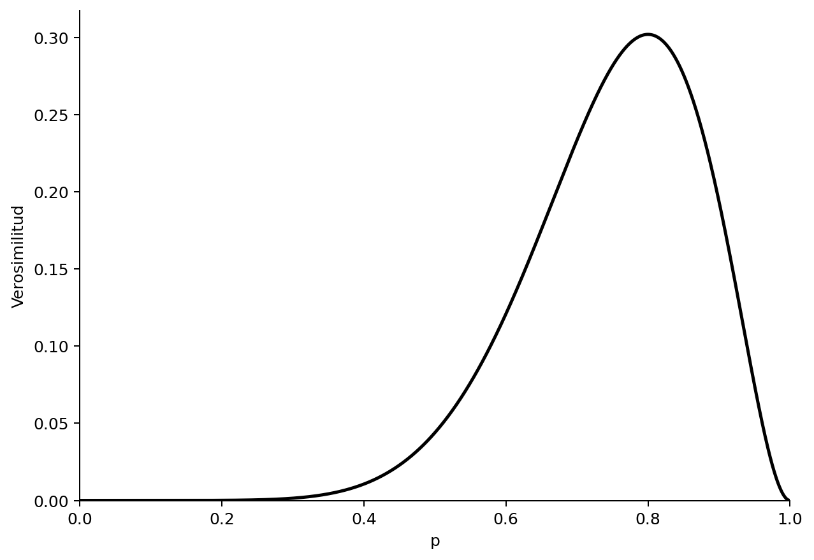
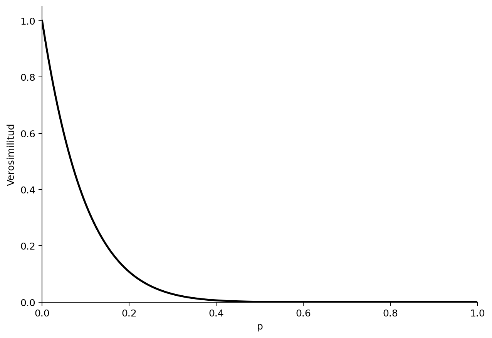
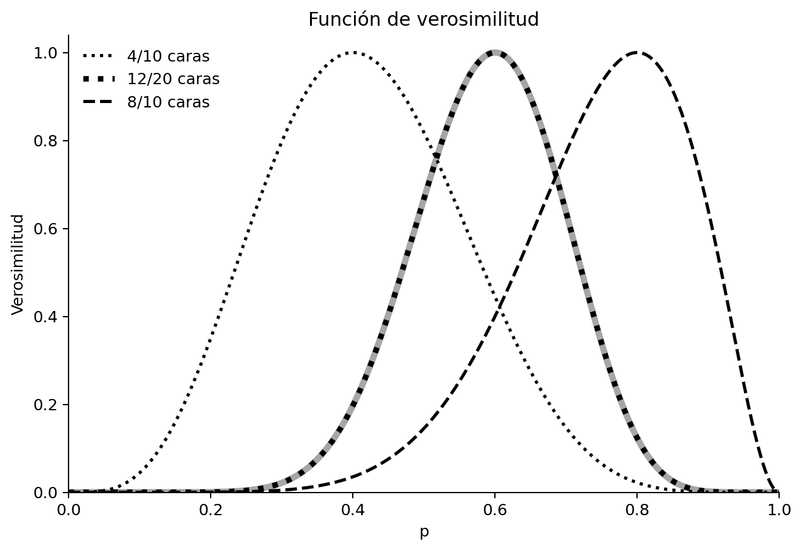
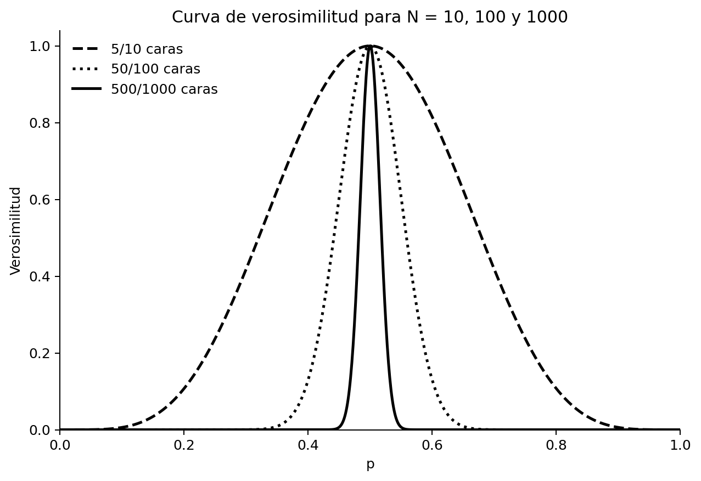
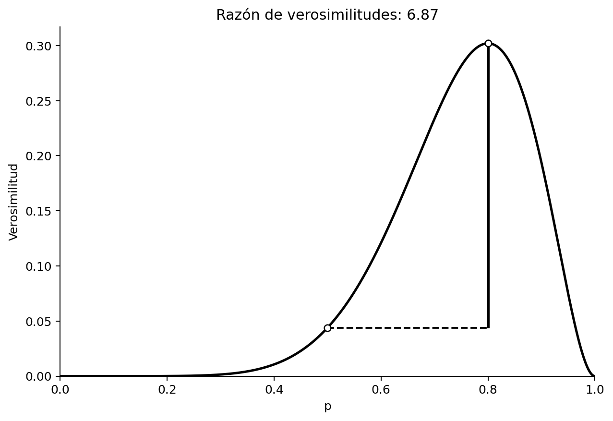
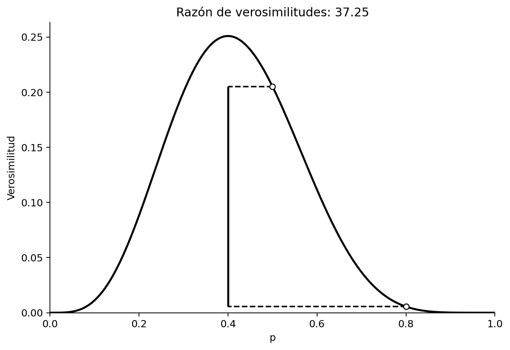
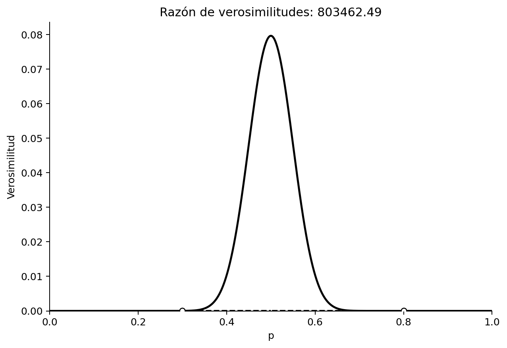
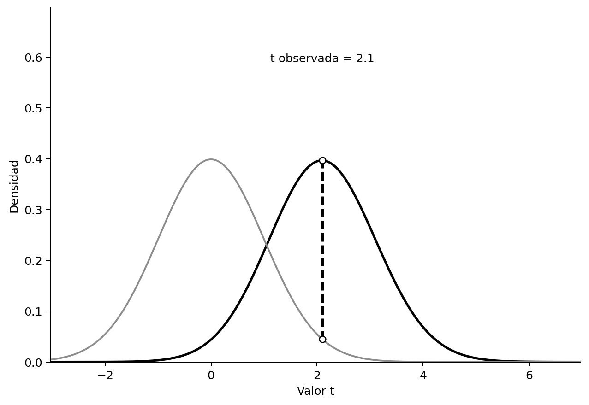

# Verosimilitudes

> Traducción literal al castellano del capítulo 3, “Likelihoods”, de Daniël Lakens, *Improving Your Statistical Inferences*.<br>
> Original: https://lakens.github.io/statistical_inferences/03-likelihoods.html<br>
> Licencia del original: CC-BY-4.0. Traducción no oficial.

Además de los enfoques frecuentista y bayesiano de la inferencia estadística, las verosimilitudes proporcionan un tercer enfoque (Pawitan, 2001; Dienes, 2008). Al igual que los [enfoques bayesianos](04-estadistica-bayesiana.md), que se discutirán en el capítulo siguiente, quienes adoptan el enfoque de la verosimilitud están interesados en cuantificar una medida de evidencia relativa al comparar dos modelos o hipótesis. Sin embargo, a diferencia de los bayesianos, no se muestran demasiado entusiastas ante la idea de incorporar información previa a sus inferencias estadísticas. Como escriben Taper y Lele (2011), defensores de este enfoque:

> No es que creamos que la regla de Bayes o las matemáticas bayesianas sean defectuosas, sino que, a partir de la definición axiomática fundamental de la probabilidad, el bayesianismo está condenado a responder preguntas irrelevantes para la ciencia. No nos importa lo que tú creas; apenas nos importa lo que nosotros creamos; lo que nos interesa es lo que puedes demostrar.

El enfoque de la verosimilitud se interesa por una medida de evidencia relativa. A diferencia del enfoque frecuentista fisheriano, en el que solo se especifica $H_0$ y los valores *p* más bajos —menos compatibles con el modelo nulo— se interpretan como evidencia contra la nula, en el enfoque de la verosimilitud se especifican un modelo nulo y otro alternativo, y se cuantifica la verosimilitud relativa de los datos bajo ambos modelos. El enfoque de Neyman-Pearson, en el que se especifican $H_0$ y $H_1$, se ocupa de tomar decisiones sobre cómo actuar y no pretende cuantificar la evidencia. Al mismo tiempo, las funciones de verosimilitud son una parte importante tanto de los enfoques frecuentistas como de los bayesianos. En el enfoque de Neyman-Pearson, las verosimilitudes desempeñan un papel importante a través del lema de Neyman-Pearson, que muestra que la prueba de la razón de verosimilitudes es la prueba más potente de $H_0$ frente a $H_1$. El lema de Neyman-Pearson se utiliza para determinar el valor crítico con el que rechazar una hipótesis. En los enfoques bayesianos, la verosimilitud se combina con una distribución previa para calcular una distribución de probabilidad posterior.

Podemos utilizar funciones de verosimilitud para hacer inferencias sobre cantidades desconocidas. Imaginemos que lanzas una moneda 10 veces y sale cara 8 veces. ¿Cuál es la probabilidad verdadera —que a veces se representa mediante la letra griega $\theta$ (theta), aunque en este capítulo utilizaremos *p*— de que esta moneda caiga de cara?

La **probabilidad binomial** de observar *k* éxitos en *n* ensayos es:

$$
Pr\left(k;n,p\right)=\frac{n!}{k!\left(n-k\right)!}p^k{(1-p)}^{n-k}
$$

donde *p* es la probabilidad de éxito, *k* es el número observado de éxitos y *n* es el número de ensayos. El primer término indica el número de combinaciones posibles de resultados —por ejemplo, podrías comenzar con ocho éxitos, terminar con ocho éxitos u observar cualquiera de las demás combinaciones posibles de ocho éxitos y dos fracasos—; este se multiplica por la probabilidad de observar un éxito en cada uno de los ensayos y, a continuación, por la probabilidad de no observar un éxito en cada uno de los ensayos restantes.

Supongamos que esperas que se trate de una moneda equilibrada. ¿Cuál es la probabilidad binomial de observar 8 caras en 10 lanzamientos cuando *p* = 0.5? La respuesta es:

$$
Pr\left(8;10,0.5\right)=\frac{10!}{8!\left(10-8\right)!}\times0.5^8\times{(1-0.5)}^{10-8}
$$

En R, esta probabilidad se calcula como:

```r
factorial(10) / (factorial(8) * (factorial(10 - 8))) * 0.5^8 * (1 - 0.5)^(10 - 8)
```

o utilizando la función:

```r
dbinom(x = 8, size = 10, prob = 0.5)
```

Supongamos que no disponemos de ninguna otra información sobre esta moneda. —Podrías creer que la mayoría de las monedas están equilibradas; tales distribuciones previas se discutirán cuando hablemos de [estadística bayesiana](04-estadistica-bayesiana.md) en el capítulo siguiente—. Cuando calculamos una probabilidad, suponemos que el modelo es conocido y calculamos la probabilidad de observar un resultado concreto. La ecuación *Pr(k;n,p)* proporciona la probabilidad de observar *k* éxitos en *n* ensayos cuando la probabilidad de éxito de una moneda es *p*. Pero, a partir de los datos que hemos observado, podemos plantear la pregunta inversa: ¿qué valor de *p* hará que los datos observados sean **más verosímiles**? Cuando calculamos una verosimilitud, suponemos que los datos son conocidos y hacemos una inferencia sobre el parámetro más verosímil del modelo. Para responder a esta pregunta, podemos introducir los valores de *k* y *n* y encontrar qué valor de *p* maximiza esta función. [Ronald Fisher](https://en.wikipedia.org/wiki/Ronald_Fisher) denominó a esto **estimación de máxima verosimilitud**. Se considera uno de los desarrollos más importantes de la estadística del siglo XX, y Fisher publicó su primer artículo sobre el tema en 1912, cuando tenía 22 años y cursaba su tercer año de universidad (Aldrich, 1997). Como *p* puede adoptar cualquier valor entre 0 y 1, podemos representar todos los valores en lo que se conoce como *función de verosimilitud*, de modo que podamos ver el máximo con mayor facilidad.

{#fig-like1}

La verosimilitud se representa para todos los valores posibles de *p* —de 0 a 1—. No debería sorprender que, dados los datos que hemos observado, el valor más verosímil del parámetro verdadero sea 8 de 10, o *p* = 0.8, con una verosimilitud de 0.30 —el punto más alto del eje y—. En este ejemplo, *p* = 0.8 se denomina **estimador de máxima verosimilitud**. Es importante saber que la verosimilitud por sí sola carece de significado. En este sentido, difiere de una probabilidad. Pero podemos comparar las verosimilitudes de la misma función para distintos valores de *p*. Puedes leer cualquier otro valor de la verosimilitud para cualquier otro *p* y comprobar que, dados los datos observados, los valores bajos de *p* —por ejemplo, 0.2— no son muy verosímiles.

Existe una diferencia sutil entre una probabilidad y una verosimilitud. En el lenguaje coloquial puedes utilizar ambos términos con el mismo significado, pero en estadística se refieren a formas diferentes de contemplar el mismo problema. Observa que la ecuación de *Pr* incluye tanto información sobre los datos —*k*, *n*— como información sobre el parámetro —*p*—. Para calcular una **probabilidad**, consideramos *p* fijo —por ejemplo, para una moneda equilibrada introducimos *p* = 0.5— y después estimamos la probabilidad de resultados diferentes —*k*, *n*—. La función resultante es la función de masa de probabilidad. Para calcular la **verosimilitud**, en cambio, consideramos fijos los datos observados —por ejemplo, observar 5 caras en 10 lanzamientos— y consideramos *Pr* como una función de *p*, estimando el valor que maximiza la verosimilitud de una muestra concreta.

Las verosimilitudes son un ejemplo de inferencia estadística: hemos observado algunos datos y los utilizamos para hacer una inferencia sobre distintos parámetros poblacionales. De manera más formal, la función de verosimilitud es la función de densidad —conjunta— evaluada en los datos observados. Las funciones de verosimilitud pueden calcularse para muchos modelos diferentes —por ejemplo, distribuciones binomiales o normales; véase Millar (2011)—. Este enfoque se denomina **estadística de la verosimilitud**, o **verosimilitudismo**, y se diferencia de los enfoques frecuentista y bayesiano porque utiliza directamente la función de verosimilitud para hacer inferencias.

Cuando se ha observado una combinación de caras y cruces, la curva de verosimilitud asciende y desciende, ya que no es posible que la moneda solo pueda dar caras o solo cruces —al fin y al cabo, ya se han observado ambas—. Si se observan 10 caras o 0 caras, la curva de verosimilitud alcanza su máximo en el extremo derecho o izquierdo del eje x. Cuando representamos las curvas de verosimilitud para 0 caras en 10 lanzamientos, la curva se parece a la de la Figura 3.2.

{#fig-like2}

Las verosimilitudes pueden combinarse fácilmente. Imaginemos que dos personas lanzan de manera independiente la misma moneda. Una observa 8 caras en 10 lanzamientos y la otra observa 4 caras en 10 lanzamientos. Podrías esperar que esto produjera la misma curva de verosimilitud que si una persona lanzara una moneda 20 veces y observara 12 caras y, en efecto, así es. En el gráfico siguiente, todas las curvas de verosimilitud se han estandarizado dividiendo cada una de ellas por su máxima verosimilitud. Por eso todas tienen ahora un máximo de 1 y podemos comparar con mayor facilidad distintas curvas de verosimilitud.

{#fig-like3}

La curva de la izquierda corresponde a 4 caras de 10, mientras que la de la derecha corresponde a 8 caras de 10. La curva negra punteada del centro corresponde a 12 caras de 20. La curva gris, situada directamente debajo de la curva de 12 caras de 20, se calcula multiplicando las curvas de verosimilitud: $L(p_{combinada})=L(p=0.8)\times L(p=0.4)$.

En la Figura 3.4 vemos curvas de verosimilitud para 10, 100 y 1000 lanzamientos de moneda, que producen 5, 50 y 500 caras, respectivamente. Las curvas se han estandarizado de nuevo para facilitar su comparación. A medida que aumenta el tamaño muestral, las curvas se hacen más estrechas —la línea discontinua corresponde a *n* = 10, la punteada a *n* = 100 y la continua a *n* = 1000—. Esto significa que, conforme aumenta el tamaño muestral, nuestros datos son cada vez menos verosímiles bajo parámetros poblacionales más alejados del número de caras observado. En otras palabras, hemos recogido evidencia cada vez más fuerte a favor de *p* = 0.5 en comparación con la mayoría de los demás parámetros poblacionales posibles.

{#fig-like4}

## Razones de verosimilitud

Podemos utilizar la función de verosimilitud para comparar posibles valores de *p*. Por ejemplo, podríamos creer que la moneda que lanzamos estaba equilibrada, aunque obtuvimos ocho caras de diez. Una moneda equilibrada tendrá *p* = 0.5, mientras que nosotros observamos *p* = 0.8. La función de verosimilitud nos permite calcular la verosimilitud relativa de distintos parámetros posibles. ¿Cuánto más verosímiles son nuestros datos observados bajo la hipótesis de que se trata de una moneda desequilibrada que dará cara, por término medio, el 80% de las veces, en comparación con la teoría alternativa de que se trata de una moneda equilibrada que debería dar cara el 50% de las veces?

Podemos calcular la razón de verosimilitudes:

$$
\frac{L(p=0.8)}{L(p=0.5)}
$$

que es 0.302/0.044 = 6.87. En el gráfico, ambos círculos muestran los puntos de la curva de verosimilitud para $L(p=0.5)$ y $L(p=0.8)$.

{#fig-like5}

Podemos interpretar subjetivamente esta razón de verosimilitudes, que nos dice que nuestros datos observados son 6.87 veces más verosímiles bajo la hipótesis de que esta moneda está desequilibrada y dará cara el 80% de las veces que bajo la hipótesis de que se trata de una moneda equilibrada. ¿Hasta qué punto resulta convincente? Redondeemos la razón de verosimilitudes a 7 e imaginemos dos bolsas de canicas. Una bolsa contiene 7 canicas azules. La segunda contiene 7 canicas, cada una de un color diferente del arcoíris: violeta, añil, azul, verde, amarillo, naranja y rojo. Alguien elige al azar una de las dos bolsas, saca una canica y te la enseña. La canica es azul: ¿hasta qué punto estás seguro de que procede de la bolsa en la que todas las canicas eran azules, en comparación con la bolsa que contenía canicas de los colores del arcoíris? Esta es la fuerza con la que la razón de verosimilitudes nos lleva a creer que nuestros datos fueron generados por una moneda desequilibrada que da cara el 80% de las veces, en relación con una moneda equilibrada, dado que hemos observado 8 caras en 10 lanzamientos. Después de esta explicación, cuya intención es evitar que dependas demasiado de valores de referencia, todavía puede resultar útil saber que Royall (1997) consideraba las razones de verosimilitud de 8 como evidencia moderadamente fuerte y las razones de 32 como evidencia fuerte.

Observa que las razones de verosimilitud proporcionan evidencia relativa a favor de una hipótesis especificada frente a otra hipótesis especificada. La razón puede calcularse para dos valores hipotéticos cualesquiera. Por ejemplo, en la Figura 3.6 se calcula una razón que compara la hipótesis de una moneda equilibrada —*p* = 0.5— con la hipótesis alternativa de que la moneda da cara el 80% de las veces —*p* = 0.8—, cuando hemos observado 4 caras en 10 lanzamientos. Vemos que los datos observados son 0.2050/0.0055 = 37.25 veces más verosímiles —ignorando las diferencias de redondeo; intenta calcular estas cifras a mano con la fórmula proporcionada anteriormente— bajo la hipótesis de que se trata de una moneda equilibrada que bajo la hipótesis de que se trata de una moneda que da cara el 80% de las veces.

{#fig-like6}

Una razón de verosimilitudes de 1 significa que los datos son igual de verosímiles bajo ambas hipótesis. Los valores más alejados de 1 indican que los datos son más verosímiles bajo una hipótesis que bajo la otra. La razón puede expresarse a favor de una hipótesis frente a la otra —por ejemplo, $L(p=0.5)/L(p=0.8)$— o a la inversa —$L(p=0.8)/L(p=0.5)$—. Esto significa que una razón de 37.25 para $H_0$ en relación con $H_1$ equivale a una razón de 1/37.25 = 0.02685 para $H_1$ en relación con $H_0$. Las razones de verosimilitud oscilan entre 0 e infinito y, cuanto más se acercan a cero o a infinito, más fuerte es la evidencia relativa a favor de una hipótesis frente a la otra. Veremos en el capítulo sobre [estadística bayesiana](04-estadistica-bayesiana.md) que, en este sentido, las razones de verosimilitud son muy similares a los factores de Bayes —y constituyen un caso especial de ellos—.

Las verosimilitudes son evidencia relativa. Que los datos sean más verosímiles bajo un valor posible de *p* que bajo otro no significa que procedan de una de esas dos distribuciones. Otros valores podrían generar verosimilitudes todavía mayores. Por ejemplo, consideremos una situación en la que lanzamos una moneda 100 veces y observamos 50 caras. Comparamos *p* = 0.3 con *p* = 0.8 y encontramos que la razón de verosimilitudes es 803462, lo que implica que en los datos hay 803462 veces más evidencia a favor de *p* = 0.3 que de *p* = 0.8. Esto podría sonar como una evidencia bastante concluyente a favor de *p* = 0.3. Pero solo es evidencia relativa a favor de *p* = 0.3 en comparación con *p* = 0.8. Si observamos la función de verosimilitud, vemos con claridad que, como era de esperar, *p* = 0.5 es el valor que la maximiza. Que una hipótesis sea más verosímil que otra no significa que no exista una tercera hipótesis que sea todavía más verosímil.

{#fig-like7}

## Verosimilitud de resultados mixtos en conjuntos de estudios

La ciencia es un proceso acumulativo y deberíamos evaluar líneas de investigación, no estudios aislados. Un gran problema de la literatura científica es que los resultados no significativos a menudo nunca se publican (Franco et al., 2014; Fanelli, 2010). Al mismo tiempo, como la potencia estadística de las pruebas de hipótesis nunca es del 100% —y a menudo es mucho menor—, es una realidad matemática que resulta improbable —o «demasiado bueno para ser verdad»— que un conjunto de estudios produzca exclusivamente resultados significativos (Schimmack, 2012; Francis, 2014). Podemos utilizar verosimilitudes binomiales para examinar la probabilidad de observar resultados mixtos y comprender cuándo estos constituyen, pese a todo, evidencia fuerte de la presencia de un efecto. Lo que sigue se basa en gran medida en Lakens y Etz (2017).

La probabilidad de observar un resultado significativo o no significativo en un estudio depende de la tasa de error Tipo 1 ($\alpha$), de la potencia estadística de la prueba (1 - $\beta$) y de la probabilidad de que la hipótesis nula sea verdadera (Wacholder et al., 2004). Hay cuatro resultados posibles en un estudio: un verdadero positivo, un falso positivo, un verdadero negativo y un falso negativo. Cuando $H_0$ es verdadera, la probabilidad de observar un falso positivo depende del nivel $\alpha$, o tasa de error Tipo 1 —por ejemplo, 5%—. Cuando $H_1$ es verdadera, la probabilidad de observar un verdadero positivo depende de la potencia estadística de la prueba realizada —para la que a menudo se recomienda un mínimo del 80%—, que a su vez depende del nivel $\alpha$, del tamaño verdadero del efecto y del tamaño muestral. Con un nivel $\alpha$ del 5%, cuando $H_0$ es verdadera se producirá un falso positivo con una probabilidad del 5% —siempre que se controlen las tasas de error, por ejemplo en estudios prerregistrados— y un verdadero negativo con una probabilidad del 95%. Cuando una prueba tiene una potencia del 80% y $H_1$ es verdadera, un verdadero positivo tiene una probabilidad del 80% y un falso negativo, una probabilidad del 20%.

Si realizamos varios estudios, podemos calcular la probabilidad binomial de observar un número concreto de resultados significativos y no significativos (Ioannidis y Trikalinos, 2007; Hunt, 1975). Por ejemplo, podemos calcular la probabilidad de encontrar exactamente dos resultados significativos en tres estudios suponiendo que la hipótesis nula es verdadera. Cuando $H_0$ es verdadera, la probabilidad de obtener resultados significativos es igual al nivel $\alpha$ y, por tanto, cuando este se controla cuidadosamente —por ejemplo, en estudios prerregistrados—, la probabilidad de observar un resultado significativo (*p*) = 0.05. Es decir, cuando *k* = 2, *n* = 3 y *p* = .05, la función de probabilidad binomial nos dice que la probabilidad de encontrar exactamente dos resultados significativos en tres estudios es 0.007 —0.05 × 0.05 × 0.95 = 0.002375, y existen tres órdenes en los que pueden observarse dos de los tres resultados, de modo que 0.002375 × 3 = 0.007—.

Para calcular la verosimilitud suponiendo que $H_1$ es verdadera, necesitamos hacer una suposición sobre la potencia de cada estudio. Supongamos provisionalmente que todos los estudios tenían una potencia del 80% y, por tanto, *p* = .80. La probabilidad de observar exactamente dos resultados significativos en tres estudios, suponiendo una potencia de 0.8, es 0.384 —0.8 × 0.8 × 0.2 = 0.128, y como hay tres órdenes en los que dos de los tres resultados pueden ser significativos, 0.128 × 3 = 0.384—. En otras palabras, si te propones realizar 3 estudios, tu hipótesis es correcta y la pones a prueba con una potencia del 80%, hay una probabilidad del 38.4% de observar 2 resultados significativos de 3, y una probabilidad del 9.6% de observar 1 resultado significativo de 3 —y, para una persona extremadamente desafortunada, una probabilidad del 0.8% de no encontrar ningún resultado significativo en tres estudios, aunque exista un efecto verdadero—. A menos que la potencia sea extremadamente alta, cabe esperar resultados mixtos en los conjuntos de estudios.

Ambas verosimilitudes para *p* = .05 y *p* = .80 aparecen resaltadas en la figura interactiva inferior mediante círculos situados sobre las líneas verticales punteadas. Podemos utilizar la verosimilitud de los datos suponiendo que $H_0$ o $H_1$ es verdadera para calcular la razón de verosimilitudes: 0.384/0.007 = 53.89. Esto nos dice que el resultado observado de exactamente dos resultados significativos en tres estudios es 53.89 veces más verosímil cuando $H_1$ es verdadera y los estudios tenían una potencia del 80% que cuando $H_0$ es verdadera y los estudios tienen una tasa de error Tipo 1 del 5% cuidadosamente controlada. Utilizando los valores propuestos por Royall (1997) —razones de 8 y 32 como referencias de evidencia moderadamente fuerte y fuerte, respectivamente—, esto implica que encontrar dos resultados significativos en los tres estudios podría considerarse evidencia fuerte a favor de $H_1$, suponiendo una potencia del 80%. La calculadora interactiva siguiente te permite explorar estos cálculos para cualquier combinación de número de estudios, resultados significativos, tasa de error Tipo 1 y potencia.

::: {.content-visible when-format="html"}

```{=html}
<iframe id="lr-calc-iframe"
        src="likelihood_ratio_app_book.html"
        width="100%"
        height="700"
        scrolling="no"
        style="border:none;display:block;margin:1.5rem 0;overflow:hidden;"
        title="Calculadora de razones de verosimilitud">
</iframe>
<script>
window.addEventListener('message', function(e) {
  if (e.data && typeof e.data.iframeHeight === 'number') {
    var f = document.getElementById('lr-calc-iframe');
    if (f && e.source === f.contentWindow) f.style.height = e.data.iframeHeight + 'px';
  }
});
</script>
```

:::

::: {.content-visible unless-format="html"}

Hay una calculadora interactiva para estos cálculos disponible en <https://shiny.ieis.tue.nl/mixed_results_likelihood/>.

:::

En conjuntos de estudios, la razón de verosimilitudes a favor de $H_1$ frente a $H_0$ después de observar una combinación de resultados significativos y no significativos puede llegar a ser sorprendentemente grande. Aunque la evidencia parezca mixta, en realidad puede existir evidencia fuerte a favor de un efecto verdadero. Por ejemplo, cuando un investigador realiza seis estudios con una potencia del 80% y un nivel alfa del 5%, y encuentra tres resultados significativos y tres no significativos, la razón de verosimilitudes acumulada alcanza un convincente 38 a 1 a favor de $H_1$, suficiente para considerar que el conjunto de estudios constituye evidencia fuerte de un efecto verdadero. Intuitivamente, los investigadores podrían no sentirse convencidos ante un conjunto en el que tres de seis resultados fueran estadísticamente significativos. Pero, cuando hacemos los cálculos, vemos que ese conjunto puede ser evidencia muy fuerte a favor de un efecto verdadero. Comprender mejor estas probabilidades podría ser un paso importante para mitigar los efectos negativos del sesgo de publicación.

Cabe esperar que los investigadores estén más dispuestos a enviar resultados no significativos para su publicación cuando comprendan mejor el valor evidencial de las líneas de investigación con resultados mixtos. Publicar todos los estudios realizados en una línea determinada reducirá el sesgo de publicación y aumentará el valor informativo de los datos de la literatura científica. No es razonable esperar que todos los estudios de una línea de investigación sean estadísticamente significativos, y es importante que los investigadores desarrollen expectativas más realistas si quieren extraer inferencias significativas de esas líneas. No tenemos una buena intuición sobre el aspecto que presentan los patrones reales de estudios porque estamos expuestos continuamente a una literatura científica que no refleja la realidad. Casi todos los artículos con múltiples estudios de la literatura científica presentan únicamente resultados estadísticamente significativos, aunque esto es improbable dadas la potencia de esos estudios y la probabilidad de que solo investiguemos predicciones correctas (Scheel et al., 2021). Enseñar a los investigadores probabilidades binomiales y razones de verosimilitud es una forma directa de desarrollar expectativas más realistas sobre el aspecto que realmente presentan las líneas de investigación que contienen valor evidencial a favor de $H_1$.

## Verosimilitudes para pruebas *t*

Hasta ahora hemos calculado verosimilitudes para probabilidades binomiales, pero pueden calcularse para cualquier modelo estadístico (Glover y Dixon, 2004; Pawitan, 2001). Por ejemplo, podemos calcular la verosimilitud relativa de observar un determinado valor *t* bajo la hipótesis nula y una hipótesis alternativa, como se ilustra en la Figura 3.8. Naturalmente, los datos observados son más verosímiles si suponemos que el efecto observado es igual al efecto verdadero, pero examinar la verosimilitud revela que existen muchas hipótesis alternativas que son relativamente más verosímiles que la hipótesis nula. Esto también ocurre al observar resultados no significativos, que pueden ser más verosímiles bajo una hipótesis alternativa de interés que bajo la hipótesis nula. Esta es una de las razones por las que es incorrecto afirmar que no hay efecto cuando *p* > $\alpha$ —véase el [malentendido 1 sobre los valores *p*](01-usando-valores-p.md)—.

{#fig-like9}

## Ponte a prueba

### Preguntas sobre las verosimilitudes

**P1**: Supongamos que lanzas una moneda que crees equilibrada. ¿Cuál es la probabilidad binomial de observar 8 caras en 10 lanzamientos cuando *p* = 0.5? —Puedes utilizar las funciones del capítulo o calcularla a mano—.

- 0.044
- 0.05
- 0.5
- 0.8

**P2**: La curva de verosimilitud asciende y desciende, excepto en los casos extremos en los que se observan 0 caras o solamente caras. Copia el código siguiente —recuerda que puedes pulsar el icono del portapapeles situado en la esquina superior derecha del bloque de código—, cambia el número de éxitos a 0 caras (`x <- 0`) en 10 lanzamientos (`n <- 10`) y ejecuta el script. ¿Qué aspecto tiene la curva de verosimilitud?

```r
n <- 10 # fija el número total de ensayos
x <- 5 # fija el número de éxitos
H0 <- 0.5 # especifica una hipótesis que quieras comparar
H1 <- 0.4 # especifica otra hipótesis que quieras comparar
dbinom(x, n, H0) / dbinom(x, n, H1) # Devuelve la razón H0/H1
dbinom(x, n, H1) / dbinom(x, n, H0) # Devuelve la razón H1/H0

theta <- seq(0, 1, len = 100) # crea una variable de probabilidad de 0 a 1
like <- dbinom(x, n, theta)

plot(theta, like, type = "l", xlab = "p", ylab = "Verosimilitud", lwd = 2)
points(H0, dbinom(x, n, H0))
points(H1, dbinom(x, n, H1))
segments(H0, dbinom(x, n, H0), x / n, dbinom(x, n, H0), lty = 2, lwd = 2)
segments(H1, dbinom(x, n, H1), x / n, dbinom(x, n, H1), lty = 2, lwd = 2)
segments(x / n, dbinom(x, n, H0), x / n, dbinom(x, n, H1), lwd = 2)
title(paste("Razón de verosimilitudes H0/H1:",
            round(dbinom(x, n, H0) / dbinom(x, n, H1), digits = 2),
            " Razón de verosimilitudes H1/H0:",
            round(dbinom(x, n, H1) / dbinom(x, n, H0), digits = 2)))
```

- La curva de verosimilitud es una línea horizontal.
- El script devuelve un mensaje de error: no es posible representar la curva de verosimilitud para 0 caras.
- La curva comienza en su punto más alto en *p* = 0 y la verosimilitud disminuye a medida que aumenta *p*.
- La curva comienza en su punto más bajo en *p* = 0 y la verosimilitud aumenta a medida que aumenta *p*.

**P3**: Saca una moneda de tu bolsillo o monedero. Lánzala 13 veces y cuenta el número de caras. Con el código anterior, calcula la verosimilitud de tus resultados observados bajo la hipótesis de que la moneda está equilibrada, en comparación con la hipótesis de que no lo está. Fija el número de éxitos (`x`) en el número de caras que hayas observado. Cambia $H_1$ por la proporción de caras que hayas observado —o déjalo en 0 si no has observado ninguna cara—. Puedes utilizar, por ejemplo, `4/13` o introducir `0.3077`. Deja $H_0$ en 0.5. Ejecuta el script para calcular la razón de verosimilitudes. ¿Cuál es la razón de una moneda equilibrada frente a una no equilibrada —$H_0$/$H_1$— que produce caras con la frecuencia que has observado, dados los datos? Redondea la respuesta a dos decimales.

Respuesta: ________

**P4**: Antes mencionamos que, al aumentar los tamaños muestrales, habíamos recogido evidencia relativa más fuerte. Supongamos que queremos comparar $L(p=0.4)$ con $L(p=0.5)$. ¿Cuál es la razón de verosimilitudes si $H_1$ es 0.4, $H_0$ es 0.5 y obtienes 5 caras en 10 ensayos? De las dos formas posibles de calcularla —$H_1$/$H_0$ y $H_0$/$H_1$—, informa de la razón que sea mayor que 1 y redondea a dos decimales.

Respuesta: ________

**P5**: ¿Cuál es la razón de verosimilitudes si $H_1$ es 0.4, $H_0$ es 0.5 y obtienes 50 caras en 100 ensayos? De las dos formas posibles de calcularla —$H_1$/$H_0$ y $H_0$/$H_1$—, informa de la razón que sea mayor que 1 y redondea a dos decimales.

Respuesta: ________

**P6**: ¿Cuál es la razón de verosimilitudes si $H_1$ es 0.4, $H_0$ es 0.5 y obtienes 500 caras en 1000 ensayos? De las dos formas posibles de calcularla —$H_1$/$H_0$ y $H_0$/$H_1$—, informa de la razón que sea mayor que 1 y redondea a dos decimales.

Respuesta: ________

**P7**: Al comparar dos hipótesis —*p* = *X* frente a *p* = *Y*—, una razón de verosimilitudes de:

- 0.02 significa que no hay evidencia suficiente en los datos para ninguna de las dos hipótesis.
- 5493 significa que la hipótesis *p* = *X* es la más respaldada por los datos.
- 5493 significa que la hipótesis *p* = *X* está mucho más respaldada por los datos que *p* = *Y*.
- 0.02 significa que los datos son un 2% más verosímiles bajo la hipótesis *p* = *X* que bajo la hipótesis *p* = *Y*.

### Preguntas sobre resultados mixtos

Utiliza la calculadora interactiva anterior para explorar estos cálculos.

**P8**: ¿Qué afirmación es correcta cuando realizas 3 estudios?

- Cuando $H_1$ es verdadera, alfa = 0.05 y la potencia = 0.80, es casi tan probable observar uno o más resultados no significativos —48.8%— como observar únicamente resultados significativos —51.2%—.
- Cuando alfa = 0.05 y la potencia = 0.80, es extremadamente raro encontrar 3 resultados significativos —0.0125%—, con independencia de que $H_0$ o $H_1$ sea verdadera.
- Cuando alfa = 0.05 y la potencia = 0.80, obtener 2 de 3 resultados estadísticamente significativos es el resultado más probable de todos los posibles —0 de 3, 1 de 3, 2 de 3 o 3 de 3— y ocurre el 38.4% de las veces cuando $H_1$ es verdadera.
- Cuando alfa = 0.05 y la potencia = 0.80, la probabilidad de encontrar al menos un falso positivo —un resultado significativo cuando $H_0$ es verdadera— en tres estudios es del 5%.

**P9**: A veces, en un conjunto de tres estudios, encontrarás un efecto significativo en uno de ellos, pero ningún efecto en los otros dos estudios relacionados. Supongamos que los dos estudios relacionados no eran exactamente iguales en todos los aspectos —por ejemplo, cambiaste la manipulación, el procedimiento o algunas preguntas—. Podría ocurrir que los otros dos estudios no funcionaran debido a pequeñas diferencias que produjeron algún efecto que todavía no comprendes por completo. También podría ocurrir que el único resultado significativo fuera un error Tipo 1 y que $H_0$ fuera verdadera en los tres estudios. ¿Qué afirmación es correcta, suponiendo una tasa de error Tipo 1 del 5% y una potencia del 80%?

- En igualdad de condiciones, la probabilidad de un error Tipo 1 en uno de tres estudios es del 5% cuando no hay un efecto verdadero en ninguno de ellos, y la probabilidad de encontrar exactamente 1 resultado significativo de 3, suponiendo una potencia del 80% en los tres estudios, es del 80%, lo cual es considerablemente más probable.
- En igualdad de condiciones, la probabilidad de un error Tipo 1 en uno de tres estudios es del 13.5% cuando no hay un efecto verdadero en ninguno de ellos, y la probabilidad de encontrar exactamente 1 resultado significativo de 3, suponiendo una potencia del 80% en los tres estudios —y, por tanto, un efecto verdadero—, es del 9.6%, lo cual es ligeramente, pero no considerablemente, menos probable.
- En igualdad de condiciones, la probabilidad de un error Tipo 1 en uno de tres estudios es del 85.7% cuando no hay un efecto verdadero en ninguno de ellos, y la probabilidad de encontrar exactamente 1 resultado significativo de 3, suponiendo una potencia del 80% en los tres estudios —y, por tanto, un efecto verdadero—, es del 0.8%, lo cual es considerablemente menos probable.
- No es posible conocer la probabilidad de observar un error Tipo 1 si realizas 3 estudios.

La idea de que la mayoría de los estudios tienen una potencia del 80% es ligeramente optimista. **Examina la respuesta correcta a la pregunta anterior para distintos valores de potencia** —por ejemplo, una potencia del 50% y del 30%—.

**P10**: Varios artículos sugieren que es razonable suponer que la potencia de la literatura psicológica puede situarse en torno al 50%. Fija en 4 tanto el número de estudios como el número de resultados significativos, sitúa el control de la potencia supuesta en el 50% y observa la tabla de la parte inferior de la aplicación. ¿Qué probabilidad hay de observar 4 resultados significativos en 4 estudios, suponiendo que existe un efecto verdadero?

- 6.25%
- 12.5%
- 25%
- 37.5%

Imagina que realizas 4 estudios y que 3 de ellos muestran un resultado significativo. **Introduce estos números en la aplicación y mantén la potencia en el 50%**. El texto del resultado te indica:

> Cuando los resultados observados son igual de verosímiles bajo $H_0$ y $H_1$, la razón de verosimilitudes es 1. Los valores de referencia para interpretar las razones de verosimilitud sugieren que, cuando 1 < RV < 8, hay evidencia débil; cuando 8 ≤ RV < 32, hay evidencia moderada; y cuando RV ≥ 32, hay evidencia fuerte.

> Los datos son más verosímiles bajo la hipótesis alternativa que bajo la hipótesis nula, con una razón de verosimilitudes de 526.32.

Estos cálculos muestran que, suponiendo que has observado tres resultados significativos en cuatro estudios y que cada estudio tenía una potencia del 50%, es 526 veces más probable observar estos datos cuando la hipótesis alternativa es verdadera que cuando la hipótesis nula es verdadera. En otras palabras, es 526 veces más probable encontrar un efecto significativo en tres estudios cuando tienes una potencia del 50% que encontrar tres errores Tipo 1 en un conjunto de cuatro estudios.

**P11**: Quizá no consideres razonable suponer una potencia del 50%. ¿Hasta qué valor puede descender la potencia —redondeado a dos decimales— para que la razón de verosimilitudes siga siendo superior a 32 a favor de $H_1$ cuando se observan 3 resultados significativos de 4?

- Potencia del 5%
- Potencia del 17%
- Potencia del 34%
- Potencia del 44%

La principal idea que debe extraerse de estos cálculos es comprender que 1) cabe esperar resultados mixtos y 2) los resultados mixtos pueden contener evidencia fuerte de un efecto verdadero para un amplio intervalo de valores plausibles de potencia. La aplicación también te indica, de una manera aproximadamente dicotómica, cuánta evidencia puedes esperar. Esto resulta útil para nuestro objetivo educativo. Pero, cuando quieras evaluar resultados de varios estudios, la forma apropiada de hacerlo es realizar un metaanálisis.

Los cálculos anteriores parten de una suposición muy importante: que la tasa de error Tipo 1 está controlada en el 5%. Si pruebas muchos análisis diferentes en cada estudio y solo informas del resultado que produjo *p* < 0.05, estos cálculos dejan de ser válidos.

**P12**: Vuelve a los valores predeterminados de 2 resultados significativos en 3 estudios, pero fija ahora la tasa de error Tipo 1 en el 20%, para reflejar una cantidad moderada de *p*-hacking. En estas circunstancias, ¿cuál es la **mayor** razón de verosimilitudes a favor de $H_1$ que puedes obtener si exploras todos los valores posibles de la potencia verdadera?

- Aproximadamente 1
- Aproximadamente 4.63
- Aproximadamente 6.70
- Aproximadamente 62.37

Como muestra el escenario anterior, el *p*-hacking hace que los estudios sean extremadamente poco informativos. **Si inflas la tasa de error, destruyes rápidamente la evidencia de los datos.** Ya no puedes determinar si los datos son más verosímiles cuando no hay un efecto que cuando sí lo hay. A veces, los investigadores se quejan de que quienes se preocupan por el *p*-hacking y tratan de promover un mejor control del error Tipo 1 no entienden lo esencial, y de que otras cosas —mejores medidas, mejor teoría, etc.— son más importantes. Estoy completamente de acuerdo en que estos aspectos de la investigación científica son, al menos, tan importantes como un mejor control del error. Pero desarrollar mejores medidas y teorías requerirá décadas de trabajo. Podríamos mejorar hoy mismo el control del error si los investigadores dejaran de inflar sus tasas de error analizando los datos con flexibilidad. Y, como muestra este ejercicio, unas tasas infladas de falsos positivos dificultan muy rápidamente que aprendamos qué es verdadero a partir de los datos que recogemos. Debido a la relativa facilidad con la que puede mejorarse esta parte de la investigación científica, y porque podemos hacerlo hoy —y no dentro de una década—, creo que merece la pena subrayar la importancia del control del error y publicar conjuntos de estudios con un aspecto más realista.

**P13**: Algunas revistas «prestigiosas» —que, cuando se examinan en términos de calidad científica, como la reproducibilidad, los estándares de presentación de informes y las políticas de intercambio de datos y materiales, son de calidad bastante baja pese a su prestigio— solo publican manuscritos con un gran número de estudios que, además, deben ser todos estadísticamente significativos. Si suponemos una potencia media en psicología del 50%, solo el 3.125% de los artículos con 5 estudios debería contener exclusivamente resultados significativos. Si tomas un número cualquiera de una de estas revistas prestigiosas y ves 10 artículos, cada uno de los cuales presenta 5 estudios, y todos los manuscritos contienen exclusivamente resultados significativos, ¿confiarías más o menos en los hallazgos comunicados que si todos esos artículos hubieran presentado resultados mixtos? ¿Por qué?

**P14**: A menos que consigas dotar a todos tus estudios de una potencia del 99.99% durante el resto de tu carrera —lo cual sería ligeramente ineficiente, pero estupendo si no te gusta la inseguridad sobre afirmaciones estadísticas erróneas—, observarás resultados mixtos dentro de cualquier línea de investigación. ¿Cómo piensas afrontar esos resultados mixtos?

### Preguntas abiertas

1. ¿Cuál es la diferencia entre una probabilidad y una verosimilitud?

2. ¿Por qué es importante recordar que una razón de verosimilitudes constituye evidencia relativa?

3. Si comparamos dos hipótesis, $H_0$ y $H_1$, y la razón de verosimilitudes de $H_1$ frente a $H_0$ es 77, ¿qué significa?

4. ¿Cuáles son los valores de referencia de evidencia moderada y fuerte según Royall (1997)?

5. ¿Cómo es posible observar una razón de verosimilitudes de 200 y que, sin embargo, ambas hipótesis sean incorrectas?

6. Si realizamos varios estudios y descubrimos que solo 2 de 3 muestran un resultado significativo, ¿cómo puede esto constituir en realidad evidencia fuerte a favor de $H_1$?

## Solucionario {.unnumbered}

### Preguntas sobre las verosimilitudes

- **P1:** 0.044.
- **P2:** La curva comienza en su punto más alto en *p* = 0 y la verosimilitud disminuye a medida que aumenta *p*.
- **P3:** Depende del número de caras observado. Redondeando a dos decimales: 0 o 13 caras, 0.00; 1 o 12, 0.00; 2 u 11, 0.03; 3 o 10, 0.14; 4 o 9, 0.37; 5 u 8, 0.71; 6 o 7, 0.96.
- **P4:** 1.23.
- **P5:** 7.70.
- **P6:** 731784961.
- **P7:** 5493 significa que la hipótesis *p* = *X* está mucho más respaldada por los datos que *p* = *Y*.

### Preguntas sobre resultados mixtos

- **P8:** Cuando $H_1$ es verdadera, alfa = 0.05 y la potencia = 0.80, es casi tan probable observar uno o más resultados no significativos —48.8%— como observar únicamente resultados significativos —51.2%—.
- **P9:** La probabilidad de exactamente un falso positivo en tres estudios es del 13.5% cuando no hay un efecto verdadero, y la probabilidad de exactamente un resultado significativo en tres estudios con una potencia del 80% es del 9.6%.
- **P10:** 6.25%.
- **P11:** Potencia del 17%.
- **P12:** Aproximadamente 4.63.
- **P13:** Cabe confiar menos. Una sucesión tan extrema de resultados exclusivamente significativos es muy improbable con una potencia del 50% y sugiere sesgo de publicación, selección de análisis o exclusión de resultados no significativos. Los resultados mixtos son lo que el modelo probabilístico permite esperar.
- **P14:** Respuesta abierta. Una estrategia adecuada es anticipar los resultados mixtos, informar de todos los estudios y analizarlos de manera conjunta —preferentemente mediante un metaanálisis—, sin seleccionar solo los resultados significativos.

## Referencias

Aldrich, J. (1997). R. A. Fisher and the making of maximum likelihood 1912–1922. *Statistical Science, 12*(3), 162–176. https://doi.org/10.1214/ss/1030037906

Dienes, Z. (2008). *Understanding psychology as a science: An introduction to scientific and statistical inference*. Palgrave Macmillan.

Fanelli, D. (2010). “Positive” results increase down the hierarchy of the sciences. *PLoS ONE, 5*(4). https://doi.org/10.1371/journal.pone.0010068

Francis, G. (2014). The frequency of excess success for articles in *Psychological Science*. *Psychonomic Bulletin & Review, 21*(5), 1180–1187. https://doi.org/10.3758/s13423-014-0601-x

Franco, A., Malhotra, N., & Simonovits, G. (2014). Publication bias in the social sciences: Unlocking the file drawer. *Science, 345*(6203), 1502–1505. https://doi.org/10.1126/SCIENCE.1255484

Glover, S., & Dixon, P. (2004). Likelihood ratios: A simple and flexible statistic for empirical psychologists. *Psychonomic Bulletin & Review, 11*(5), 791–806.

Hunt, K. (1975). Do we really need more replications? *Psychological Reports, 36*(2), 587–593.

Ioannidis, J. P. A., & Trikalinos, T. A. (2007). An exploratory test for an excess of significant findings. *Clinical Trials, 4*(3), 245–253. https://doi.org/10.1177/1740774507079441

Lakens, D., & Etz, A. J. (2017). Too true to be bad: When sets of studies with significant and nonsignificant findings are probably true. *Social Psychological and Personality Science, 8*(8), 875–881. https://doi.org/10.1177/1948550617693058

Millar, R. B. (2011). *Maximum likelihood estimation and inference: With examples in R, SAS, and ADMB*. Wiley.

Pawitan, Y. (2001). *In all likelihood: Statistical modelling and inference using likelihood*. Clarendon Press; Oxford University Press.

Royall, R. (1997). *Statistical evidence: A likelihood paradigm*. Chapman and Hall/CRC.

Scheel, A. M., Schijen, M. R. M. J., & Lakens, D. (2021). An excess of positive results: Comparing the standard psychology literature with Registered Reports. *Advances in Methods and Practices in Psychological Science, 4*(2), 25152459211007467. https://doi.org/10.1177/25152459211007467

Schimmack, U. (2012). The ironic effect of significant results on the credibility of multiple-study articles. *Psychological Methods, 17*(4), 551–566. https://doi.org/10.1037/a0029487

Taper, M. L., & Lele, S. R. (2011). Philosophy of statistics. En P. S. Bandyopadhyay & M. R. Forster (Eds.), *Evidence, evidence functions, and error probabilities* (pp. 513–531). Elsevier.

Wacholder, S., Chanock, S., Garcia-Closas, M., El Ghormli, L., & Rothman, N. (2004). Assessing the probability that a positive report is false: An approach for molecular epidemiology studies. *JNCI Journal of the National Cancer Institute, 96*(6), 434–442. https://doi.org/10.1093/jnci/djh075

Lakens, D. (2022). *Improving Your Statistical Inferences*. https://lakens.github.io/statistical_inferences/ https://doi.org/10.5281/zenodo.6409077
