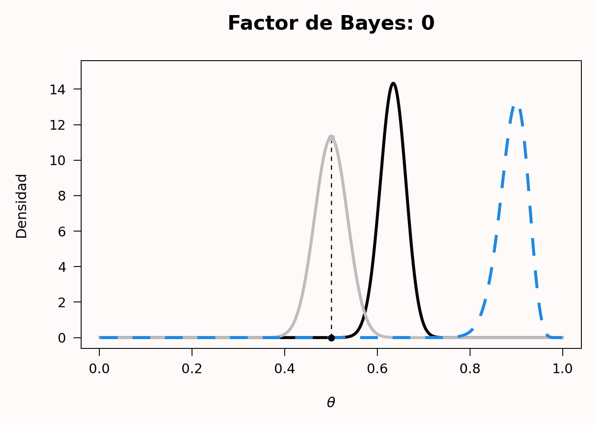
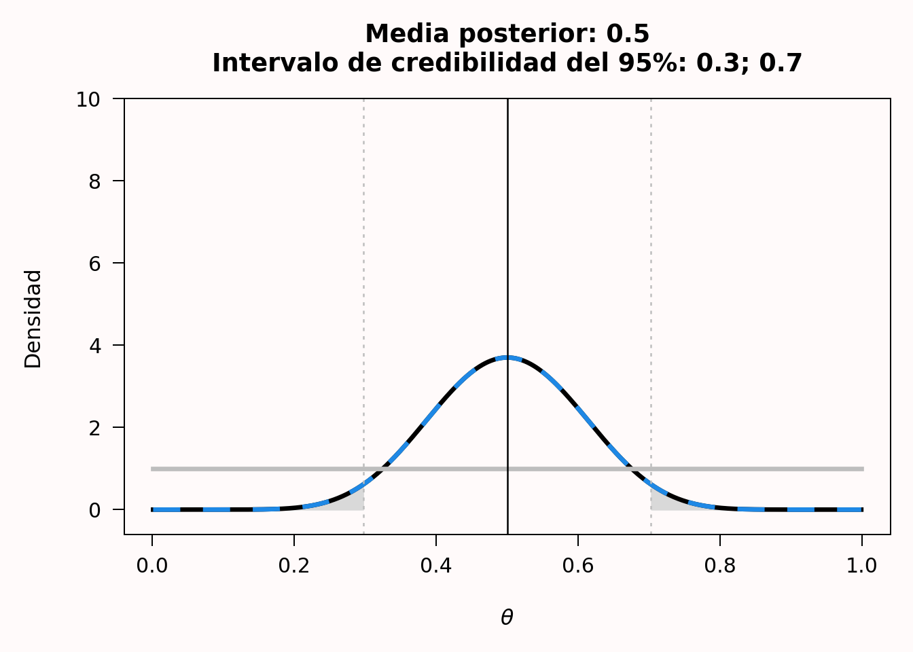

# Estadística bayesiana

> Traducción literal al castellano del capítulo 4, “Bayesian statistics”, de Daniël Lakens, *Improving Your Statistical Inferences*.<br>
> Original: https://lakens.github.io/statistical_inferences/04-bayes.html<br>
> Licencia del original: CC-BY-4.0. Traducción no oficial.

> «¡Lógica!», dijo el profesor, medio para sí mismo. «¿Por qué no enseñan lógica en estos colegios? Solo hay tres posibilidades. O tu hermana miente, o está loca, o dice la verdad. Sabes que no miente y es evidente que no está loca. Por el momento, entonces, y a menos que aparezca alguna prueba nueva, debemos suponer que dice la verdad».

[*El león, la bruja y el armario. Una historia para niños*](https://gutenberg.ca/ebooks/lewiscs-thelionthewitchandthewardrobe/lewiscs-thelionthewitchandthewardrobe-00-h.html), *de C. S. Lewis*.

En el libro infantil *El león, la bruja y el armario*, Lucy y Edmund atraviesan un armario y llegan a un país llamado Narnia. Lucy habla de Narnia a sus hermanos mayores, Peter y Susan, pero Edmund quiere mantenerlo en secreto y les dice que Lucy y él solo estaban fingiendo que Narnia existía. Peter y Susan no saben qué creer: ¿existe Narnia o no? ¿Dice la verdad Lucy o Edmund? Pensar en probabilidades a largo plazo no servirá de mucho: se trata de un acontecimiento único y tendremos que pensar en la probabilidad de que Narnia exista o no a partir de la información de la que disponemos.

Piden consejo al profesor, que vive en la casa donde se encuentra el armario. El profesor pregunta a Susan y Peter quién ha sido más sincero según su experiencia anterior, Lucy o Edmund, a lo que Peter responde: «Hasta ahora, habría dicho siempre que Lucy». Por tanto, tienen una creencia previa más fuerte en que Lucy dice la verdad que en que Edmund la dice. El profesor responde entonces con la cita anterior. De las tres opciones posibles, no creemos que Lucy mienta, porque no lo ha hecho en el pasado, y el profesor considera evidente, solo con hablar con ella, que no está loca. Por tanto, la opción más plausible es que Lucy diga la verdad. Si aparecen pruebas nuevas, estas creencias podrán actualizarse en el futuro. Este enfoque de la generación de conocimiento, en el que se cuantifica la probabilidad previa de distintas hipótesis y, si es posible, se actualiza a la luz de nuevos datos, es un ejemplo de *inferencia bayesiana*.

Aunque la estadística frecuentista es, con diferencia, el enfoque dominante en la ciencia, es importante haber tenido al menos un contacto rudimentario con la estadística bayesiana durante cualquier formación estadística. La estadística bayesiana resulta especialmente útil cuando se hacen inferencias en casos en los que los datos investigados son únicos y no existe una probabilidad frecuentista, que suele definirse como el límite de una variable promediada a lo largo de muchos ensayos. Por ejemplo, la pregunta podría no ser con qué frecuencia miente Lucy *por término medio*, sino si Lucy miente *en este caso concreto* sobre la existencia de Narnia. Cuando investigamos, a menudo partimos de una creencia previa en que una hipótesis es verdadera. Después de recoger datos, podemos utilizarlos para actualizar nuestras creencias previas. La estadística bayesiana permite actualizar las creencias previas y convertirlas en probabilidades posteriores de una manera lógicamente coherente. Antes de recoger los datos, las **razones previas** de la Hipótesis 1 ($H_1$) frente a la hipótesis nula ($H_0$) son *P*($H_1$)/*P*($H_0$). Una vez recogidos los datos, tenemos las **razones posteriores** *P*($H_1$\|D)/*P*($H_0$\|D), que pueden leerse como la probabilidad de $H_1$, dados los datos, dividida por la probabilidad de $H_0$, dados los datos. Existen distintos enfoques de la estadística bayesiana. Primero analizaremos los factores de Bayes y después la estimación bayesiana.

## Factores de Bayes

Uno de los enfoques de la estadística bayesiana se centra en comparar distintos modelos que podrían explicar los datos. En este enfoque de comparación de modelos, la probabilidad de los datos bajo un modelo especificado —*P*(D\|$H_0$)— es un número que expresa lo que en ocasiones se denomina **evidencia** absoluta y, más formalmente, verosimilitud marginal. La verosimilitud marginal utiliza probabilidades previas para promediar la verosimilitud en todo el espacio de parámetros. Supongamos, por ejemplo, que tenemos un modelo sencillo *M* basado en un único parámetro, que puede adoptar dos valores, *X* e *Y*, y que *a priori* creemos que la probabilidad de ambos valores es *P*(X) = 0.4 y *P*(Y) = 0.6. Recogemos datos y calculamos la verosimilitud para ambos valores del parámetro: *P*(D\|*X*) = 0.02 y *P*(D\|*Y*) = 0.08. La verosimilitud marginal de nuestro modelo *M* es entonces *P*(D\|M) = 0.4 × 0.02 + 0.6 × 0.08 = 0.056. La mayoría de las veces, los modelos tienen parámetros que varían de manera continua y la fórmula de la verosimilitud marginal se basa en una integral, pero la idea sigue siendo la misma.

La comparación de dos modelos se basa en la evidencia relativa que los datos proporcionan a favor de cada uno. Esta evidencia relativa se calcula dividiendo la verosimilitud marginal de un modelo por la verosimilitud marginal del otro, y esta razón de evidencia relativa basada en las verosimilitudes marginales se denomina **factor de Bayes**. Los factores de Bayes son el equivalente bayesiano de las pruebas de hipótesis (Dienes, 2008; Kass y Raftery, 1995). El factor de Bayes representa cuánto hemos actualizado nuestras creencias después de observar los datos. Podemos expresar los factores de Bayes para indicar cuánto más probable se ha vuelto $H_1$ a la luz de los datos en comparación con $H_0$ —a menudo se representa mediante $BF_{10}$— o cuánto más probable se ha vuelto $H_0$ en comparación con $H_1$ —$BF_{01}$—, y $BF_{10}$ = $1/BF_{01}$. Al igual que una razón de verosimilitudes de 1, un factor de Bayes de 1 no modifica nuestras creencias a favor de un modelo frente al otro. Un factor de Bayes muy grande a favor de $H_1$ frente a $H_0$ aumenta nuestra creencia en $H_1$ en relación con $H_0$, y un factor de Bayes cercano a 0 aumenta nuestra creencia en $H_0$ en relación con $H_1$. Si nuestra creencia previa en $H_1$ era muy, muy baja —por ejemplo, nuestra creencia en los unicornios—, incluso un factor de Bayes grande que apoyara la presencia de un unicornio podría no convencernos todavía de que los unicornios son reales. Sin embargo, habríamos actualizado nuestra creencia y ahora pensaríamos que al menos son más probables de lo que creíamos antes —aunque continuásemos considerando muy improbable que existan—. La contribución del factor de Bayes y de la previa al cálculo de las razones posteriores queda clara en la fórmula siguiente:

$$
\frac{P(H_1|D)}{P(H_0|D)} = \frac{P(D|H_1)}{P(D|H_0)} \times \frac{P(H_1)}{P(H_0)}
$$

$$
\text{Razón posterior} = \text{Factor de Bayes} \times \text{Razón previa}
$$

Un análisis bayesiano de los datos exige especificar la previa. Aquí continuaremos con nuestro ejemplo basado en una probabilidad binomial, como el lanzamiento de una moneda. En el ejemplo sobre la verosimilitud comparamos dos hipótesis puntuales —por ejemplo, *p* = 0.5 frente a *p* = 0.8—. En la estadística bayesiana, los parámetros se consideran variables aleatorias, y la incertidumbre o el grado de creencia respecto a ellos se cuantifica mediante **distribuciones de probabilidad**.

Una probabilidad binomial se sitúa entre 0 y 1. Podríamos dibujar cualquier densidad de probabilidad entre 0 y 1 y convertirla en una previa, pero, por buenas razones —sobre todo por sencillez—, para las probabilidades binomiales se utiliza con frecuencia una previa beta. La forma de la previa beta depende de dos parámetros, $\alpha$ y $\beta$. Observa que son las mismas letras griegas que se utilizan para las tasas de error Tipo 1 y Tipo 2, pero se trata de una coincidencia. Los parámetros $\alpha$ y $\beta$ de las probabilidades binomiales no guardan relación con las tasas de error, y que se utilicen las mismas letras se debe principalmente a la falta de creatividad de los estadísticos y a las limitadas posibilidades que ofrece el alfabeto. Tampoco ayuda que la distribución en la que $\beta$ es uno de los parámetros se denomine distribución Beta. Intenta mantener separadas estas betas. La función de densidad de probabilidad es:

$$
f(x; \alpha, \beta) = \frac{1}{B(\alpha, \beta)} x^{\alpha - 1}(1 - x)^{\beta - 1}
$$

donde *B*($\alpha$, $\beta$) es la función beta. Comprender la base matemática de esta función queda fuera del alcance de este capítulo, pero puedes leer más en [Wikipedia](https://es.wikipedia.org/wiki/Distribuci%C3%B3n_beta) o en el libro de Kruschke *Doing Bayesian Data Analysis* (Kruschke, 2014). En la visualización interactiva siguiente pueden explorarse previas beta con distintos valores de $\alpha$ y $\beta$. Cada panel muestra una distribución Beta diferente; puedes modificar libremente $\alpha$ y $\beta$ para observar cómo cambia su forma, mientras que la media y la moda se actualizan automáticamente.

::: {.content-visible when-format="html"}

```{=html}
<iframe id="beta-prior-iframe"
        src="beta_prior_app_book.html"
        width="100%"
        height="620"
        scrolling="no"
        style="border:none;display:block;margin:1.5rem 0;overflow:hidden;"
        title="Distribuciones previas beta">
</iframe>
<script>
window.addEventListener('message', function(e) {
  if (e.data && typeof e.data.iframeHeight === 'number') {
    var f = document.getElementById('beta-prior-iframe');
    if (f && e.source === f.contentWindow) f.style.height = e.data.iframeHeight + 'px';
  }
});
</script>
```

:::

::: {.content-visible unless-format="html"}

*En la versión en línea de este libro está disponible una visualización interactiva de la distribución Beta.*

:::

Estas densidades beta reflejan distintos tipos de previas. Imaginemos que se te acerca un vendedor ambulante que intenta venderte una moneda especial, con cara y cruz, que al lanzarla casi siempre cae de cara. La previa $\alpha$ = 1, $\beta$ = 1 es la que tendría un bebé recién nacido, sin ninguna idea sobre qué esperar al lanzar una moneda, de modo que todos los valores de *p* son igualmente probables. La previa $\alpha$ = 1, $\beta$ = 1/2 es la que tendría un creyente convencido. El vendedor te dice que la moneda caerá de cara casi siempre y, por tanto, crees que caerá de cara casi siempre. Las previas $\alpha$ = 4, $\beta$ = 4 y $\alpha$ = 100, $\beta$ = 100 corresponden a personas ligera y extremadamente escépticas, respectivamente. Con una previa $\alpha$ = 4, $\beta$ = 4, esperas que la moneda esté equilibrada, pero estás dispuesto a creer que es posible un amplio intervalo de otros valores verdaderos —la curva se centra en 0.5, pero es ancha y admite valores de *p* muy altos y muy bajos—. Con la previa $\alpha$ = 100, $\beta$ = 100 estás realmente convencido de que las monedas están equilibradas y crees que, como máximo, existirá un sesgo muy pequeño —la curva vuelve a estar centrada en 0.5, y una persona escéptica cree que *p* se situará entre 0.4 y 0.6, un intervalo mucho más estrecho que el de la persona ligeramente escéptica—.

Supongamos que el bebé recién nacido, el creyente convencido, la persona ligeramente escéptica y la persona extremadamente escéptica compran la moneda, la lanzan *n* = 20 veces y observan *x* = 10 caras. Este resultado puede representarse como una distribución binomial con 10 caras en 20 ensayos o como una distribución Beta(11, 11).

El bebé recién nacido tenía una distribución previa Beta con $\alpha$ = 1 y $\beta$ = 1, que equivale a una distribución de verosimilitud binomial correspondiente a 0 caras en 0 ensayos. La posterior es una distribución Beta($\alpha^*$, $\beta^*$), donde:

$$\alpha^* = \alpha + x = 1 + 10 = 11$$

$$\beta^* = \beta + (n - x) = 1 + 20 - 10 = 11$$

O, calculando estos valores de forma más directa a partir de $\alpha$ y $\beta$ de la previa y de la verosimilitud:

$$\alpha^* = \alpha_\text{previa} + \alpha_\text{verosimilitud} - 1 = 1 + 11 - 1 = 11$$

$$\beta^* = \beta_\text{previa} + \beta_\text{verosimilitud} - 1 = 1 + 11 - 1 = 11$$

Por tanto, la distribución posterior del bebé es una distribución Beta(11, 11). Esta equivale a una función de verosimilitud binomial correspondiente a 10 caras en 20 ensayos, es decir, a una distribución Beta(11, 11). En otras palabras, cuando se utiliza una previa uniforme, la distribución posterior es idéntica a la función de verosimilitud.

La visualización interactiva siguiente muestra cómo se actualiza cada previa para convertirse en una posterior después de observar los datos. En cada panel, la línea gris es la previa, la línea azul discontinua es la verosimilitud y la línea roja es la posterior. Utiliza los campos *n* —lanzamientos— y *x* —caras— para ver cómo cambian la previa, la verosimilitud y la posterior con datos diferentes. Los valores predeterminados son *n* = 20 y *x* = 10. Observa que el creyente convencido utiliza una previa Beta(10, 0.5), lo bastante fuerte como para que, con solo 20 lanzamientos, la posterior siga sesgada hacia la cara incluso cuando se observa exactamente un 50% de caras.

::: {.content-visible when-format="html"}

```{=html}
<iframe id="bayes-update-iframe"
        src="bayesian_updating_app_book.html"
        width="100%"
        height="680"
        scrolling="no"
        style="border:none;display:block;margin:1.5rem 0;overflow:hidden;"
        title="Actualización bayesiana">
</iframe>
<script>
window.addEventListener('message', function(e) {
  if (e.data && typeof e.data.iframeHeight === 'number') {
    var f = document.getElementById('bayes-update-iframe');
    if (f && e.source === f.contentWindow) f.style.height = e.data.iframeHeight + 'px';
  }
});
</script>
```

:::

::: {.content-visible unless-format="html"}

*En la versión en línea de este libro está disponible una visualización interactiva de la actualización bayesiana.*

:::

En el caso del creyente convencido, la posterior es atraída de manera apreciable hacia la previa: los datos muestran un 50% de caras, pero la posterior sigue inclinándose hacia la cara porque la previa tiene un peso considerable —Beta(10, 0.5) equivale a haber observado antes unas 9 caras adicionales con pocas pruebas en sentido contrario—. Las personas ligera y extremadamente escépticas terminan con una creencia mucho más fuerte en que la moneda está equilibrada que el bebé y el creyente convencido después de observar los datos, pero principalmente porque ya partían de una creencia previa más fuerte en que la moneda estaba equilibrada.

## Actualizar nuestra creencia

Ahora que tenemos una distribución para la previa y otra para la posterior, podemos comparar dónde es más alta la posterior que la previa para ver en qué valores de *p* ha aumentado nuestra creencia. En todos los puntos en los que la posterior —roja— está por encima de la previa —gris—, ha aumentado nuestra creencia en ese valor de *p*.

El factor de Bayes cuantifica este cambio en la evidencia relativa en una hipótesis nula puntual $H_0$ concreta. Es simplemente el valor de la distribución posterior en $H_0$ dividido por el valor de la distribución previa en $H_0$: una razón conocida como **razón de densidades de Savage-Dickey**. Para la previa Beta(1, 1) del bebé recién nacido y 10 caras en 20 lanzamientos, donde $H_0$: *p* = 0.5:

$$BF_{10} = \frac{\text{Beta}(p = 0.5,\; 11,\; 11)}{\text{Beta}(p = 0.5,\; 1,\; 1)} = \frac{3.70}{1} = 3.70$$

Utiliza la calculadora interactiva siguiente para explorar cómo cambia el factor de Bayes con distintas previas y distintos datos. La línea gris es la previa, la azul discontinua es la verosimilitud —solo resulta visible si cambias la previa uniforme por una previa informada— y la roja es la posterior. El punto gris señala la densidad previa en $H_0$, el punto rojo señala la densidad posterior en $H_0$ y el segmento discontinuo que los une ilustra la razón que produce $BF_{10}$.

::: {.content-visible when-format="html"}

```{=html}
<iframe id="bayes-factor-iframe"
        src="bayes_factor_app_book.html"
        width="100%"
        height="600"
        scrolling="no"
        style="border:none;display:block;margin:1.5rem 0;overflow:hidden;"
        title="Calculadora del factor de Bayes">
</iframe>
<script>
window.addEventListener('message', function(e) {
  if (e.data && typeof e.data.iframeHeight === 'number') {
    var f = document.getElementById('bayes-factor-iframe');
    if (f && e.source === f.contentWindow) f.style.height = e.data.iframeHeight + 'px';
  }
});
</script>
```

:::

::: {.content-visible unless-format="html"}

*En la versión en línea de este libro está disponible una calculadora interactiva del factor de Bayes.*

:::

Vemos que, para el bebé recién nacido, *p* = 0.5 se ha vuelto más probable, pero también lo ha hecho *p* = 0.4. Examinemos ahora las curvas de la persona extremadamente escéptica, que cree que la moneda está equilibrada con una previa Beta(100, 100), compra la moneda y la lanza 100 veces. Sorprendentemente, la moneda cae de cara 90 de las 100 veces. El gráfico de la previa, la verosimilitud y la posterior tiene ahora un aspecto mucho más extremo, porque partíamos de una previa muy informada y de unos datos extremadamente diferentes. Vemos la distribución previa gris, la verosimilitud azul discontinua basada en los datos y la distribución posterior en negro. El factor de Bayes de 0 —el valor está redondeado y es extremadamente pequeño, pero no exactamente cero— representa la considerable disminución de la creencia en que la moneda está equilibrada; de hecho, incluso para la persona extremadamente escéptica, esta parece ahora una hipótesis insostenible. Esto muestra cómo los datos pueden actualizar una creencia. Mientras que un bebé recién nacido creería ahora por completo que la *p* verdadera de la moneda se encuentra en torno a 0.9, la persona extremadamente escéptica tiene más razones para creer que *p* se sitúa alrededor de 0.65, debido a su fuerte convicción previa de que la moneda está equilibrada. Con suficientes datos, incluso esta persona terminará convencida de que la moneda cae de cara la mayor parte de las veces.

{#fig-bayes7}

Ahora también podemos apreciar la diferencia entre un enfoque de inferencia basado en la verosimilitud y otro basado en la inferencia bayesiana. En la inferencia mediante verosimilitudes podemos comparar distintos valores de *p* en una misma curva de verosimilitud —por ejemplo, *p* = 0.5 frente a *p* = 0.8— y calcular la razón de verosimilitudes. En la inferencia bayesiana podemos comparar la diferencia entre la previa y la posterior para un mismo valor de *p* y calcular el factor de Bayes.

Si nunca has visto factores de Bayes, quizá te resulte difícil interpretar los números. Como ocurre con cualquier pauta —por ejemplo, interpretar los tamaños del efecto como pequeños, medianos y grandes—, se ha criticado el uso de valores de referencia. Por otro lado, para comenzar a formarse una idea de lo que significan los factores de Bayes hay que partir de algún sitio. Se considera que un factor de Bayes entre 1 y 3 «apenas merece una mención», uno mayor que 3 —o menor que 1/3— es «sustancial» y uno mayor que 10 —o menor que 1/10— es «fuerte» (Jeffreys, 1939). Estas etiquetas se refieren al aumento de nuestra creencia en una hipótesis concreta, no a la creencia posterior en esa hipótesis. Si consideras extremadamente inverosímil la percepción extrasensorial, un único estudio con BF = 14 aumentará tu creencia, pero solo hasta el punto de que pases a considerarla «prácticamente extremadamente inverosímil».

Los factores de Bayes se presentan a menudo como una alternativa a los valores *p*. Uno de los beneficios que se les atribuyen es que pueden proporcionar apoyo tanto a la hipótesis alternativa como a la nula (Dienes, 2014). Sin embargo, lo mismo puede lograrse con pruebas frecuentistas de equivalencia, como veremos en el capítulo sobre [pruebas de equivalencia](09-pruebas-de-equivalencia.md), y las inferencias basadas en factores de Bayes y pruebas de equivalencia suelen llevar a las mismas conclusiones (Lakens et al., 2020). Otra razón que algunas personas ofrecen para sustituir los valores *p* por factores de Bayes es que, como vimos en el capítulo 1 sobre los [valores *p*](01-usando-valores-p.md), estos se malinterpretan con frecuencia. Sin embargo, como cabía esperar, los factores de Bayes se malinterpretan y utilizan incorrectamente al menos con la misma frecuencia (Wong et al., 2022; Tendeiro et al., 2024). Las inferencias estadísticas son difíciles, y pensar en probabilidades no es algo que hagamos bien si confiamos en nuestra intuición. Tenemos que entrenarnos para extraer inferencias correctas; cambiar a otro enfoque de la estadística no impedirá que se utilice mal.

## Evitar malentendidos habituales sobre los factores de Bayes {#sec-bfgmisconceptions}

A medida que más personas han comenzado a utilizar factores de Bayes, no debería sorprendernos que se hayan extendido los malentendidos sobre ellos. Un estudio reciente muestra que el porcentaje de artículos científicos que extraen inferencias incorrectas a partir de los factores de Bayes observados es angustiosamente alto (Wong et al., 2022; Tendeiro et al., 2024): el 92% de los artículos presenta al menos un malentendido sobre los factores de Bayes.

### Malentendido 1: confundir los factores de Bayes con las razones posteriores {#sec-bfgmisconception1}

Una crítica habitual de los bayesianos al contraste de significación de la hipótesis nula —CSHN— es que este cuantifica la probabilidad de los datos —o de datos más extremos— suponiendo que la hipótesis nula es verdadera, cuando los científicos deberían estar interesados en la probabilidad de que la hipótesis sea verdadera dados los datos. Cohen (1994) escribió:

> ¿Qué tiene de malo el CSHN? Bueno, entre muchas otras cosas, no nos dice lo que queremos saber, y queremos saber tanto lo que queremos saber que, por desesperación, terminamos creyendo que sí nos lo dice. Lo que queremos saber es: «Dados estos datos, ¿cuál es la probabilidad de que $H_0$ sea verdadera?».

Por tanto, podría pensarse que los factores de Bayes nos dicen algo sobre la probabilidad de que una hipótesis sea verdadera, pero esto es incorrecto. Un factor de Bayes se limita a cuantificar cuánto deberíamos actualizar nuestra creencia en una hipótesis. Si esa hipótesis era extremadamente improbable —por ejemplo, que las personas tengan telepatía—, podríamos seguir considerándola muy improbable incluso después de calcular un factor de Bayes grande en un único estudio que demostrara telepatía. Si creíamos que la hipótesis de que las personas tienen telepatía era improbable —por ejemplo, estábamos seguros al 99.9% de que la telepatía no era real—, las pruebas a favor de la telepatía podrían aumentar nuestra creencia solo hasta el punto de que ahora considerásemos improbable la telepatía al 98%. El factor de Bayes solo se corresponde con nuestra creencia posterior cuando al principio teníamos una incertidumbre completa sobre si la hipótesis era verdadera o no. Si ambas hipótesis eran igualmente probables y un factor de Bayes indica que debemos actualizar nuestra creencia de tal modo que la hipótesis alternativa sea tres veces más probable que la nula, solo entonces terminaríamos creyendo que la hipótesis alternativa es exactamente tres veces más probable que la nula. Por tanto, no debería concluirse, por ejemplo, que con un BF de 10 la hipótesis alternativa es más probable que la hipótesis nula. La afirmación correcta es que las personas deberían multiplicar por 10 su creencia relativa en la hipótesis alternativa.

### Malentendido 2: no interpretar los factores de Bayes como evidencia relativa {#sec-bfgmisconception2}

Una ventaja de los factores de Bayes que los bayesianos mencionan a menudo es que, a diferencia del CSHN, pueden proporcionar apoyo a la hipótesis nula y, de ese modo, falsar predicciones. Es cierto que el CSHN solo puede rechazar la hipótesis nula —es decir, nunca puede aceptarla—, aunque conviene añadir que en la estadística frecuentista pueden utilizarse [pruebas de equivalencia](09-pruebas-de-equivalencia.md) para rechazar la hipótesis alternativa y, por tanto, no es necesario cambiar a los factores de Bayes para interpretar de manera significativa los resultados de contrastes no significativos de la hipótesis nula.

Los factores de Bayes cuantifican el apoyo a una hipótesis en relación con otra. Al igual que sucede con las razones de verosimilitudes —y como se ilustra en la [Figura 3.7](03-verosimilitudes.html#fig-like7)—, es posible que una hipótesis reciba más apoyo que otra aunque ambas sean falsas. Es incorrecto interpretar los factores de Bayes de manera absoluta, por ejemplo afirmando que un factor de Bayes de 0.09 apoya la hipótesis nula. La interpretación correcta es que el factor de Bayes proporciona apoyo relativo a $H_0$ en comparación con $H_1$. Con un modelo alternativo diferente, el factor de Bayes cambiaría. Como ocurre con una prueba de equivalencia significativa, incluso un factor de Bayes que apoye con fuerza a $H_0$ no significa que no exista ningún efecto: podría haber un efecto verdadero, pero pequeño.

Por ejemplo, después de que Daryl Bem (2011) publicara nueve estudios que proporcionaban apoyo a la precognición —es decir, la conciencia cognitiva consciente de un acontecimiento futuro que no podría conocerse de otro modo—, un equipo de estadísticos bayesianos volvió a analizar los estudios y concluyó: «De las diez pruebas fundamentales, solo una ofrece evidencia “sustancial” a favor de $H_1$, mientras que tres ofrecen evidencia “sustancial” a favor de $H_0$. Los resultados de las seis pruebas restantes solo proporcionan evidencia “anecdótica”» (Wagenmakers et al., 2011). En su respuesta, Bem y Utts (2011) sostienen que el conjunto de estudios proporciona evidencia convincente a favor de la hipótesis alternativa si los factores de Bayes se calculan como evidencia relativa entre la hipótesis nula y una hipótesis alternativa especificada de manera más realista, en la que se espera que los efectos de la precognición sean pequeños. Este intercambio ilustra que los factores de Bayes constituyen evidencia relativa y que un cambio en la especificación del modelo alternativo modifica qué hipótesis —la nula o la alternativa— recibe relativamente más apoyo a la luz de los datos.

### Malentendido 3: no especificar el modelo nulo o el alternativo {#sec-bfgmisconception3}

Dado que los factores de Bayes constituyen evidencia relativa a favor o en contra de un modelo en comparación con otro, podría sorprender que muchos investigadores ni siquiera especifiquen el modelo alternativo cuando informan de sus análisis. Y, sin embargo, en una revisión sistemática del uso de los factores de Bayes por parte de los psicólogos, Van de Schoot et al. (2017) encontraron que «el 31.1% de los artículos ni siquiera discutía las previas utilizadas». Mientras que, en un contraste de significación de la hipótesis nula, los investigadores no necesitan especificar el modelo en el que se basa la prueba —porque, por definición, se contrasta frente a un efecto de 0 y el modelo alternativo está formado por cualquier tamaño del efecto distinto de cero en una prueba bilateral—, esto no ocurre al calcular factores de Bayes. El modelo nulo al calcular factores de Bayes suele ser —aunque no necesariamente— una nula puntual, como en el CSHN, pero el modelo alternativo suele ser solo una de las muchas hipótesis alternativas posibles con las que el investigador podría compararlo. Se ha vuelto habitual utilizar previas «predeterminadas», pero, como ocurre con cualquier heurístico, la configuración predeterminada responderá la mayoría de las veces a una pregunta absurda y se convertirá rápidamente en una forma de estadística irreflexiva. Al presentar los factores de Bayes como alternativa a las pruebas *t* frecuentistas, Rouder et al. (2009) escriben:

> Este compromiso de especificar alternativas prudentes y razonadas impone una carga al analista. Hemos proporcionado configuraciones predeterminadas apropiadas para situaciones genéricas. Sin embargo, estas recomendaciones no son más que eso y no deberían utilizarse a ciegas. Además, los analistas pueden y deben considerar sus objetivos y expectativas al especificar las previas. En pocas palabras, la inferencia basada en principios es un proceso reflexivo que no puede realizarse mediante una adhesión rígida a los valores predeterminados.

Por tanto, las previas utilizadas al calcular un factor de Bayes deberían especificarse y justificarse.

### Malentendido 4: las afirmaciones basadas en factores de Bayes no requieren control del error {#sec-bfgmisconception4}

En un artículo con el provocador título «Detención opcional: ningún problema para los bayesianos», Rouder (2014) sostiene que «los investigadores que utilizan métodos bayesianos pueden emplear la detención opcional en sus propias investigaciones y proporcionar análisis bayesianos de datos secundarios con independencia de la regla de detención utilizada». Un lector que solo leyera el título y el resumen del artículo podría concluir que los factores de Bayes son una solución maravillosa a la inflación del error debida a la [detención opcional](10-analisis-secuencial.md) en el marco frecuentista, pero esto no es correcto (De Heide y Grünwald, 2017).

Existe una salvedad importante respecto al tipo de inferencias estadísticas que no se ve afectado por la detención opcional. La detención opcional solo deja de ser problemática para los bayesianos si se abstienen de: a) formular una afirmación dicotómica sobre la presencia o ausencia de un efecto, o b) extraer conclusiones sobre si una predicción recibe apoyo o ha sido falsada. Rouder señala que «incluso con detención opcional, un investigador puede interpretar las razones posteriores como creencias actualizadas sobre las hipótesis a la luz de los datos». En otras palabras, incluso después de una detención opcional, un factor de Bayes indica a los investigadores cuánto deberían actualizar su creencia en una hipótesis. Es importante señalar que, cuando los investigadores formulan afirmaciones dicotómicas basadas en factores de Bayes —por ejemplo, «el efecto no difirió significativamente entre las condiciones, $BF_{10}$ = 0.17»—, la afirmación puede ser correcta o constituir un error. Por eso las tasas de error se convierten en una consideración relevante, a diferencia de lo que ocurre cuando los investigadores se limitan a presentar el factor de Bayes para que los lectores actualicen sus creencias personales.

Los bayesianos discrepan entre sí sobre si los factores de Bayes deberían utilizarse como base de afirmaciones dicotómicas. Quienes promueven su uso para formular afirmaciones suelen remitirse a los umbrales propuestos por Jeffreys (1939), según los cuales un BF \> 3 constituye «evidencia sustancial» y un BF \> 10, «evidencia fuerte». Algunas revistas, como *Nature Human Behaviour*, establecen el siguiente requisito para los investigadores que envían un *Registered Report* —un formato novedoso de publicación en el que un prerregistro se somete a revisión por pares antes de analizar los datos y los autores reciben una decisión sobre la publicación del artículo antes de conocer los resultados—: «Para la inferencia mediante factores de Bayes, los autores deben ser capaces de garantizar la recogida de datos hasta que el factor de Bayes sea al menos diez veces favorable a la hipótesis experimental frente a la hipótesis nula —o viceversa—». Cuando los investigadores deciden recoger datos hasta superar un umbral concreto para formular una afirmación sobre una prueba, esa afirmación puede ser correcta o errónea, como ocurre cuando los valores *p* constituyen la base estadística de una afirmación. Puesto que tanto el factor de Bayes como el valor *p* pueden calcularse a partir del tamaño muestral y del valor *t* (Rouder et al., 2009; Francis, 2016), utilizar factores de Bayes como base de una afirmación ordinal no tiene nada de especial. Las tasas exactas de error a largo plazo no pueden controlarse directamente al calcular factores de Bayes, y las tasas de error Tipo 1 y Tipo 2 dependen de la previa elegida y del punto de corte utilizado para decidir si se formula una afirmación. Los estudios de simulación muestran que, con las previas habituales y un punto de corte de BF \> 3 para formular afirmaciones, la tasa de error Tipo 1 es algo menor, pero la tasa de error Tipo 2 es considerablemente mayor (Kelter, 2021).

En resumen, siempre que los investigadores formulan afirmaciones pueden formular afirmaciones erróneas, por lo que el control del error debería constituir un objetivo valioso. El control del error no es una consideración cuando los investigadores no formulan afirmaciones ordinales —por ejemplo, que X es mayor que Y o que existe una correlación distinta de cero entre X e Y—. Si los factores de Bayes se utilizan para cuantificar cuánto deberían actualizar los investigadores sus creencias personales en una hipótesis, no es necesario tener en cuenta el control del error; pero, como consecuencia, los investigadores también deberían abstenerse de formular en los apartados de Resultados o Discusión afirmaciones ordinales basadas en factores de Bayes. Renunciar al control del error significa también renunciar a las afirmaciones dicotómicas sobre la presencia o ausencia de efectos.

### Malentendido 5: interpretar los factores de Bayes como tamaños del efecto {#sec-bfgmisconception5}

Los factores de Bayes no son afirmaciones sobre la magnitud de un efecto. Por tanto, no es apropiado concluir que el tamaño del efecto es pequeño o grande basándose únicamente en el factor de Bayes. Según las previas utilizadas al especificar los modelos alternativo y nulo, el mismo factor de Bayes puede observarse con estimaciones del tamaño del efecto muy diferentes. También ocurre lo contrario: el mismo tamaño del efecto puede corresponder a factores de Bayes que apoyen la hipótesis nula o la alternativa, según cómo se especifiquen ambos modelos. Por tanto, los investigadores deberían informar e interpretar siempre las medidas del tamaño del efecto por separado de sus estadísticos de contraste. Las afirmaciones sobre la magnitud de los efectos deberían basarse únicamente en estas medidas del tamaño del efecto y no en los factores de Bayes.

## Estimación bayesiana {#sec-bayesest}

La distribución posterior resume nuestra creencia sobre el número esperado de caras al lanzar una moneda después de observar los datos, promediando nuestras creencias previas y los datos —o la verosimilitud—. La media de una distribución Beta puede calcularse mediante $\alpha$/$({\alpha+\beta})$. Por tanto, podemos calcular fácilmente la media de una distribución posterior, que es el valor esperado a partir de nuestras creencias previas y de los datos.

También podemos calcular un **intervalo de credibilidad** alrededor de la media, que es una versión bayesiana de un [intervalo de confianza](07-intervalos-de-confianza.md) con una interpretación ligeramente diferente. En vez de la interpretación frecuentista, en la que un parámetro tiene un único valor verdadero —desconocido—, el enfoque bayesiano considera que los datos son fijos, pero permite que el parámetro varíe. En los enfoques bayesianos, las distribuciones de probabilidad representan nuestro grado de creencia. Al calcular un intervalo de credibilidad, afirmamos: «Creo que existe una probabilidad del 95% —dadas mi previa y los datos— de que el parámetro verdadero se encuentre dentro de este intervalo de credibilidad». Un intervalo de credibilidad del 95% es simplemente el área de la distribución posterior comprendida entre los cuantiles 0.025 y 0.975.

Un intervalo de credibilidad y un intervalo de confianza son iguales cuando se utiliza una previa uniforme como Beta(1, 1). En este caso, el intervalo de credibilidad es numéricamente idéntico al intervalo de confianza. En la Figura 4.2 se muestra un ejemplo en el que se representan la media y el intervalo de credibilidad del 95% de la posterior cuando se observan 10 caras en 20 lanzamientos de una moneda, dada una previa uniforme. En este ejemplo, el intervalo de credibilidad es idéntico al intervalo de confianza. Solo difiere la interpretación. Cuando se utiliza una previa informada, el intervalo de credibilidad y el intervalo de confianza son diferentes. Si la previa elegida no representa la verdad, el intervalo de credibilidad tampoco representará la verdad, pero siempre será una formalización correcta de tus creencias. Como se explicará con más detalle en el capítulo 7, en el caso de un [único intervalo de confianza](07-intervalos-de-confianza.md), la probabilidad de que contenga el parámetro poblacional verdadero es 0 o 1. Solo a largo plazo el 95% de los intervalos de confianza contendrá el parámetro poblacional verdadero. Conviene recordar estas importantes diferencias entre los intervalos de credibilidad bayesianos y los intervalos de confianza frecuentistas.

{#fig-bayes8}

También podemos utilizar el paquete `binom` de R para calcular la media posterior, el intervalo de credibilidad y el **intervalo de máxima densidad —IMD—**. El intervalo de máxima densidad es una alternativa al intervalo de credibilidad que funciona mejor cuando la distribución beta posterior es asimétrica —y es idéntico cuando la distribución posterior es simétrica—. No entraremos aquí en los cálculos del IMD.

```r
library(binom)

n <- 20 # fija el número total de ensayos
x <- 10 # fija el número de éxitos
aprior <- 1 # fija alfa de la distribución Beta de la previa
bprior <- 1 # fija beta de la distribución Beta de la previa

binom.bayes(x, n, type = "central", prior.shape1 = aprior, prior.shape2 = bprior)
binom.bayes(x, n, type = "highest", prior.shape1 = aprior, prior.shape2 = bprior)
```

| método | x | n | forma1 | forma2 | media | inferior | superior | sig |
|:--|--:|--:|--:|--:|--:|--:|--:|--:|
| bayes | 10 | 20 | 11 | 11 | 0.5 | 0.2978068 | 0.7021932 | 0.05 |

| método | x | n | forma1 | forma2 | media | inferior | superior | sig |
|:--|--:|--:|--:|--:|--:|--:|--:|--:|
| bayes | 10 | 20 | 11 | 11 | 0.5 | 0.2978068 | 0.7021932 | 0.05 |

La media posterior es idéntica a la media frecuentista, pero esto solo sucede cuando la media de la previa coincide con la media de la verosimilitud (Albers et al., 2018). En tus investigaciones probablemente necesitarás cálculos distintos del ejemplo binomial que hemos utilizado aquí, y en el paquete de software libre y gratuito [JASP](https://jasp-stats.org/) ya se encuentran disponibles muchas pruebas bayesianas. Las matemáticas y las previas se vuelven más complejas, pero la idea básica sigue siendo la misma. Puedes utilizar la estadística bayesiana para cuantificar evidencia relativa, lo cual puede orientarte sobre cuánto deberías creer en las teorías o actualizar tus creencias en ellas.

Este capítulo ha mostrado la esencia de la inferencia bayesiana: decidimos una distribución previa, recogemos datos y calculamos una verosimilitud marginal, y utilizamos estos elementos para calcular una distribución posterior. A partir de esta distribución posterior podemos estimar la media y el intervalo de credibilidad del 95%. Para cualquier hipótesis concreta podemos calcular, mediante el factor de Bayes, la evidencia relativa a favor de un modelo posterior en comparación con un modelo previo. Existen muchos tipos distintos de estadística bayesiana. Esto significa que los propios bayesianos discrepan sobre cuál es el mejor enfoque de las inferencias estadísticas, con una vehemencia al menos tan grande como la de las discrepancias entre frecuentistas y bayesianos. Por ejemplo, a muchos bayesianos no les gustan los factores de Bayes (McElreath, 2016). A algunos bayesianos no les gustan las previas subjetivas utilizadas en el **análisis bayesiano subjetivo** y prefieren lo que se conoce como **análisis bayesiano objetivo** (Berger y Bayarri, 2004). Los materiales didácticos sobre estadística bayesiana suelen presentarla como superior a la estadística frecuentista. Para acceder a una exposición educativa más equilibrada sobre la estadística bayesiana y frecuentista, que señale con mayor honestidad las fortalezas y debilidades de ambos enfoques, consulta los primeros 50 minutos de [esta clase de Michael I. Jordan](https://www.youtube.com/watch?v=HUAE26lNDuE).

## Ponte a prueba

**P1**: El creyente convencido tenía una previa Beta(1, 0.5). Después de observar 10 caras en 20 lanzamientos de una moneda, ¿cuál es la distribución posterior, dado que $\alpha^*$ = $\alpha$ + *x* y $\beta^*$ = $\beta$ + *n* – *x*?

- Beta(10, 10)
- Beta(11, 10.5)
- Beta(10, 20)
- Beta(11, 20.5)

**P2**: La persona extremadamente escéptica tenía una previa Beta(100, 100). Después de observar 50 caras en 100 lanzamientos de una moneda, ¿cuál es la distribución posterior, dado que $\alpha^*$ = $\alpha$ + *x* y $\beta^*$ = $\beta$ + *n* – *x*?

- Beta(50, 50)
- Beta(51, 51)
- Beta(150, 150)
- Beta(11, 20.5)

Utiliza la calculadora del factor de Bayes anterior con los valores predeterminados: $H_0$ = 0.5, *n* = 20, *x* = 10, $\alpha$ = 1 y $\beta$ = 1. La calculadora representa la previa —gris—, la verosimilitud —azul discontinua— y la posterior —roja—, y muestra $BF_{10}$ como la razón entre la densidad posterior y la densidad previa en $H_0$.

**P3**: En la calculadora, cambia $H_0$ a 0.675 y mantén todos los demás valores predeterminados. Si estuvieras poniendo a prueba la idea de que esta moneda cae de cara el 67.5% de las veces, ¿qué afirmación sería verdadera?

- Tu creencia en esta hipótesis, dados los datos, habría disminuido.
- Tu creencia en esta hipótesis, dados los datos, habría permanecido igual.
- Tu creencia en esta hipótesis, dados los datos, habría aumentado.

**P4**: Vuelve a fijar $H_0$ en 0.5 en la calculadora. A continuación, fija $\alpha$ = 100 y $\beta$ = 100 —manteniendo *n* = 20 y *x* = 10— para examinar la actualización de la creencia de la persona extremadamente escéptica. Compara $BF_{10}$ con el $BF_{10}$ = 3.70 del bebé recién nacido. ¿Qué afirmación es verdadera?

- La creencia en la hipótesis de que *p* = 0.5, dados los datos, ha **aumentado** para la persona extremadamente escéptica, pero **no tanto** como para el bebé recién nacido.
- La creencia en la hipótesis de que *p* = 0.5, dados los datos, ha **aumentado** para la persona extremadamente escéptica **exactamente en la misma medida** que para el bebé recién nacido.
- La creencia en la hipótesis de que *p* = 0.5, dados los datos, ha **aumentado** para la persona extremadamente escéptica, y **mucho más** que para el bebé recién nacido.
- La creencia en la hipótesis de que *p* = 0.5, dados los datos, ha **disminuido** para la persona extremadamente escéptica.

Copia y ejecuta el siguiente script de R. El script representará la media de la posterior cuando se observan 10 caras en 20 lanzamientos de una moneda, dada una previa uniforme —como en la Figura 4.2—. También utilizará el paquete `binom` para calcular la media posterior, el intervalo de credibilidad y el intervalo de máxima densidad, que constituye una alternativa al intervalo de credibilidad.

```r
n <- 20 # fija el número total de ensayos
x <- 10 # fija el número de éxitos
aprior <- 1 # fija alfa de la distribución Beta de la previa
bprior <- 1 # fija beta de la distribución Beta de la previa

ymax <- 10 # fija el máximo del eje y

alikelihood <- x + 1 # calcula alfa de la distribución Beta de la verosimilitud
blikelihood <- n - x + 1 # calcula beta de la distribución Beta de la verosimilitud
aposterior <- aprior + alikelihood - 1 # calcula alfa de la distribución Beta de la posterior
bposterior <- bprior + blikelihood - 1 # calcula beta de la distribución Beta de la posterior

theta <- seq(0, 1, 0.001) # crea un intervalo de probabilidad p de 0 a 1
prior <- dbeta(theta, aprior, bprior) # determina la distribución previa
likelihood <- dbeta(theta, alikelihood, blikelihood) # determina la distribución de verosimilitud
posterior <- dbeta(theta, aposterior, bposterior) # determina la distribución posterior
plot(theta, posterior, ylim = c(0, ymax), type = "l", lwd = 3,
     xlab = bquote(theta), ylab = "Densidad", las = 1) # dibuja la posterior
lines(theta, prior, col = "grey", lwd = 3) # dibuja la previa
lines(theta, likelihood, lty = 2, lwd = 3, col = "dodgerblue") # dibuja la verosimilitud
LL <- qbeta(.025, aposterior, bposterior) # calcula el límite inferior del intervalo de credibilidad
UL <- qbeta(.975, aposterior, bposterior) # calcula el límite superior del intervalo de credibilidad
abline(v = aposterior / (aposterior + bposterior)) # dibuja la línea de la media
abline(v = LL, col = "grey", lty = 3) # dibuja la línea del límite inferior
abline(v = UL, col = "grey", lty = 3) # dibuja la línea del límite superior
polygon(c(theta[theta < LL], rev(theta[theta < LL])),
        c(posterior[theta < LL], rep(0, sum(theta < LL))),
        col = "lightgrey", border = NA)
polygon(c(theta[theta > UL], rev(theta[theta > UL])),
        c(posterior[theta > UL], rep(0, sum(theta > UL))),
        col = "lightgrey", border = NA)
title(paste("Media posterior: ",
            round((aposterior / (aposterior + bposterior)), digits = 5),
            ", intervalo de credibilidad del 95%: ",
            round(LL, digits = 2), ";", round(UL, digits = 2), sep = ""))

if (!require(binom)) {
  install.packages("binom")
}
library(binom)
binom.bayes(x, n, type = "central", prior.shape1 = aprior, prior.shape2 = bprior)
binom.bayes(x, n, type = "highest", prior.shape1 = aprior, prior.shape2 = bprior)
```


| método | x | n | forma1 | forma2 | media | inferior | superior | sig |
|:--|--:|--:|--:|--:|--:|--:|--:|--:|
| bayes | 10 | 20 | 11 | 11 | 0.5 | 0.2978068 | 0.7021932 | 0.05 |

| método | x | n | forma1 | forma2 | media | inferior | superior | sig |
|:--|--:|--:|--:|--:|--:|--:|--:|--:|
| bayes | 10 | 20 | 11 | 11 | 0.5 | 0.2978068 | 0.7021932 | 0.05 |

La media posterior es idéntica a la media frecuentista, pero esto solo ocurre cuando la media de la previa coincide con la media de la verosimilitud.

**P5**: Supongamos que el resultado de los 20 lanzamientos hubiera sido de 18 caras. Cambia *x* a 18 en la segunda línea y ejecuta el script. Recuerda que la media de la distribución previa Beta(1, 1) es $\alpha$ / ($\alpha$ + $\beta$), es decir, 1/(1+1) = 0.5. La media frecuentista es simplemente *x*/*n*, o 18/20 = 0.9. ¿Qué afirmación es verdadera?

- La media frecuentista es **mayor** que la media de la posterior porque, al combinar la previa con los datos, la media de la posterior está **más cerca** de la media de la distribución previa.
- La media frecuentista es **menor** que la media de la posterior porque, al combinar la previa con los datos, la media de la posterior está **más cerca** de la media de la distribución previa.
- La media frecuentista es **mayor** que la media de la posterior porque, al combinar la previa con los datos, la media de la posterior está **más lejos** de la media de la distribución previa.
- La media frecuentista es **menor** que la media de la posterior porque, al combinar la previa con los datos, la media de la posterior está **más lejos** de la media de la distribución previa.

**P6**: ¿Cuál es, hoy, tu mejor estimación de la probabilidad de que el sol salga mañana? Supón que naciste con una previa uniforme Beta(1, 1). El sol puede salir o no salir. Supón que has visto salir el sol todos los días desde que naciste, lo que significa que se ha producido una sucesión continua de éxitos durante todos los días de tu vida. Puedes estimar los días que has vivido multiplicando tu edad por 365. ¿Cuál es tu mejor estimación de la probabilidad de que el sol salga mañana?

Respuesta: ________

**P7**: ¿Cuál sería la mejor estimación de la probabilidad de la P6 desde una perspectiva frecuentista?

Respuesta: ________

**P8**: ¿Cuál crees que es el objetivo de la ciencia? Rozeboom (1960) criticó el contraste de hipótesis de Neyman-Pearson con la siguiente afirmación:

> Pero el objetivo principal de un experimento científico no es precipitar decisiones, sino realizar un ajuste apropiado del grado en que se acepta o se cree en la hipótesis o hipótesis que se ponen a prueba.

Frick (1996) respondió a Rozeboom:

> Rozeboom (1960) sugirió que los científicos no deberían tomar decisiones sobre las afirmaciones, sino calcular y actualizar la probabilidad de dichas afirmaciones. Sin embargo, esto no parece práctico. Si solo hubiera un puñado de afirmaciones posibles en cualquier área de la psicología, sería factible asignarles probabilidades, actualizar constantemente esas probabilidades y esperar que los experimentadores llevaran la cuenta de esas probabilidades siempre cambiantes. En realidad, el mero número de afirmaciones de la psicología resulta abrumador. Probablemente sería imposible que los seres humanos llevaran la cuenta de la probabilidad de cada afirmación, sobre todo si esas probabilidades cambiasen continuamente. En cualquier caso, los científicos no asignan probabilidades a las afirmaciones. En su lugar, actúan como si el objetivo de la ciencia fuera reunir un corpus de afirmaciones que se consideran establecidas (Giere, 1972).

En filosofía de la ciencia no existen respuestas correctas o incorrectas. Reflexiona en 250 palabras sobre estos dos objetivos de la ciencia esbozados por Rozeboom y Frick y sobre cómo se relacionan con tu propia filosofía de la ciencia.

### Preguntas abiertas

1. ¿Qué es un factor de Bayes?

2. ¿Cuál es la diferencia entre un factor de Bayes y una razón de verosimilitudes?

3. ¿Qué significa un factor de Bayes de 1?

4. ¿Qué es la previa en la inferencia bayesiana? ¿Es posible que distintas personas tengan previas diferentes?

5. Define un intervalo de credibilidad.

6. ¿Cuál es la diferencia entre un intervalo de confianza frecuentista y un intervalo de credibilidad bayesiano?

7. ¿Cuál es la diferencia entre una previa uniforme y una informada cuando calculamos la distribución posterior?

8. Al calcular un factor de Bayes para analizar, por ejemplo, la diferencia de medias entre dos grupos independientes, ¿por qué es incorrecto escribir «el factor de Bayes de 0.2 indicó que no había ningún efecto»?

9. Al calcular un factor de Bayes para analizar, por ejemplo, la diferencia de medias entre dos grupos independientes, ¿por qué es incorrecto escribir «el factor de Bayes de 8 indicó que la hipótesis alternativa era más probable que la hipótesis nula»?

## Solucionario {.unnumbered}

- **P1:** Beta(11, 10.5).
- **P2:** Beta(150, 150).
- **P3:** La creencia en la hipótesis habría permanecido igual.
- **P4:** La creencia en que *p* = 0.5 ha aumentado para la persona extremadamente escéptica, pero no tanto como para el bebé recién nacido.
- **P5:** La media frecuentista es mayor que la media de la posterior porque, al combinar la previa con los datos, la media de la posterior se acerca a la media de la distribución previa.
- **P6:** Si has vivido *d* días, la posterior es Beta(*d* + 1, 1) y su media es $({d+1})/({d+2})$. Para una persona adulta, el valor redondeado es aproximadamente 1 —por ejemplo, 0.9999—.
- **P7:** 1.
- **P8:** Respuesta abierta.

## Referencias

Albers, C. J., Kiers, H. A. L., & van Ravenzwaaij, D. (2018). Credible confidence: A pragmatic view on the frequentist vs Bayesian debate. *Collabra: Psychology, 4*(1), 31. https://doi.org/10.1525/collabra.149

Bem, D. J. (2011). Feeling the future: Experimental evidence for anomalous retroactive influences on cognition and affect. *Journal of Personality and Social Psychology, 100*(3), 407–425. https://doi.org/10.1037/a0021524

Bem, D. J., Utts, J., & Johnson, W. O. (2011). Must psychologists change the way they analyze their data? *Journal of Personality and Social Psychology, 101*(4), 716–719. https://doi.org/10.1037/a0024777

Berger, J. O., & Bayarri, M. J. (2004). The interplay of Bayesian and frequentist analysis. *Statistical Science, 19*(1), 58–80. https://doi.org/10.1214/088342304000000116

Cohen, J. (1994). The earth is round (*p* < .05). *American Psychologist, 49*(12), 997–1003. https://doi.org/10.1037/0003-066X.49.12.997

De Heide, R., & Grünwald, P. D. (2017). Why optional stopping is a problem for Bayesians. *arXiv:1708.08278 [Math, Stat]*. https://arxiv.org/abs/1708.08278

Dienes, Z. (2008). *Understanding psychology as a science: An introduction to scientific and statistical inference*. Palgrave Macmillan.

Dienes, Z. (2014). Using Bayes to get the most out of non-significant results. *Frontiers in Psychology, 5*. https://doi.org/10.3389/fpsyg.2014.00781

Francis, G. (2016). Equivalent statistics and data interpretation. *Behavior Research Methods*, 1–15. https://doi.org/10.3758/s13428-016-0812-3

Frick, R. W. (1996). The appropriate use of null hypothesis testing. *Psychological Methods, 1*(4), 379–390. https://doi.org/10.1037/1082-989X.1.4.379

Jeffreys, H. (1939). *Theory of probability* (1st ed.). Oxford University Press.

Kass, R. E., & Raftery, A. E. (1995). Bayes factors. *Journal of the American Statistical Association, 90*(430), 773–795. https://doi.org/10.1080/01621459.1995.10476572

Kelter, R. (2021). Analysis of type I and II error rates of Bayesian and frequentist parametric and nonparametric two-sample hypothesis tests under preliminary assessment of normality. *Computational Statistics, 36*(2), 1263–1288. https://doi.org/10.1007/s00180-020-01034-7

Kruschke, J. K. (2014). *Doing Bayesian data analysis: A tutorial with R, JAGS, and Stan* (2nd ed.). Academic Press.

Lakens, D., McLatchie, N., Isager, P. M., Scheel, A. M., & Dienes, Z. (2020). Improving inferences about null effects with Bayes factors and equivalence tests. *The Journals of Gerontology: Series B, 75*(1), 45–57. https://doi.org/10.1093/geronb/gby065

McElreath, R. (2016). *Statistical rethinking: A Bayesian course with examples in R and Stan* (Vol. 122). CRC Press.

Rouder, J. N. (2014). Optional stopping: No problem for Bayesians. *Psychonomic Bulletin & Review, 21*(2), 301–308.

Rouder, J. N., Speckman, P. L., Sun, D., Morey, R. D., & Iverson, G. (2009). Bayesian *t* tests for accepting and rejecting the null hypothesis. *Psychonomic Bulletin & Review, 16*(2), 225–237. https://doi.org/10.3758/PBR.16.2.225

Rozeboom, W. W. (1960). The fallacy of the null-hypothesis significance test. *Psychological Bulletin, 57*(5), 416–428. https://doi.org/10.1037/h0042040

Tendeiro, J. N., Kiers, H. A. L., Hoekstra, R., Wong, T. K., & Morey, R. D. (2024). Diagnosing the misuse of the Bayes factor in applied research. *Advances in Methods and Practices in Psychological Science, 7*(1), 25152459231213371. https://doi.org/10.1177/25152459231213371

Van de Schoot, R., Winter, S. D., Ryan, O., Zondervan-Zwijnenburg, M., & Depaoli, S. (2017). A systematic review of Bayesian articles in psychology: The last 25 years. *Psychological Methods, 22*(2), 217–239. https://doi.org/10.1037/met0000100

Wagenmakers, E.-J., Wetzels, R., Borsboom, D., & van der Maas, H. L. J. (2011). Why psychologists must change the way they analyze their data: The case of psi: Comment on Bem (2011). *Journal of Personality and Social Psychology, 100*(3), 426–432. https://doi.org/10.1037/a0022790

Wong, T. K., Kiers, H., & Tendeiro, J. (2022). On the potential mismatch between the function of the Bayes factor and researchers’ expectations. *Collabra: Psychology, 8*(1), 36357. https://doi.org/10.1525/collabra.36357

Lakens, D. (2022). *Improving Your Statistical Inferences*. https://lakens.github.io/statistical_inferences/ https://doi.org/10.5281/zenodo.6409077
