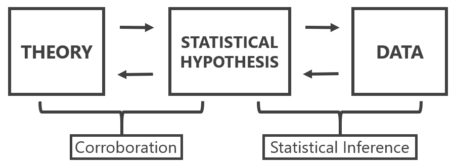
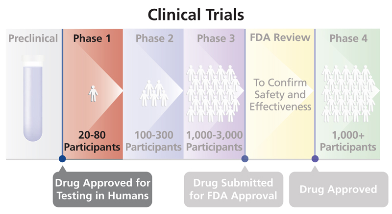
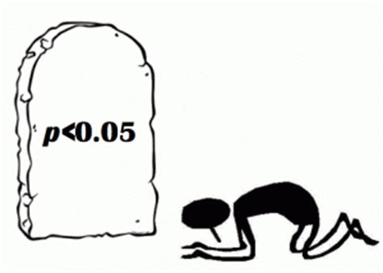
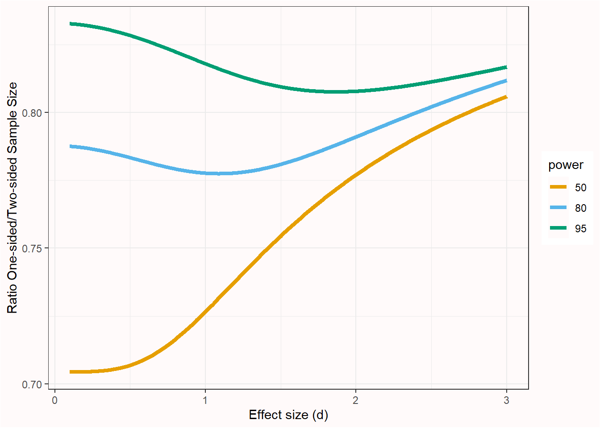
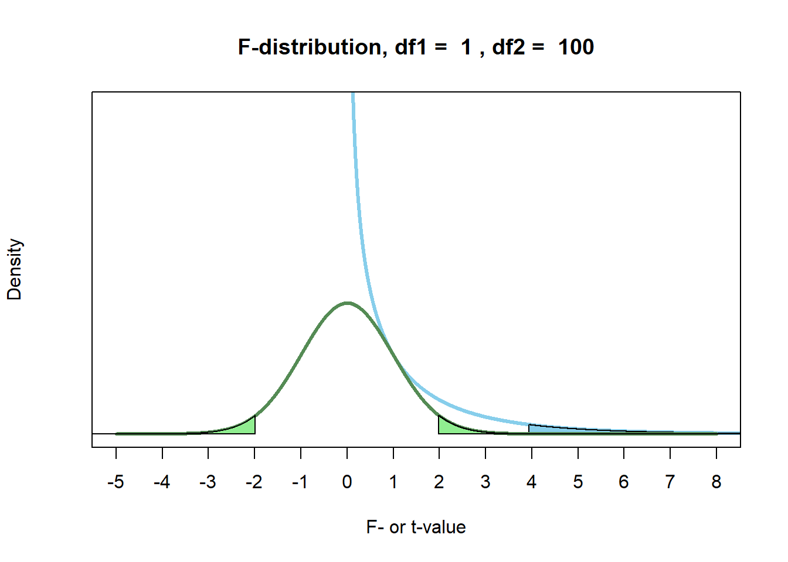
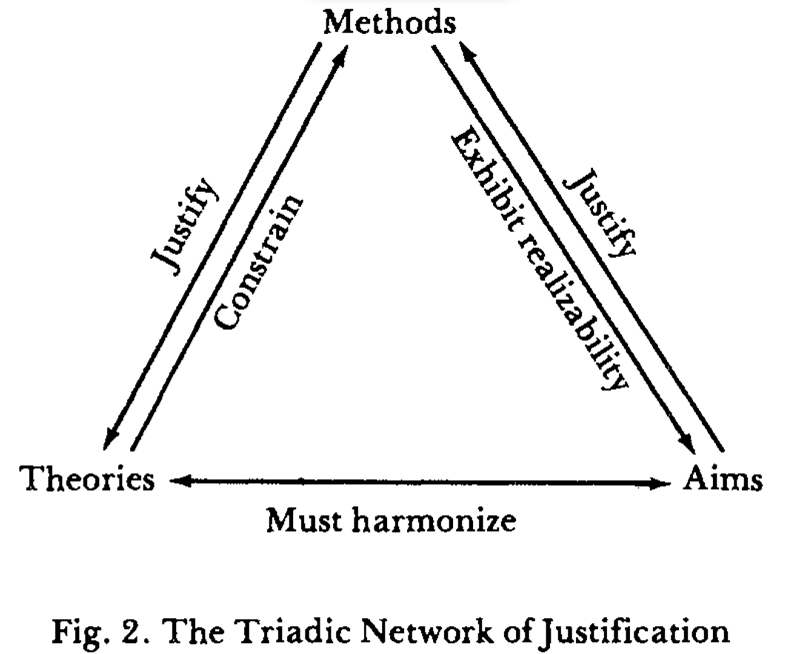
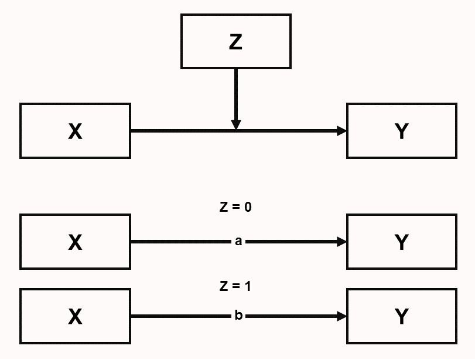

# Formular preguntas estadísticas
> Cuidado con el hombre de un solo método o de un solo instrumento, ya sea experimental o teórico. Tiende a volverse orientado al método en lugar de orientado al problema. El hombre orientado al método está encadenado; el hombre orientado al problema al menos está alcanzando libremente hacia lo que es más importante.
>
> — Platt (1964), *Strong Inference*.

En el núcleo del diseño de un nuevo estudio está la evaluación de su **calidad informativa**: el potencial de un conjunto de datos concreto para alcanzar un objetivo de análisis dado empleando métodos de análisis de datos y considerando una utilidad dada (Kenett et al., 2016). El objetivo de la recogida de datos es obtener información mediante investigación empírica en la que se recopilan observaciones y se analizan, a menudo a través de modelos estadísticos. Se pueden distinguir tres enfoques de modelización estadística (Shmueli, 2010): **descripción, explicación y predicción**, que se discuten a continuación. La utilidad a menudo depende de qué efectos se consideran interesantes. Por lo tanto, una evaluación exhaustiva de la calidad informativa de un estudio depende de especificar claramente el objetivo de la recogida de datos, el enfoque de modelización estadística que se elige y la utilidad de los datos para extraer conclusiones sobre los efectos de interés con el método de análisis elegido. Un estudio con baja calidad informativa puede que no merezca la pena realizarlo, ya que los datos que se recogerán tienen un bajo potencial para alcanzar el objetivo de análisis.

## Descripción

La descripción pretende responder preguntas sobre rasgos de la manifestación empírica de algún fenómeno. La descripción puede implicar eventos únicos (p. ej., estudios de caso de pacientes individuales) y clases de eventos (p. ej., pacientes con una determinada enfermedad). Ejemplos de rasgos de interés son la duración (cuánto tiempo), la cantidad (cuántos), la localización (dónde), etc.

Un ejemplo de una pregunta descriptiva es la investigación de Kinsey, que estudió el comportamiento y las experiencias sexuales de los estadounidenses en una época en la que había muy poca investigación científica disponible sobre este tema. Utilizó entrevistas que proporcionaron la base estadística para extraer conclusiones sobre la sexualidad en Estados Unidos, lo cual, en ese momento, desafió las creencias convencionales sobre la sexualidad.

Las preguntas de investigación descriptiva se responden mediante estadística de estimación. El valor informativo de un estudio de estimación viene determinado por la cantidad de observaciones (cuantas más observaciones, mayor la precisión de las estimaciones) y el plan de muestreo (cuanto más representativa sea la muestra, menor será el sesgo de selección muestral, lo que incrementa la capacidad de generalizar de la muestra a la población), y la fiabilidad de la medida. También es importante crear medidas fiables y válidas. Para un recurso educativo abierto y gratuito sobre medición psicológica, véase “Introduction to Educational and Psychological Measurement Using R”.

Las preguntas de investigación descriptiva a veces se ven como menos emocionantes que las preguntas de explicación o de predicción (Gerring, 2012), pero son un bloque esencial en la formación de teorías (Scheel et al., 2021). Aunque las preguntas de estimación a menudo se centran en la puntuación media de una medida, las estimaciones precisas de la varianza de una medida también son extremadamente valiosas. La varianza de una medida es información esencial en una justificación del tamaño muestral bien fundamentada, tanto al planificar para la precisión como al realizar un análisis de potencia a priori.

## Predicción

El objetivo en la modelización predictiva es aplicar un algoritmo o un modelo estadístico para predecir observaciones futuras (Shmueli, 2010). Por ejemplo, durante la pandemia de COVID-19 se creó un gran número de modelos que combinaban variables para estimar el riesgo de que las personas se infectaran con COVID, o de que las personas que se infectaran experimentaran efectos negativos en su salud (Wynants et al., 2020). Idealmente, el objetivo es desarrollar un modelo de predicción que capture con precisión las regularidades en sus datos de entrenamiento y que generalice bien a datos no vistos. Existe un compromiso sesgo-varianza entre estos dos objetivos, y los investigadores deben decidir cuánto sesgo debería reducirse, lo cual incrementa la varianza, o viceversa (Yarkoni & Westfall, 2017). El objetivo en la predicción es minimizar el error de predicción. Un método común para evaluar errores de predicción es la validación cruzada, en la que se examina si un modelo desarrollado en un conjunto de datos de entrenamiento generaliza a un conjunto de datos de retención (*holdout*). El desarrollo de modelos de predicción se está volviendo cada vez más popular con el auge de los enfoques de aprendizaje automático.

## Explicación

El uso de modelos estadísticos concierne a pruebas de teorías explicativas. En este caso, los modelos estadísticos se usan para poner a prueba supuestos causales, o explicaciones que derivamos de teorías. Meehl (1990a) nos recuerda la importante distinción entre una teoría sustantiva, una hipótesis estadística y las observaciones. La inferencia estadística solo interviene al extraer conclusiones sobre la hipótesis estadística. Las observaciones pueden llevar a la conclusión de que la hipótesis estadística está confirmada (o no), pero esta conclusión no se traduce directamente en corroboración para la teoría. Platt (1964) se refiere a la aplicación sistemática de pruebas estadísticas para acumular conocimiento como *strong inference* (inferencia fuerte). Consiste en 1) especificar hipótesis alternativas, 2) diseñar un experimento que pueda corroborar una hipótesis y falsar otra, y 3) realizar el experimento. Este ciclo puede repetirse para poner a prueba una serie de hipótesis hasta que permanezca una hipótesis que pueda explicar los datos observados. Platt señala cómo considerar múltiples hipótesis alternativas evita que los investigadores se apeguen demasiado a una sola hipótesis. Al diseñar un nuevo experimento, los investigadores deberían preguntarse lo que Platt llama “La Pregunta”: “Pero, señor, ¿qué hipótesis refuta su experimento?”.

Nunca ponemos a prueba una teoría en aislamiento, sino que siempre incluimos hipótesis auxiliares sobre las medidas e instrumentos que se usan en un estudio, las condiciones realizadas en el experimento, hasta la cláusula *ceteris paribus* que asume que “todas las demás cosas son iguales”. El mejor montaje experimental rara vez puede ser “deducido” de la teoría, y requiere premisas que se dan tácitamente por supuestas. Como afirma Hempel (1966): “Reliance on auxiliary hypotheses, as we shall see, is the rule rather than the exception in the testing of scientific hypotheses; and it has an important consequence for the question whether an unfavorable test finding, i.e., one that shows I to be false, can be held to disprove the hypothesis under investigation.” Por lo tanto, nunca está claro si un fracaso en corroborar una predicción teórica debe atribuirse a la teoría o a las hipótesis auxiliares. Para generar teorías explicativas fiables, los investigadores por tanto tienen que realizar líneas de investigación en las que las hipótesis auxiliares se pongan a prueba de manera sistemática (Uygun Tunç & Tunç, 2022).

**Figura 5.1.** Distinción entre una hipótesis teórica, una hipótesis estadística y observaciones. Figura basada en Meehl, 1990.

{width=90%}

## Aflojar y endurecer

Para cada una de las tres preguntas anteriores, podemos formular preguntas sobre descripción, predicción y explicación durante una fase de aflojamiento (*loosening*) al hacer investigación, o durante una fase de endurecimiento (*tightening*) (Fiedler, 2004). La distinción es relativa. Durante la etapa de aflojamiento, el foco está en crear variación que proporcione la fuente de nuevas ideas. Durante la etapa de endurecimiento, tiene lugar la selección con el objetivo de distinguir variantes útiles de variantes menos útiles. En investigación descriptiva, una entrevista no estructurada está más alineada con la fase de aflojamiento, mientras que una entrevista estructurada está más alineada con la fase de endurecimiento. En predicción, construir un modelo de predicción basado en el conjunto de entrenamiento es la fase de aflojamiento, mientras que evaluar el error de predicción en el conjunto de retención (*holdout*) es la fase de endurecimiento. En explicación, la experimentación exploratoria funciona para generar hipótesis, mientras que las pruebas de hipótesis funcionan para distinguir teorías que hacen predicciones que son corroboradas de aquellas teorías cuyas predicciones no son corroboradas.

Es importante darse cuenta de si tu objetivo es generar nuevas ideas o poner a prueba nuevas ideas. Los investigadores a menudo no son explícitos acerca de la etapa en la que se encuentra su investigación, lo que conlleva el riesgo de intentar poner a prueba hipótesis de manera prematura (Scheel et al., 2021). La investigación de ensayos clínicos es más explícita acerca de las diferentes fases de investigación y distingue ensayos de Fase 1, Fase 2, Fase 3 y Fase 4. En un ensayo de Fase 1 los investigadores evalúan la seguridad de un nuevo fármaco o intervención en un grupo pequeño de voluntarios no aleatorizados (a menudo sanos), examinando cuánta cantidad de un fármaco es segura administrar, mientras se monitoriza una gama de posibles efectos secundarios. Un ensayo de Fase 2 a menudo se realiza con pacientes como participantes, y puede centrarse con más detalle en encontrar la dosis definitiva. El objetivo es explorar de manera sistemática un rango de parámetros (p. ej., la intensidad de un estímulo) para identificar condiciones de contorno (Dubin, 1969). Un ensayo de Fase 3 es un gran ensayo controlado aleatorizado con el objetivo de poner a prueba la efectividad de la nueva intervención en la práctica. Los ensayos de Fase 3 requieren un plan de análisis estadístico preespecificado que controle estrictamente las tasas de error. Finalmente, un ensayo de Fase 4 examina la seguridad a largo plazo y la generalización. En comparación con un ensayo de Fase 3, hay más aflojamiento, ya que los investigadores exploran la posibilidad de interacciones con otros fármacos, o efectos moderadores en ciertos subgrupos de la población. En ensayos clínicos, un ensayo de Fase 3 requiere una enorme cantidad de preparación y no se emprende a la ligera.

**Figura 5.2.** Cuatro fases de la investigación clínica. [Fuente](https://clinicalinfo.hiv.gov/en/glossary/phase-1-trial).

{width=90%}

## Tres filosofías estadísticas

Royall (1997) distingue tres preguntas que uno puede plantear:

- ¿Qué creo, ahora que tengo esta observación?

- ¿Qué debería hacer, ahora que tengo esta observación?

- ¿Qué me dice esta observación sobre A frente a B? (¿Cómo debería interpretar esta observación como evidencia respecto de A frente a B?)

Una metáfora útil para pensar sobre estas diferencias es si miramos al hinduismo, donde hay tres maneras de alcanzar la iluminación: el *Bhakti yoga*, o el Camino de la Devoción, el *Karma yoga*, o el Camino de la Acción, y el *Jnana yoga*, o el Camino del Conocimiento. Los tres caminos estadísticos correspondientes son la estadística bayesiana, que se centra en actualizar creencias; la estadística de Neyman-Pearson, que se centra en tomar decisiones sobre cómo actuar; y los enfoques de verosimilitud, que se centran en cuantificar la evidencia o el conocimiento obtenido a partir de los datos. Igual que en el hinduismo los distintos caminos no son mutuamente excluyentes, y el énfasis en estos tres yogas difiere entre individuos, también los científicos diferirán en el énfasis de su enfoque preferido hacia la estadística.

Los tres enfoques de modelización estadística (descripción, predicción y explicación) pueden examinarse desde cada una de las tres filosofías estadísticas (p. ej., estimación frecuentista, estimación de máxima verosimilitud y estimación bayesiana, o pruebas de hipótesis de Neyman-Pearson, pruebas de razón de verosimilitudes y factores de Bayes). Los enfoques bayesianos parten de una creencia previa especificada y usan los datos para actualizar su creencia. Los procedimientos frecuentistas se centran en procedimientos metodológicos que permiten a los investigadores hacer inferencias que controlan la probabilidad de error a largo plazo. Los enfoques de verosimilitud se centran en cuantificar el valor evidencial en los datos observados. Cuando se usan con conocimiento, estos enfoques a menudo producen inferencias muy similares (Dongen et al., 2019; Lakens et al., 2020; Tendeiro & Kiers, 2019). Jeffreys (1939), que desarrolló una prueba de hipótesis bayesiana, observó lo siguiente al comparar su prueba de hipótesis bayesiana con métodos frecuentistas propuestos por Fisher:

I have in fact been struck repeatedly in my own work, after being led on general principles to a solution of a problem, to find that Fisher had already grasped the essentials by some brilliant piece of common sense, and that his results would be either identical with mine or would differ only in cases where we should both be very doubtful. As a matter of fact I have applied my significance tests to numerous applications that have also been worked out by Fisher’s, and have not yet found a disagreement in the actual decisions reached.

Al mismo tiempo, cada enfoque se basa en principios diferentes y permite inferencias específicas. Por ejemplo, un enfoque de Neyman-Pearson no cuantifica evidencia, y un enfoque bayesiano puede llevar a conclusiones sobre el apoyo relativo a una hipótesis frente a otra, dadas unas previas especificadas, mientras ignora la tasa a la que tal conclusión sería engañosa. Comprender estos principios básicos es útil, ya que las críticas sobre prácticas estadísticas (p. ej., calcular valores p) siempre se reducen a un desacuerdo sobre los principios en los que se construyen las distintas filosofías estadísticas. Sin embargo, cuando revisamos la literatura, rara vez vemos el punto de vista de que todos los enfoques de inferencias estadísticas, incluidos los valores p, proporcionan respuestas a preguntas específicas que un investigador podría querer plantear. En su lugar, los estadísticos a menudo incurren en lo que yo llamo la falacia del estadístico: una declaración de lo que ellos creen que los investigadores realmente “quieren saber” sin limitar la utilidad de su pregunta estadística preferida a un contexto específico (Lakens, 2021). El ejemplo más conocido de la falacia del estadístico lo proporciona Cohen (1994) al discutir el contraste de significación de la hipótesis nula:

What’s wrong with NHST? Well, among many other things, it does not tell us what we want to know, and we so much want to know what we want to know that, out of desperation, we nevertheless believe that it does! What we want to know is ‘Given these data, what is the probability that H0 is true?’

Distintos estadísticos argumentarán que lo que realmente “quieres saber” es la probabilidad posterior de una hipótesis, el riesgo de falso positivo, el tamaño del efecto y su intervalo de confianza, la verosimilitud, el factor de Bayes o la severidad con la que se ha puesto a prueba una hipótesis. Sin embargo, depende de ti elegir una estrategia estadística que encaje con la pregunta que quieres plantear (Hand, 1994).

## Falsación

Como hemos visto arriba, los científicos pueden adoptar una perspectiva bayesiana e intentar cuantificar su creencia en la probabilidad de que una hipótesis sea verdadera, o pueden hacer afirmaciones basadas en probabilidades frecuentistas de largo plazo que tienen baja probabilidad de ser un error. La filosofía falsacionista de Karl Popper se basa en este segundo enfoque:

Instead of discussing the ‘probability’ of a hypothesis we should try to assess what tests, what trials, it has withstood; that is, we should try to assess how far it has been able to prove its fitness to survive by standing up to tests. In brief, we should try to assess how far it has been ‘corroborated’.

Es importante distinguir el falsacionismo dogmático —que Karl Popper e Imre Lakatos criticaron en su trabajo filosófico— del falsacionismo ingenuo y del falsacionismo metodológico sofisticado. El falsacionismo dogmático propone una distinción clara entre teoría y hechos, y argumenta que los hechos (observaciones) pueden falsar teorías. Lakatos (1978) (p. 13) resume esta visión como: “the theoretician proposes, the experimenter - in the name of Nature - disposes”. Lakatos argumenta contra esta idea, porque “there are and can be no sensations unimpregnated by expectation and therefore there is no natural (i.e. psychological) demarcation between observational and theoretical propositions.” Los hechos que observamos están, al menos en cierta medida, influidos por nuestras teorías. El falsacionismo dogmático también sostiene que el valor de verdad de los enunciados observacionales puede derivarse de los hechos por sí solos. Popper (2002) criticó esta visión y argumentó que nuestras experiencias directas no pueden justificar lógicamente los enunciados (p. 87): “Experiences can motivate a decision, and hence an acceptance or a rejection of a statement, but a basic statement cannot be justified by them — no more than by thumping the table.” Finalmente, Lakatos critica el criterio de demarcación de los falsacionistas dogmáticos, según el cual “only those theories are ‘scientific’ which forbid certain observable states of affairs and therefore are factually disprovable”. En su lugar, sostiene que “exactly the most admired scientific theories simply fail to forbid any observable state of affairs.” La razón de esto es que las teorías a menudo solo hacen predicciones en combinación con una cláusula *ceteris paribus* (como se discutió arriba), y por tanto uno tiene que decidir si las predicciones fallidas deben atribuirse a la teoría o a la cláusula *ceteris paribus*.

¿Cuál es la diferencia entre el falsacionismo dogmático y el falsacionismo ingenuo o metodológico tal como lo propone Popper? Primero, Popper acepta que nunca hay una distinción estricta entre teorías y hechos, pero relega la influencia de las teorías a un “conocimiento de fondo no problemático” que se acepta (tentativamente) mientras se pone a prueba una teoría. Estas son “hipótesis auxiliares” que, según Popper, deberían usarse lo más parsimoniosamente posible. Segundo, el falsacionismo metodológico separa rechazo y refutación (*disproof*). En el falsacionismo metodológico, el valor de verdad de los enunciados no queda refutado por los hechos, pero puede rechazarse basándose en procedimientos metodológicos acordados. Estos procedimientos metodológicos nunca son seguros. Como se explica en la sección sobre interpretar valores p, Popper argumenta:

Science does not rest upon solid bedrock. The bold structure of its theories rises, as it were, above a swamp. It is like a building erected on piles. The piles are driven down from above into the swamp, but not down to any natural or ‘given’ base; and if we stop driving the piles deeper, it is not because we have reached firm ground. We simply stop when we are satisfied that the piles are firm enough to carry the structure, at least for the time being.

En el falsacionismo metodológico, el criterio de demarcación es mucho más liberal que en el falsacionismo dogmático. Por ejemplo, las teorías probabilísticas ahora se consideran “científicas” porque estas pueden hacerse “falsables” mediante “specifying certain rejection rules which may render statistically interpreted evidence ‘inconsistent’ with the probabilistic theory” (Lakatos, 1978, p. 25).

Popper y especialmente Lakatos desarrollaron el falsacionismo metodológico más allá hasta el falsacionismo sofisticado. El falsacionismo metodológico sofisticado subraya que la ciencia a menudo no trata simplemente de poner a prueba una teoría en un experimento, sino de poner a prueba diferentes teorías o una serie de teorías entre sí en líneas de experimentos. Además, reconoce que en la práctica la confirmación también juega un papel importante al decidir entre teorías competidoras. Lakatos intentó integrar las visiones de Thomas Kuhn (1962) sobre cómo se generaba el conocimiento científico en la práctica, pero sustituyó los procesos sociales y psicológicos de Kuhn por procesos lógicos y metodológicos. En el falsacionismo metodológico sofisticado, una teoría queda falsada si la teoría novedosa 1) predice hechos novedosos, 2) es capaz de explicar el éxito de la teoría anterior, y 3) algunas de las predicciones novedosas son corroboradas. La falsación ya no ocurre en pruebas individuales de predicciones, sino a través de líneas de investigación progresivas y degenerativas. Por supuesto, es difícil saber si una línea de investigación está progresando o degenerando en una escala temporal corta. Según Meehl (2004), las líneas de investigación progresivas llevan a que las teorías aparezcan en libros de texto, desaparezcan de las conferencias las reuniones de discusión sobre la teoría, y la teoría ya no se ponga a prueba sino que principalmente se mejore. Meehl se refiere a este punto final como “ensconcement” y sugiere cincuenta años de “ensconcement” como un buen proxy de la verdad (aunque algunas teorías, como las de Newton, pueden tardar más en ser falsadas). Nótese que científicos sin formación en filosofía de la ciencia a menudo caracterizan incorrectamente las ideas de Popper sobre falsación como falsacionismo dogmático, sin darse cuenta de que el falsacionismo metodológico sofisticado de Popper fue una crítica directa del falsacionismo dogmático.

## Pruebas severas

Una característica central del falsacionismo metodológico es diseñar experimentos que proporcionen pruebas severas de hipótesis. Según Mayo (2018) “a claim is severely tested to the extent it has been subjected to and passed a test that probably would have found flaws, were they present.” Las pruebas severas no son el único objetivo en ciencia —al fin y al cabo, las tautologías pueden someterse a pruebas severas— y el objetivo de pruebas severas debería perseguirse junto con el objetivo de poner a prueba preguntas teóricas o prácticas interesantes. Pero se consideran una característica deseable, como se expresa bien por el físico Richard Feynman (1974): “I’m talking about a specific, extra type of integrity that is not lying, but bending over backwards to show how you’re maybe wrong, that you ought to do when acting as a scientist.” La idea de pruebas severas (o “arriesgadas”) se explica bien en el artículo “Appraising and amending theories: The strategy of Lakatosian defense and two principles that warrant it” de Paul Meehl (1990a):

A theory is corroborated to the extent that we have subjected it to such risky tests; the more dangerous tests it has survived, the better corroborated it is. If I tell you that Meehl’s theory of climate predicts that it will rain sometime next April, and this turns out to be the case, you will not be much impressed with my “predictive success.” Nor will you be impressed if I predict more rain in April than in May, even showing three asterisks (for $p < .001$) in my t-test table! If I predict from my theory that it will rain on 7 of the 30 days of April, and it rains on exactly 7, you might perk up your ears a bit, but still you would be inclined to think of this as a “lucky coincidence.” But suppose that I specify which 7 days in April it will rain and ring the bell; then you will start getting seriously interested in Meehl’s meteorological conjectures. Finally, if I tell you that on April 4th it will rain 1.7 inches (.66 cm), and on April 9th, 2.3 inches (.90 cm) and so forth, and get seven of these correct within reasonable tolerance, you will begin to think that Meehl’s theory must have a lot going for it. You may believe that Meehl’s theory of the weather, like all theories, is, when taken literally, false, since probably all theories are false in the eyes of God, but you will at least say, to use Popper’s language, that it is beginning to look as if Meehl’s theory has considerable verisimilitude, that is, “truth-likeness.”

Para apreciar el concepto de pruebas severas, merece la pena reflexionar sobre cómo son las pruebas no severas. Imagina a un investigador que recopila datos y, después de mirar qué pruebas estadísticas producen un resultado estadísticamente significativo, se inventa una teoría. ¿Cuál es el problema de esta práctica, conocida como formular hipótesis después de conocer los resultados (*hypothesizing after results are known*), o HARKing (Kerr, 1998)? Al fin y al cabo, ¡la hipótesis que se le ocurre a este investigador podría ser correcta! La razón por la que el HARKing en ciencia es problemático es que la prueba estadística es completamente no severa: no hay manera de que la prueba estadística hubiera podido demostrar que la afirmación era falsa, si era falsa. De nuevo, la afirmación puede ser correcta, pero la prueba no incrementa nuestra confianza en esto de ninguna manera. Mayo (2018) llama a esto: *Bad Evidence, No Test* (BENT). Un problema similar ocurre cuando los investigadores incurren en prácticas de investigación cuestionables. Como estas prácticas pueden inflar sustancialmente la tasa de error de Tipo 1, incrementan enormemente la probabilidad de que una prueba corrobore una predicción, incluso si esa predicción es errónea. De nuevo, la severidad de la prueba se ve afectada. Por supuesto, puedes usar prácticas de investigación cuestionables y llegar a una conclusión correcta. Pero después de *p-hacking*, la prueba tiene una capacidad muy reducida para demostrar que el investigador está equivocado. Si esta falta de una prueba severa no se comunica de manera transparente, los lectores son engañados para creer que una afirmación ha sido sometida a una prueba severa, cuando no lo ha sido. Estos problemas pueden mitigarse preregistrando el plan de análisis estadístico (Lakens, 2019).

## Predicciones arriesgadas

El objetivo de una prueba de hipótesis es examinar cuidadosamente si las predicciones que se derivan de una teoría científica resisten el escrutinio. No todas las predicciones que podemos probar son igual de emocionantes. Por ejemplo, si un investigador pide a dos grupos que informen de su estado de ánimo en una escala de 1 a 7 y luego predice que la diferencia entre estos grupos caerá dentro de un rango de -6 a +6, sabemos de antemano que tiene que ser así. Ningún resultado puede falsar la predicción y, por tanto, encontrar un resultado que corrobore la predicción es completamente trivial y una pérdida de tiempo.

La división más común de estados del mundo que son predichos y que no son predichos por una teoría en el contraste de significación de la hipótesis nula es la siguiente: un efecto de exactamente cero no es predicho por una teoría, y todos los demás efectos se toman como corroboración de la predicción teórica. Aquí quiero explicar por qué este es un contraste de hipótesis muy débil. En ciertas líneas de investigación, incluso podría ser una predicción bastante trivial. Es bastante fácil realizar pruebas de hipótesis mucho más fuertes. Una manera sería reducir el nivel alfa de una prueba, ya que esto incrementa la probabilidad de ser demostrado equivocado cuando la predicción es errónea. Pero también es posible incrementar lo arriesgado de una prueba reduciendo qué resultados siguen considerándose apoyo para la predicción.

Echa un vistazo a los tres círculos de abajo. Cada círculo representa todos los resultados posibles de una prueba empírica de una teoría. La línea azul ilustra el estado del mundo que se observó en un estudio (hipotético) perfectamente preciso. La línea podría haber caído en cualquier parte del círculo. Realizamos un estudio y encontramos un resultado específico. El área negra en el círculo representa los estados del mundo que se interpretarán como falsando nuestra predicción, mientras que el área blanca ilustra los estados del mundo que predijimos, y que se interpretarán como corroborando nuestra predicción.

**Figura 5.3.** Tres círculos que visualizan predicciones que excluyen diferentes partes del mundo.

{width=90%}

En la figura de la izquierda, solo una fracción diminuta de los estados del mundo falsará nuestra predicción. Esto representa una prueba de hipótesis donde solo una porción infinitamente pequeña de todos los posibles estados del mundo no está en línea con la predicción. Un ejemplo común es una prueba de significación de la hipótesis nula bilateral, que prohíbe (e intenta rechazar) solo el estado del mundo donde el tamaño del efecto verdadero es exactamente cero.

En el círculo del medio, el 50% de todos los resultados posibles falsan la predicción y el 50% la corrobora. Un ejemplo común es una prueba de hipótesis nula unilateral. Si predices que la media es mayor que cero, esta predicción queda falsada por todos los estados del mundo donde el efecto verdadero es igual a cero o menor que cero. Esto significa que la mitad de todos los posibles estados del mundo ya no pueden interpretarse como corroborando tu predicción. La línea azul, o el estado del mundo observado en el experimento, resulta caer en el área blanca del círculo del medio, por lo que todavía podemos concluir que la predicción está respaldada. Sin embargo, nuestra predicción ya era ligeramente más arriesgada que en el círculo de la izquierda que representa una prueba bilateral.

En el escenario del círculo de la derecha, casi todos los resultados posibles no están en línea con nuestra predicción: solo el 5% del círculo es blanco. De nuevo, la línea azul, nuestro resultado observado, cae en este área blanca y nuestra predicción se confirma. Sin embargo, ahora nuestra predicción se confirma en una prueba muy arriesgada. Había muchas maneras en las que podríamos estar equivocados, pero fuimos correctos de todos modos.

Aunque nuestra predicción se confirma en los tres escenarios anteriores, filósofos de la ciencia como Popper y Lakatos quedarían más impresionados después de que tu predicción haya resistido la prueba más severa (es decir, en el escenario ilustrado por el círculo de la derecha). Nuestra predicción era más específica: el 95% de los resultados posibles se juzgaron como falsando nuestra predicción y solo el 5% de los resultados posibles se interpretarían como apoyo a nuestra teoría. A pesar de este listón tan alto, nuestra predicción fue corroborada. Compáralo con el escenario de la izquierda: casi cualquier resultado habría apoyado nuestra teoría. Que nuestra predicción se confirmara en el escenario del círculo de la izquierda apenas es sorprendente.

Hacer predicciones de rango más arriesgadas tiene algunos beneficios importantes sobre el uso generalizado de pruebas de hipótesis nula. Estos beneficios significan que, incluso si una prueba de hipótesis nula es defendible, sería preferible si pudieras poner a prueba una predicción de rango. Hacer una predicción más arriesgada da a tu teoría una mayor verosimilitud. Recibirás más crédito en los dardos cuando predices correctamente que darás en la diana que cuando predices correctamente que darás en el tablero. Muchos deportes funcionan así, como el patinaje artístico o la gimnasia. Cuanto más arriesgada sea la rutina que realizas, más puntos puedes conseguir, ya que había muchas maneras en las que la rutina podría haber fallado si te faltara habilidad. Del mismo modo, recibes más crédito por el poder predictivo de tu teoría cuando predices correctamente que un efecto caerá dentro de 0,5 puntos de escala alrededor de 8 en una escala de 10 puntos, que cuando predices que el efecto será mayor que el punto medio de la escala.

Meehl (1967) comparó el uso de pruebas estadísticas en psicología y física y señala que en física los investigadores hacen predicciones puntuales. Una manera de poner a prueba predicciones puntuales es examinar si la media observada cae entre un límite superior y un límite inferior. En el capítulo 9 discutiremos cómo realizar tales pruebas, como pruebas de equivalencia o pruebas de efecto mínimo, en la práctica. Aunque las pruebas de equivalencia a menudo se usan para probar si un efecto cae dentro de un rango especificado alrededor de 0, una prueba de hipótesis de intervalo puede realizarse alrededor de cualquier valor, y por tanto usarse para realizar pruebas más arriesgadas de hipótesis.

Aunque Meehl prefiere predicciones puntuales que caen dentro de un rango determinado, no rechaza completamente el uso del contraste de significación de la hipótesis nula. Cuando pregunta “¿Es alguna vez correcto usar contrastes de significación de la hipótesis nula?”, su propia respuesta es “Por supuesto que lo es” (Meehl, 1990a). Hay momentos, como muy al principio de líneas de investigación, en los que los investigadores no tienen modelos suficientemente buenos ni datos existentes fiables para hacer predicciones puntuales o de rango. Otras veces, dos teorías competidoras no son más precisas que el hecho de que una predice que las ratas en un laberinto aprenderán algo, mientras que la otra teoría predice que las ratas no aprenderán nada. Como escribe Meehl (1990a): “When I was a rat psychologist, I unabashedly employed significance testing in latent-learning experiments; looking back I see no reason to fault myself for having done so in the light of my present methodological views.”

No hay enfoques estadísticos buenos o malos: todos los enfoques estadísticos proporcionan una respuesta a una pregunta específica. Tiene sentido permitir pruebas tradicionales de hipótesis nula temprano en líneas de investigación, cuando las teorías no hacen predicciones más específicas que “algo” ocurrirá. Pero también deberíamos empujarnos a desarrollar teorías que hagan predicciones de rango más precisas y luego poner a prueba estas predicciones más específicas en pruebas de hipótesis de intervalo. Teorías más maduras deberían ser capaces de predecir efectos en algún rango, incluso cuando estos rangos sean relativamente amplios.

## ¿De verdad quieres poner a prueba una hipótesis?

Muñeco de palitos adorando un valor p

{width=90%}

Una prueba de hipótesis es una respuesta muy específica a una pregunta muy específica. Podemos usar un juego de dardos como metáfora de la pregunta que una prueba de hipótesis pretende responder. En esencia, tanto un juego de dardos como una prueba de hipótesis son un procedimiento metodológico para hacer una predicción direccional: ¿Es A mejor o peor que B? En un juego de dardos a menudo comparamos dos jugadores, y la pregunta es si deberíamos actuar como si el jugador A es el mejor, o el jugador B es el mejor. En una prueba de hipótesis, comparamos dos hipótesis, y la pregunta es si deberíamos actuar como si la hipótesis nula es verdadera, o si la hipótesis alternativa es verdadera.

Históricamente, los investigadores a menudo se han interesado por poner a prueba hipótesis para examinar si las predicciones que se derivan de una teoría científica resisten el escrutinio. Algunas filosofías de la ciencia (pero no todas) valoran teorías que son capaces de hacer predicciones. Si un jugador de dardos quiere convencerte de que es un buen jugador, puede hacer una predicción (“el próximo dardo dará en la diana”), lanzar un dardo e impresionarte dando en la diana. Cuando un investigador usa una teoría para hacer una predicción, recopila datos, y observa y puede afirmar basándose en un procedimiento metodológico predefinido que los resultados confirman su predicción, la idea es que te impresiona la validez predictiva de una teoría (de Groot, 1969). La prueba respalda la idea de que la teoría es un punto de partida útil para generar predicciones sobre la realidad. Filósofos de la ciencia como Popper llaman a esto “verosimilitud”: la teoría está de alguna manera relacionada con la verdad, y tiene cierta “semejanza con la verdad”.

Para que una confirmación de una predicción nos impresione, la predicción debe poder ser incorrecta. En otras palabras, una predicción teórica necesita ser falsable. Si nuestras predicciones se refieren a la presencia o ausencia de entidades claramente observables (p. ej., la existencia de un cisne negro), es relativamente sencillo dividir todos los estados posibles del mundo en un conjunto que es predicho por nuestra teoría (p. ej., todos los cisnes son blancos) y un conjunto que no es predicho por nuestra teoría (p. ej., los cisnes pueden tener otros colores además de blanco). Sin embargo, muchas preguntas científicas se refieren a eventos probabilísticos donde observaciones individuales contienen ruido debido a variación aleatoria: las ratas tienen cierta probabilidad de desarrollar un tumor, las personas tienen cierta probabilidad de comprar un producto, o las partículas tienen cierta probabilidad de aparecer tras una colisión. Si queremos prohibir ciertos resultados de nuestra prueba al medir eventos probabilísticos, podemos dividir los estados del mundo basándonos en la probabilidad de que se observe algún resultado.

**Figura 5.4.** Algunos campos hacen predicciones en blanco y negro sobre la presencia o ausencia de observables, pero en muchas ciencias, las predicciones son probabilísticas y hay tonalidades de gris.

{width=90%}

Que una prueba de hipótesis pueda realizarse no significa que sea interesante. Una prueba de hipótesis es más útil cuando 1) ambos modelos generadores de datos entre los que se decide tienen cierta plausibilidad, y 2) es posible aplicar un procedimiento metodológico informativo.

Primero, los dos modelos competidores deberían ser ambos buenos jugadores. Igual que en un juego de dardos habría muy poco interés si yo jugara contra Michael van Gerwen (el campeón del mundo en el momento de escribir esto) para decidir quién es el mejor jugador de dardos. Como yo no juego muy bien a los dardos, un partido entre nosotros dos no sería interesante de ver. Del mismo modo, a veces es completamente poco interesante comparar dos modelos generadores de datos, uno representando el estado del mundo cuando no hay efecto y otro representando el estado del mundo cuando hay algún efecto, porque en algunos casos la ausencia de un efecto es extremadamente implausible.

Segundo, para que una prueba de hipótesis sea interesante necesitas haber diseñado un estudio informativo. Al diseñar un estudio, necesitas poder asegurarte de que la regla metodológica proporciona una prueba severa, donde es probable que corroboremos una predicción si es correcta y, al mismo tiempo, no corroboremos una predicción cuando es errónea (Mayo, 2018). Si el campeón del mundo de dardos y yo nos colocamos a 20 pulgadas de una diana y podemos simplemente empujar el dardo en el lugar donde queremos que acabe, no es posible mostrar mi falta de habilidad. Si ambos estamos con los ojos vendados y lanzamos dardos desde 100 pies, no es posible que el campeón del mundo muestre su habilidad. En una prueba de hipótesis, la severidad estadística de una prueba viene determinada por las tasas de error. Por tanto, un investigador necesita poder controlar adecuadamente las tasas de error para realizar una prueba de una hipótesis con alto valor informativo.

A estas alturas, con suerte está claro que las pruebas de hipótesis son una herramienta muy específica, que responde a una pregunta muy específica: después de aplicar una regla metodológica a datos observados, ¿qué decisión debería tomar si no quiero tomar decisiones incorrectas con demasiada frecuencia? Si no tienes deseo de usar un procedimiento metodológico para decidir entre teorías competidoras, no hay una razón real para informar los resultados de una prueba de hipótesis. Aunque pueda sentirse como que deberías poner a prueba una hipótesis al investigar, pensar cuidadosamente sobre la pregunta estadística que quieres plantear podría revelar que enfoques estadísticos alternativos —como describir los datos que has observado, cuantificar tus creencias personales sobre hipótesis, o informar la verosimilitud relativa de los datos bajo diferentes hipótesis— podrían ser el enfoque que responde a la pregunta que realmente quieres saber.

## Pruebas direccionales (unilaterales) frente a no direccionales (bilaterales)

Como se explicó arriba, una manera de incrementar lo arriesgado de una predicción es realizando una prueba direccional. Curiosamente, existe bastante desacuerdo sobre si la pregunta estadística que planteas en un estudio debería ser direccional (lo que significa que solo efectos en una dirección predicha llevarán al rechazo de la hipótesis nula) o no direccional (lo que significa que efectos en cualquiera de las dos direcciones llevarán al rechazo de la hipótesis nula). Por ejemplo, Baguley (2012) escribe que “one-sided tests should typically be avoided” porque los investigadores rara vez están dispuestos a afirmar que un efecto en la dirección no predicha no es significativo, independientemente de lo grande que sea. Al mismo tiempo, Jones (1952) afirmó: “Since the test of the null hypothesis against a one-sided alternative is the most powerful test for all directional hypotheses, it is strongly recommended that the one-tailed model be adopted wherever its use is appropriate”, y Cho & Abe (2013) se quejan del “widespread overuse of two-tailed testing for directional research hypotheses tests”. Reflexionemos sobre algunos argumentos a favor o en contra de la elección de realizar una prueba unilateral.

Primero, está claro que una prueba direccional proporciona una ventaja clara en potencia estadística. Como muestra la Figura 5.5, la razón de la muestra para una prueba no direccional frente a una prueba direccional significa que aproximadamente el 80% del tamaño muestral de una prueba no direccional se requiere para alcanzar la misma potencia en una prueba direccional (el beneficio exacto depende de la potencia y del tamaño del efecto, como se ve en la figura de abajo).

**Figura 5.5.** Razón del tamaño muestral requerido para una prueba t de una muestra para una prueba no direccional/direccional para alcanzar 50%, 80% o 95% de potencia.

{width=90%}

Debido a que en una prueba direccional el nivel alfa se usa solo para una cola de la distribución, el valor crítico de la prueba es más bajo y, todo lo demás igual, la potencia es mayor. Esta reducción del valor crítico requerido para declarar un efecto estadísticamente significativo ha sido criticada porque conduce a evidencia más débil. Por ejemplo, Schulz & Grimes (2005) escriben: “Using a one-sided test in sample size calculations to reduce required sample sizes stretches credulity.” Esto es trivialmente cierto: cualquier cambio en el diseño de un estudio que requiera un tamaño muestral menor reduce la fuerza de la evidencia que recoges, ya que la fuerza de la evidencia está inherentemente ligada al número total de observaciones. Sin embargo, esto confunde dos tipos de filosofías estadísticas, a saber, un enfoque verosimilitudista, que pretende cuantificar evidencia relativa, y un enfoque frecuentista, que pretende proporcionar un procedimiento para hacer afirmaciones con una tasa máxima de error. Hay una diferencia entre diseñar un estudio que produzca cierto nivel de evidencia y un estudio que controle adecuadamente las tasas de error al realizar una prueba de hipótesis. Si deseas un nivel específico de evidencia, diseña un estudio que proporcione este nivel deseado de evidencia. Si deseas controlar la tasa de error de las afirmaciones, entonces esa tasa de error es como máximo del 5% mientras el nivel alfa sea 5%, independientemente de si se realiza una prueba unilateral o bilateral.

Nótese que hay una distinción sutil entre una prueba direccional y una prueba unilateral (Baguley, 2012). Aunque los dos términos se solapan al realizar una prueba t, no se solapan para una prueba F. El valor F y el valor t están relacionados: $F = t^2$. Esto se mantiene siempre que $df_1 = 1$ (p. ej., $F(1, 100)$, o, en otras palabras, siempre que solo se comparen dos grupos. Podemos ver en la Figura 5.6 que las dos distribuciones se tocan en $t = 1$ (ya que $1^2 = 1$), y que la prueba F no tiene valores negativos debido a la naturaleza al cuadrado de la distribución. El valor t crítico, al cuadrado, de una prueba t no direccional con una tasa de error del 5% equivale al valor F crítico para una prueba F, que siempre es unilateral, con una tasa de error del 5%. Debido a la naturaleza “al cuadrado” de una prueba F, una prueba F es siempre no direccional. Lógicamente no puedes partir a la mitad el valor p en una prueba F para realizar una prueba “unilateral”, porque no puedes tener una prueba F direccional. Al comparar dos grupos, puedes usar una prueba t en lugar de una prueba F, que puede ser direccional.

**Figura 5.6.** Distribución y regiones de rechazo para una prueba t bilateral y la prueba F correspondiente con df1 = 1 y df2 = 100.

{width=90%}

Una preocupación final planteada contra las pruebas unilaterales es que hallazgos sorprendentes en la dirección opuesta podrían ser significativos y no deberían ignorarse. Estoy de acuerdo, pero este no es un argumento contra la prueba unilateral. El objetivo en el contraste de hipótesis es, no sorprendentemente, poner a prueba una hipótesis. Si tienes una hipótesis direccional, un resultado en la dirección opuesta nunca puede confirmar tu hipótesis. Puede llevar a crear una nueva hipótesis, pero esta nueva hipótesis debería ponerse a prueba en un nuevo conjunto de datos (de Groot, 1969). Tiene sentido describir un efecto inesperado en la dirección opuesta a tu predicción, pero hay una diferencia entre describir datos y poner a prueba una hipótesis. Una prueba de hipótesis unilateral no prohíbe a los investigadores describir patrones inesperados en los datos. Y si realmente quieres poner a prueba si hay un efecto en cualquiera de las dos direcciones, simplemente preregistra una prueba bilateral.

## Ruido sistemático, o el factor *crud*

Meehl (1978) cree que “the almost universal reliance on merely refuting the null hypothesis as the standard method for corroborating substantive theories in the soft areas is a terrible mistake, is basically unsound, poor scientific strategy, and one of the worst things that ever happened in the history of psychology”. Al mismo tiempo, también escribió: “When I was a rat psychologist, I unabashedly employed significance testing in latent-learning experiments; looking back I see no reason to fault myself for having done so in the light of my present methodological views” (Meehl, 1990a). Cuando pregunta “¿Es alguna vez correcto usar contrastes de significación de la hipótesis nula?”, su propia respuesta es:

Of course it is. I do not say significance testing is never appropriate or helpful; there are several contexts in which I would incline to criticize a researcher who failed to test for significance.

Meehl no opina que las pruebas de significación de la hipótesis nula no sean útiles en absoluto, sino que la pregunta de si existe alguna diferencia con respecto a cero a veces no es una pregunta muy interesante que plantear. Crucialmente, Meehl está especialmente preocupado por el uso generalizado de pruebas de significación de la hipótesis nula allí donde hay margen para ruido sistemático, o el factor *crud*, en los datos que se analizan. La presencia de ruido sistemático en los datos significa que es extremadamente improbable que la hipótesis nula sea verdadera y, combinado con un conjunto de datos lo suficientemente grande, la pregunta de si la hipótesis nula puede rechazarse es poco interesante.

El ruido sistemático solo puede excluirse en un experimento ideal. En este experimento ideal, solo un único factor puede conducir a un efecto, como en un ensayo controlado aleatorizado perfecto. Es notoriamente difícil lograr la perfección en la práctica. En cualquier experimento no perfecto, puede haber pequeños factores causales que, aunque no sean el objetivo principal del experimento, conduzcan a diferencias entre la condición experimental y la condición de control. Los participantes en la condición experimental podrían leer más palabras, contestar más preguntas, necesitar más tiempo, tener que pensar más profundamente o procesar información más novedosa. Cualquiera de estas cosas podría mover ligeramente el tamaño del efecto verdadero alejándolo de cero, sin estar relacionado con la variable independiente que los investigadores pretendían manipular. La diferencia es fiable, pero no está causada por nada que sea teóricamente interesante para el investigador. En la vida real, los experimentos ni de lejos son perfectos. En consecuencia, siempre hay cierto margen para ruido sistemático, aunque no hay manera de saber cuán grande es este ruido sistemático en un estudio concreto.

El ruido sistemático es especialmente un problema en estudios donde no hay aleatorización, como en estudios correlacionales. Como ejemplo de datos correlacionales, piensa en investigación que examina diferencias entre mujeres y hombres. En un estudio así, los sujetos no pueden asignarse aleatoriamente a cada condición. En tales estudios no experimentales, es posible que “todo esté correlacionado con todo”. O, de manera ligeramente más formal, *crud* puede definirse como el concepto epistemológico de que, en investigación correlacional, todas las variables están conectadas mediante estructuras causales multivariadas que dan lugar a correlaciones reales distintas de cero entre todas las variables en cualquier conjunto de datos dado (Orben & Lakens, 2020). Por ejemplo, los hombres son en promedio más altos que las mujeres y, como consecuencia, a los hombres les pedirán desconocidos que cojan un objeto de una estantería alta en un supermercado un poco más a menudo que a las mujeres. Si preguntamos a hombres y mujeres “¿con qué frecuencia ayudas a desconocidos?”, esta diferencia promedio de altura tiene un efecto diminuto pero sistemático en sus respuestas, aunque un investigador podría estar teóricamente interesado en diferencias no relacionadas con la altura. En este caso específico, el ruido sistemático mueve la diferencia media desde cero a un valor ligeramente mayor para los hombres, pero está operando un número desconocido de otras fuentes de ruido sistemático, y todas interactúan, llevando a una diferencia poblacional verdadera final desconocida que es muy improbable que sea exactamente cero.

Como consecuencia, algunos campos científicos encuentran relativamente poco interesantes las pruebas de correlaciones. Los investigadores en estos campos podrían encontrar interesante estimar el tamaño de las correlaciones, pero podrían no encontrar valioso realizar una prueba de significación de la hipótesis nula para una correlación, ya que con un conjunto de datos lo suficientemente grande, la significación estadística está prácticamente garantizada. Esto es cada vez más cierto cuanto más grande sea el conjunto de datos. Como anécdota, mientras trabajaba en un artículo sobre análisis secuencial, pregunté a mi colaborador Prof. Wassmer por qué el paquete *rpact* no tenía un módulo para pruebas de correlaciones. Respondió que no había suficiente interés en contrastes de significación de la hipótesis nula para correlaciones en estadística biofarmacéutica, porque como todo correlaciona con todo de todos modos, ¿por qué querría alguien ponerlo a prueba?

Cuando realizas una prueba de hipótesis nula *nil* (nula *nil*), deberías justificar por qué la hipótesis nula *nil* es una hipótesis interesante para poner a prueba. Esto no siempre es evidente, y a veces la hipótesis nula *nil* simplemente no es muy interesante. ¿Es plausible que la hipótesis nula *nil* sea verdadera? Si no, entonces es más interesante realizar una prueba de efecto mínimo. Para un ejemplo concreto de cómo determinar si la presencia de *crud* justifica el uso de pruebas de efecto mínimo en una literatura, véase Ferguson & Heene (2021).

Varios *Many Lab Registered Replication Reports* en psicología, donde se realizan experimentos aleatorizados con tamaños muestrales muy grandes que revisitan hallazgos publicados, han mostrado que para todos los propósitos prácticos, y dado los tamaños muestrales que los psicólogos son capaces de recoger, ha resultado sorprendentemente difícil encontrar efectos significativos. Un estudio de replicación multilaboratorio que examinó el efecto de compatibilidad acción-frase mostró un efecto promedio sobre el logaritmo de los tiempos de despegue cercano a 0 \[-0.006, 0.004\] en 903 hablantes nativos de inglés (Morey et al., 2021). Un *Registered Replication Report* que examinó el efecto de primar a participantes con conceptos relacionados con profesor o con hooligan arrojó una diferencia no significativa en el número de preguntas de conocimiento general respondidas de 0.14% \[−0.71%, 1.00%\] en una muestra de 4493 participantes (O’Donnell et al., 2018). Un *Registered Replication Report* que examinó el efecto de recordar los diez mandamientos o 10 libros leídos en el instituto sobre con qué frecuencia la gente hacía trampas en una tarea de resolución de problemas mostró una diferencia no significativa de 0.11 \[-0.09; 0.31\] matrices en una muestra de 4674 participantes (Verschuere et al., 2018). Un *Registered Replication Report* que puso a prueba la hipótesis de la retroalimentación facial mostró un efecto no significativo en valoraciones de gracia entre condiciones donde se manipuló a participantes para mover músculos relacionados con sonreír o fruncir el ceño de 0.03 \[−0.11; 0.16\] unidades de escala en una muestra de 1894 participantes (Wagenmakers et al., 2016). Un estudio de replicación multilaboratorio del efecto de agotamiento del ego (*ego-depletion*) (que aparecerá de forma más prominente en el capítulo sobre sesgo) observó un efecto de d = 0.04 \[−0.07, 0.15\] en una muestra de 2141 participantes (Hagger et al., 2016). Estos estudios sugieren que a veces la hipótesis nula *nil* es un modelo plausible contra el que probar, y que incluso con tamaños muestrales mucho mayores de los que típicamente se recogen en investigación psicológica, la nula *nil* es sorprendentemente difícil de rechazar.

Otros estudios multilaboratorio proporcionan indicios de efectos verdaderos diminutos, que podrían deberse al factor *crud*. Colling et al. (2020) observaron efectos de congruencia en el efecto SNARC atencional para cuatro condiciones de intervalo entre estímulos (250, 500, 750 y 1000 ms) de -0.05 ms \[-0.82l; 0.71\], 1.06 ms \[0.34; 1.78\], 0.19 ms \[-0.53; 0.90\] y 0.18 ms \[-0.51; 0.88\] con un tamaño muestral de 1105 participantes. Para el efecto estadísticamente significativo en la condición de ISI de 500 ms (que podría ser *crud*) concluyen: “we view a difference of about 1 ms, even if “real,” as too small for any neurally or psychologically plausible mechanism—particularly one constrained to operate only within a narrow time window of 500 ms after the stimulus.” McCarthy et al. (2018) observaron una diferencia de 0.08 \[0.004; 0.16\] en cómo se valoraba como hostil un comportamiento ambiguo en una viñeta después de una tarea de *priming* donde más o menos palabras estaban relacionadas con hostilidad, y concluyen “Our results suggest that the procedures we used in this replication study are unlikely to produce an assimilative priming effect that researchers could practically and routinely detect.” En estos casos, la hipótesis nula puede rechazarse, pero el tamaño del efecto observado se considera demasiado pequeño como para importar. Como se discute en el capítulo sobre pruebas de equivalencia e hipótesis de intervalo, la solución a este problema es especificar el tamaño de efecto mínimo de interés.

## Afrontar inconsistencias en la ciencia

Podríamos preferir respuestas claras de la investigación científica, pero en la práctica a menudo se nos presentan resultados inconsistentes en una literatura científica. ¿Qué deberíamos hacer cuando “ni siquiera los científicos se ponen de acuerdo”?

Según Karl Popper, la capacidad de los científicos para alcanzar consenso sobre enunciados básicos es un criterio clave de la ciencia:

If some day it should no longer be possible for scientific observers to reach agreement about basic statements this would amount to a failure of language as a means of universal communication. It would amount to a new ‘Babel of Tongues’: scientific discovery would be reduced to absurdity. In this new Babel, the soaring edifice of science would soon lie in ruins.

Otros filósofos de la ciencia, como Thomas Kuhn, consideraban paradigmas diferentes en ciencia como inconmensurables. Debido a que Kuhn creía que los paradigmas cambian dramáticamente con el tiempo (lo que llama revoluciones científicas), los defensores de teorías competidoras no pueden comparar y discutir directamente sus teorías (Kuhn, 1962). Kuhn reconoce que los científicos sí alcanzan consenso dentro de una tradición de investigación concreta (a la que llama “ciencia normal”):

Men whose research is based on shared paradigms are committed to the same rules and standards for scientific practice. That commitment and the apparent consensus it produces are prerequisites for normal science, i.e., for the genesis and continuation of a particular research tradition.

Harry Laudan pretende resolver estas visiones diferentes sobre si los científicos pueden o no pueden alcanzar consenso distinguiendo desacuerdos en tres niveles (Laudan, 1986). El primer nivel implica afirmaciones sobre entidades teóricas u observables, donde los científicos pueden tener desacuerdos fácticos o consenso fáctico. Estos pueden resolverse mediante reglas metodológicas. Sin embargo, los científicos también pueden tener desacuerdos acerca de qué métodos o procedimientos deberían usarse. Estos desacuerdos en el nivel metodológico solo pueden resolverse discutiendo los fines de la ciencia, ya que los métodos que usamos deberían ser técnicas óptimas para alcanzar nuestros fines en ciencia. Laudan llama a esto el nivel axiológico. Según Laudan, existe un proceso de justificación mutua entre estos tres niveles y, aunque hay fines, métodos y teorías diferentes, los científicos necesitan poder justificar cómo su enfoque es coherente.

**Figura 5.7.** La interrelación entre el nivel metodológico, teorías que explican la observación fáctica, y los fines de la ciencia según el modelo reticulado de racionalidad científica de Laudan.

{width=90%}

Las inconsistencias fácticas pueden surgir de diferentes maneras. Primero, el apoyo a una afirmación científica específica puede ser mixto, en el sentido de que algunos estudios muestran resultados estadísticamente significativos ($p < .05$), mientras que otros estudios no ($p > 0.05$). Hemos visto que resultados mixtos son esperables en conjuntos de estudios. Es posible (y a veces probable) que la potencia estadística de los estudios sea baja. Si el 60% de los estudios produce $p < .05$ y el 40% de los estudios produce p \> .05 esto podría parecer inconsistente, pero en realidad el patrón de resultados sería perfectamente consistente con las tasas de error Tipo 2 de largo plazo esperadas en un conjunto de estudios con baja potencia estadística. Veremos más adelante que combinar todos los estudios en un meta-análisis puede aportar más claridad cuando estudios individuales tienen baja potencia estadística.

Como escribe Popper (2002): “a few stray basic statements contradicting a theory will hardly induce us to reject it as falsified. We shall take it as falsified only if we discover a reproducible effect which refutes the theory.” Recuerda que cualquier afirmación de rechazar o aceptar una hipótesis se hace con una cierta tasa de error y que los estudios de replicación cercana son la única manera de distinguir afirmaciones dicotómicas erróneas de correctas en contrastes estadísticos de hipótesis. Si la hipótesis nula es verdadera, el nivel alfa determina cuántos resultados falsos positivos se observarán. De nuevo, estos errores deberían ocurrir tan a menudo como la tasa de error Tipo 1 para la que un estudio fue diseñado. En una prueba bilateral realizada con un nivel alfa del 5%, el 2,5% de todos los estudios llevará a una afirmación sobre un efecto en la dirección positiva y el 2,5% de los estudios llevará a una afirmación sobre un efecto en la dirección negativa (cuando en realidad la hipótesis nula es verdadera). Ver efectos estadísticamente significativos en la literatura en ambas direcciones, positiva y negativa, podría parecer inconsistente, pero si todos estos hallazgos son errores de Tipo 1 deberían ocurrir exactamente tan a menudo como se espera basándose en el nivel alfa elegido.

Incluso si hay un efecto verdadero, debido a la variación aleatoria es posible observar muy raramente un efecto estadísticamente significativo en la dirección opuesta, lo que se ha llamado un “error de tercera clase” (Kaiser, 1960) o un error Tipo S (Altoè et al., 2020; Gelman & Carlin, 2014). Aunque tales resultados son raros, es mucho más probable que oigas hablar de ellos porque un artículo de periódico que diga “contrario a lo que los investigadores creían durante las últimas décadas, un nuevo estudio sugiere que pasar menos tiempo estudiando podría conducir a mejores resultados de examen” da para un titular que capta mucho la atención. Dado que existe un riesgo real de que hallazgos contraintuitivos sean en realidad simples golpes de suerte, sería bueno que los periodistas científicos dedicaran más tiempo a informar sobre meta-análisis y menos tiempo a informar sobre hallazgos novedosos sorprendentes.

Si todos los resultados de investigación se informaran de manera transparente, múltiples estudios deberían indicar rápidamente si estábamos ante un error Tipo 1 relativamente raro o un hallazgo verdadero. Sin embargo, como veremos en el capítulo sobre sesgo, no todos los hallazgos de investigación se comparten. Como se explica en la sección sobre el valor predictivo positivo, esto puede llevar a una literatura donde se publican muchos errores de Tipo 1, lo que dificulta determinar si hay un efecto verdadero o no. La combinación de variación aleatoria y sesgo en la literatura científica puede hacer fácil encontrar un único estudio que pueda usarse para apoyar cualquier punto de vista o argumento. Para prevenir el sesgo de confirmación, deberías buscar activamente estudios que contradigan el punto que quieres defender y evaluar la evidencia a través de múltiples estudios. Si esta literatura más amplia muestra inconsistencias, las pruebas de detección de sesgo podrían proporcionar una primera indicación de que la causa de la inconsistencia es una literatura sesgada. Para resolver inconsistencias debidas a sesgo en la literatura deberían realizarse nuevos estudios, preferiblemente *Registered Reports* que tengan un plan de análisis estadístico preregistrado y se publiquen independientemente de si los resultados son significativos o no.

Un segundo tipo de inconsistencia ocurre cuando dos afirmaciones conflictivas han recibido apoyo de una literatura no sesgada. En este caso, diferentes investigadores podrían argumentar que una u otra afirmación es verdadera, pero lo más probable es que ambas sean falsas, ya que ambas solo son verdaderas bajo condiciones específicas. Uno podría argumentar que en algunos campos de investigación, como la psicología, siempre hay algunas condiciones bajo las cuales una afirmación es verdadera y algunas condiciones bajo las cuales la misma afirmación es falsa. De hecho, si uno quisiera resumir todo el conocimiento generado por psicólogos en dos palabras, sería “depende”. McGuire (2004) se refiere a esto como “perspectivismo” y lo propuso como un enfoque fructífero al teorizar: “all hypotheses, even pairs of contraries, are true (at least from some perspective).” Pensar por adelantado sobre cuándo una predicción podría cumplirse y cuándo no es un buen enfoque para teorizar sobre condiciones de contorno y otros tipos de moderadores. Si dos afirmaciones conflictivas han recibido apoyo fiable, la presencia de un moderador significa que una relación estadística entre dos variables depende de una tercera variable. En la Figura 5.8 vemos que el efecto de X e Y depende del nivel de Z (Z impacta la relación entre X e Y). Por ejemplo, un efecto de ganar la lotería sobre cuán feliz eres depende de si tus amigos y familia se alegran por ti (llamemos a esto condición Z = 0), o si discusiones sobre dinero arruinan tus relaciones personales (Z = 1). El efecto (indicado como a y b) podría ser positivo en una condición de Z y ausente o incluso negativo en otra condición de Z. Como hay muchos moderadores posibles, y estudiar efectos de moderación típicamente requiere más recursos que estudiar efectos principales, es posible que haya relativamente poca investigación empírica que examine moderadores, en cuyo caso las inconsistencias permanecen sin resolver.

**Figura 5.8.** Modelo de caminos de un efecto de moderación donde el efecto de X sobre Y depende de Z, donde los tamaños de efecto a y b difieren entre sí dependiendo del nivel de Z.

{width=90%}

Algunos investigadores creen firmemente que los fracasos al replicar hallazgos publicados pueden explicarse por la presencia de moderadores hasta ahora no identificados, o “ocultos” (Stroebe & Strack, 2014). Ha habido al menos un ejemplo de investigadores que fueron capaces de proporcionar un apoyo modesto a la idea de que un fallo previo al replicar un hallazgo se debía a cuán personalmente relevante era un mensaje en el estudio (Luttrell et al., 2017). Es difícil identificar de manera fiable variables moderadoras que expliquen fallos al replicar hallazgos publicados, pero es fácil plantearlas como explicación cuando estudios de replicación no observan el mismo efecto que el estudio original. Especialmente en las ciencias sociales, es fácil señalar moderadores que son prácticamente imposibles de probar, como el hecho de que la sociedad ha cambiado con el tiempo, o que efectos que funcionan en una cultura podrían no replicarse en culturas distintas. Este es un problema tan antiguo como la propia ciencia, ya identificado por Galileo en *The Assayer*, uno de los primeros libros sobre el método científico. En este libro, Galileo discute la afirmación de que los babilonios cocinaban huevos haciéndolos girar en una honda, lo cual es imposible de replicar, y escribe:

‘If we do not achieve an effect which others formerly achieved, it must be that we lack something in our operation which was the cause of this effect succeeding, and if we lack one thing only, then this alone can be the true cause. Now we do not lack eggs, or slings, or sturdy fellows to whirl them, and still they do not cook, but rather cool down faster if hot. And since we lack nothing except being Babylonians, then being Babylonian is the cause of the egg hardening.’

Resolver inconsistencias en la ciencia es un proceso esforzado que puede facilitarse participando en una colaboración adversarial, donde dos equipos unen fuerzas para resolver inconsistencias (Mellers et al., 2001). Requiere primero establecer una base empírica fiable reduciendo la probabilidad de errores Tipo 1 y Tipo 2 y de sesgo, y luego poner a prueba de manera sistemática hipótesis que se proponen para explicar inconsistencias (Uygun Tunç & Tunç, 2022).

## Verosimilitud y progreso en la ciencia

> It makes a fellow cheery  
> To be cooking up a theory;  
> And it needn’t make him blue  
> That it’s not exactly true  
> If at least it’s getting neary.  
>
> *Verisimilitude* — Meehl, 11/7/1988

¿Ofrece la ciencia una manera de aprender qué es verdadero sobre nuestro mundo? Según la perspectiva en filosofía de la ciencia conocida como realismo científico, la respuesta es “sí”. El realismo científico es la idea de que teorías científicas exitosas que han hecho predicciones novedosas nos dan una buena razón para creer que estas teorías hacen afirmaciones sobre el mundo que son al menos parcialmente verdaderas. Conocido como el argumento del no milagro, solo el realismo puede explicar el éxito de la ciencia, que consiste en hacer repetidamente predicciones exitosas (Duhem, 1954), sin requerir que creamos en milagros.

No todo el mundo piensa que importe si las teorías científicas hacen afirmaciones verdaderas sobre el mundo, como hacen los realistas científicos. Laudan (1981) argumenta contra el realismo científico basándose en una metainducción pesimista: si teorías que se consideraron exitosas en el pasado resultan ser falsas, entonces podemos esperar razonablemente que todas nuestras teorías exitosas actuales sean falsas también. Van Fraassen (1980) cree que es suficiente que una teoría sea “empíricamente adecuada” y haga predicciones verdaderas sobre cosas que podemos observar, independientemente de si estas predicciones se derivan de una teoría que describa cómo es el mundo no observable en realidad. Este punto de vista se conoce como empirismo constructivo. Como resume Van Fraassen la perspectiva empirista constructiva (1980, p.12): “Science aims to give us theories which are empirically adequate; and acceptance of a theory involves as belief only that it is empirically adequate”.

La idea de que deberíamos “creer” hipótesis científicas no es algo que los realistas científicos puedan aceptar. O bien piensan que las teorías hacen afirmaciones verdaderas sobre cosas en el mundo, pero tendremos que permanecer completamente agnósticos acerca de cuándo lo hacen (Feyerabend, 1993), o piensan que corroborar predicciones novedosas y arriesgadas hace razonable creer que una teoría tiene cierta “semejanza con la verdad”, o verosimilitud. El concepto de verosimilitud se basa en la intuición de que una teoría está más cerca de una afirmación verdadera cuando la teoría nos permite hacer más predicciones verdaderas y menos predicciones falsas. Cuando los datos están en línea con las predicciones, una teoría gana verosimilitud; cuando los datos no están en línea con las predicciones, una teoría pierde verosimilitud (Meehl, 1978). Popper pretendía claramente que la verosimilitud fuera distinta de la creencia (Niiniluoto, 1998). Importante: la verosimilitud se refiere a cuán cerca está una teoría de la verdad, lo que la convierte en una cuestión ontológica, no epistemológica. Es decir, la verosimilitud es una función del grado en que una teoría es similar a la verdad, pero no es una función del grado de creencia en, o de la evidencia para, una teoría (Meehl, 1978, 1990a). Tampoco es necesario para un realista científico que sepamos alguna vez qué es verdadero: solo necesitamos opinar que podemos acercarnos a la verdad (conocido como realismo científico comparativo, Kuipers (2016)).

Los intentos de formalizar la verosimilitud han sido un reto y, desde la perspectiva de un científico empírico, la naturaleza abstracta de esta discusión en curso no me hace optimista respecto a que vaya a ser extremadamente útil en la práctica cotidiana. En un nivel más intuitivo, la verosimilitud puede considerarse como el grado en que una teoría hace el mayor número de afirmaciones correctas (y el menor número de afirmaciones incorrectas) sobre rasgos específicos del mundo. Una manera de pensar en esto es usando el enfoque de “mundos posibles” (Niiniluoto, 1999), donde para cada estado básico del mundo que uno puede predecir, existe un mundo posible que contiene cada combinación única de estados.

Por ejemplo, considera los experimentos de Stroop (1935), donde palabras relacionadas con colores (p. ej., RED, BLUE) se imprimen o bien en colores congruentes (es decir, la palabra RED en tinta roja) o incongruentes (es decir, la palabra RED en tinta azul). Podríamos tener una teoría muy simple que predice que las personas procesan automáticamente información irrelevante en una tarea. Cuando hacemos dos versiones de un experimento Stroop, una donde se pide a la gente que lea las palabras y otra donde se pide a la gente que nombre los colores, esta teoría simple predeciría respuestas más lentas en ensayos incongruentes comparados con ensayos congruentes. Una teoría ligeramente más avanzada predice que los efectos de congruencia dependen de la saliencia de la dimensión palabra y la dimensión color (Melara & Algom, 2003). Debido a que en el experimento Stroop estándar la dimensión palabra es mucho más saliente en ambas tareas que la dimensión color, esta teoría predice respuestas más lentas en ensayos incongruentes, pero solo en la condición de nombrar el color. Tenemos cuatro mundos posibles, dos de los cuales representan predicciones de cualquiera de las dos teorías, y dos que no están en línea con ninguna de las dos teorías.

| Mundo | Respuestas al nombrar el color | Respuestas al leer la palabra |
|---|---|---|
| Mundo 1 | Más lento | Más lento |
| Mundo 2 | Más lento | No más lento |
| Mundo 3 | No más lento | Más lento |
| Mundo 4 | No más lento | No más lento |

Meehl (1990b) discute un “marcador” (*box score*) del número de rasgos predichos con éxito, lo cual reconoce que es demasiado simplista. No se dispone de una medida formalizada ampliamente aceptada de verosimilitud para expresar la similitud entre los rasgos predichos con éxito por una teoría, aunque se han propuesto varias propuestas (Cevolani et al., 2011; Niiniluoto, 1998; Oddie, 2013). Sin embargo, incluso si no se disponen de medidas formales de verosimilitud, sigue siendo un concepto útil para describir teorías que se asume que están más cerca de la verdad porque hacen predicciones novedosas (Psillos, 1999).
