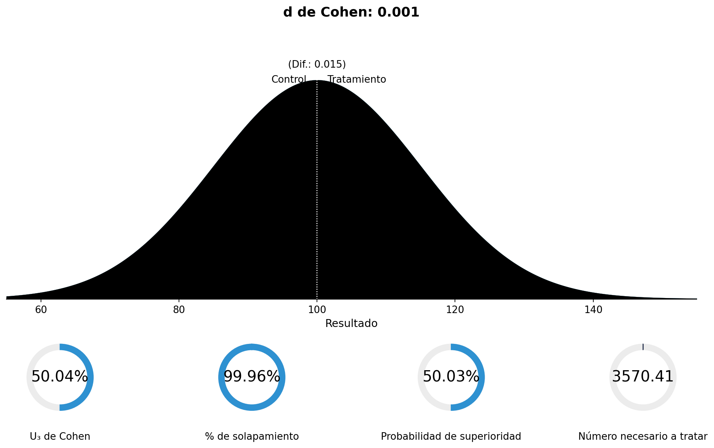
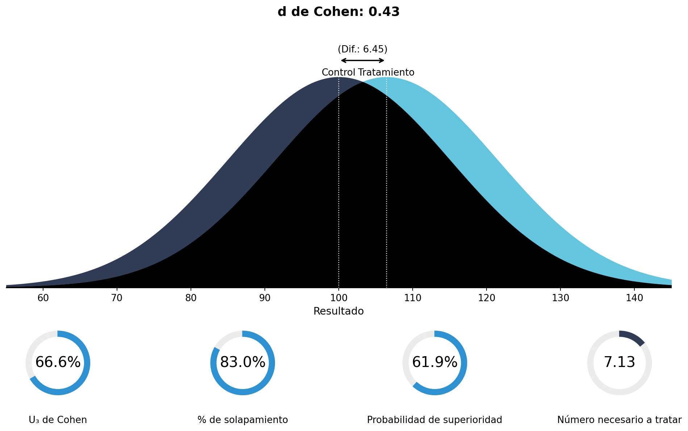
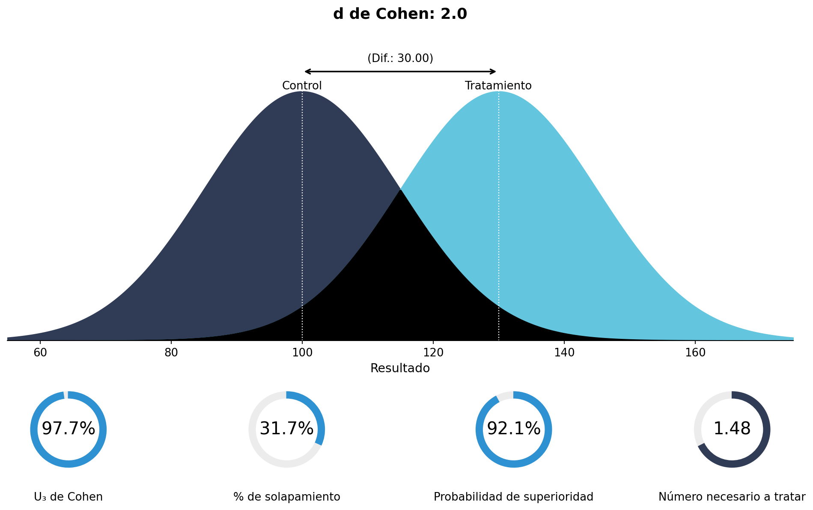
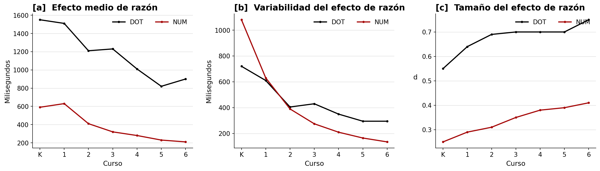
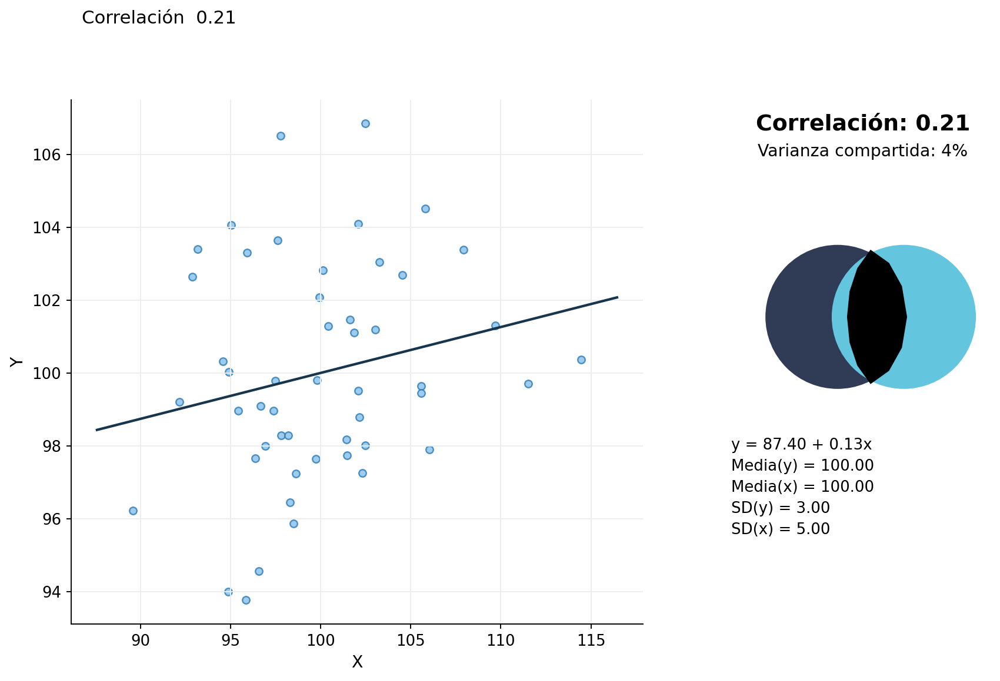
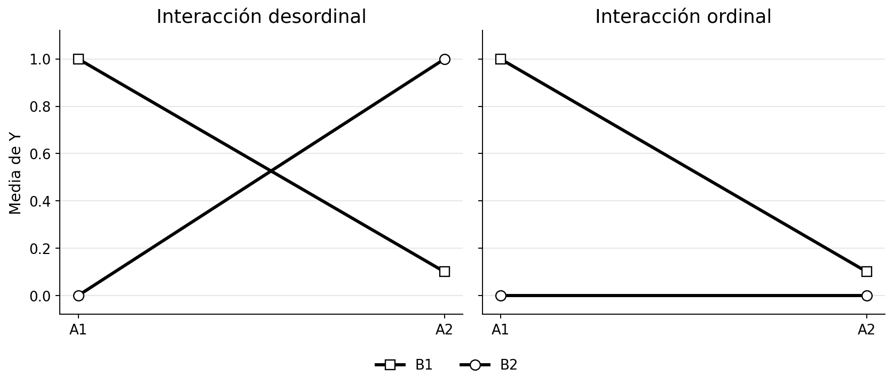
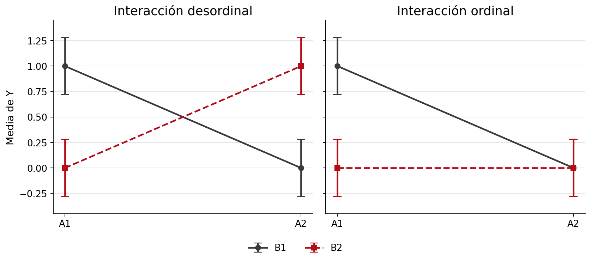
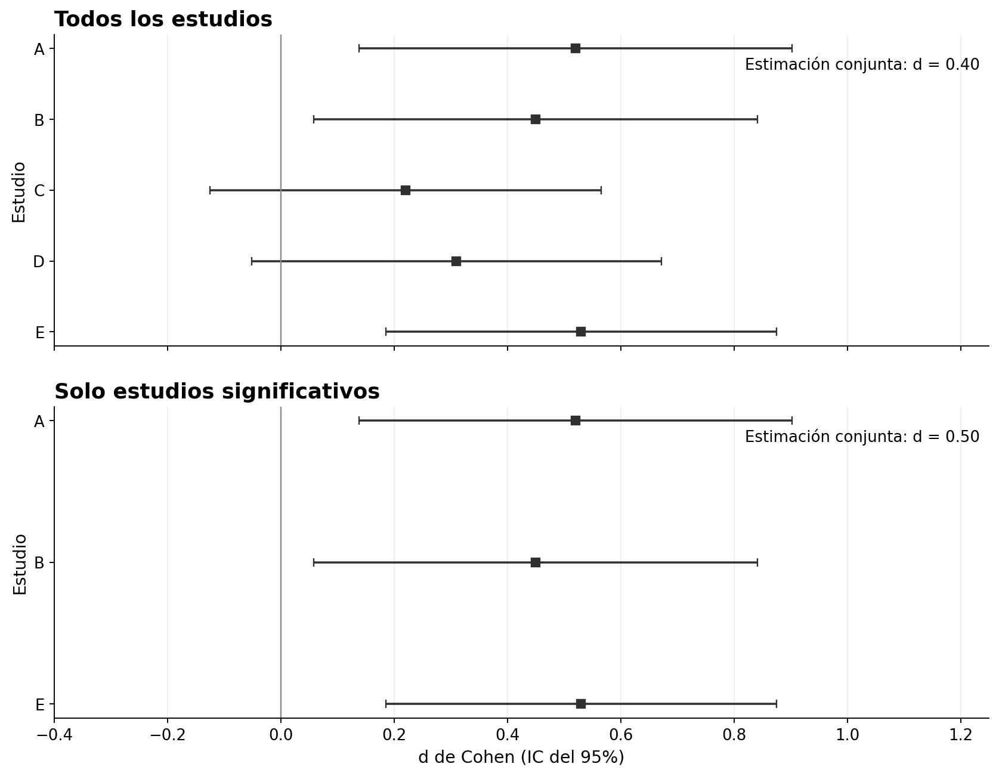
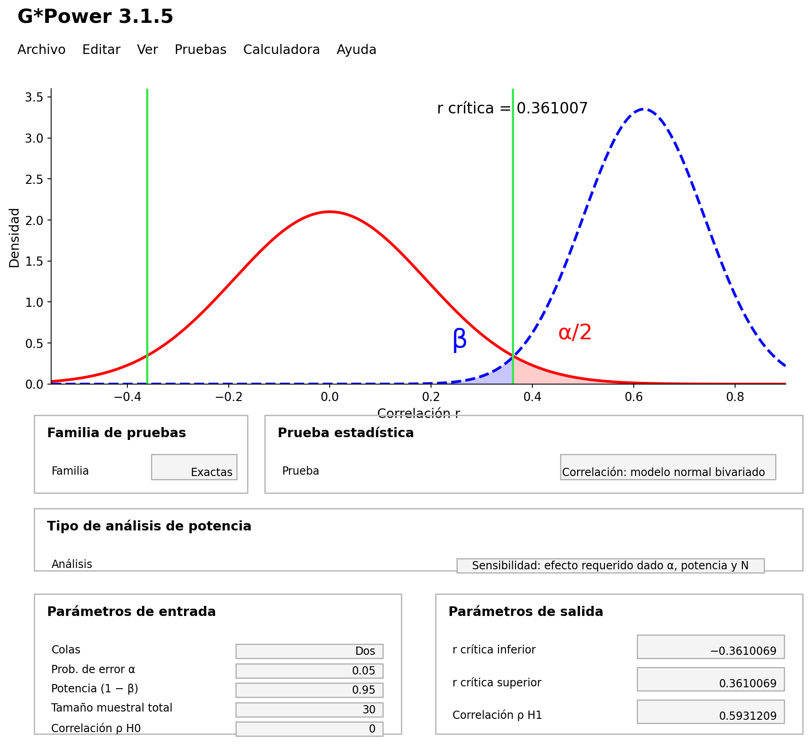

# Tamaños del efecto

> Traducción literal al castellano del capítulo 6, “Effect Sizes”, de Daniël Lakens, *Improving Your Statistical Inferences*.<br>
> Original: https://lakens.github.io/statistical_inferences/06-effectsize.html<br>
> Licencia del original: CC-BY-4.0. Traducción no oficial.

Los tamaños del efecto son un resultado estadístico importante en la mayoría de los estudios empíricos. Los investigadores quieren saber si una intervención o manipulación experimental tiene un efecto mayor que cero o —cuando resulta evidente que existe un efecto— cuál es su magnitud. A menudo se recuerda a los investigadores que informen de los tamaños del efecto, porque son útiles por tres razones. En primer lugar, permiten presentar la magnitud de los efectos comunicados, lo que a su vez permite reflexionar sobre su **significación práctica**, además de sobre su significación *estadística*. En segundo lugar, permiten extraer conclusiones metaanalíticas mediante la comparación de tamaños del efecto estandarizados entre estudios. En tercer lugar, los tamaños del efecto de estudios anteriores pueden utilizarse al planificar un estudio nuevo mediante un análisis de potencia *a priori*.

Una medida del tamaño del efecto es una descripción cuantitativa de la fuerza de un fenómeno. Se expresa como un número en una escala. En los **tamaños del efecto no estandarizados**, el tamaño del efecto se expresa en la escala en la que se recogió la medida. Esto resulta útil siempre que las personas puedan interpretar intuitivamente las diferencias en una escala de medida. Por ejemplo, los niños crecen por término medio 6 centímetros al año entre los 2 años y la pubertad. Podemos interpretar 6 centímetros al año como un tamaño del efecto, y muchas personas tienen una comprensión intuitiva de cuánto son 6 cm. Mientras que un valor *p* se utiliza para afirmar si existe un efecto o si quizá solo estamos observando variación aleatoria en los datos, el tamaño del efecto responde a la pregunta de cuál es la magnitud de ese efecto. Por eso, en la mayoría de los estudios, su estimación constituye un complemento importante de los valores *p*. Un valor *p* nos permite afirmar que los niños crecen con la edad; los tamaños del efecto nos dicen qué talla de ropa cabe esperar que usen a una edad determinada y cuánto tardará en quedárseles pequeña.

Para quienes viven en lugares donde no se utiliza el sistema métrico, puede resultar difícil entender qué representa una diferencia de 6 cm. Del mismo modo, un psicólogo acostumbrado a puntuaciones de 0 a 20 en su medida preferida de depresión quizá no comprenda qué significa un cambio de 3 puntos en otra medida cuya escala puede ir de 0 a 10 o de 0 a 50. Para facilitar la comparación de tamaños del efecto entre situaciones en las que se utilizan escalas de medida diferentes, los investigadores pueden informar de **tamaños del efecto estandarizados**. Un tamaño del efecto estandarizado, como la ***d* de Cohen**, se calcula dividiendo la diferencia en la escala original por la desviación estándar y, por tanto, se expresa en función de la variabilidad de la muestra de la que procede. Un efecto de *d* = 0.5 significa que la diferencia equivale a media desviación estándar de la medida.

Esto significa que los tamaños del efecto estandarizados vienen determinados tanto por la magnitud del fenómeno observado como por el tamaño de la desviación estándar. Como son una razón entre la diferencia de medias y la desviación estándar, dos tamaños del efecto estandarizados distintos pueden indicar que la diferencia de medias no es idéntica, que las desviaciones estándar no son idénticas o ambas cosas. Es posible que dos estudios encuentren la misma diferencia no estandarizada —por ejemplo, 0.5 puntos en una escala de 7 puntos—, pero que, al ser mayor la desviación estándar en el Estudio A —por ejemplo, *SD* = 2— que en el Estudio B —por ejemplo, *SD* = 1—, difieran los tamaños del efecto estandarizados —Estudio A: 0.5/2 = 0.25; Estudio B: 0.5/1 = 0.5—.

Los tamaños del efecto estandarizados son habituales cuando las variables no se miden en una escala con la que las personas estén familiarizadas o cuando, dentro de una misma área de investigación, se utilizan escalas diferentes. Si preguntas a alguien qué tan feliz es, una respuesta de «5» significará algo muy distinto si la escala va de 1 a 5 o de 1 a 9. Los tamaños del efecto estandarizados pueden comprenderse y compararse con independencia de la escala utilizada para medir la variable dependiente. A pesar de la facilidad de uso de las medidas estandarizadas del tamaño del efecto, existen buenos argumentos para preferir, siempre que sea posible, la presentación y la interpretación de tamaños del efecto no estandarizados frente a los estandarizados (Baguley, 2009).

Los tamaños del efecto estandarizados pueden agruparse en dos familias (Rosnow y Rosenthal, 2009): la familia *d* —formada por diferencias de medias estandarizadas— y la familia *r* —formada por medidas de fuerza de asociación—. Conceptualmente, los tamaños del efecto de la familia *d* se basan en la diferencia entre observaciones dividida por su desviación estándar, mientras que los de la familia *r* describen la proporción de varianza explicada por la pertenencia al grupo. Por ejemplo, una correlación ($r$) de 0.5 indica que la diferencia entre grupos explica el 25% de la varianza ($r^2$) de la variable de resultado. Estos tamaños del efecto se calculan a partir de la suma de cuadrados de los residuos —las diferencias entre cada observación y la media del grupo, elevadas al cuadrado y sumadas— correspondiente al efecto, dividida por la suma total de cuadrados del diseño.

## Tamaños del efecto

¿Cuál es el resultado más importante de un estudio empírico? Quizá sientas la tentación de responder que el valor *p* de la prueba estadística, puesto que casi siempre se informa de él en los artículos y determina si calificamos algo de «significativo» o no. Sin embargo, como escribe Cohen (1990) en «Things I’ve learned (so far)»:

> He aprendido y enseñado que el producto principal de una investigación es una o más medidas del tamaño del efecto, no los valores *p*.

Aunque lo que se quiere aprender de los datos difiere en cada estudio y rara vez existe una única cosa que siempre deseemos saber, los tamaños del efecto constituyen una parte muy importante de la información obtenida mediante la recogida de datos.

Una razón para informar de ellos es facilitar investigaciones futuras. Es posible realizar un metaanálisis o un análisis de potencia a partir de tamaños del efecto no estandarizados y de su desviación estándar, pero resulta más sencillo trabajar con tamaños del efecto estandarizados, en especial cuando varían las medidas que utilizan los investigadores. Sin embargo, el objetivo principal de informar de los tamaños del efecto es reflexionar sobre si el efecto observado es significativo en términos sustantivos. Por ejemplo, quizá podamos medir de forma fiable que, por término medio, las personas de 19 años crecerán 1 centímetro durante el año siguiente. Esta diferencia sería estadísticamente significativa con una muestra lo bastante grande, pero no es algo que deba preocuparte al comprar ropa con 19 años. Veamos dos ejemplos de estudios en los que examinar el tamaño del efecto, además de su significación estadística, habría mejorado las inferencias.

## El experimento de Facebook

En el verano de 2014 surgieron algunas preocupaciones acerca de un experimento realizado por Facebook con sus usuarios para examinar el «contagio emocional del estado de ánimo», es decir, la idea de que el estado de ánimo de las personas puede verse influido por el de quienes las rodean. Puedes leer el artículo [aquí](http://www.pnas.org/content/111/24/8788.full). Para empezar, existía una preocupación considerable por los aspectos éticos del estudio, principalmente porque los investigadores no habían solicitado el **consentimiento informado** de los participantes ni la autorización del **comité de revisión institucional** —o comité de ética— de su universidad.

Otra de las críticas sostenía que influir en el estado de ánimo de las personas podía resultar peligroso. Como escribió Nancy J. Smyth, decana de la Escuela de Trabajo Social de la Universidad de Buffalo, en su [blog de Trabajo Social](https://njsmyth.wordpress.com/2014/06/29/did-facebooks-secret-mood-manipulation-experiment-create-harm/):

> Incluso podría haberse producido un aumento de los episodios de autolesión, de ira descontrolada o, me atrevería a decir, de intentos de suicidio o suicidios como consecuencia de la manipulación experimental. ¿Causó daño este experimento? El problema es que nunca lo sabremos, porque nunca se establecieron las protecciones para los participantes humanos.

Si el experimento de Facebook hubiera tenido un efecto tan intenso sobre el estado de ánimo que hubiese llevado a suicidarse a personas que de otro modo no lo habrían hecho, resultaría evidentemente problemático. Examinemos, por tanto, con más detalle los efectos de la manipulación utilizada por Facebook.

Veamos primero qué manipularon los investigadores:

> Se llevaron a cabo dos experimentos paralelos para las emociones positivas y negativas: uno en el que se redujo la exposición al contenido emocional positivo de los amigos en la sección de noticias, y otro en el que se redujo la exposición al contenido emocional negativo. En estas condiciones, cuando una persona cargaba su sección de noticias, cada publicación que contenía contenido emocional de la valencia correspondiente tenía entre un 10% y un 90% de probabilidades —en función de su identificador de usuario— de ser omitida en esa visualización concreta.

A continuación, qué midieron:

> En cada experimento se examinaron dos variables dependientes relativas a la emocionalidad expresada en las actualizaciones de estado de las propias personas: el porcentaje de todas las palabras producidas por una persona que eran positivas o negativas durante el periodo experimental. En total se analizaron más de 3 millones de publicaciones, con más de 122 millones de palabras, de las cuales 4 millones eran positivas —3.6%— y 1.8 millones negativas —1.6%—.

Y, por último, qué encontraron:

> Cuando se redujeron las publicaciones positivas en la sección de noticias, el porcentaje de palabras positivas en las actualizaciones de estado disminuyó *B* = −0.1% respecto al control [*t*(310 044) = −5.63, *p* < 0.001, *d* de Cohen = 0.02], mientras que el porcentaje de palabras negativas aumentó *B* = 0.04% [*t* = 2.71, *p* = 0.007, *d* = 0.001]. A la inversa, cuando se redujeron las publicaciones negativas, el porcentaje de palabras negativas disminuyó *B* = −0.07% [*t*(310 541) = −5.51, *p* < 0.001, *d* = 0.02] y el porcentaje de palabras positivas aumentó *B* = 0.06% [*t* = 2.19, *p* < 0.003, *d* = 0.008].

Nos centraremos en los efectos negativos del estudio de Facebook —en concreto, el aumento de las palabras negativas utilizadas— para hacernos una idea de si existe riesgo de aumento de las tasas de suicidio. Aunque, al parecer, hubo un efecto negativo, no resulta fácil comprender su magnitud a partir de las cifras mencionadas en el texto. Además, el número de publicaciones analizadas era realmente grande. Con una muestra grande, es importante comprobar si el tamaño del efecto hace que el hallazgo sea sustantivamente interesante, porque, con tamaños muestrales grandes, incluso las diferencias diminutas resultarán estadísticamente significativas —lo examinaremos con más detalle más adelante—. Para ello necesitamos comprender mejor los «tamaños del efecto».

## El estudio de los jueces hambrientos

{#fig-hungryjudges}

En la @fig-hungryjudges vemos una representación gráfica de la proporción de decisiones favorables sobre la libertad condicional que adoptan jueces reales en función del número de casos que tramitan a lo largo del día. El estudio del que procede el gráfico aparece en muchos libros de divulgación científica como ejemplo de un hallazgo que muestra que las personas no siempre toman decisiones racionales, sino que «las resoluciones judiciales pueden verse influidas por variables ajenas que no deberían tener ninguna relación con las decisiones legales» (Danziger et al., 2011). Al comienzo del día, los jueces empiezan concediendo la libertad condicional aproximadamente al 65% de las personas, lo que equivale básicamente a decir: «De acuerdo, puede volver a la sociedad». Pero enseguida el número de decisiones favorables cae prácticamente a cero. Después de una breve pausa que, según los autores, «puede reponer los recursos mentales al proporcionar descanso, mejorar el estado de ánimo o aumentar los niveles de glucosa del organismo», las decisiones favorables vuelven al 65% y después caen otra vez casi hasta cero. Se produce otra pausa, el porcentaje regresa al 65% y vuelve a descender a lo largo del día.

Si calculamos el tamaño del efecto de la caída producida después de una pausa y antes de la siguiente (Glöckner, 2016), el resultado es una *d* de Cohen de aproximadamente 2, un efecto increíblemente grande. Apenas existen efectos de tal magnitud en psicología y mucho menos efectos del estado de ánimo o del descanso sobre la toma de decisiones. Además, este efecto sorprendentemente grande no aparece una sola vez, sino tres a lo largo del día. Si el agotamiento mental tuviera realmente un impacto tan enorme en la vida real, la sociedad se sumiría básicamente en un caos completo justo antes de la comida. O, al menos, se habría organizado en torno a este efecto increíblemente intenso. Del mismo modo que los fabricantes tienen en cuenta las diferencias de tamaño entre hombres y mujeres al producir objetos como palos de golf o relojes, dejaríamos de impartir clase antes de comer, los médicos no programarían operaciones y conducir antes de la comida sería ilegal. Si un efecto psicológico fuera tan grande, no necesitaríamos descubrirlo y publicarlo en una revista científica: ya sabríamos que existe.

Podemos recurrir a un metametaanálisis —un artículo que metaanaliza un gran número de metaanálisis de la literatura— de Richard, Bond y Stokes-Zoota (2003) para comprobar qué tamaños del efecto de la psicología jurídica se aproximan a una *d* de Cohen de 2. Los autores informan de dos efectos metaanalizados ligeramente menores. El primero es que el veredicto final de un jurado probablemente coincidirá con el que la mayoría favorecía al principio; 13 estudios muestran un tamaño del efecto de *r* = .63, o *d* = 1.62. El segundo es que, cuando un jurado comienza dividido respecto al veredicto, es probable que el veredicto final sea indulgente; 13 estudios muestran también un tamaño del efecto de *r* = .63. En toda su base de datos, algunos efectos cercanos a *d* = 2 son la estabilidad de los rasgos de personalidad a lo largo del tiempo —*r* = .66, *d* = 1.76—, el rechazo por parte de un grupo de las personas que se desvían de él —*r* = .60, *d* = 1.50— o que los líderes poseen carisma —*r* = .62, *d* = 1.58—. Quizá adviertas la naturaleza casi tautológica de estos efectos. Y ese es, supuestamente, el tamaño del efecto que tiene el paso del tiempo —y, después, comer— sobre las decisiones de libertad condicional.

Vemos cómo examinar la magnitud de un efecto puede llevarnos a identificar hallazgos que no pueden deberse a los mecanismos propuestos. Por tanto, el efecto comunicado en el estudio de los jueces hambrientos debe deberse a una variable de confusión. De hecho, se han identificado variables de este tipo: el orden de los casos no es aleatorio y es probable que los casos que merecen la libertad condicional se tramiten primero y los que no la merecen, después (Chatziathanasiou, 2022; Weinshall-Margel y Shapard, 2011). Otro uso de los tamaños del efecto consiste en identificar efectos demasiado grandes para resultar plausibles. Hilgard (2021) propone incorporar «controles positivos máximos», es decir, condiciones experimentales que muestren el mayor efecto posible para cuantificar el límite superior de las medidas plausibles del tamaño del efecto.

## Diferencias de medias estandarizadas {#sec-cohend}

Conceptualmente, los tamaños del efecto de la familia *d* se basan en comparar la diferencia entre las observaciones con su desviación estándar. Por tanto, una *d* de Cohen = 1 significa que la diferencia estandarizada entre dos grupos equivale a una desviación estándar. La magnitud del efecto del estudio de Facebook se cuantificó mediante la *d* de Cohen. La *d* de Cohen —la *d* se escribe siempre [en cursiva](https://blog.apastyle.org/apastyle/2011/08/the-grammar-of-mathematics-writing-about-variables.html)— se utiliza para describir la diferencia de medias estandarizada de un efecto. Este valor permite comparar efectos entre estudios incluso cuando las variables dependientes se miden con escalas distintas, por ejemplo, una escala de 7 puntos en un estudio y otra de 9 puntos en otro. Incluso podemos comparar tamaños del efecto obtenidos con medidas completamente diferentes de un mismo constructo, como una medida de autoinforme en un estudio y una medida fisiológica en otro. Aunque podamos comparar tamaños del efecto obtenidos con mediciones diferentes, esto no significa que sean comparables, como se discutirá con más detalle en la sección sobre heterogeneidad del capítulo de [metaanálisis](11-meta-analisis.md).

La *d* de Cohen puede ir de menos infinito a infinito —aunque, en la práctica, la diferencia de medias observada en sentido positivo o negativo nunca será infinita—, y el valor 0 indica ausencia de efecto. Cohen (1988) utiliza subíndices para distinguir las distintas versiones de *d*, una práctica que seguiremos porque evita confusiones —sin especificación alguna, la expresión «*d* de Cohen» designa a toda la familia de tamaños del efecto—. Cohen denomina $d_s$ a la diferencia de medias estandarizada entre dos grupos de observaciones independientes en la *muestra*. Antes de entrar en los detalles estadísticos, visualicemos qué significa una *d* de Cohen de 0.001, como la encontrada en el estudio de Facebook. Utilizaremos una visualización de [rpsychologist.com](https://rpsychologist.com/cohend/), creada por Kristoffer Magnusson, que permite representar las diferencias entre dos mediciones —como el aumento de palabras negativas de un usuario de Facebook cuando se redujo el número de palabras positivas de su sección de noticias—. En realidad, la visualización contiene dos distribuciones, una azul oscuro y otra azul claro, pero se solapan tanto que la minúscula diferencia no resulta visible.

{#fig-rpsychd1}

Los cuatro números situados bajo la distribución expresan el tamaño del efecto de distintas maneras para facilitar su interpretación. Por ejemplo, la **probabilidad de superioridad** expresa la probabilidad de que una observación elegida al azar de un grupo tenga una puntuación mayor que otra elegida al azar del otro grupo. Como el efecto es tan pequeño, esta probabilidad es del 50.03%, lo que significa que las personas de la condición experimental escriben casi el mismo número de palabras positivas o negativas que las de la condición de control. El índice del **número necesario a tratar** ilustra que, en el estudio de Facebook, una persona debe escribir 3570 palabras antes de que observemos una palabra negativa adicional respecto a la condición de control. Esto se basa en la configuración predeterminada de la aplicación, en la que la CER —tasa de eventos en el grupo de control, es decir, el número de observaciones de la condición de control que experimentan un evento— se fija en el 20%. Si fijamos la CER en el 2% —redondeando la tasa observada de palabras negativas del 1.6%—, el número necesario a tratar pasa a ser 20 632. No sé con qué frecuencia escribes tantas palabras en Facebook, pero podemos convenir en que este efecto no resulta perceptible a escala individual.

Para comprender cómo se calcula la *d* de Cohen para dos grupos independientes, examinemos primero la fórmula del estadístico *t*:

$$
t = \frac{{\overline{M}}_{1}{-\overline{M}}_{2}}{SD_{\text{combinada}} \times \sqrt{\frac{1}{n_{1}} + \frac{1}{n_{2}}}}
$$

Aquí, ${\overline{M}}_{1}{-\overline{M}}_{2}$ es la diferencia entre las medias, $SD_{\text{combinada}}$ es la desviación estándar combinada (Lakens, 2013), y $n_1$ y $n_2$ son los tamaños muestrales de los dos grupos comparados. El valor *t* se utiliza para determinar si la diferencia entre dos grupos en una prueba *t* es estadísticamente significativa, como se explicó en el capítulo sobre los [valores *p*](01-usando-valores-p.md). La fórmula de la *d* de Cohen es muy similar:

$$
d_s = \frac{{\overline{M}}_{1}{-\overline{M}}_{2}}{SD_{\text{combinada}}}
$$

Como puede verse, el tamaño muestral de cada grupo —$n_1$ y $n_2$— forma parte de la fórmula del valor *t*, pero no de la fórmula de la *d* de Cohen —la desviación estándar combinada se calcula ponderando la desviación estándar de cada grupo por su tamaño muestral, aunque este se cancela si los grupos tienen el mismo tamaño—. Esta distinción es útil porque nos dice que el valor *t* —y, en consecuencia, el valor *p*— es una función del tamaño muestral, mientras que la *d* de Cohen es independiente de él. Si existe un efecto verdadero —es decir, un tamaño del efecto poblacional distinto de cero—, el valor *t* de una prueba de hipótesis nula frente a un efecto de cero será, por término medio, mayor —y el valor *p*, menor— a medida que aumente el tamaño muestral. El tamaño del efecto, sin embargo, no aumentará ni disminuirá, sino que se estimará con mayor precisión, porque el error estándar disminuye al aumentar el tamaño muestral. Esta es también la razón por la que los valores *p* no permiten afirmar si un efecto es **significativo en la práctica**, y por la que las estimaciones del tamaño del efecto son un complemento tan importante al realizar inferencias estadísticas.

La *d* de Cohen para grupos independientes puede calcularse a partir del valor *t* de muestras independientes, algo que suele resultar práctico cuando la sección de resultados de un artículo no informa de tamaños del efecto:

$$
d_s = t \times \sqrt{\frac{1}{n_{1}} + \frac{1}{n_{2}}}
$$

Una *d* de 0.001 es un efecto extremadamente diminuto, así que exploremos un tamaño del efecto algo más representativo de lo que puede encontrarse en la literatura. En el metametaanálisis ya mencionado, la mediana de los tamaños del efecto de los estudios publicados incluidos en metaanálisis de la literatura psicológica fue *d* = 0.43 (Richard et al., 2003). Para hacernos una idea de este tamaño del efecto, fijemos *d* = 0.43.

{#fig-rpsychd2}

Un ejemplo de tamaño del efecto metaanalítico exactamente igual a $d_s$ = 0.43 es el hallazgo de que quienes trabajan en grupo se esfuerzan menos para alcanzar un objetivo que quienes trabajan individualmente, fenómeno denominado **holgazanería social**. El efecto es lo bastante grande como para que lo advirtamos en la vida cotidiana. Sin embargo, al observar el solapamiento entre las distribuciones, comprobamos que la cantidad de esfuerzo se solapa considerablemente entre ambas condiciones —trabajar de manera individual o en grupo—. La @fig-rpsychd2 muestra que la **probabilidad de superioridad**, es decir, la probabilidad de que, si elegimos al azar una persona de la condición grupal y otra de la condición individual, la primera se esfuerce menos, es solo del 61.9%. Esta interpretación de las diferencias entre grupos también se denomina **tamaño del efecto en lenguaje común** (McGraw y Wong, 1992).

{#fig-rpsychd3}

Según [estos datos](http://www.nature.com/pr/journal/v73/n3/full/pr2012189a.html), la diferencia entre la altura de hombres y mujeres de 21 años en los Países Bajos es aproximadamente de 13 centímetros —como tamaño del efecto no estandarizado—, o de $d_s$ = 2 como tamaño del efecto estandarizado. Si elijo al azar a un hombre y a una mujer que pasean por las calles de Róterdam, ¿qué probabilidad hay de que el hombre sea más alto? Como vemos, es bastante probable: la probabilidad de superioridad es del 92.1%. No obstante, incluso con un efecto tan enorme sigue existiendo un solapamiento considerable entre las dos distribuciones. Concluir que la altura de las personas de un grupo es mayor que la de las personas del otro no significa que todas las personas del primer grupo sean más altas que todas las del segundo.

A veces, cuando intentas explicar hallazgos científicos en una fiesta de cumpleaños, un tío o una tía escépticos pueden comentar: «Bueno, yo no creo que eso sea cierto porque *a mí* nunca me ocurre». En las observaciones probabilísticas existe una distribución de efectos observados. En el ejemplo de la holgazanería social, *por término medio* las personas se esfuerzan menos para alcanzar un objetivo cuando trabajan en grupo que cuando lo hacen solas. Para cualquier individuo de la población, el efecto puede ser mayor, menor, inexistente o incluso producirse en la dirección contraria. Que tu pariente escéptico nunca experimente un fenómeno determinado no contradice la afirmación de que el efecto existe *por término medio* en la población. De hecho, cabe esperar que en algunas personas no exista efecto, al menos parte del tiempo. Aunque puede haber excepciones —por ejemplo, casi todas las personas experimentarán el [efecto Stroop](https://es.wikipedia.org/wiki/Efecto_Stroop)—, muchos efectos son lo bastante pequeños o variables como para no estar presentes en todos y cada uno de los individuos de la población.

Conceptualmente, calcular la *d* de Cohen en comparaciones intrasujeto se basa en la misma idea que en los grupos independientes: las diferencias entre dos observaciones se dividen por la desviación estándar dentro de los grupos de observaciones. Sin embargo, en las muestras correlacionadas el estandarizador más habitual es la desviación estándar de las puntuaciones de diferencia. Comprobar mediante una prueba *t* para muestras relacionadas si dos medias correlacionadas difieren significativamente equivale a comprobar mediante una prueba *t* de una muestra si las puntuaciones de diferencia difieren de 0. De igual manera, calcular el tamaño del efecto de la diferencia entre dos medias correlacionadas es similar al cálculo para una prueba *t* de una muestra. La diferencia de medias estandarizada para diseños intrasujeto se denomina $d_z$ de Cohen; la *z* alude a que la unidad de análisis ya no es *x* o *y*, sino su diferencia, *z*, y se calcula como:

$$
d_z = \frac{M_{dif}}{\sqrt{\frac{\sum{(X_{dif}-M_{dif})^2}}{N-1}}}
$$

La estimación $d_z$ de Cohen también puede calcularse directamente a partir del valor *t* y del número de participantes:

$$
d_z = \frac{t}{\sqrt{n}}
$$

Dada la relación directa entre el valor *t* de una prueba *t* para muestras relacionadas y $d_z$, no sorprende que los programas que realizan análisis de potencia para diseños intrasujeto —como G\*Power— utilicen $d_z$ como dato de entrada.

Maxwell y Delaney (2004) señalan que «uno de los principales objetivos del desarrollo de medidas del tamaño del efecto consiste en proporcionar una métrica estándar que los metaanalistas y otras personas puedan interpretar entre estudios que varían tanto en sus variables dependientes como en sus tipos de diseño». Como $d_z$ incorpora la correlación entre las medidas dependientes, no puede compararse directamente con $d_s$. Algunos investigadores prefieren utilizar como estandarizador la media de las desviaciones estándar de ambos grupos de observaciones —ignorando así la correlación entre ellas—, porque permite una comparación más directa con $d_s$. Este tamaño del efecto se denomina $d_{av}$ de Cohen (Cumming, 2013) y se calcula simplemente como:

$$
d_{av} = \frac{M_{dif}}{\frac{SD_1+SD_2}{2}}
$$

## Interpretación de los tamaños del efecto

Una interpretación habitual de la *d* de Cohen consiste en calificar los tamaños del efecto como pequeños —*d* = 0.2—, medianos —*d* = 0.5— y grandes —*d* = 0.8— a partir de los valores de referencia propuestos por Cohen (1988). Sin embargo, estos valores son arbitrarios y no deberían utilizarse. En la práctica, solo se emplean en una forma de razonamiento circular: el efecto es pequeño porque *d* = 0.2, y *d* = 0.2 es pequeño. Utilizar esos valores no aporta nada, salvo ocultar que en realidad no hemos interpretado la magnitud del efecto. Además, los valores de referencia de un efecto «mediano» y «grande» ni siquiera se corresponden entre la *d* de Cohen y *r* (McGrath y Meyer, 2006; véase la P12 de la autoevaluación). Cualquier clasificación verbal basada en valores de referencia ignora que todo efecto puede ser significativo en la práctica, como una intervención que produzca una reducción fiable de la tasa de suicidios con *d* = 0.1. En otros casos, una *d* = 0.1 puede no tener consecuencia alguna, por ejemplo, porque sea menor que la diferencia apenas perceptible y, por tanto, demasiado pequeña para que los individuos la adviertan en el mundo real.

Los psicólogos se apoyan principalmente en tamaños del efecto estandarizados, en los que las puntuaciones de diferencia se dividen por la desviación estándar. Estas métricas son cómodas para comparar efectos entre estudios que utilizan medidas distintas y para combinar efectos en metaanálisis (Lakens, 2013). Sin embargo, dificultan la interpretación significativa de los efectos en psicología, porque pueden reflejar una diferencia entre las medias, una diferencia entre las desviaciones estándar o cualquier combinación de ambas. Como ejemplo, el efecto de razón muestra que a las personas les resulta más fácil indicar cuál de dos números representa una cantidad mayor cuando la razón entre ellos es grande —por ejemplo, 2 frente a 8— que cuando es pequeña —4 frente a 5—. Estas tareas de comparación numérica se han utilizado para estudiar el desarrollo del procesamiento numérico en niños. Como señalan Lyons y sus colaboradores (2015), y muestra la @fig-rawstandardized, el efecto medio en puntuaciones brutas —tiempos de reacción en milisegundos— disminuye a lo largo de los cursos —panel a—. Pero como la variabilidad disminuye aún más —panel b—, el tamaño del efecto estandarizado muestra el patrón opuesto al efecto bruto —panel c—. Ante este patrón contradictorio, los autores preguntan, como era de esperar: «Por tanto, la verdadera pregunta es: ¿qué es un tamaño del efecto significativo?» (Lyons et al., 2015, p. 1032).

{#fig-rawstandardized}

El sesgo de publicación y la flexibilidad en el análisis de datos inflan las estimaciones del tamaño del efecto. Innovaciones como los **informes registrados** (Chambers y Tzavella, 2022; Nosek y Lakens, 2014) hacen cada vez más frecuente la disponibilidad de estimaciones no sesgadas en la literatura científica. Los informes registrados son publicaciones científicas que se revisan, antes de recoger los datos, a partir de la introducción, el método y el plan de análisis estadístico propuesto, y se publican con independencia de que los resultados sean estadísticamente significativos. Una consecuencia de dejar de publicar selectivamente estudios significativos es que muchos tamaños del efecto resultarán menores de lo que creían los investigadores. Por ejemplo, en los 100 estudios de replicación del *Reproducibility Project: Psychology*, los tamaños del efecto observados en las réplicas fueron, por término medio, la mitad de los observados en los estudios originales (Open Science Collaboration, 2015).

Para no limitarse a *informar* de un tamaño del efecto, sino *interpretarlo*, no se gana nada con la práctica habitual de buscar la etiqueta verbal correspondiente —«pequeño», «mediano» o «grande»—. Los investigadores que quieran sostener que un efecto es significativo deben aportar argumentos empíricos y falsables que respalden esa afirmación (Anvari et al., 2021; Primbs et al., 2022). Una opción consiste en especificar explícitamente el [menor tamaño del efecto de interés](09-pruebas-de-equivalencia.md), por ejemplo, mediante un análisis de costes y beneficios. Otra posibilidad es interpretar el tamaño del efecto en relación con otros efectos de la literatura (Baguley, 2009; Funder y Ozer, 2019).

## Correlaciones y varianza explicada

Los tamaños del efecto de la familia *r* se basan en la proporción de varianza explicada por la pertenencia al grupo —por ejemplo, una correlación de *r* = 0.5 indica que la diferencia entre grupos explica el 25% de la varianza, $r^2$—. Recordarás que *r* se utiliza para representar una correlación. La correlación entre dos variables continuas puede ir de 0 —completamente independientes— a 1 —relación positiva perfecta— o −1 —relación negativa perfecta—. Para adquirir una mejor intuición sobre las correlaciones, utiliza el juego interactivo siguiente: tendrás que adivinar la correlación entre dos variables a partir de un diagrama de dispersión y el juego calculará tu precisión a lo largo de los intentos.

::: {.content-visible when-format="html"}

```{=html}
<iframe id="guess-corr-iframe"
        src="guess_correlation_app_book.html"
        width="100%"
        height="600"
        scrolling="no"
        style="border:none;display:block;margin:1.5rem 0;overflow:hidden;"
        title="Adivina la correlación">
</iframe>
<script>
window.addEventListener('message', function(e) {
  if (e.data && typeof e.data.iframeHeight === 'number') {
    var f = document.getElementById('guess-corr-iframe');
    if (f && e.source === f.contentWindow) f.style.height = e.data.iframeHeight + 'px';
  }
});
</script>
```

:::

::: {.content-visible unless-format="html"}

*En la edición en línea de este libro está disponible una versión interactiva del juego.*

:::

Los tamaños del efecto de la familia *r* se calculan a partir de la suma de cuadrados —la diferencia entre las observaciones individuales y la media del grupo, elevada al cuadrado y sumada— correspondiente al efecto, dividida por las sumas de cuadrados de los demás factores del diseño. Antes se mencionó que la mediana del tamaño del efecto en psicología es $d_s$ = 0.43. Sin embargo, los autores informaron en realidad de sus resultados como una correlación, *r* = 0.21. Podemos convertir la *d* de Cohen en *r* —aunque esta fórmula solo se aplica a $d_s$, no a $d_z$—:

$$
r = \frac{d_s}{\sqrt{d_s^2 + \frac{N^2 - 2N}{n_1 \times n_2}}}
$$

*N* es el tamaño muestral total de ambos grupos, mientras que $n_1$ y $n_2$ son los tamaños de cada grupo —es habitual utilizar *N* mayúscula para el tamaño muestral total y *n* minúscula para el tamaño por grupo—. En [rpsychologist.com](https://rpsychologist.com/correlation/) puede verse una buena visualización de la proporción de varianza explicada por la pertenencia al grupo y de la relación entre *r* y $r^2$. La cantidad de varianza explicada suele ser bastante pequeña: la @fig-sharedvariance muestra que, para una correlación de 0.21 —la mediana del metametaanálisis de Richard y sus colaboradores—, la proporción de varianza explicada es solo del 4.4%. Funder y Ozer (2019) advierten contra la interpretación de valores pequeños de varianza explicada como indicación de que el efecto carece de importancia —e incluso consideran que la práctica de elevar la correlación al cuadrado es «activamente engañosa»—.

{#fig-sharedvariance}

Como ya hemos visto, interpretar los tamaños del efecto puede ayudar a identificar tanto efectos insignificantes en la práctica como otros inverosímilmente grandes. Examinemos un estudio sobre el número de suicidios en función de la cantidad de música *country* emitida por la radio. El artículo puede consultarse [aquí](https://heinonline.org/HOL/P?h=hein.journals/josf71&i=227). Ganó un [premio Ig Nobel por investigaciones que primero hacen reír y después pensar](http://www.abc.net.au/science/articles/2004/10/01/1211441.htm), aunque, en este caso, el estudio no debería hacernos reflexionar sobre la música *country*, sino sobre la importancia de interpretar los tamaños del efecto.

Los autores predijeron lo siguiente:

> Sostenemos que los temas presentes en la música *country* fomentan un estado de ánimo suicida entre las personas que ya presentan riesgo de suicidio y que, por tanto, se asocian con una tasa de suicidios elevada.

A continuación recogieron los datos:

> Nuestra muestra está formada por 49 grandes áreas metropolitanas para las que se disponía de datos musicales. La exposición a la música *country* se mide como la proporción del tiempo de emisión radiofónica dedicado a ella. Los datos de suicidio se extrajeron de las cintas anuales de mortalidad obtenidas del Consorcio Interuniversitario para la Investigación Política y Social —ICPSR— de la Universidad de Michigan. La variable dependiente es el número de suicidios por cada 100 000 habitantes.

Y concluyeron:

> Se encontró una correlación de orden cero significativa entre las tasas de suicidio de personas blancas y la música *country* —*r* = .54, *p* < .05—. Cuanto mayor era el tiempo de emisión dedicado a la música *country*, mayor era la tasa de suicidios de personas blancas.

Podemos comparar de nuevo la magnitud de este efecto con otros efectos conocidos en psicología. En la base de datos de Richard y sus colaboradores hay muy pocos efectos tan grandes, pero algunos ejemplos son que los líderes resultan más eficaces si tienen carisma —*r* = 0.54—, que las buenas relaciones entre líderes y subordinados favorecen la satisfacción de estos —*r* = 0.53— y que las personas pueden reconocer emociones entre culturas —*r* = 0.53—. Todos estos efectos son grandes y evidentes, lo que debería suscitar dudas sobre que la relación entre escuchar música *country* y los suicidios tenga la misma magnitud. ¿Es realmente tan mala la música *country*? Al buscar en la literatura descubrimos que [otros investigadores no pudieron reproducir el análisis de los autores originales](http://sf.oxfordjournals.org/content/74/1/327.short). Es posible que los resultados sean espurios o que constituyan un error Tipo 1.

Eta cuadrado, escrito $\eta^2$ —perteneciente a la familia *r* y extensión de *r* que puede utilizarse con más de dos conjuntos de observaciones—, mide la proporción de la variación de *Y* asociada con la pertenencia a los distintos grupos definidos por *X*, es decir, la suma de cuadrados del efecto dividida por la suma total de cuadrados:

$$
\eta^2 = \frac{SS_{\text{efecto}}}{SS_{\text{total}}}
$$

Un $\eta^2$ de .13 significa que la pertenencia al grupo permite explicar el 13% de la varianza total. Aunque $\eta^2$ es una forma eficiente de comparar la magnitud de los efectos dentro de un estudio —como cada efecto se interpreta en relación con la varianza total, todos los valores de $\eta^2$ de un mismo estudio suman el 100%—, eta cuadrado no puede compararse fácilmente entre estudios, porque la variabilidad total —$SS_{total}$— depende del diseño y aumenta cuando se manipulan variables adicionales —por ejemplo, al añadir variables independientes—. Keppel (1991) recomendó eta cuadrado parcial —$\eta_p^2$— para mejorar la comparabilidad entre estudios. $\eta_p^2$ expresa la suma de cuadrados del efecto en relación con la suma de cuadrados del efecto más la suma de cuadrados del error asociado:

$$
\eta_p^2 = \frac{SS_{\text{efecto}}}{SS_{\text{efecto}} + SS_{\text{error}}}
$$

En diseños con factores fijos —factores manipulados o que agotan todos los niveles de la variable independiente, como vivo frente a muerto—, pero no en diseños con factores medidos o covariables, eta cuadrado parcial puede calcularse a partir del valor *F* y sus grados de libertad (Cohen, 1988):

$$
\eta_p^2 = \frac{F \times gl_{\text{efecto}}}{F \times gl_{\text{efecto}} + gl_{\text{error}}}
$$

Por ejemplo, para *F*(1, 38) = 7.21, $\eta_p^2$ = 7.21 × 1/(7.21 × 1 + 38) = 0.16.

Eta cuadrado puede transformarse en la *d* de Cohen:

$$
d = 2 \times f \qquad \text{donde} \qquad f^2 = \frac{\eta^2}{1-\eta^2}
$$

## Corrección del sesgo

Los tamaños del efecto poblacionales casi siempre se estiman a partir de muestras y, como medida del tamaño del efecto poblacional basada en medias muestrales, la *d* de Cohen sobreestima ligeramente el efecto verdadero. Cuando la *d* de Cohen se refiere a la población, suele utilizarse la letra griega $\delta$. Por ello se aplican correcciones del sesgo —aunque no siempre producen una estimación completamente insesgada—. En la familia *d*, la corrección del sesgo de la estimación poblacional de la *d* de Cohen se conoce como ***g* de Hedges** —aunque se utilizan nombres distintos; también aparece $d_{insesgada}$—. Esta corrección solo resulta apreciable con tamaños muestrales pequeños, pero, dado que solemos utilizar programas informáticos para calcular los tamaños del efecto, tiene sentido informar siempre de la *g* de Hedges en lugar de la *d* de Cohen (Thompson, 2007).

Al igual que la *d* de Cohen, $\eta^2$ es una estimación sesgada del tamaño verdadero del efecto en la población. Se han propuesto dos estimaciones menos sesgadas: épsilon cuadrado, $\varepsilon^2$, y omega cuadrado, $\omega^2$. A efectos prácticos, ambas corrigen el sesgo igual de bien (Albers y Lakens, 2018; Okada, 2013) y deberían preferirse a $\eta^2$. Épsilon cuadrado parcial —$\varepsilon_p^2$— y omega cuadrado parcial —$\omega_p^2$— pueden calcularse a partir del valor *F* y de los grados de libertad:

$$
\omega_p^2 = \frac{F-1}{F+\frac{gl_{\text{error}}+1}{gl_{\text{efecto}}}}
$$

$$
\varepsilon_p^2 = \frac{F-1}{F+\frac{gl_{\text{error}}}{gl_{\text{efecto}}}}
$$

Los tamaños del efecto parciales $\eta_p^2$, $\varepsilon_p^2$ y $\omega_p^2$ no pueden generalizarse entre diseños diferentes. Por esta razón se han propuesto eta cuadrado generalizado —$\eta_G^2$— y omega cuadrado generalizado —$\omega_G^2$— (Olejnik y Algina, 2003), aunque no son muy populares. Esto puede deberse, en parte, a las limitaciones de resumir el tamaño del efecto de un diseño ANOVA mediante un único índice; quizá tenga más sentido describir el patrón de resultados, como veremos a continuación.

## Tamaños del efecto para las interacciones

El tamaño del efecto utilizado en los análisis de potencia de diseños ANOVA es la *f* de Cohen. Para dos grupos independientes, *f* de Cohen = 0.5 × *d* de Cohen. Con más de dos grupos, la *f* de Cohen puede convertirse en eta cuadrado y viceversa mediante $f = \sqrt{\eta^2/(1-\eta^2)}$ o $\eta^2 = f^2/(1+f^2)$. Al predecir efectos de interacción en diseños ANOVA, planificar el estudio a partir de un tamaño esperado como $\eta_p^2$ o *f* de Cohen quizá no sea el enfoque más intuitivo.

Comencemos con el tamaño del efecto de una comparación sencilla entre dos grupos y supongamos una diferencia de medias de 1 y una desviación estándar de 2. El tamaño del efecto estandarizado es, por tanto, *d* = 0.5. Una prueba *t* independiente es matemáticamente idéntica a una prueba *F* con dos grupos. En una prueba *F*, el tamaño del efecto utilizado en los análisis de potencia es la *f* de Cohen, que se calcula a partir de la desviación estándar de las medias poblacionales dividida por la desviación estándar poblacional —que sabemos que es 2 para nuestra medida—:

$$
f = \frac{\sigma_m}{\sigma}
$$

donde, para tamaños muestrales iguales,

$$
\sigma_m = \sqrt{\frac{\sum_{i=1}^{k}(m_i-m)^2}{k}}.
$$

En esta fórmula, *m* es la media global, *k* es el número de medias y $m_i$ es la media de cada grupo. La fórmula puede parecer algo intimidante, pero calcular la *f* de Cohen no es tan difícil cuando existen dos grupos.

Si tomamos medias de 0 y 1 y una desviación estándar de 2, la media global —la *m* de la fórmula— es (0 + 1)/2 = 0.5. La fórmula indica que debemos restar esta media global a la media de cada grupo, elevar el resultado al cuadrado y sumar: $(0-0.5)^2$ y $(1-0.5)^2$, ambos iguales a 0.25. Sumamos los valores —0.25 + 0.25 = 0.5—, dividimos por el número de grupos —0.5/2 = 0.25— y extraemos la raíz cuadrada: $\sigma_m$ = 0.5. Ya podemos calcular la *f* de Cohen —con $\sigma$ = 2—:

$$
f = \frac{\sigma_m}{\sigma} = \frac{0.5}{2} = 0.25
$$

Confirmamos que, para dos grupos, la *f* de Cohen es la mitad de la *d* de Cohen.

Ya disponemos de la base para examinar los efectos de interacción. Patrones de medias distintos en un ANOVA pueden tener la misma *f* de Cohen. Existen dos tipos de interacciones, representados en la @fig-interactions. En una **interacción ordinal**, la media de un grupo —B1— siempre es mayor que la del otro —B2—. Las **interacciones desordinales**, también llamadas interacciones cruzadas, se producen cuando el grupo con la media mayor cambia entre condiciones. La distinción es importante, porque la interacción desordinal de la @fig-interactions tiene un tamaño del efecto mayor que la interacción ordinal.

{#fig-interactions}

Matemáticamente, el efecto de interacción se calcula como la media de cada celda menos la suma de la media global, la diferencia entre la media marginal de cada condición de un factor y la media global, y la diferencia entre la media marginal de cada condición del otro factor y la media global (Maxwell y Delaney, 2004).

Consideremos dos casos: una interacción desordinal perfecta —las medias 0 y 1 se invierten en la otra condición y pasan a ser 1 y 0— y una interacción ordinal —el efecto está presente en una condición, con medias 0 y 1, pero desaparece en la otra, con medias 0 y 0; véase la @fig-interactionplots—.

{#fig-interactionplots}

Podemos calcular el efecto de interacción del siguiente modo —recorreremos los pasos con cierto detalle—. Comencemos por la interacción desordinal. La media global es (1 + 0 + 0 + 1)/4 = 0.5.

Podemos calcular las medias marginales de A1, A2, B1 y B2 promediando cada fila y columna. Para la fila A1 obtenemos (1 + 0)/2 = 0.5. En esta interacción desordinal perfecta, todas las medias marginales son 0.5, lo que significa que no hay efectos principales: no existe un efecto principal del factor A —las medias marginales de A1 y A2 son exactamente 0.5— ni del factor B.

También podemos calcular el efecto de interacción. Para cada celda tomamos su valor —por ejemplo, 1 en a1b1— y calculamos la diferencia entre la media de la celda y el efecto aditivo de los dos factores:

1 − [la media global de 0.5 + (la media marginal de a1 menos la media global, 0.5 − 0.5 = 0) + (la media marginal de b1 menos la media global, 0.5 − 0.5 = 0)]. Por tanto, obtenemos:

- a1b1: 1 − [0.5 + (0.5 − 0.5) + (0.5 − 0.5)] = 0.5
- a1b2: 0 − [0.5 + (0.5 − 0.5) + (0.5 − 0.5)] = −0.5
- a2b1: 0 − [0.5 + (0.5 − 0.5) + (0.5 − 0.5)] = −0.5
- a2b2: 1 − [0.5 + (0.5 − 0.5) + (0.5 − 0.5)] = 0.5

La *f* de Cohen es entonces:

$$
f = \frac{\sqrt{\frac{0.5^2+(-0.5)^2+(-0.5)^2+0.5^2}{4}}}{2} = 0.25
$$

Para la interacción ordinal, la media global es (1 + 0 + 0 + 0)/4 = 0.25. Las medias marginales son a1 = 0.5, a2 = 0, b1 = 0.5 y b2 = 0.

Al completar el cálculo de las cuatro celdas obtenemos:

- a1b1: 1 − [0.25 + (0.5 − 0.25) + (0.5 − 0.25)] = 0.25
- a1b2: 0 − [0.25 + (0.5 − 0.25) + (0.0 − 0.25)] = −0.25
- a2b1: 0 − [0.25 + (0.0 − 0.25) + (0.5 − 0.25)] = −0.25
- a2b2: 0 − [0.25 + (0.0 − 0.25) + (0.0 − 0.25)] = 0.25

La *f* de Cohen es entonces:

$$
f = \frac{\sqrt{\frac{0.25^2+(-0.25)^2+(-0.25)^2+0.25^2}{4}}}{2} = 0.125.
$$

El tamaño del efecto de la interacción cruzada —*f* = 0.25— es el doble que el de la interacción ordinal —*f* = 0.125—. Esto resulta comprensible si pensamos en la interacción como una prueba de contrastes. En la interacción desordinal comparamos las celdas a1b1 y a2b2 con a1b2 y a2b1, es decir, (1 + 1)/2 frente a (0 + 0)/2. Si lo interpretamos como una prueba *t* de un contraste, la diferencia de medias es 1. En la interacción ordinal comparamos (1 + 0)/2 con (0 + 0)/2, por lo que la diferencia de medias se reduce a la mitad: 0.5. Evidentemente, esto influye en la potencia estadística disponible al examinar efectos de interacción.

Afirmar simplemente que en el análisis de potencia se espera un tamaño del efecto «mediano» de *f* de Cohen para una interacción no es el mejor enfoque. Conviene comenzar pensando en el patrón de medias y desviaciones estándar —y, en los factores intrasujeto, en la correlación entre variables dependientes— y calcular después el tamaño del efecto a partir de ese patrón. Si prefieres no hacerlo a mano, puedes utilizar [Superpower](https://aaroncaldwell.us/SuperpowerBook/) (Lakens y Caldwell, 2021). Lo mismo se aplica a diseños más complejos, como los modelos multinivel. En tales casos, suele resultar más fácil realizar los análisis de potencia mediante simulaciones que introduciendo un único tamaño del efecto en un programa de análisis de potencia (DeBruine y Barr, 2021).

## Por qué se inflan los tamaños del efecto seleccionados por su significación {#sec-effectinflated}

Otra forma de pensar en este problema recurre al concepto de **distribución truncada**. Si los tamaños del efecto solo se comunican cuando el valor *p* es estadísticamente significativo, únicamente tenemos acceso a efectos mayores que cierto valor mínimo (Anderson et al., 2017; Taylor y Muller, 1996). En la calculadora siguiente, solo los efectos mayores que *d* = 0.4 pueden ser significativos, de modo que se censuran todos los tamaños del efecto inferiores a ese umbral y los investigadores solo tendrán acceso a los situados en la parte gris de la distribución. Sin la parte inferior de la distribución, los tamaños del efecto quedarán inflados por término medio.

Las estimaciones basadas en muestras de la población muestran variabilidad. Cuanto mayor es la muestra, más próximas se encuentran las estimaciones a los valores poblacionales verdaderos, como se explica en el capítulo siguiente sobre [intervalos de confianza](07-intervalos-de-confianza.md). En ocasiones observaremos estimaciones mayores que el valor poblacional y, en otras, menores. Mientras dispongamos de un conjunto no sesgado de estimaciones, combinarlas mediante un metaanálisis puede aumentar la precisión. Por desgracia, la literatura científica suele estar sesgada. Es especialmente frecuente que se publiquen los estudios estadísticamente significativos —por ejemplo, con valores *p* inferiores a 0.05— mientras permanecen inéditos los que presentan valores *p* mayores que 0.05 (Franco et al., 2014; Sterling, 1959). Quienes consultan la literatura no tienen acceso a todos los tamaños del efecto, sino únicamente a los que superaron un filtro de significación, lo que introduce un sesgo sistemático.

Para explicar cómo la selección por significación introduce sesgo, resulta útil comprender las distribuciones truncadas o censuradas. Si quisiéramos estimar la altura media de la población de los Países Bajos, recogeríamos una muestra representativa, mediríamos a sus integrantes y calcularíamos la media. Con suficientes datos, la estimación se aproximaría al valor poblacional verdadero. Pero, si recogiéramos los datos entre quienes acceden a una atracción de un parque temático que exige medir al menos 150 cm, la media se basaría en una distribución truncada que solo incluye personas de más de 150 cm. Faltarían las de menor estatura. Imaginemos que medimos a dos personas dentro de la atracción y que miden 164 y 184 cm: su altura media es (164 + 184)/2 = 174 cm. Fuera de la entrada hay otra persona que mide 144 cm. Si también la hubiéramos medido, la estimación sería (144 + 164 + 184)/3 = 164 cm. Eliminar los valores bajos de una distribución lleva a sobreestimar el valor verdadero; eliminar los altos produce una infraestimación.

La literatura científica padece sesgo de publicación. Los resultados no significativos —según si el valor *p* es menor que 0.05 o no— suelen tener menos probabilidades de publicarse. Cuando la estimación del tamaño del efecto es 0, el valor *p* es 1; cuanto más se aleja de 0 el tamaño del efecto, menor es el valor *p*. En igualdad de condiciones —mismo tamaño muestral, distribución y variabilidad—, si se seleccionan resultados por su significación estadística —por ejemplo, *p* < .05—, también se seleccionan tamaños del efecto mayores. Como los efectos pequeños se observarán con sus probabilidades correspondientes, su ausencia inflará las estimaciones. Cada estudio proporciona su propia estimación del efecto verdadero, igual que cada persona aporta una observación para estimar la altura media de una población. Cuando esas estimaciones se combinan en un [metaanálisis](11-meta-analisis.md), la estimación metaanalítica estará sesgada —será sistemáticamente diferente del valor poblacional verdadero— si la distribución está truncada. Para obtener estimaciones no sesgadas al combinar estudios, los investigadores necesitan acceder a la distribución completa de valores: todos los estudios realizados, con independencia de que hayan producido un valor *p* superior o inferior a 0.05.

La calculadora interactiva siguiente muestra una distribución centrada en una *d* de Cohen de 0.5 para una prueba *t* bilateral con 50 observaciones en cada condición independiente. Con un nivel alfa de 0.05, solo los tamaños del efecto mayores que *d* = 0.4 serán estadísticamente significativos —todos los observados en el área gris—. El umbral a partir del cual los tamaños del efecto observados resultan significativos viene determinado por el tamaño muestral y el nivel alfa, no por el tamaño verdadero del efecto. Modifica los valores de la calculadora para comprobarlo. El área blanca bajo la curva representa errores Tipo 2: resultados no significativos que se observarán cuando la hipótesis alternativa sea verdadera.

::: {.content-visible when-format="html"}

```{=html}
<iframe id="cohens-d-iframe"
        src="cohens_d_app_book.html"
        width="100%"
        height="600"
        scrolling="no"
        style="border:none;display:block;margin:1.5rem 0;overflow:hidden;"
        title="Distribución de la d de Cohen">
</iframe>
<script>
window.addEventListener('message', function(e) {
  if (e.data && typeof e.data.iframeHeight === 'number') {
    var f = document.getElementById('cohens-d-iframe');
    if (f && e.source === f.contentWindow) f.style.height = e.data.iframeHeight + 'px';
  }
});
</script>
```

:::

::: {.content-visible unless-format="html"}

*En la versión en línea de este libro está disponible una calculadora interactiva de la distribución de la d de Cohen.*

:::

Si los investigadores solo pueden acceder a las estimaciones situadas en el área gris —una distribución truncada de la que se han eliminado los resultados no significativos—, la media ponderada calculada exclusivamente con esos estudios estará sesgada al alza.

Los dos diagramas de bosque de la @fig-metabias, que representan sendos metaanálisis, permiten observarlo. En el superior se incluyen los cinco estudios, aunque C y D producen resultados no significativos —sus intervalos de confianza del 95% incluyen 0—. El tamaño del efecto estimado con los cinco estudios es *d* = 0.4. En el inferior se eliminan los dos estudios no significativos, como ocurriría en presencia de sesgo de publicación. Sin ellos, el tamaño del efecto metaanalítico, *d* = 0.5, queda inflado. El grado de inflación depende del tamaño verdadero del efecto y del tamaño muestral de los estudios.

{#fig-metabias}

La inflación será mayor cuanto mayor sea la parte truncada de la distribución y cuanto más próximo a 0 se encuentre el efecto poblacional verdadero. En el ejemplo de la altura, la inflación habría sido mayor si hubiéramos truncado la distribución eliminando a todas las personas de menos de 170 cm en lugar de 150 cm. Si la altura media verdadera fuera de 194 cm, eliminar a las pocas personas que previsiblemente midieran menos de 150 cm —suponiendo una distribución normal— influiría menos en la estimación que si la altura media verdadera fuera 150 cm, caso en el que eliminaríamos al 50% de las personas. En pruebas estadísticas cuyos resultados se seleccionan por su significación con alfa = 5%, se eliminarán más datos cuando el tamaño verdadero del efecto sea menor, pero también cuando el tamaño muestral sea menor. Con muestras pequeñas, la potencia estadística es menor y una parte mayor de la distribución —los valores más próximos a 0— será no significativa.

Cualquier estimación individual de un valor poblacional variará alrededor del valor verdadero. El tamaño del efecto de un estudio puede ser menor que el efecto verdadero aunque los estudios se hayan seleccionado por su significación. Por ejemplo, es posible que el efecto verdadero sea 0.5, que observemos 0.45 y que solo se trunquen los efectos inferiores a 0.4 al seleccionar por significación, como en la figura anterior. Al mismo tiempo, esa estimación individual de 0.45 está inflada. Lo que infla el tamaño del efecto es el procedimiento utilizado para generar el valor a largo plazo. A largo plazo, las estimaciones producidas por un procedimiento que selecciona por significación estarán sesgadas al alza. Por tanto, una única estimación observada de *d* = 0.45 estará inflada si procede de un proceso que trunca todos los efectos no significativos, pero no estará sesgada si procede de una distribución en la que se comunican todos los efectos observados, sean o no significativos. Esto también implica que un solo investigador no puede garantizar que los efectos que aporta a la literatura contribuyan a una estimación no sesgada: debe existir un sistema en el que todos comuniquen todos los efectos observados. Otra posibilidad es no depender de otros investigadores y recoger datos suficientes en un único estudio para obtener una estimación muy precisa. Los estudios de replicación multilaboratorio constituyen un ejemplo: decenas de investigadores reúnen un gran número de observaciones, a veces miles.

La consecuencia más extrema de la inflación se produce cuando el tamaño verdadero del efecto poblacional es 0, pero, debido a la selección de resultados estadísticamente significativos, solo se publican los efectos significativos en la dirección esperada. Si se publicaran todos los resultados significativos —y no solo los efectos en la dirección esperada—, el 2.5% de los errores Tipo 1 aparecería en la dirección positiva y el 2.5% en la negativa, y el tamaño medio del efecto sería en realidad 0. Mientras el efecto verdadero sea exactamente 0 y se publiquen todos los errores Tipo 1, la estimación no estaría sesgada. En la práctica, los científicos no siempre publican todos los resultados, sino solo los estadísticamente significativos en la dirección deseada. Un ejemplo es la literatura sobre el agotamiento del ego: se publicaron cientos de estudios, la mayoría con efectos estadísticamente significativos, pero grandes réplicas no sesgadas revelaron tamaños del efecto de 0 (Hagger et al., 2016; Vohs et al., 2021).

¿Qué puede hacerse si solo disponemos de estudios que superaron un filtro de significación? Los estadísticos han desarrollado procedimientos que ajustan las estimaciones sesgadas teniendo en cuenta la distribución truncada (Taylor y Muller, 1996), y uno de ellos se ha implementado en R (Anderson et al., 2017). Aplicarlo resulta difícil porque nunca sabemos con certeza si una estimación está sesgada ni, en caso afirmativo, cuánto. Además, seleccionar por significación es solo una forma de sesgo; quienes informan selectivamente de resultados significativos pueden incurrir en otras prácticas problemáticas —como comunicar únicamente determinados resultados— que el ajuste no contempla. Con todo, puede utilizarse como una forma más conservadora de estimar los efectos en una literatura sesgada.

Otros investigadores denominan a este problema **error Tipo M** (Gelman y Carlin, 2014) y proponen informar siempre del factor medio de inflación de los tamaños del efecto. No creo que este enfoque resulte útil. El error Tipo M no es un error, sino un sesgo de estimación, y resulta más informativo calcular una estimación ajustada a partir de una distribución truncada, como proponen Taylor y Muller (1996), que calcular la inflación media de un diseño concreto. Si los efectos están inflados, por término medio, por un factor de 1.3 —el error Tipo M—, esto no significa que el efecto observado esté inflado exactamente por ese factor. El estimador para efectos truncados de Taylor y Muller proporciona una estimación real a partir del tamaño del efecto observado. Los errores Tipo M pueden desempeñar una función educativa, pero no son útiles para los científicos.

La verdadera solución al sesgo causado por los filtros de significación que generan distribuciones truncadas o censuradas consiste, por supuesto, en dejar de comunicar selectivamente los resultados. Diseñar estudios muy informativos, con potencia elevada tanto para rechazar la hipótesis nula como para rechazar mediante una prueba de equivalencia el menor tamaño del efecto de interés, constituye un buen punto de partida. Publicar la investigación como informe registrado es todavía mejor. Si no resolvemos el problema por nosotros mismos, probablemente terminaremos sometidos a medidas regulatorias externas que obliguen a incorporar todos los estudios aprobados por un comité de ética a un registro público y a actualizarlo con la estimación del tamaño del efecto, como ya sucede con los ensayos clínicos.

## El efecto mínimo estadísticamente detectable {#sec-minimaldetectable1}

Para cualquier nivel alfa y tamaño muestral puede calcularse directamente el **efecto mínimo estadísticamente detectable**, o **tamaño crítico del efecto**: el menor tamaño del efecto que, si se observara, sería estadísticamente significativo con ese nivel alfa y ese tamaño muestral (Perugini et al., 2025). Como se explicó en la sección anterior, si los investigadores solo acceden selectivamente a resultados significativos, todos los tamaños del efecto deberán ser mayores que el mínimo estadísticamente detectable y la estimación media estará inflada al alza. Para cualquier valor *t* crítico —por ejemplo, *t* = 1.96 para $\alpha$ = 0.05 con muestras grandes— podemos calcular una diferencia de medias crítica (Phillips et al., 2001) o un tamaño del efecto estandarizado crítico. En una prueba *t* bilateral para grupos independientes, la diferencia de medias crítica es:

$$
M_{crit} = t_{crit}\sqrt{\frac{sd_1^2}{n_1}+\frac{sd_2^2}{n_2}}
$$

y la diferencia de medias estandarizada crítica correspondiente es:

$$
d_{crit} = t_{crit}\sqrt{\frac{1}{n_1}+\frac{1}{n_2}}.
$$

G\*Power proporciona el estadístico crítico de contraste —por ejemplo, el valor *t* crítico— al realizar un análisis de potencia. La @fig-gcrit2 muestra que, para una correlación examinada mediante una prueba bilateral con $\alpha$ = 0.05 y *N* = 30, solo pueden ser estadísticamente significativos los efectos mayores que *r* = 0.361 o menores que *r* = −0.361. Esto revela que, cuando el tamaño muestral es relativamente pequeño, el efecto observado debe ser bastante considerable para alcanzar la significación estadística.

{#fig-gcrit2}

Es importante comprender que, debido a la variación aleatoria, cada estudio tiene cierta probabilidad de producir efectos mayores que el tamaño crítico incluso cuando el efecto verdadero es pequeño —o incluso cuando es 0, caso en el que cada efecto significativo constituye un error Tipo 1—. Al mismo tiempo, los investigadores suelen evitar experimentos en los que los efectos que les interesan ni siquiera puedan alcanzar la significación estadística; por ello, calcular el efecto mínimo estadísticamente significativo puede resultar útil como parte de la [justificación del tamaño muestral](08-justificacion-del-tamaño-de-la-muestra.md).

## Autoevaluación

**P1**: Uno de los mayores tamaños del efecto del metametaanálisis de Richard y sus colaboradores de 2003 es que las personas tienden a realizar una acción si tienen una actitud positiva hacia ella y creen que es habitual. Este efecto es —con todos los respetos para quienes contribuyeron al metaanálisis— algo trivial. Aun así, la correlación fue *r* = .66, equivalente a una *d* de Cohen de 1.76. Según la aplicación de [rpsychologist.com](https://rpsychologist.com/cohend/), ¿cuál es la probabilidad de superioridad para un efecto de esta magnitud?

- 70.5%
- 88.1%
- 89.3%
- 92.1%

**P2**: La *d* de Cohen es a ______ lo que eta cuadrado es a ______.

- *r*; épsilon cuadrado
- *g* de Hedges; omega cuadrado
- $d_s$ de Cohen; eta cuadrado generalizado

**P3**: Una correlación de *r* = 1.2 es:

- Imposible.
- Increíblemente grande para un tamaño del efecto en ciencias sociales.
- Coherente con la mediana del tamaño del efecto en psicología.

**P4**: Supongamos que la diferencia entre las dos medias observadas es 1 y que la desviación estándar combinada también es 1. Si simulamos un gran número de estudios con esos valores, ¿qué ocurre por término medio con el valor *t* y con la *d* de Cohen en función del tamaño muestral?

- Dadas la diferencia de medias y la desviación estándar, al aumentar el tamaño muestral el valor *t* aumenta y la *d* de Cohen también aumenta.
- Dadas la diferencia de medias y la desviación estándar, al aumentar el tamaño muestral el valor *t* se aproxima al valor verdadero y la *d* de Cohen aumenta.
- Dadas la diferencia de medias y la desviación estándar, al aumentar el tamaño muestral el valor *t* aumenta y la *d* de Cohen se aproxima al valor verdadero.
- Dadas la diferencia de medias y la desviación estándar, al aumentar el tamaño muestral el valor *t* se aproxima al valor verdadero y la *d* de Cohen también se aproxima al valor verdadero.

**P5**: Visita [rpsychologist.com](https://rpsychologist.com/correlation/) para observar una visualización de la proporción de varianza explicada por la pertenencia al grupo y de la relación entre *r* y $r^2$. Examina el diagrama de dispersión y la varianza compartida para *r* = .21 (Richard et al., 2003). Si *r* = 0.21 era su estimación de la mediana del tamaño del efecto en la investigación psicológica —sin corregir el sesgo—, ¿qué proporción de varianza explican por término medio las variables en psicología?

- 2%
- 21%
- 4%
- 44%

**P6**: En la visualización de correlaciones anterior, el tamaño muestral predeterminado es 50. Accede a la configuración, cambia el tamaño muestral a 500 y pulsa «Nueva muestra». ¿Qué sucede?

- La proporción de varianza explicada se multiplica por 5.
- La proporción de varianza explicada se divide por 5.
- La proporción de varianza explicada se multiplica por 52.
- La proporción de varianza explicada permanece igual.

**P7**: En un artículo antiguo encuentras un resultado de una prueba *t* independiente presentado como *t*(36) = 2.14, *p* < 0.05, sin que se informe del tamaño del efecto. Mediante la aplicación MOTE [en línea](https://doomlab.shinyapps.io/mote/) —elige «Independent t - t» en el menú «Mean Differences»— o la función de R `d.ind.t.t`, ¿cuál es la *d* de Cohen de este efecto si hay 38 participantes —por ejemplo, 19 en cada grupo, lo que produce *N* − 2 = 36 grados de libertad— y alfa = 0.05?

- *d* = 0.38
- *d* = 0.41
- *d* = 0.71
- *d* = 0.75

**P8**: En un artículo antiguo encuentras el resultado de un ANOVA 2 × 3 intersujeto presentado como *F*(2, 122) = 4.13, *p* < 0.05, sin tamaño del efecto. Mediante la aplicación MOTE —elige «Eta – F» en el menú «Variance Overlap»— o la función de R `eta.F`, ¿cuál es el tamaño del efecto expresado como eta cuadrado parcial?

- $\eta_p^2$ = 0.06
- $\eta_p^2$ = 1.00
- $\eta_p^2$ = 0.032
- $\eta_p^2$ = 0.049

**P9**: Sabes que omega cuadrado corrige parte del sesgo de eta cuadrado. Para el artículo con *F*(2, 122) = 4.13, *p* < 0.05, y mediante MOTE —elige «Omega – F»— o la función de R `omega.F`, ¿cuál es el tamaño del efecto expresado como omega cuadrado parcial? **Pista:** el tamaño muestral total es $gl_{error} + k$, donde *k* es el número de grupos —6 en el ANOVA 2 × 3—.

- $\omega_p^2$ = 0.05
- $\omega_p^2$ = 0.75
- $\omega_p^2$ = 0.032
- $\omega_p^2$ = 0.024

**P10**: En este capítulo se ha convertido varias veces la *d* de Cohen en *r* o viceversa. Podemos utilizar el paquete `effectsize` de R —que también permite calcular tamaños del efecto al analizar datos en R— para convertir la mediana *r* = 0.21 del metametaanálisis de Richard y sus colaboradores en *d*: `effectsize::r_to_d(0.21)` produce *d* = 0.43, suponiendo tamaños muestrales iguales en cada condición. ¿Qué *d* de Cohen corresponde a *r* = 0.1?

- *d* = 0.05
- *d* = 0.10
- *d* = 0.20
- *d* = 0.30

**P11**: Puede resultar útil convertir tamaños del efecto en *r* al realizar un metaanálisis que incluya efectos no basados exclusivamente en diferencias de medias. Mediante la función `d_to_r()` del paquete `effectsize`, ¿a qué valor de *r* corresponde *d* = 0.8, de nuevo suponiendo tamaños muestrales iguales por condición?

- *r* = 0.30
- *r* = 0.37
- *r* = 0.50
- *r* = 0.57

**P12**: Quizá hayas advertido algo peculiar en las preguntas 10 y 11. Los valores de referencia habituales para efectos «pequeños», «medianos» y «grandes» son *d* = 0.2, *d* = 0.5 y *d* = 0.8 para la *d* de Cohen, y *r* = 0.1, *r* = 0.3 y *r* = 0.5 para las correlaciones. Utiliza `d_to_r()` para comprobar si el valor de referencia de un efecto «grande» se corresponde entre *d* y *r*.

Como escriben McGrath y Meyer (2006): «Muchos usuarios de los valores de referencia de Cohen (1988) parecen ignorar que los correspondientes al coeficiente de correlación y a *d* no son estrictamente equivalentes, porque los valores de referencia de Cohen citados habitualmente para la correlación se concibieron para la correlación biserial, poco utilizada, y no para la correlación biserial puntual».

Descarga el artículo de McGrath y Meyer de 2006 —puedes encontrar enlaces al PDF [aquí](https://scholar.google.com/scholar?cluster=18022919125620514097&as_sdt=0%2C5&inst=1903264034810781805)— y lee en la columna derecha de la página 390 qué solución prefieren los autores.

- Reflexionar cuidadosamente sobre las limitaciones del uso de valores de referencia.
- Dejar de utilizar esos absurdos valores de referencia.
- Modificar los valores de referencia de *d* a 0.20, 0.67 y 1.15.
- Modificar los valores de referencia de las correlaciones *r* a .10, .24 y .37.

### Preguntas abiertas

1. ¿Cuál es la diferencia entre tamaños del efecto estandarizados y no estandarizados?

2. Define «tamaño del efecto».

3. ¿Cuáles son algunos de los principales usos de los tamaños del efecto?

4. ¿Cómo pueden mejorar las inferencias estadísticas, más allá de examinar el valor *p*?

5. ¿Qué es el tamaño del efecto *r* y qué valores puede adoptar?

6. ¿Qué es el tamaño del efecto *d* y qué valores puede adoptar?

7. ¿Cómo se denominan los tamaños del efecto menos sesgados correspondientes a *d* y a eta cuadrado?

8. Proporciona un ejemplo en el que un efecto pequeño carezca de importancia y otro en el que sí la tenga.

9. Los investigadores utilizan a menudo los valores de referencia de Cohen (1988) para interpretar los tamaños del efecto. ¿Por qué no constituye esto una buena práctica?

10. ¿Cuál es la diferencia entre los efectos de interacción ordinales y desordinales? Si las medias de las distintas condiciones son 0 o 1 en una escala, ¿qué tipo de interacción tendrá un tamaño del efecto mayor?

## Solucionario {.unnumbered}

- **P1:** 89.3%.
- **P2:** *g* de Hedges; omega cuadrado.
- **P3:** Imposible.
- **P4:** Al aumentar el tamaño muestral, el valor *t* aumenta y la *d* de Cohen se aproxima al valor verdadero.
- **P5:** 4%.
- **P6:** La proporción de varianza explicada permanece igual.
- **P7:** *d* = 0.71.
- **P8:** $\eta_p^2$ = 0.06.
- **P9:** $\omega_p^2$ = 0.05.
- **P10:** *d* = 0.20.
- **P11:** *r* = 0.37.
- **P12:** Dejar de utilizar esos absurdos valores de referencia.

## Referencias

Albers, C. J., & Lakens, D. (2018). When power analyses based on pilot data are biased: Inaccurate effect size estimators and follow-up bias. *Journal of Experimental Social Psychology, 74*, 187–195. https://doi.org/10.1016/j.jesp.2017.09.004

Anderson, S. F., Kelley, K., & Maxwell, S. E. (2017). Sample-size planning for more accurate statistical power: A method adjusting sample effect sizes for publication bias and uncertainty. *Psychological Science, 28*(11), 1547–1562. https://doi.org/10.1177/0956797617723724

Anvari, F., Kievit, R., Lakens, D., Pennington, C. R., Przybylski, A. K., Tiokhin, L., Wiernik, B. M., & Orben, A. (2021). Not all effects are indispensable: Psychological science requires verifiable lines of reasoning for whether an effect matters. *Perspectives on Psychological Science*. https://doi.org/10.31234/osf.io/g3vtr

Baguley, T. (2009). Standardized or simple effect size: What should be reported? *British Journal of Psychology, 100*(3), 603–617. https://doi.org/10.1348/000712608X377117

Chambers, C. D., & Tzavella, L. (2022). The past, present and future of Registered Reports. *Nature Human Behaviour, 6*(1), 29–42. https://doi.org/10.1038/s41562-021-01193-7

Chatziathanasiou, K. (2022). *Beware the lure of narratives: “Hungry judges” should not motivate the use of “artificial intelligence” in law* (SSRN Scholarly Paper 4011603). Social Science Research Network. https://doi.org/10.2139/ssrn.4011603

Cohen, J. (1988). *Statistical power analysis for the behavioral sciences* (2.ª ed.). Lawrence Erlbaum Associates.

Cohen, J. (1990). Things I have learned (so far). *American Psychologist, 45*(12), 1304–1312. https://doi.org/10.1037/0003-066X.45.12.1304

Cumming, G. (2013). *Understanding the new statistics: Effect sizes, confidence intervals, and meta-analysis*. Routledge.

Danziger, S., Levav, J., & Avnaim-Pesso, L. (2011). Extraneous factors in judicial decisions. *Proceedings of the National Academy of Sciences, 108*(17), 6889–6892. https://doi.org/10.1073/pnas.1018033108

DeBruine, L. M., & Barr, D. J. (2021). Understanding mixed-effects models through data simulation. *Advances in Methods and Practices in Psychological Science, 4*(1). https://doi.org/10.1177/2515245920965119

Franco, A., Malhotra, N., & Simonovits, G. (2014). Publication bias in the social sciences: Unlocking the file drawer. *Science, 345*(6203), 1502–1505. https://doi.org/10.1126/science.1255484

Funder, D. C., & Ozer, D. J. (2019). Evaluating effect size in psychological research: Sense and nonsense. *Advances in Methods and Practices in Psychological Science, 2*(2), 156–168. https://doi.org/10.1177/2515245919847202

Gelman, A., & Carlin, J. (2014). Beyond power calculations: Assessing Type S (sign) and Type M (magnitude) errors. *Perspectives on Psychological Science, 9*(6), 641–651. https://doi.org/10.1177/1745691614551642

Glöckner, A. (2016). The irrational hungry judge effect revisited: Simulations reveal that the magnitude of the effect is overestimated. *Judgment and Decision Making, 11*(6), 601–610.

Hagger, M. S., et al. (2016). A multilab preregistered replication of the ego-depletion effect. *Perspectives on Psychological Science, 11*(4), 546–573. https://doi.org/10.1177/1745691616652873

Hilgard, J. (2021). Maximal positive controls: A method for estimating the largest plausible effect size. *Journal of Experimental Social Psychology, 93*, 104082. https://doi.org/10.1016/j.jesp.2020.104082

Keppel, G. (1991). *Design and analysis: A researcher’s handbook* (3.ª ed.). Prentice Hall.

Lakens, D. (2013). Calculating and reporting effect sizes to facilitate cumulative science: A practical primer for *t*-tests and ANOVAs. *Frontiers in Psychology, 4*, 863. https://doi.org/10.3389/fpsyg.2013.00863

Lakens, D., & Caldwell, A. R. (2021). Simulation-based power analysis for factorial analysis of variance designs. *Advances in Methods and Practices in Psychological Science, 4*(1). https://doi.org/10.1177/2515245920951503

Lyons, I. M., Nuerk, H.-C., & Ansari, D. (2015). Rethinking the implications of numerical ratio effects for understanding the development of representational precision and numerical processing across formats. *Journal of Experimental Psychology: General, 144*(5), 1021–1035. https://doi.org/10.1037/xge0000094

Maxwell, S. E., & Delaney, H. D. (2004). *Designing experiments and analyzing data: A model comparison perspective* (2.ª ed.). Lawrence Erlbaum Associates.

McGrath, R. E., & Meyer, G. J. (2006). When effect sizes disagree: The case of *r* and *d*. *Psychological Methods, 11*(4), 386–401. https://doi.org/10.1037/1082-989X.11.4.386

McGraw, K. O., & Wong, S. P. (1992). A common language effect size statistic. *Psychological Bulletin, 111*(2), 361–365. https://doi.org/10.1037/0033-2909.111.2.361

Nosek, B. A., & Lakens, D. (2014). Registered Reports: A method to increase the credibility of published results. *Social Psychology, 45*(3), 137–141. https://doi.org/10.1027/1864-9335/a000192

Okada, K. (2013). Is omega squared less biased? A comparison of three major effect size indices in one-way ANOVA. *Behaviormetrika, 40*(2), 129–147. https://doi.org/10.2333/bhmk.40.129

Olejnik, S., & Algina, J. (2003). Generalized eta and omega squared statistics: Measures of effect size for some common research designs. *Psychological Methods, 8*(4), 434–447. https://doi.org/10.1037/1082-989X.8.4.434

Open Science Collaboration. (2015). Estimating the reproducibility of psychological science. *Science, 349*(6251), aac4716. https://doi.org/10.1126/science.aac4716

Perugini, A., Toffalini, E., Gambarota, F., Lakens, D., Pastore, M., Finos, L., & Altoè, G. (2025). The benefits of reporting critical effect size values. *Advances in Methods and Practices in Psychological Science*. https://doi.org/10.31234/osf.io/7qe92

Phillips, B. M., Hunt, J. W., Anderson, B. S., Puckett, H. M., Fairey, R., Wilson, C. J., & Tjeerdema, R. (2001). Statistical significance of sediment toxicity test results: Threshold values derived by the detectable significance approach. *Environmental Toxicology and Chemistry, 20*(2), 371–373. https://doi.org/10.1002/etc.5620200218

Primbs, M., Pennington, C. R., Lakens, D., Silan, M. A., Lieck, D. S. N., Forscher, P., Buchanan, E. M., & Westwood, S. J. (2022). Are small effects the indispensable foundation for a cumulative psychological science? A reply to Götz et al. (2022). *Perspectives on Psychological Science*. https://doi.org/10.31234/osf.io/6s8bj

Richard, F. D., Bond, C. F., Jr., & Stokes-Zoota, J. J. (2003). One hundred years of social psychology quantitatively described. *Review of General Psychology, 7*(4), 331–363. https://doi.org/10.1037/1089-2680.7.4.331

Rosnow, R. L., & Rosenthal, R. (2009). Effect sizes: Why, when, and how to use them. *Zeitschrift für Psychologie / Journal of Psychology, 217*(1), 6–14. https://doi.org/10.1027/0044-3409.217.1.6

Sterling, T. D. (1959). Publication decisions and their possible effects on inferences drawn from tests of significance—or vice versa. *Journal of the American Statistical Association, 54*(285), 30–34. https://doi.org/10.1080/01621459.1959.10501497

Taylor, D. J., & Muller, K. E. (1996). Bias in linear model power and sample size calculation due to estimating noncentrality. *Communications in Statistics—Theory and Methods, 25*(7), 1595–1610. https://doi.org/10.1080/03610929608831787

Thompson, B. (2007). Effect sizes, confidence intervals, and confidence intervals for effect sizes. *Psychology in the Schools, 44*(5), 423–432. https://doi.org/10.1002/pits.20234

Vohs, K. D., et al. (2021). A multisite preregistered paradigmatic test of the ego-depletion effect. *Psychological Science, 32*(10), 1566–1581. https://doi.org/10.1177/0956797621989733

Weinshall-Margel, K., & Shapard, J. (2011). Overlooked factors in the analysis of parole decisions. *Proceedings of the National Academy of Sciences, 108*(42), E833. https://doi.org/10.1073/pnas.1110910108

Lakens, D. (2022). *Improving Your Statistical Inferences*. https://lakens.github.io/statistical_inferences/ https://doi.org/10.5281/zenodo.6409077
