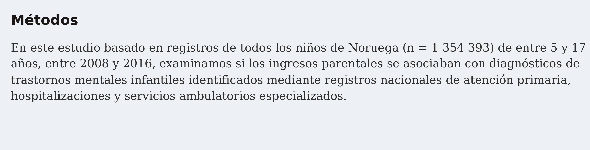
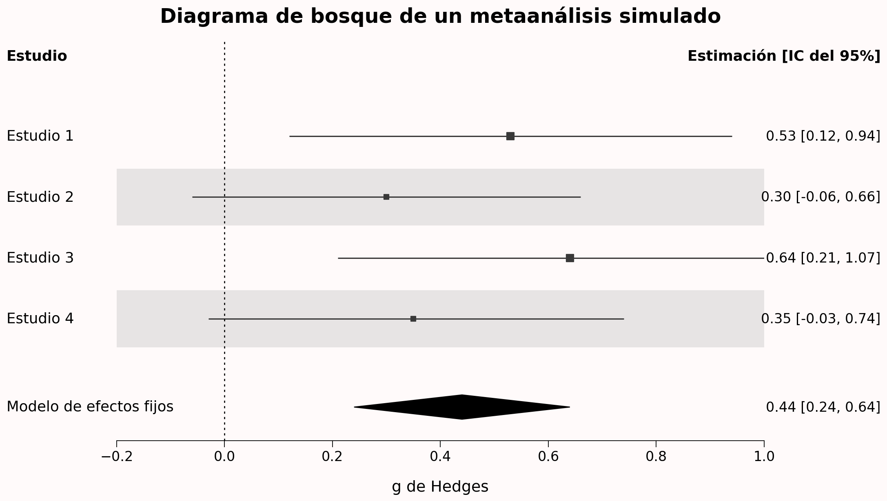
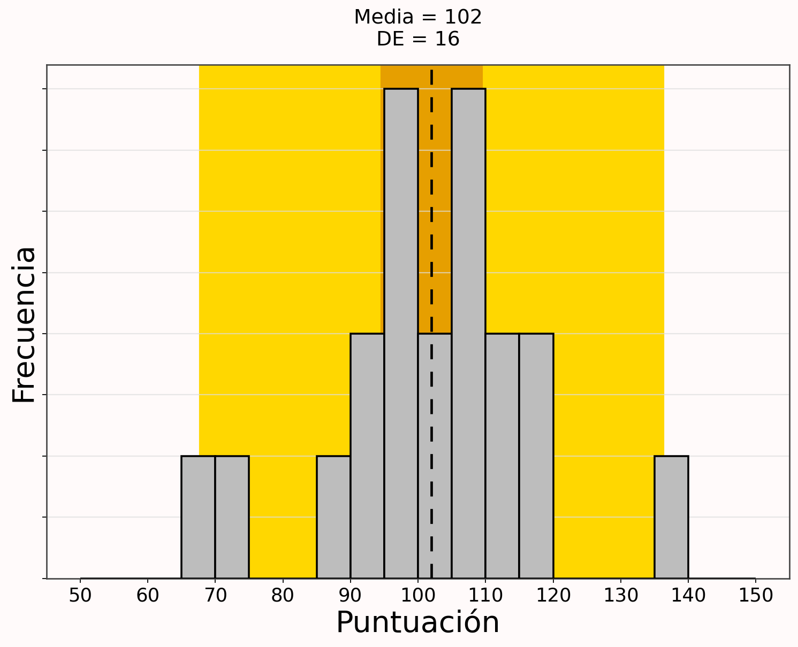
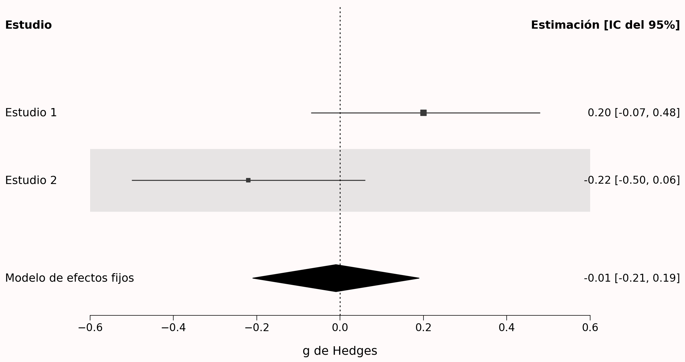
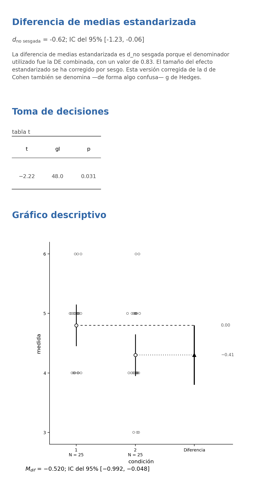
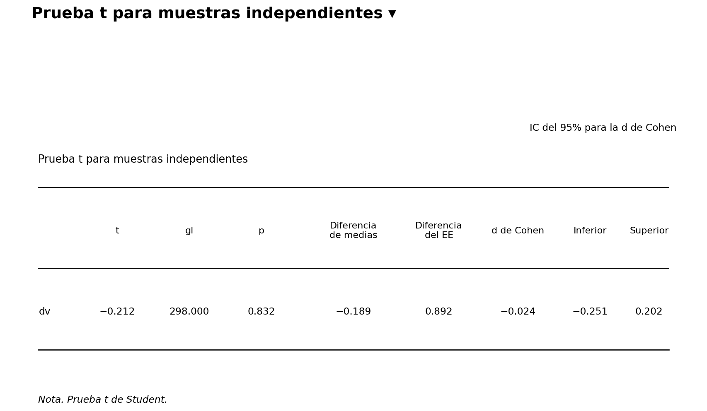
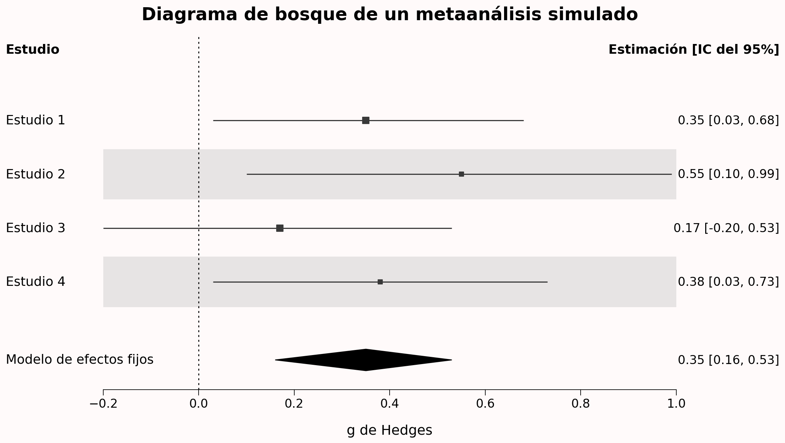
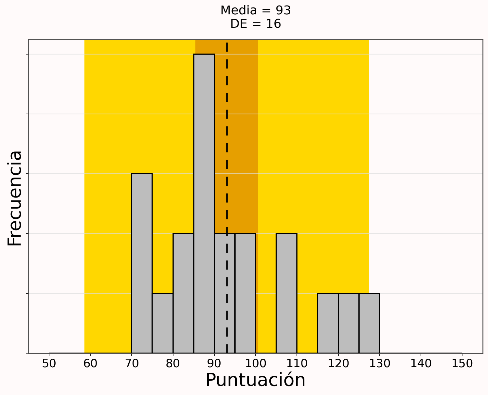

# Intervalos de confianza

> Traducción literal al castellano del capítulo 7, “Confidence Intervals”, de Daniël Lakens, *Improving Your Statistical Inferences*.<br>
> Original: https://lakens.github.io/statistical_inferences/07-CI.html<br>
> Licencia del original: CC-BY-4.0. Traducción no oficial.

Cuando informamos de estimaciones puntuales, debemos reconocer y cuantificar la incertidumbre que existe en ellas. Los intervalos de confianza proporcionan una manera de cuantificar la precisión de una estimación. Al informar de una estimación junto con un intervalo de confianza, los resultados se presentan dentro de un rango de valores que contiene el valor verdadero del parámetro con un porcentaje deseado. Por ejemplo, cuando informamos de una estimación del tamaño del efecto con un intervalo de confianza del 95%, esperamos que el intervalo sea lo bastante amplio como para que, el 95% de las veces, el rango de valores alrededor de la estimación contenga el valor verdadero del parámetro —si se cumplen todos los supuestos de la prueba—.

## Población frente a muestra

En estadística diferenciamos entre la población y la muestra. La **población** está formada por todas las personas que nos interesan, como todos los seres humanos del mundo, las personas mayores con depresión o quienes compran productos innovadores. La **muestra** está formada por todas las personas de esa población que hemos podido medir. De manera análoga, distinguimos entre un **parámetro** y un **estadístico**. Un parámetro es una característica de la población, mientras que un estadístico es una característica de una muestra.

En ocasiones disponemos de datos sobre toda la población. Por ejemplo, se ha medido la estatura de todas las personas que han caminado alguna vez sobre la Luna. Podemos calcular la estatura media de esos doce individuos y, por tanto, conocemos el parámetro verdadero. No necesitamos estadística inferencial. Sin embargo, desconocemos la estatura media de todas las personas que han caminado alguna vez sobre la Tierra. Por ello, necesitamos estimar ese parámetro mediante un estadístico basado en una muestra. Aunque es poco frecuente que un estudio incluya a toda la población, no resulta imposible, como ilustra la @fig-population.

{#fig-population}

Cuando se mide a toda la población, no es necesario realizar una prueba de hipótesis. Al fin y al cabo, no existe una población a la que generalizar —aunque podría sostenerse que seguimos haciendo una inferencia, incluso cuando observamos toda la población, porque hemos observado una *población metafórica* de uno entre muchos mundos posibles; véase Spiegelhalter (2019)—. Cuando se han recogido datos de toda la población, se conoce el tamaño del efecto poblacional y no hay ningún intervalo de confianza que calcular.

Si conocemos el tamaño total de la población, pero no la hemos medido por completo, la anchura del intervalo de confianza debería reducirse hasta cero a medida que el estudio se aproxima a medirla en su totalidad. Esto se conoce como **factor de corrección por población finita** de la varianza del estimador (Kish, 1965). El error estándar de una media muestral es $\sigma/\sqrt{n}$ y, para poblaciones finitas, se multiplica por el factor de corrección por población finita:

$$
FPC = \sqrt{\frac{(N - n)}{(N-1)}}
$$

donde *N* es el tamaño de la población y *n*, el tamaño de la muestra. Cuando *N* es mucho mayor que *n*, el factor de corrección estará próximo a 1 —por eso suele ignorarse cuando las poblaciones son muy grandes, aunque sean finitas— y no tendrá un efecto apreciable sobre la varianza. Cuando se mide toda la población, el factor de corrección es 0 y, por tanto, la varianza también pasa a ser 0. Por ejemplo, si la población total está formada por 100 deportistas de élite y se recogen datos de una muestra de 35, la corrección por población finita es $\sqrt{(100 - 35)/(100-1)}$ = 0.81. El paquete `superb` de R permite calcular intervalos de confianza corregidos para la población (Cousineau y Chiasson, 2019).

## ¿Qué es un intervalo de confianza?

Los intervalos de confianza constituyen una afirmación sobre el porcentaje de intervalos de confianza que contienen el valor verdadero del parámetro. Este comportamiento se representa en la simulación interactiva siguiente. Vemos puntos que representan medias de una muestra y que se distribuyen alrededor de una línea vertical discontinua, la cual representa el valor verdadero del parámetro en la población —μ = 0—. Debido a la variación muestral, no todas las estimaciones caen sobre la línea discontinua.

Las líneas horizontales que rodean los puntos son los intervalos de confianza. De forma predeterminada, la visualización muestra intervalos de confianza del 95%. La mayoría de las líneas son verdes —lo que significa que el intervalo de confianza se solapa con la línea discontinua que indica el valor poblacional verdadero—, pero algunas son rojas —lo que indica que no capturan el valor poblacional verdadero—. A largo plazo, el 95% de las barras horizontales serán verdes y el 5%, rojas.

::: {.content-visible when-format="html"}

```{=html}
<iframe id="ci-app-iframe"
        src="confidence_interval_app_book.html"
        width="100%"
        height="600"
        scrolling="no"
        style="border:none;display:block;margin:1.5rem 0;overflow:hidden;"
        title="Intervalos de confianza a lo largo del tiempo">
</iframe>
<script>
window.addEventListener('message', function(e) {
  if (e.data && typeof e.data.iframeHeight === 'number') {
    var f = document.getElementById('ci-app-iframe');
    if (f && e.source === f.contentWindow) f.style.height = e.data.iframeHeight + 'px';
  }
});
</script>
```

:::

::: {.content-visible unless-format="html"}

*En la edición en línea de este libro está disponible una versión interactiva de esta simulación.*

:::

Ahora podemos comprender qué significa la frase «Los intervalos de confianza constituyen una afirmación sobre el porcentaje de intervalos de confianza que contienen el valor verdadero del parámetro». A largo plazo, en el 95% de las muestras, la línea discontinua naranja —el parámetro poblacional— queda contenida dentro del intervalo de confianza del 95% alrededor de la media muestral; en el 5% de los intervalos de confianza no sucede así.

Como veremos al examinar la fórmula de los intervalos de confianza, su anchura depende del tamaño muestral y de la desviación estándar. Cuanto mayor es la muestra, más estrechos son los intervalos de confianza. La simulación interactiva siguiente muestra cómo se estrecha el intervalo de confianza alrededor de la media conforme aumenta el tamaño muestral.

Además, a medida que aumenta el tamaño muestral, la estimación se aproxima cada vez más a la estimación poblacional verdadera —una media de 1 de forma predeterminada en la simulación—. En un tamaño muestral concreto —por ejemplo, *N* = 250— vemos que, a largo plazo, el 95% de las medias observadas tendrían un intervalo de confianza del 95% que contendría el parámetro poblacional verdadero; aproximadamente el 5% de las medias serían más extremas y no tendrían un intervalo de confianza que contuviera el parámetro poblacional de 1. Para explorar este comportamiento a largo plazo, fija la velocidad en 1 y reduce el tamaño muestral máximo —*N*—, por ejemplo, a 100.

::: {.content-visible when-format="html"}

```{=html}
<iframe id="ci-samplesize-iframe"
        src="ci_sample_size_app_book.html"
        width="100%"
        height="600"
        scrolling="no"
        style="border:none;display:block;margin:1.5rem 0;overflow:hidden;"
        title="Anchura del intervalo de confianza al aumentar el tamaño muestral">
</iframe>
<script>
(function() {
  var handled = false;
  window.addEventListener('message', function(e) {
    if (e.data && typeof e.data.iframeHeight === 'number') {
      var f = document.getElementById('ci-samplesize-iframe');
      if (f && e.source === f.contentWindow) {
        f.style.height = e.data.iframeHeight + 'px';
        handled = true;
      }
    }
  });
})();
</script>
```

:::

::: {.content-visible unless-format="html"}

*En la edición en línea de este libro está disponible una versión interactiva de esta simulación.*

:::

## Interpretación de un único intervalo de confianza {#sec-singleCI}

Siempre que calculamos o encontramos un único intervalo de confianza, es importante comprender que otra persona que realizara exactamente el mismo experimento habría observado, solo por la variación aleatoria, un intervalo de confianza, un tamaño del efecto y un valor *p* diferentes. Debido a esta variación aleatoria, resulta difícil interpretar un único intervalo de confianza. Las interpretaciones erróneas son frecuentes. Por ejemplo, Cumming (2014) escribe: «Podemos tener una confianza del 95% en que nuestro intervalo incluye $\mu$ y pensar en sus límites inferior y superior como límites inferior y superior probables de $\mu$». Ambas afirmaciones son incorrectas (Morey et al., 2016).

Es incorrecto afirmar que podemos tener una confianza del 95% en que nuestro intervalo incluye la media poblacional verdadera. Imaginemos que estudiamos si un amigo puede predecir si una moneda caerá de cara o de cruz en 100 lanzamientos y que acierta 61 de ellos, con un intervalo de confianza del 95% entre 0.507 y 0.706. Resulta perfectamente razonable aplicar cierto razonamiento bayesiano y suponer —con una confianza superior al 5% restante— que se trató simplemente de una casualidad y que su tasa verdadera de aciertos al adivinar el resultado de los lanzamientos es del 50%.

También es incorrecto creer que los límites inferior y superior son límites inferior y superior probables de $\mu$, puesto que cualquier otra persona que realizara el mismo experimento habría observado, al analizar otra muestra extraída de la misma población, un intervalo de confianza distinto, con límites superior e inferior diferentes. Si se han recogido muchos datos —por ejemplo, miles de observaciones—, este problema prácticamente desaparece, porque la incertidumbre restante es demasiado pequeña para tener importancia.

Una forma útil de pensar en un intervalo de confianza consiste en considerarlo una indicación de la **resolución** con la que se estima un efecto. Si la resolución es baja, resulta difícil obtener una imagen clara; si es extremadamente alta, la imagen es lo bastante nítida para todos los usos prácticos. Si hemos estimado un efecto dentro de un rango muy estrecho —por ejemplo, *M* = 0.52, IC del 95% [0.49; 0.55]— y nos parece justificado suponer que a nadie le importan diferencias inferiores a 0.05 en la medida, el intervalo de confianza comunica que los datos se han estimado con suficiente [precisión](08-justificacion-del-tamaño-de-la-muestra.md).

De forma análoga, si el tamaño muestral es pequeño y el intervalo de confianza muy amplio —por ejemplo, *M* = 0.52, IC del 95% [0.09; 0.95]— y nos parece justificado asumir que diferencias cercanas a 1 en la medida importan en las situaciones en las que se utilizaría la estimación, el intervalo de confianza comunica que la estimación del tamaño del efecto no es lo bastante precisa. Esta evaluación de la resolución de la estimación puede resultar útil y falta cuando solo se informa de un valor *p* o de un tamaño del efecto. Por ello, se recomienda informar de los intervalos de confianza alrededor de las estimaciones. Suelen presentarse entre corchetes, pero una alternativa interesante —en especial para las tablas— consiste en utilizar subíndices: $_{0.09}0.52_{0.95}$ (Louis y Zeger, 2009).

Resulta tentador interpretar de manera bayesiana un único intervalo de confianza y afirmar: «Creo que existe un 95% de probabilidad de que este intervalo contenga el parámetro poblacional verdadero». Una interpretación bayesiana ha perdido el control frecuentista de los errores, lo que significa que, dependiendo del *prior*, esta creencia podría estar equivocada en bastante más del 5% de los estudios. Esto no preocupa a los bayesianos, porque sus inferencias no se centran en limitar los errores a largo plazo, sino en cuantificar las creencias.

Un frecuentista no puede hacer afirmaciones probabilísticas sobre observaciones únicas. Después de recoger los datos, solo puede afirmar que el intervalo de confianza actual contiene el parámetro poblacional verdadero o no lo contiene. A largo plazo, el $\alpha$% de los intervalos de confianza no incluirá el parámetro poblacional verdadero, y este intervalo concreto podría ser uno de esos casos fortuitos. Aunque un intervalo de confianza frecuentista y un intervalo creíble bayesiano pueden ser idénticos con determinados *priors* (Albers et al., 2018), las distintas definiciones de probabilidad conducen a interpretaciones diferentes de un único intervalo.

Un frecuentista puede interpretar fácilmente un **procedimiento** de confianza, pero no resulta tan sencillo interpretar un único intervalo de confianza (Morey et al., 2016). Esto no debería sorprendernos, porque es difícil interpretar cualquier estudio aislado —por eso necesitamos realizar estudios de replicación—. Cuando los intervalos de confianza se interpretan como un procedimiento a largo plazo, se relacionan directamente con los valores *p*.

## Relación entre los intervalos de confianza y los valores *p* {#sec-relatCIp}

Existe una relación directa entre el intervalo de confianza alrededor de un tamaño del efecto y la significación estadística de una prueba de significación de la hipótesis nula. Por ejemplo, si un efecto es estadísticamente significativo —*p* < 0.05— en una prueba *t* bilateral para muestras independientes con un alfa de .05, el intervalo de confianza del 95% para la diferencia de medias entre los dos grupos no incluirá cero.

A veces se afirma que los intervalos de confianza son más informativos que los valores *p*, porque no solo aportan información sobre si un efecto es estadísticamente significativo —es decir, cuando el intervalo de confianza no se solapa con el valor que representa la hipótesis nula—, sino que también comunican la precisión de la estimación del tamaño del efecto. Esto es cierto, pero, como se señaló en el capítulo sobre los [valores *p*](01-usando-valores-p.md), sigue siendo recomendable añadir los valores *p* exactos. Esto facilita la reutilización de los resultados en análisis secundarios (Appelbaum et al., 2018) y permite que otros investigadores comparen el valor *p* con el nivel alfa que ellos habrían preferido utilizar (Lehmann y Romano, 2005).

Para mantener la relación directa entre un intervalo de confianza y un valor *p*, es necesario ajustar el nivel de confianza cada vez que se modifica el nivel alfa. Por ejemplo, si un nivel alfa del 5% se corrige para tres comparaciones y pasa a ser 0.05/3 = 0.0167, el intervalo de confianza correspondiente sería 1 − 0.0167 = 0.9833. De modo análogo, si se calcula un valor *p* para una prueba *t* unilateral, solo existe un límite superior o inferior del intervalo y el otro extremo se extiende hasta −∞ o ∞.

Para mantener una relación directa entre una prueba *F* y su intervalo de confianza, debe proporcionarse un intervalo de confianza del 90% para los tamaños del efecto de una prueba *F*. [Karl Wuensch](https://web.archive.org/web/20140104080701/http://core.ecu.edu/psyc/wuenschk/docs30/CI-Eta2-Alpha.doc) explica el motivo. Mientras que la *d* de Cohen puede adoptar valores positivos y negativos, $r^2$ y $\eta^2$ son valores elevados al cuadrado y, por tanto, solo pueden ser positivos. Esto se relaciona con el hecho de que las pruebas *F* —tal como suelen utilizarse en el ANOVA— son unilaterales.

Si se calcula un intervalo de confianza del 95%, pueden producirse situaciones en las que el intervalo incluya 0, pero la prueba revele una diferencia estadística con *p* < .05 —para una explicación más matemática, véase Steiger (2004)—. Esto significa que un intervalo de confianza del 95% alrededor de la *d* de Cohen en una prueba *t* independiente equivale a un intervalo de confianza del 90% alrededor de $\eta^2$ para exactamente la misma prueba realizada como ANOVA. Como último detalle, dado que eta cuadrado no puede ser menor que cero, el límite inferior del intervalo de confianza tampoco puede serlo. Por ello, un intervalo de confianza de un efecto que no difiere estadísticamente de 0 debe comenzar en 0. Se informa de él como IC del 90% [.00; .XX], donde XX es su límite superior.

Los intervalos de confianza se utilizan a menudo en diagramas de bosque que comunican los resultados de un metaanálisis. En el gráfico siguiente vemos cuatro filas. Cada una muestra la estimación del tamaño del efecto de un estudio —expresada como *g* de Hedges—. Por ejemplo, el Estudio 1 produjo una estimación de 0.53, con un intervalo de confianza entre 0.12 y 0.94. La línea horizontal negra representa la anchura del intervalo de confianza. Cuando no toca el tamaño del efecto 0 —indicado por una línea vertical negra de puntos—, el efecto es estadísticamente significativo.



Como los intervalos de confianza no se solapan con 0, vemos que los Estudios 1 y 3 fueron estadísticamente significativos. El rombo denominado «Modelo de efectos fijos» representa el tamaño del efecto metaanalítico. En lugar de una línea horizontal negra, sus extremos izquierdo y derecho indican los límites inferior y superior del intervalo de confianza, y el centro del rombo representa la estimación metaanalítica del tamaño del efecto. Un metaanálisis calcula el tamaño del efecto combinando y ponderando todos los estudios. El intervalo de confianza de una estimación metaanalítica del tamaño del efecto siempre es más estrecho que el de un estudio individual, debido al tamaño muestral combinado de todos los estudios incluidos.

En la sección anterior nos centramos en examinar si el intervalo de confianza se solapaba con 0. Este es un enfoque mediante intervalos de confianza de una prueba de significación de la hipótesis nula. Aunque no calculemos un valor *p*, podemos ver directamente en el intervalo de confianza si *p* < $\alpha$. Este enfoque hace bastante intuitivo pensar en pruebas frente a hipótesis nulas distintas de cero (Bauer y Kieser, 1996). Por ejemplo, podríamos comprobar si podemos rechazar un efecto de 0.5 examinando si el intervalo de confianza del 95% no se solapa con 0.5. Podemos comprobar si un efecto es **menor** que 0.5 examinando si el intervalo queda por completo **por debajo** de 0.5. Veremos que esto conduce a una extensión lógica de las pruebas de hipótesis nulas: en lugar de intentar rechazar un efecto de 0, podemos comprobar si rechazamos otros efectos de interés mediante **predicciones de rango** y [**pruebas de equivalencia**](09-pruebas-de-equivalencia.md).

## El error estándar y los intervalos de confianza del 95%

Para calcular un intervalo de confianza necesitamos el error estándar. El **error estándar** —*SE*, por sus siglas en inglés— estima la variabilidad entre las medias muestrales que se obtendrían al realizar varias mediciones de una misma población. Es fácil confundirlo con la desviación estándar, que expresa en qué medida difieren los individuos de una muestra respecto a su media muestral.

Formalmente, los estadísticos distinguen entre $\sigma$ y $\widehat{\sigma}$: el acento circunflejo indica que el valor se estima a partir de una muestra y su ausencia, que se trata del valor poblacional. En las fórmulas siguientes omitiré el acento, aunque me referiré principalmente a valores estimados a partir de una muestra. Matemáticamente —donde $\sigma$ es la desviación estándar—:

$$
Error\ estándar\ (SE) = \sigma/\sqrt n
$$

El error estándar de la muestra tenderá a cero conforme aumente el tamaño muestral, porque la estimación de la media poblacional será cada vez más exacta. La desviación estándar de la muestra se parecerá cada vez más a la desviación estándar poblacional al crecer la muestra, pero no disminuirá. Mientras que la desviación estándar es un estadístico descriptivo de la muestra, el error estándar describe los límites de un proceso de muestreo aleatorio.

El error estándar se utiliza para construir intervalos de confianza alrededor de estimaciones muestrales, como la media, las diferencias entre medias o cualquier otro estadístico que nos interese. Para calcular un intervalo de confianza alrededor de una media —indicada por la letra griega mu, $\mu$—, utilizamos la distribución *t* con los grados de libertad correspondientes —*gl*; en una prueba *t* de una muestra, los grados de libertad son *n* − 1—:

$$
\mu \pm t_{gl, 1-(\alpha/2)} SE
$$

Con un intervalo de confianza del 95%, $\alpha$ = 0.05 y, por tanto, se calcula el valor *t* crítico para los grados de libertad en 1 − $\alpha$/2, es decir, el cuantil 0.975. Recuerda que una distribución *t* tiene colas ligeramente más gruesas que una distribución *Z*. Mientras que el cuantil 0.975 de una distribución *Z* es 1.96, el valor de una distribución *t* con, por ejemplo, *gl* = 19 es 2.093. Este valor se multiplica por el error estándar y se suma a la media —para el límite superior del intervalo— o se resta —para el límite inferior—.

## Superposición de los intervalos de confianza

Los intervalos de confianza se utilizan a menudo en gráficos. En la simulación interactiva siguiente se representan tres estimaciones —los puntos— rodeadas por tres líneas —los intervalos de confianza del 95%—. Los dos puntos de la izquierda —X e Y— representan las **medias** de los grupos independientes X e Y en una escala de 0 a 8 —véase el eje izquierdo—. Las líneas de puntos entre ambos intervalos muestran la superposición entre los intervalos de confianza alrededor de las medias.

Los dos intervalos de confianza alrededor de las medias de X e Y son los que suelen aparecer en una figura de un artículo científico. El tercer punto, ligeramente mayor, es la **diferencia de medias** entre X e Y, y la línea algo más gruesa representa su intervalo de confianza. La diferencia se expresa mediante el eje derecho —de −3 a 5—. En el gráfico siguiente, la media del grupo X es 3, la del grupo Y es 5.6 y la diferencia es 2.6. El gráfico se basa en 50 observaciones por grupo, y el intervalo de confianza alrededor de la diferencia de medias va de 0.49 a 4.68, un intervalo bastante amplio.

::: {.content-visible when-format="html"}

```{=html}
<iframe id="means-diff-iframe"
        src="means_difference_app_book.html"
        width="100%"
        height="550"
        scrolling="no"
        style="border:none;display:block;margin:1.5rem 0;overflow:hidden;"
        title="Medias y diferencia">
</iframe>
<script>
window.addEventListener('message', function(e) {
  if (e.data && typeof e.data.iframeHeight === 'number') {
    var f = document.getElementById('means-diff-iframe');
    if (f && e.source === f.contentWindow) f.style.height = e.data.iframeHeight + 'px';
  }
});
</script>
```

:::

::: {.content-visible unless-format="html"}

*En la edición en línea de este libro está disponible un gráfico interactivo de las medias y su diferencia.*

:::

Como se señaló antes, cuando un intervalo de confianza del 95% no contiene 0, el efecto difiere estadísticamente de 0. En la simulación anterior, la etiqueta «Diferencia» señala la diferencia de medias y su intervalo de confianza del 95%. Como este intervalo no contiene 0, la prueba *t* es significativa con un alfa de 0.05. El valor *p* aparece en el gráfico y es 0.016.

Aunque las dos medias difieren entre sí de manera estadísticamente significativa, los intervalos de confianza alrededor de cada media se solapan. Podría parecer intuitivo que un efecto solo es estadísticamente significativo cuando los intervalos de confianza de las medias individuales no se superponen, pero no es cierto. La prueba de significación se relaciona con el intervalo de confianza alrededor de la **diferencia de medias**.

## Intervalos de predicción

Aunque, a largo plazo, el 95% de los intervalos de confianza contendrá el parámetro verdadero, un intervalo de confianza del 95% no contendrá el 95% de las futuras observaciones individuales —ni el 95% de las futuras medias, como se explicará en la sección siguiente—. A veces los investigadores desean predecir el intervalo dentro del cual caerá un único valor. Este es el **intervalo de predicción**, que siempre es mucho más amplio que un intervalo de confianza. El motivo es que las observaciones individuales pueden variar de forma considerable, mientras que las medias de muestras futuras variarán mucho menos.

En la @fig-predictioninterval, el fondo naranja representa el intervalo de confianza del 95% alrededor de la media, y el fondo amarillo, el intervalo de predicción del 95%.

{#fig-predictioninterval}

Para calcular el intervalo de predicción necesitamos una fórmula del error estándar ligeramente distinta de la utilizada para el intervalo de confianza:

$$
Error\ estándar\ (SE) = \sigma\sqrt{1+1/n}
$$

Si reescribimos la fórmula del intervalo de confianza como $\sigma\sqrt{1/n}$, vemos que la diferencia con el intervalo de predicción se encuentra en «1 +», lo que siempre produce intervalos más amplios. Los intervalos de predicción son **más amplios** porque se construyen para contener **un único valor futuro** el 95% de las veces, en lugar de contener la **media**. Su gran anchura constituye un buen recordatorio de que es difícil predecir qué ocurrirá con un individuo concreto.

## Porcentajes de captura

Puede resultar difícil comprender por qué un intervalo de confianza del 95% no nos proporciona el intervalo en el que caerá el 95% de las futuras medias. El porcentaje de medias que cae dentro de un único intervalo de confianza se denomina **porcentaje de captura**. No es algo que se utilice para realizar inferencias sobre los datos, pero aprender qué es ayuda a evitar interpretaciones erróneas de los intervalos de confianza.

En la @fig-metaci vemos dos estudios simulados aleatoriamente con el mismo tamaño muestral y extraídos de la misma población. El tamaño del efecto verdadero de ambos estudios es 0, y los intervalos de confianza del 95% de los dos contienen el valor poblacional verdadero de 0. Sin embargo, cubren rangos de tamaños del efecto muy diferentes: el intervalo del Estudio 1 va de −0.07 a 0.48, mientras que el del Estudio 2 va de −0.50 a 0.06. No puede ser cierto que, en el futuro, debamos esperar que el 95% de los tamaños del efecto caiga entre −0.07 y 0.48 **y**, al mismo tiempo, que el 95% caiga entre −0.50 y 0.06.

{#fig-metaci}

La única situación en la que un intervalo de confianza del 95% coincide también con un porcentaje de captura del 95% se produce cuando el tamaño del efecto observado en una muestra es exactamente igual al parámetro poblacional verdadero. En la @fig-metaci esto exigiría observar un efecto de exactamente 0. Sin embargo, no podemos saber si el tamaño del efecto observado coincide exactamente con el poblacional.

Cuando una estimación muestral no es idéntica al valor poblacional verdadero —lo que ocurre casi siempre—, menos del 95% de los futuros tamaños del efecto caerán dentro del intervalo de confianza de la muestra actual. Como en los dos estudios anteriores observamos tamaños del efecto algo alejados del verdadero, encontraremos con bastante frecuencia estimaciones de futuros estudios situadas fuera de los intervalos observados. Por tanto, el porcentaje de futuras medias que cae dentro de un único intervalo de confianza depende de cuál sea el intervalo concreto que hayamos observado. Mediante estudios de simulación puede mostrarse que, por término medio y a largo plazo, un intervalo de confianza del 95% tiene una probabilidad de captura del 83.4% (Cumming y Maillardet, 2006).

## Cálculo de intervalos de confianza alrededor de desviaciones estándar

Cuando calculamos una desviación estándar —*SD*— a partir de una muestra, ese valor constituye una estimación del valor verdadero de la población. En muestras pequeñas, la estimación puede quedar bastante alejada del valor poblacional. Sin embargo, por la ley de los grandes números, mediremos la desviación estándar con mayor exactitud a medida que aumente el tamaño muestral. Puesto que la desviación estándar muestral es una estimación sujeta a incertidumbre, podemos calcular alrededor de ella un intervalo de confianza del 95%.

Por alguna razón, esto rara vez se hace en la práctica, quizá porque los investigadores suelen estar más interesados en las medias que en las desviaciones estándar. Sin embargo, las desviaciones estándar son una propiedad interesante de nuestras medidas, e incluso podrían formularse predicciones teóricas sobre su aumento o disminución entre condiciones. En la actualidad, los investigadores rara vez elaboran teorías sobre la variación de las desviaciones estándar y, quizá por ello, prácticamente nunca calculan intervalos de confianza alrededor de las que comunican.

Tener presente la incertidumbre de las desviaciones estándar puede resultar importante. Cuando los investigadores realizan un análisis de potencia *a priori* basado en un tamaño del efecto de interés expresado en una escala bruta, necesitan estimaciones exactas de la desviación estándar. A veces utilizan datos piloto para obtenerlas. Como la estimación de la desviación estándar poblacional basada en un estudio piloto conlleva incertidumbre —los estudios piloto suelen tener muestras relativamente pequeñas—, el análisis de potencia *a priori* heredará esa incertidumbre —véanse las preguntas de autoevaluación—. Para evitarlo, conviene utilizar medidas validadas o existentes para las que se disponga de estimaciones exactas de la desviación estándar en la población de interés. Y hay que recordar que todas las estimaciones obtenidas de una muestra tienen incertidumbre.

## Cálculo de intervalos de confianza alrededor de los tamaños del efecto

En 1994, Cohen (1994) reflexionó sobre la razón por la que rara vez se informaba de intervalos de confianza: «Sospecho que la principal razón por la que no se comunican es que son vergonzosamente grandes». Tal vez fuera así, pero otra razón podría ser que, cuando Cohen escribió su artículo, los programas estadísticos rara vez proporcionaban intervalos de confianza alrededor de los tamaños del efecto.

Con la popularidad de los paquetes gratuitos de R, informar de intervalos de confianza resulta cada vez más sencillo, aunque esos paquetes todavía no ofrezcan soluciones para todas las pruebas estadísticas. Los [estándares para la presentación de artículos científicos](https://apastyle.apa.org/jars/quantitative) recomiendan informar, cuando sea posible, de «estimaciones del tamaño del efecto e intervalos de confianza de las estimaciones que correspondan a cada prueba inferencial realizada».

Una solución sencilla para calcular tamaños del efecto e intervalos de confianza es [MOTE](https://www.aggieerin.com/shiny-server/), creado por la Dra. Erin Buchanan y su laboratorio. El sitio web incluye una colección completa de tutoriales, comparaciones con otros programas y vídeos demostrativos que explican de manera accesible cómo calcular tamaños del efecto e intervalos de confianza para una amplia variedad de pruebas a partir de estadísticos resumidos. Así, sea cual sea el programa utilizado para realizar las pruebas, pueden introducirse tamaños muestrales y medias, desviaciones estándar o estadísticos de contraste para calcular los tamaños del efecto y sus intervalos de confianza.

MOTE también está disponible como paquete de R (Buchanan et al., 2017). Aunque existen muchas soluciones para calcular la *d* de Cohen, MOTE destaca porque permite calcular tamaños del efecto e intervalos de confianza para muchas medidas adicionales: omega cuadrado parcial para un ANOVA intersujeto —$\omega^{2}$ y $\omega^{2}_p$—, omega cuadrado generalizado —$\omega^{2}_G$—, épsilon cuadrado —$\varepsilon^{2}$— y eta cuadrado generalizado parcial —$\eta^{2}_G$—, entre otras.

```text
[1] "$d_s$ = -0.41, IC del 95% [-0.72, -0.09]"
```

MBESS es otro paquete de R con distintas opciones para calcular tamaños del efecto y sus intervalos de confianza (Kelley, 2007). El resultado siguiente reproduce el ejemplo anterior de MOTE.

```text
[1] -0.406028
```

Si te sientes cómodo analizando datos en R, el paquete `effectsize` ofrece un conjunto completo de soluciones prácticas para calcular tamaños del efecto e intervalos de confianza (Ben-Shachar et al., 2020).

| *d* de Cohen | IC | Límite inferior | Límite superior |
|---:|---:|---:|---:|
| −0.443983 | 0.95 | −0.9050135 | 0.0180575 |

Personalmente, me impresiona la forma en que el paquete `effectsize` incorpora el estado del arte —aunque quizá sea un poco parcial—. Por ejemplo, después de que recomendáramos utilizar de manera predeterminada la prueba *t* de Welch en lugar de la prueba *t* de Student (Delacre et al., 2017), y de que un estudio de simulación reciente recomendara informar del $g_s^*$ de Hedges como tamaño del efecto para la prueba *t* de Welch (Delacre et al., 2021), `effectsize` fue el primer paquete que lo incorporó.

| *d* de Cohen | IC | Límite inferior | Límite superior |
|---:|---:|---:|---:|
| −0.5328286 | 0.95 | −0.8972774 | −0.1613137 |

Los programas estadísticos gratuitos [jamovi](https://www.jamovi.org/) y [JASP](https://jasp-stats.org/) son alternativas sólidas a SPSS que —a diferencia de este— permiten calcular la *d* de Cohen y su intervalo de confianza tanto para pruebas *t* independientes como dependientes.

En jamovi, el módulo ESCI permite calcular tamaños del efecto e intervalos de confianza y viene acompañado de materiales educativos que se centran más en la estimación y menos en las pruebas (Cumming y Calin-Jageman, 2016).



JASP ofrece una amplia variedad de análisis frecuentistas y bayesianos y, además de la *d* de Cohen, permite calcular omega cuadrado —$\omega^{2}$—, la versión menos sesgada de $\eta^{2}$ (Albers y Lakens, 2018; Okada, 2013).




## Autoevaluación

**P1**: Accede a la aplicación en línea de Kristoffer Magnusson: <http://rpsychologist.com/d3/CI/>. Quizá quieras que más del 95% de los intervalos de confianza contengan el parámetro poblacional verdadero. Arrastra el control deslizante «Slide me» completamente hacia la derecha y verás la simulación para intervalos de confianza del 99%. ¿Qué afirmación es correcta?

- Los intervalos de confianza son más amplios y las medias muestrales caen más cerca de la media verdadera.
- Los intervalos de confianza son más estrechos y las medias muestrales caen más cerca de la media verdadera.
- Los intervalos de confianza son más amplios y las medias muestrales caen igual de cerca de la media verdadera que con un intervalo de confianza del 95%.
- Los intervalos de confianza son más estrechos y las medias muestrales caen igual de cerca de la media verdadera que con un intervalo de confianza del 95%.

**P2**: Como muestran las fórmulas de los intervalos de confianza, las medias muestrales y sus intervalos dependen del tamaño muestral. En la aplicación en línea puedes cambiarlo mediante el ajuste situado bajo la visualización. De forma predeterminada, el tamaño muestral es 5. Cámbialo a 50 —puedes escribir el valor—. ¿Qué afirmación es correcta?

- Cuanto mayor es la muestra, más amplios son los intervalos de confianza. El tamaño muestral no influye en cómo varían las medias muestrales alrededor de la media poblacional verdadera.
- Cuanto mayor es la muestra, más estrechos son los intervalos de confianza. El tamaño muestral no influye en cómo varían las medias muestrales alrededor de la media poblacional verdadera.
- Cuanto mayor es la muestra, más amplios son los intervalos de confianza y más se aproximan las medias muestrales a la media poblacional verdadera.
- Cuanto mayor es la muestra, más estrechos son los intervalos de confianza y más se aproximan las medias muestrales a la media poblacional verdadera.

**P3**: En el diagrama de bosque siguiente vemos el tamaño del efecto —indicado por el cuadrado— y su intervalo de confianza —la línea que lo rodea—. ¿Cuáles de los Estudios 1 a 4 fueron estadísticamente significativos?



- Los Estudios 1, 2, 3 y 4.
- Solo el Estudio 3.
- Ninguno de los cuatro estudios.
- Los Estudios 1, 2 y 4.

**P4**: El rombo negro de la fila inferior es la estimación metaanalítica del tamaño del efecto con un modelo de efectos fijos. Sus extremos izquierdo y derecho indican los límites inferior y superior del intervalo de confianza, y su centro, la estimación metaanalítica del tamaño del efecto. Un metaanálisis calcula el tamaño del efecto combinando y ponderando todos los estudios. ¿Qué afirmación es correcta?

- El intervalo de confianza de una estimación metaanalítica del tamaño del efecto con un modelo de efectos fijos siempre es más amplio que el de un único estudio, debido a la variación adicional entre estudios.
- El intervalo de confianza de una estimación metaanalítica del tamaño del efecto con un modelo de efectos fijos siempre es más estrecho que el de un único estudio, debido al tamaño muestral combinado de todos los estudios incluidos.
- El intervalo de confianza de una estimación metaanalítica del tamaño del efecto con un modelo de efectos fijos no se amplía ni se estrecha respecto al de un único estudio; simplemente se aproxima más al parámetro poblacional verdadero.

**P5**: Supongamos que un investigador calcula una media de 7.5 y una desviación estándar de 6.3 en una muestra de 20 personas. El valor crítico de una distribución *t* con *gl* = 19 es 2.093. Calcula el límite superior del intervalo de confianza alrededor de la media mediante la fórmula siguiente. ¿Es:

$$
\mu \pm t_{gl, 1-(\alpha/2)} SE
$$

- 1.40
- 2.95
- 8.91
- 10.45

Utiliza la simulación interactiva siguiente para responder a la próxima pregunta. Pulsa «Nueva muestra» para generar un gráfico nuevo —observa la variabilidad de los valores *p* debida a la potencia relativamente baja de la prueba—. El valor *p* del gráfico te indicará si la diferencia es estadísticamente significativa. Ejecuta la simulación hasta encontrar un valor próximo a *p* = 0.05.

::: {.content-visible when-format="html"}

```{=html}
<iframe id="means-diff-q-iframe"
        src="means_difference_app_book.html"
        width="100%"
        height="550"
        scrolling="no"
        style="border:none;display:block;margin:1.5rem 0;overflow:hidden;"
        title="Medias y diferencia">
</iframe>
<script>
window.addEventListener('message', function(e) {
  if (e.data && typeof e.data.iframeHeight === 'number') {
    var f = document.getElementById('means-diff-q-iframe');
    if (f && e.source === f.contentWindow) f.style.height = e.data.iframeHeight + 'px';
  }
});
</script>
```

:::

::: {.content-visible unless-format="html"}

*En la edición en línea de este libro está disponible un gráfico interactivo de las medias y su diferencia.*

:::

**P6**: ¿Cuánto se superponen dos intervalos de confianza del 95% alrededor de medias individuales de grupos independientes cuando la diferencia entre ambas medias apenas alcanza la significación estadística —*p* ≈ 0.05 con un alfa de 0.05—?

- Cuando el intervalo de confianza del 95% alrededor de una media no contiene la media del otro grupo, los grupos siempre difieren significativamente entre sí.
- Cuando el intervalo de confianza del 95% alrededor de una media no se solapa con el intervalo de confianza del 95% de la media del otro grupo, los grupos siempre difieren significativamente entre sí.
- Cuando los dos intervalos de confianza alrededor de cada media se solapan un poco —el límite superior de uno se superpone con el cuarto inferior del intervalo de confianza de la otra media—, los grupos difieren entre sí de forma significativa con un valor aproximado de *p* = 0.05.
- No existe relación entre la superposición de los intervalos de confianza del 95% alrededor de dos medias independientes y el valor *p* de la diferencia entre esos grupos.

Esta regla visual sobre la superposición solo puede utilizarse cuando se comparan grupos independientes, no grupos dependientes. Por ello, el intervalo de confianza del 95% alrededor de los tamaños del efecto suele ser más fácil de interpretar en relación con la significación de una prueba.

Experimentemos mediante una simulación. El siguiente script de R genera un gran número de muestras adicionales después de la primera representada. Devuelve el porcentaje de intervalos de confianza que contienen la media —que a largo plazo debería ser el 95%— y el porcentaje de medias de estudios futuros que caen dentro del intervalo de confianza del 95% del estudio original, es decir, el porcentaje de captura. Este difiere del nivel de confianza —y suele ser menor, aunque en ocasiones puede ser mayor—.

```r
library(ggplot2)

n <- 20                    # tamaño muestral
nsims <- 100000            # número de simulaciones
x <- rnorm(n, 100, 15)     # muestra de una distribución normal

# Intervalo de confianza del 95%
ciu <- mean(x) + qt(0.975, n - 1) * sd(x) * sqrt(1 / n)
cil <- mean(x) - qt(0.975, n - 1) * sd(x) * sqrt(1 / n)

# Intervalo de predicción del 95%
piu <- mean(x) + qt(0.975, n - 1) * sd(x) * sqrt(1 + 1 / n)
pil <- mean(x) - qt(0.975, n - 1) * sd(x) * sqrt(1 + 1 / n)

ggplot(as.data.frame(x), aes(x)) +
  geom_rect(aes(xmin = pil, xmax = piu, ymin = 0, ymax = Inf), fill = "gold") +
  geom_rect(aes(xmin = cil, xmax = ciu, ymin = 0, ymax = Inf), fill = "#E69F00") +
  geom_histogram(colour = "black", fill = "grey", bins = 20) +
  xlab("Puntuación") + ylab("Frecuencia") + theme_bw(base_size = 20) +
  geom_vline(xintercept = mean(x), linetype = "dashed", linewidth = 1) +
  coord_cartesian(xlim = c(50, 150)) +
  labs(subtitle = paste("Media =", round(mean(x)), "\nDE =", round(sd(x))))

# Simular intervalos de confianza
ciu_sim <- numeric(nsims)
cil_sim <- numeric(nsims)
mean_sim <- numeric(nsims)

for (i in 1:nsims) {
  x <- rnorm(n, 100, 15)
  ciu_sim[i] <- mean(x) + qt(0.975, n - 1) * sd(x) * sqrt(1 / n)
  cil_sim[i] <- mean(x) - qt(0.975, n - 1) * sd(x) * sqrt(1 / n)
  mean_sim[i] <- mean(x)
}

ciu_sim <- ciu_sim[ciu_sim < 100]
cil_sim <- cil_sim[cil_sim > 100]
mean_sim <- mean_sim[mean_sim > cil & mean_sim < ciu]

cat(100 * (1 - (length(ciu_sim) / nsims + length(cil_sim) / nsims)),
    "% de los intervalos de confianza del 95% contenían la media verdadera")
cat("El porcentaje de captura del estudio representado es:",
    100 * length(mean_sim) / nsims, "%")
```



**P7**: Ejecuta las simulaciones varias veces y observa el resultado de la consola de R. Por ejemplo: «El 95.077% de los intervalos de confianza del 95% contenían la media verdadera» y «El porcentaje de captura del estudio representado, es decir, el porcentaje de valores situados dentro del intervalo de confianza observado de 88.17208 a 103.1506, es 82.377%». Mientras repites las simulaciones, observa el intervalo de confianza alrededor de la media muestral y relaciónalo con el porcentaje de captura. Continúa hasta haber visto varias medias más próximas y más alejadas de la media verdadera —100—. ¿Qué afirmación es correcta?

- Cuanto más se aleja la media muestral de la media poblacional verdadera, menor es el porcentaje de captura.
- Cuanto más se aleja la media muestral de la media poblacional verdadera, mayor es el porcentaje de captura.

**P8**: Las simulaciones de R se generan aleatoriamente, pero puedes hacer reproducible una simulación concreta fijando la semilla del proceso de generación. Copia y pega `set.seed(1000)` en la primera línea del script y ejecútalo. La media muestral debería ser 94. ¿Cuál es el porcentaje de captura? —No olvides eliminar `set.seed` si quieres generar nuevas simulaciones aleatorias—.

- 95%
- 42.1%
- 84.3%
- 89.2%

Los porcentajes de captura rara vez se utilizan directamente para realizar inferencias estadísticas. La razón principal para examinarlos aquí es evitar el error frecuente de creer que el 95% de las futuras medias caerá dentro de un único intervalo de confianza: los porcentajes de captura muestran con claridad que no es así. Los intervalos de predicción también se utilizan poco en psicología, pero son más habituales en ciencia de datos.

**P9**: Hasta ahora hemos examinado intervalos de confianza alrededor de medias, pero también podemos calcularlos alrededor de desviaciones estándar. Si ejecutas las primeras líneas del código siguiente, verás que con alfa = 0.05, 100 observaciones y una desviación estándar verdadera de 1, el intervalo de confianza del 95% alrededor de la desviación estándar es [0.88; 1.16]. Cambia la desviación estándar poblacional supuesta de 1 a 2 —`st_dev <- 2`— y mantén iguales los demás ajustes. ¿Cuál es el intervalo de confianza del 95% alrededor de una desviación estándar de 2 con 100 observaciones?

```r
alpha_level <- 0.05        # nivel alfa
n <- 100                   # número de observaciones
st_dev <- 1                # desviación estándar verdadera
effect <- 0.5              # tamaño del efecto: diferencia bruta de medias

# Valores críticos inferior y superior
c_l <- sqrt((n - 1) / qchisq(alpha_level / 2, n - 1, lower.tail = FALSE))
c_u <- sqrt((n - 1) / qchisq(alpha_level / 2, n - 1, lower.tail = TRUE))

# Límites del intervalo de confianza de la desviación estándar
st_dev * c_l
st_dev * c_u

# d basada en los límites del IC del 95% de la desviación estándar
effect / (st_dev * c_l)
effect / (st_dev * c_u)

pwr::pwr.t.test(d = effect / (st_dev * c_l), power = 0.9, sig.level = 0.05)
pwr::pwr.t.test(d = effect / (st_dev * c_u), power = 0.9, sig.level = 0.05)

# Análisis de potencia con la desviación estándar verdadera, como comparación
pwr::pwr.t.test(d = effect / st_dev, power = 0.9, sig.level = 0.05)
```

- IC del 95% [1.38; 3.65]
- IC del 95% [1.76; 2.32]
- IC del 95% [1.82; 2.22]
- IC del 95% [1.84; 2.20]

**P10**: Vuelve a cambiar la desviación estándar poblacional supuesta de 2 a 1. Reduce el tamaño muestral de 100 a 20 —`n <- 20`—. Esto nos informa de la anchura del intervalo de confianza de una desviación estándar cuando realizamos un estudio piloto con 20 observaciones. Mantén iguales los demás ajustes. ¿Cuál es el intervalo de confianza del 95% alrededor de una desviación estándar de 1 con 20 observaciones?

- IC del 95% [0.91; 1.11]
- IC del 95% [0.82; 1.28]
- IC del 95% [0.76; 1.46]
- IC del 95% [1.52; 2.92]

**P11**: Si queremos que el intervalo de confianza del 95% alrededor de una desviación estándar de 1 se aleje como máximo 0.05 de la desviación estándar poblacional supuesta, ¿cuántas observaciones necesitamos? Esto significa que deseamos que el intervalo caiga entre 0.95 y 1.05. Sin embargo, los cálculos anteriores muestran que la distribución de las desviaciones estándar muestrales no es simétrica. Una desviación estándar no puede ser menor que 0 —porque es la raíz cuadrada de la varianza—. En la práctica, por tanto, la pregunta es: ¿cuál es el **menor** número de observaciones para que el límite superior del intervalo de confianza del 95% sea inferior a 1.05? Sustituye *n* por cada uno de los valores siguientes.

- *n* = 489
- *n* = 498
- *n* = 849
- *n* = 948

Exploremos las consecuencias de una estimación inexacta de la desviación estándar poblacional sobre los análisis de potencia *a priori*. Imaginemos que queremos realizar un análisis para el menor tamaño del efecto de interés de medio punto en una escala de 1 a 5, medida que tiene una desviación estándar poblacional verdadera —desconocida— de 1.2.

**P12**: Cambia el número de observaciones a 50 y la desviación estándar poblacional supuesta a 1.2. Mantén el efecto en 0.5. El intervalo de confianza del 95% de la desviación estándar basado en una muestra de 50 observaciones va de 1.002 a 1.495. Para realizar un análisis de potencia *a priori* necesitamos calcular la *d* de Cohen, es decir, dividir la diferencia por la desviación estándar. En nuestro ejemplo queremos observar, como mínimo, una diferencia de 0.5. ¿Cuáles son los valores de la *d* de Cohen —efecto/DE— para el límite inferior del intervalo de confianza del 95% —DE = 1.002— y para el límite superior —DE = 1.495—?

- *d* = 0.33 y *d* = 0.50
- *d* = 0.40 y *d* = 0.60
- *d* = 0.43 y *d* = 0.57
- *d* = 0.29 y *d* = 0.55

Si extraemos una muestra de 50 observaciones, puede ocurrir que, por variación aleatoria, observemos un valor mucho menor o mucho mayor que el valor poblacional verdadero. Podemos examinar cómo influye esto en el número de observaciones que creemos necesario al realizar un análisis de potencia *a priori*.

**P13**: Se realiza un análisis de potencia *a priori* que utiliza la estimación de la *d* de Cohen basada en el límite inferior del intervalo de confianza del 95% de la desviación estándar. ¿Qué afirmación es correcta?

- Como el límite inferior del intervalo es **menor** que la desviación estándar poblacional verdadera, la *d* de Cohen es **menor** y el análisis producirá un tamaño muestral **menor** que el que realmente necesitamos.
- Como el límite inferior del intervalo es **menor** que la desviación estándar poblacional verdadera, la *d* de Cohen es **mayor** y el análisis producirá un tamaño muestral **mayor** que el que realmente necesitamos.
- Como el límite inferior del intervalo es **menor** que la desviación estándar poblacional verdadera, la *d* de Cohen es **menor** y el análisis producirá un tamaño muestral **mayor** que el que realmente necesitamos.
- Como el límite inferior del intervalo es **menor** que la desviación estándar poblacional verdadera, la *d* de Cohen es **mayor** y el análisis producirá un tamaño muestral **menor** que el que realmente necesitamos.

**P14**: Comprobemos si la respuesta anterior era correcta. Seguimos teniendo alfa = 0.05, *n* = 50, una desviación estándar de 1.2 y un efecto de interés de 0.5. Ejecuta los análisis de potencia con el paquete `pwr`. El primero utiliza la *d* de Cohen basada en el límite inferior del intervalo de confianza del 95%; el segundo, la basada en el límite superior. También se incluye, como comparación, un tercer análisis basado en la desviación estándar verdadera —desconocida en situaciones reales—. ¿Qué afirmación es correcta? Recuerda que el tamaño muestral de un análisis de potencia se redondea hacia arriba, porque no podemos recoger una fracción de observación.

- El tamaño muestral por grupo es 68 al calcular el tamaño del efecto a partir del límite inferior del intervalo de confianza del 95% de la desviación estándar, y 86 al utilizar el límite superior.
- El tamaño muestral por grupo es 68 al calcular el tamaño del efecto a partir del límite inferior, y 123 al utilizar el límite superior.
- El tamaño muestral por grupo es 86 al calcular el tamaño del efecto a partir del límite inferior, y 123 al utilizar el límite superior.
- El tamaño muestral por grupo es 86 al calcular el tamaño del efecto a partir del límite inferior, y 189 al utilizar el límite superior.

### Preguntas abiertas

1. ¿Cuál es la definición de un intervalo de confianza?

2. ¿Cómo se relaciona un intervalo de confianza con la significación estadística?

3. ¿Qué le ocurre a un intervalo de confianza cuando aumenta el tamaño muestral?

4. ¿Cuál es la diferencia entre un intervalo de confianza y un porcentaje de captura?

5. ¿Qué es un intervalo de predicción?

6. Si dispones de datos de toda la población, ¿necesitas calcular un intervalo de confianza?

7. ¿Sobre qué constituyen una afirmación los intervalos de confianza?

8. ¿Qué significa afirmar que, después de recoger los datos, el intervalo de confianza contiene el parámetro verdadero o no lo contiene?

9. En igualdad de condiciones, ¿qué diferencia existe entre las estimaciones de muestras pequeñas y las de muestras grandes?

10. ¿Por qué los investigadores rara vez —si acaso alguna— calculan intervalos de confianza alrededor de las desviaciones estándar? ¿En qué situación podría resultar interesante informarlos?

## Solucionario {.unnumbered}

- **P1:** Los intervalos de confianza son más amplios y las medias muestrales caen igual de cerca de la media verdadera que con un intervalo de confianza del 95%.
- **P2:** Cuanto mayor es la muestra, más estrechos son los intervalos de confianza y más se aproximan las medias muestrales a la media poblacional verdadera.
- **P3:** Los Estudios 1, 2 y 4.
- **P4:** El intervalo metaanalítico con un modelo de efectos fijos es más estrecho debido al tamaño muestral combinado.
- **P5:** 10.45.
- **P6:** Los intervalos se solapan un poco: el límite superior de uno se superpone con el cuarto inferior del intervalo de la otra media.
- **P7:** Cuanto más se aleja la media muestral de la media poblacional verdadera, menor es el porcentaje de captura.
- **P8:** 42.1%.
- **P9:** IC del 95% [1.76; 2.32].
- **P10:** IC del 95% [0.76; 1.46].
- **P11:** *n* = 849.
- **P12:** *d* = 0.33 y *d* = 0.50.
- **P13:** El límite inferior menor produce una *d* mayor y un tamaño muestral estimado menor que el realmente necesario.
- **P14:** 86 observaciones por grupo con el límite inferior y 189 con el límite superior.

## Referencias

Albers, C. J., Kiers, H. A. L., & van Ravenzwaaij, D. (2018). Credible confidence: A pragmatic view on the frequentist vs. Bayesian debate. *Collabra: Psychology, 4*(1), 31. https://doi.org/10.1525/collabra.149

Albers, C. J., & Lakens, D. (2018). When power analyses based on pilot data are biased: Inaccurate effect size estimators and follow-up bias. *Journal of Experimental Social Psychology, 74*, 187–195. https://doi.org/10.1016/j.jesp.2017.09.004

Appelbaum, M., Cooper, H., Kline, R. B., Mayo-Wilson, E., Nezu, A. M., & Rao, S. M. (2018). Journal article reporting standards for quantitative research in psychology: The APA Publications and Communications Board task force report. *American Psychologist, 73*(1), 3. https://doi.org/10.1037/amp0000191

Bauer, P., & Kieser, M. (1996). A unifying approach for confidence intervals and testing of equivalence and difference. *Biometrika, 83*(4), 934–937.

Ben-Shachar, M. S., Lüdecke, D., & Makowski, D. (2020). Effectsize: Estimation of effect size indices and standardized parameters. *Journal of Open Source Software, 5*(56), 2815. https://doi.org/10.21105/joss.02815

Buchanan, E. M., Scofield, J., & Valentine, K. D. (2017). *MOTE: Effect size and confidence interval calculator*.

Cohen, J. (1994). The earth is round (*p* < .05). *American Psychologist, 49*(12), 997–1003. https://doi.org/10.1037/0003-066X.49.12.997

Cousineau, D., & Chiasson, F. (2019). *Superb: Computes standard error and confidence interval of means under various designs and sampling schemes* [Manual].

Cumming, G. (2014). The new statistics: Why and how. *Psychological Science, 25*(1), 7–29. https://doi.org/10.1177/0956797613504966

Cumming, G., & Calin-Jageman, R. (2016). *Introduction to the new statistics: Estimation, open science, and beyond*. Routledge.

Cumming, G., & Maillardet, R. (2006). Confidence intervals and replication: Where will the next mean fall? *Psychological Methods, 11*(3), 217–227. https://doi.org/10.1037/1082-989X.11.3.217

Delacre, M., Lakens, D., & Leys, C. (2017). Why psychologists should by default use Welch’s *t*-test instead of Student’s *t*-test. *International Review of Social Psychology, 30*(1). https://doi.org/10.5334/irsp.82

Delacre, M., Lakens, D., Ley, C., Liu, L., & Leys, C. (2021). *Why Hedges’ $g_s^*$ based on the non-pooled standard deviation should be reported with Welch’s t-test*. PsyArXiv. https://doi.org/10.31234/osf.io/tu6mp

Kelley, K. (2007). Confidence intervals for standardized effect sizes: Theory, application, and implementation. *Journal of Statistical Software, 20*(8). https://doi.org/10.18637/JSS.V020.I08

Kish, L. (1965). *Survey sampling*. Wiley.

Lehmann, E. L., & Romano, J. P. (2005). *Testing statistical hypotheses* (3rd ed.). Springer.

Louis, T. A., & Zeger, S. L. (2009). Effective communication of standard errors and confidence intervals. *Biostatistics, 10*(1), 1–2. https://doi.org/10.1093/biostatistics/kxn014

Morey, R. D., Hoekstra, R., Rouder, J. N., Lee, M. D., & Wagenmakers, E.-J. (2016). The fallacy of placing confidence in confidence intervals. *Psychonomic Bulletin & Review, 23*(1), 103–123.

Okada, K. (2013). Is omega squared less biased? A comparison of three major effect size indices in one-way ANOVA. *Behaviormetrika, 40*(2), 129–147. https://doi.org/10.2333/bhmk.40.129

Spiegelhalter, D. (2019). *The art of statistics: How to learn from data*. Basic Books.

Steiger, J. H. (2004). Beyond the *F* test: Effect size confidence intervals and tests of close fit in the analysis of variance and contrast analysis. *Psychological Methods, 9*(2), 164–182. https://doi.org/10.1037/1082-989X.9.2.164
