# Justificación del tamaño de la muestra {#sec-power}

> Traducción literal al castellano del capítulo 8, “Sample Size Justification”, de Daniël Lakens, *Improving Your Statistical Inferences*.<br>
> Original: https://lakens.github.io/statistical_inferences/08-samplesizejustification.html<br>
> Licencia del original: CC-BY-4.0. Traducción no oficial.

*Puedes escuchar una grabación de audio de este capítulo [aquí](https://soundcloud.com/lakens/sample-size-justification-by-daniel-lakens). Puedes descargar una traducción al chino [aquí](https://surfdrive.surf.nl/files/index.php/s/vLD38Wf7QqfeYqc).*

Los científicos realizan estudios empíricos para recoger datos que ayuden a responder una pregunta de investigación. Cuantos más datos se recogen, más informativo será el estudio con respecto a sus objetivos inferenciales. Una justificación del tamaño de la muestra debe considerar cuán informativos serán los datos para un objetivo inferencial determinado, como estimar un tamaño del efecto o poner a prueba una hipótesis. Aunque a veces se exige justificar el tamaño muestral en las normas de envío de manuscritos, al solicitar financiación o al presentar una propuesta ante un comité de ética, con frecuencia el número de observaciones simplemente se *declara*, pero no se *justifica*. Esto dificulta evaluar hasta qué punto será informativo un estudio. Para evitar que estas preocupaciones aparezcan cuando ya es demasiado tarde —por ejemplo, después de observar una prueba de hipótesis no significativa—, los investigadores deben justificar cuidadosamente el tamaño de la muestra antes de recoger los datos. En este capítulo, que es en gran medida idéntico a @lakens_sample_2022, examinaremos con detalle cómo justificar el tamaño muestral.

| Tipo de justificación | ¿Cuándo resulta aplicable? |
|---|---|
| Medir toda la población | El investigador puede delimitar toda la población, esta es finita y es posible medir a —casi— todas sus entidades. |
| Restricciones de recursos | Los recursos limitados son la razón principal que determina el tamaño de la muestra que puede recogerse. |
| Precisión | La pregunta de investigación se centra en el valor de un parámetro y se recogen datos suficientes para obtener una estimación con el grado de precisión deseado. |
| Análisis de potencia *a priori* | La pregunta de investigación pretende comprobar si determinados tamaños del efecto pueden rechazarse estadísticamente con la potencia deseada. |
| Heurísticos | El tamaño muestral se decide a partir de un heurístico, regla general o norma descrita en la literatura o transmitida oralmente. |
| Sin justificación | El investigador no tiene una razón para elegir un tamaño muestral concreto, o carece de un objetivo inferencial claramente especificado y desea comunicarlo con honestidad. |

: Resumen de las posibles justificaciones del tamaño de la muestra en un estudio. {#tbl-table-pow-just}

## Seis enfoques para justificar el tamaño de la muestra

A los investigadores suele resultarles difícil justificar el tamaño de su muestra —es decir, un número de participantes, observaciones o cualquier combinación de ambos—. En este artículo de revisión se analizan seis enfoques posibles para justificar el tamaño de la muestra en un estudio cuantitativo —véase la @tbl-table-pow-just—. No es una revisión exhaustiva, pero incluye los enfoques más comunes y aplicables a estudios individuales. El análisis de potencia para metaanálisis queda fuera del alcance de este capítulo; véanse @hedges_power_2001 y @valentine_how_2010. La primera justificación consiste en haber recogido datos de —casi— toda la población. La segunda se centra en las restricciones de recursos, casi siempre presentes pero rara vez evaluadas de manera explícita. La tercera y la cuarta se basan en una potencia estadística o una precisión deseadas. La quinta recurre a heurísticos y, por último, los investigadores pueden elegir un tamaño muestral sin ninguna justificación. Cada una puede ser más o menos sólida según las conclusiones que se quieran extraer de los datos que se pretende recoger.

Todos estos enfoques, incluido «sin justificación», permiten a los demás conocer las razones que condujeron a decidir un tamaño muestral. No debería sorprender que los enfoques basados en «heurísticos» o «sin justificación» difícilmente impresionen a los colegas. Con todo, conviene señalar que el valor de la información recogida depende de hasta qué punto el tamaño muestral final permite alcanzar los objetivos inferenciales, no de la justificación elegida.

Que estos enfoques lleven a otros investigadores a considerar *informativos* los datos depende de los detalles de la pregunta que se intentaba responder y de los parámetros empleados al determinar el tamaño muestral. Por ejemplo, un análisis de potencia *a priori* mal realizado puede conducir rápidamente a un estudio con muy poco valor informativo. Las seis justificaciones no son mutuamente excluyentes y pueden combinarse al diseñar un estudio.

## Seis formas de evaluar qué tamaños del efecto son interesantes

La capacidad informativa de los datos depende de los objetivos inferenciales del investigador o, en ocasiones, de los que tengan sus colegas científicos. Los distintos objetivos considerados en esta revisión comparten una pregunta: qué tamaños del efecto merece la pena distinguir. Por tanto, es necesario evaluar qué efectos se consideran interesantes. Estas valoraciones combinan propiedades estadísticas y conocimiento del campo. La @tbl-table-effect-eval presenta seis consideraciones potencialmente útiles. Tampoco pretende ser exhaustiva, sino reunir enfoques habituales y aplicables en la práctica. No todas las evaluaciones son igual de pertinentes para cada clase de justificación del tamaño muestral. La aplicación Shiny en línea que acompaña a @lakens_sample_2022 ofrece un formulario interactivo que guía estas decisiones. Como suelen apoyarse en la misma información —tamaños del efecto, número de observaciones, desviación estándar, etc.—, deben entenderse como enfoques complementarios para valorar qué tamaños del efecto resultan relevantes.

Primero debe considerarse cuál es el menor tamaño del efecto de interés. En segundo lugar —solo cuando se realiza una prueba de hipótesis—, qué tamaños del efecto podrían alcanzar significación estadística dado un nivel alfa y un tamaño muestral. En tercer lugar, importa valorar el rango de efectos esperados, lo que exige examinar con cuidado de dónde procede esa expectativa y qué sesgos pueden afectarla. En cuarto lugar, conviene considerar la anchura del intervalo de confianza alrededor de posibles valores del efecto poblacional y si cabe esperar que dicho intervalo rechace efectos considerados plausibles *a priori*. En quinto lugar, merece la pena evaluar la potencia para un rango amplio de efectos mediante un análisis de sensibilidad. Por último, puede estudiarse la distribución de los tamaños del efecto en investigaciones relacionadas.

| Tipo de evaluación | Pregunta que debe plantearse el investigador |
|---|---|
| Menor tamaño del efecto de interés | ¿Cuál es el menor efecto que se considera interesante desde el punto de vista teórico o práctico? |
| Efecto mínimo estadísticamente detectable | Dadas la prueba y la muestra, ¿cuál es el tamaño del efecto crítico que podría resultar estadísticamente significativo? |
| Tamaño del efecto esperado | ¿Qué tamaño del efecto cabe esperar según las predicciones teóricas o investigaciones anteriores? |
| Anchura del intervalo de confianza | ¿Qué tamaños del efecto quedarían excluidos por la anchura esperada del intervalo de confianza? |
| Análisis de sensibilidad de la potencia | Para un rango de efectos, ¿cuáles tiene el diseño potencia suficiente para detectar al realizar una prueba de hipótesis? |
| Distribución de tamaños del efecto en un área | ¿Cuál es el rango empírico de tamaños del efecto en un campo y qué efectos serían improbables *a priori*? |

: Resumen de posibles formas de evaluar qué tamaños del efecto son interesantes. {#tbl-table-effect-eval}

## El valor de la información

Todos los científicos se enfrentan a limitaciones de recursos y deben equilibrar el coste de recoger cada dato adicional con el aumento de información que aporta. A esto se lo denomina *valor de la información* [@eckermann_value_2010]. Calcularlo es extraordinariamente difícil [@detsky_using_1990]. Los investigadores deben especificar el coste de recoger los datos y ponderarlo frente al incremento de utilidad que proporciona disponer de ellos. Desde esta perspectiva, no todos los datos que pueden recogerse tienen el mismo valor [@wilson_practical_2015; @halpern_sample_2001]. Cuando añadir observaciones no modifica las inferencias de manera relevante, el coste puede superar los beneficios.

En la mayoría de los casos, el valor de la información adicional será una función no monótona, sobre todo cuando dependa de varios objetivos inferenciales. Un investigador podría querer comparar un efecto con otro grande observado previamente, con un efecto medio predicho por una teoría y con el menor efecto de relevancia práctica. El valor esperado de la información muestral conduciría entonces a tamaños óptimos diferentes para cada objetivo. Podría merecer la pena recoger datos informativos sobre un efecto grande, tras lo cual las observaciones adicionales tendrían una utilidad marginal menor —o incluso negativa—, hasta alcanzar un punto en que los datos comenzaran a ser informativos sobre un efecto medio. Después volvería a disminuir el valor de muestrear más información, hasta que el estudio empezase a ser informativo sobre la presencia o ausencia del menor efecto de interés.

Dada la dificultad de cuantificar el valor de la información, los científicos suelen emplear métodos menos formales para justificar cuántos datos pretenden recoger. Aunque el análisis coste-beneficio no siempre se haga explícito, esta perspectiva constituye casi siempre el marco implícito de las justificaciones del tamaño muestral. En las secciones siguientes se insistirá repetidamente en la importancia de valorar la información en función de los objetivos inferenciales.

## Medir —casi— toda la población

En ocasiones es posible recoger datos de —casi— toda la población estudiada. Por ejemplo, pueden emplearse datos censales, medirse a todos los empleados de una empresa o estudiarse una población pequeña de deportistas de élite. Cuando puede medirse toda la población, la justificación es sencilla: se han utilizado todos los datos disponibles.

## Restricciones de recursos

Una razón habitual para el número de observaciones de un estudio es que los recursos limitan la cantidad de datos que puede recogerse a un coste razonable [@lenth_practical_2001]. En la práctica, el tamaño muestral siempre está limitado por los recursos. Por ello, aunque las restricciones no constituyan la justificación principal, casi siempre son una justificación secundaria.

A pesar de su omnipresencia, este asunto recibe poca atención en los textos sobre diseño experimental —véase una excepción en @bulus_bound_2021—. Esto puede hacer pensar que no es apropiado reconocer las restricciones, cuando sucede exactamente lo contrario: puesto que siempre influyen, un científico responsable las evalúa con cuidado al diseñar un estudio. Estas justificaciones se basan en un equilibrio entre el coste de recoger datos y el valor de la información obtenida. Incluso si no se cuantifica expresamente, las acciones revelan ese equilibrio. Los investigadores rara vez destinan todos sus recursos a un único estudio y se enfrentan al problema de optimizarlos entre diferentes preguntas.

El tiempo y el dinero son dos limitaciones universales. Un doctorando dispone de un periodo determinado para completar la tesis y normalmente debe desarrollar varias líneas de investigación; además, los recursos económicos influyen directamente en cuántos datos pueden recogerse. Una tercera limitación aparece cuando solo existe un número muy reducido de personas disponibles, como ocurre con enfermedades raras. Una justificación basada en recursos sitúa esas limitaciones en el centro y *parte* de los medios disponibles. Estos se traducen en un número esperado de observaciones, *N*, que puede recogerse con cierto dinero y en cierto tiempo. El reto es decidir si merece la pena reunir esas *N* observaciones. ¿Cómo sabemos si el estudio será informativo y cuándo debemos concluir que recoger los datos no compensa?

Para valorar si las restricciones vuelven poco informativa la recogida, hay que explicitar los objetivos inferenciales [@parker_sample_2003]. Tener datos siempre aporta más conocimiento que no tenerlos, de modo que, en términos absolutos, todo dato posee valor. Sin embargo, sus beneficios pueden verse superados por el coste.

Es más sencillo valorar ese beneficio cuando sabemos que alguien tomará una decisión con datos o sin ellos. Cualquier información adicional reduce la tasa de error de un proceso decisorio bien calibrado, aunque sea mínimamente. Sin datos, por ejemplo, no superaremos el azar al adivinar cuál de dos condiciones tiene una media verdadera superior. Con algunos datos podemos hacerlo mejor eligiendo la condición con la media observada más alta. Con una muestra pequeña aún será muy probable equivocarse, pero la tasa de error será menor que sin datos. El valor de la información puede ser positivo siempre que reducir los errores resulte más beneficioso que el coste de recogerla.

Un conjunto pequeño también puede ser valioso si acaba haciendo posible un metaanálisis [@maxwell_ethics_2011]. Este argumento exige que los investigadores compartan los datos de forma localizable y que exista una probabilidad razonable de que se realice en el futuro un metaanálisis de calidad que los incluya [@halpern_continuing_2002]. La incertidumbre de que llegue a hacerse debe sopesarse frente al coste.

Puede aumentarse esa probabilidad comprometiéndose a realizar el metaanálisis, combinando varios estudios propios [@cumming_new_2014]. Un investigador podría repetir durante doce años un estudio en la clase en la que enseña, esperando que doce estudios permitan después extraer inferencias informativas —aunque véase @terschure_accumulation_2019—. Si una sola persona no puede reunir todos los datos, puede establecer una colaboración en la que otros investigadores se comprometan a recoger datos comparables con las mismas medidas. Cuando no parece probable acumular información suficiente para alcanzar los objetivos inferenciales, quizá no haya valor en iniciar la recogida.

Aunque se confíe en un futuro metaanálisis, probablemente también se realizará una prueba estadística. Para calibrar las expectativas sobre su resultado hay que pensar qué efectos interesan y efectuar un análisis de sensibilidad de la potencia para evaluar la probabilidad de error de tipo II. De las seis formas anteriores, resultan útiles el menor efecto que podría ser significativo, la anchura esperada del intervalo de confianza, los efectos habituales en el área y la potencia para ellos. Si se adoptará una decisión o se formulará una afirmación, conviene además considerar un análisis de potencia de compromiso para decidir las tasas de error. Al informar de una justificación basada en recursos se recomienda tratar los cinco aspectos de la @tbl-table-pow-rec. Hacerlo permite juzgar con más facilidad si merece la pena recoger los datos. La [aplicación interactiva de justificación del tamaño muestral](https://shiny.ieis.tue.nl/sample_size_justification/) ayuda a responderlos de manera explícita.

| Qué debe abordarse | Cómo abordarlo |
|---|---|
| ¿Se realizará un metaanálisis futuro? | Considere si es plausible que lleguen a realizarse suficientes estudios muy similares para hacerlo posible. |
| ¿Se tomará una decisión o se formulará una afirmación con independencia de los datos disponibles? | Toda información reducirá los errores. Considere un análisis de compromiso para determinar las tasas de tipo I y II y valore si la reducción compensa el coste. |
| ¿Cuál es el tamaño del efecto crítico? | Infórmelo e interprételo, especialmente si los efectos esperados podrían producir resultados significativos. Si no es así, indique que la interpretación no se basará en valores *p*. |
| ¿Cuál es la anchura del intervalo de confianza? | Infórmela e interprétela. ¿Para qué servirá una estimación con esa incertidumbre? Si la hipótesis nula fuese cierta, ¿merecería la pena rechazar los efectos situados fuera del intervalo? |
| ¿Qué efectos tendrá el diseño una potencia razonable para detectar? | Presente un análisis de sensibilidad e informe de los efectos detectables para varios niveles de potencia —por ejemplo, 80%, 90% y 95%—, o represente la curva. |

: Recomendaciones para informar de una justificación basada en restricciones de recursos. {#tbl-table-pow-rec}

## Análisis de potencia *a priori* {#sec-aprioripower}

Cuando el objetivo es comprobar si existe un efecto estadísticamente significativo, los investigadores suelen querer una muestra suficientemente grande para evitar conclusiones erróneas respecto de un rango de efectos relevantes. El valor de la información consiste aquí en recoger observaciones hasta que, a largo plazo, la probabilidad de una inferencia errónea no supere el nivel deseado. En una prueba de hipótesis hay cuatro resultados posibles:

1. Un falso positivo —o error de tipo I—, determinado por $\alpha$: el resultado es significativo aunque la hipótesis nula sea verdadera.
2. Un falso negativo —o error de tipo II—, determinado por $\beta$, o 1 − potencia: el resultado no es significativo aunque la hipótesis alternativa sea verdadera.
3. Un verdadero negativo, determinado por 1 − $\alpha$: la prueba no es significativa cuando la hipótesis nula es verdadera.
4. Un verdadero positivo, determinado por 1 − $\beta$: la prueba es significativa cuando la hipótesis alternativa es verdadera.

Dados un tamaño del efecto, un nivel alfa y una potencia, el análisis *a priori* calcula cuántas observaciones se necesitan para alcanzar las tasas de error deseadas bajo ese efecto. Puede basarse en tamaños estandarizados o expresados en la escala original. Es importante conocer la desviación estándar —véase «Conoce tu medida»—, aunque en esta materia resulta algo más cómodo hablar de efectos estandarizados. La @fig-power-2 muestra cómo aumenta la potencia al crecer el número de observaciones por grupo en una prueba *t* independiente bilateral con alfa = 0.05. Para detectar *d* = 0.5, 90 observaciones por condición proporcionan más del 90% de potencia. El análisis puede determinar el número de participantes o de ítems [@westfall_statistical_2014], e incluso aplicarse a estudios de caso único [@ferron_power_1996; @mcintosh_power_2021].

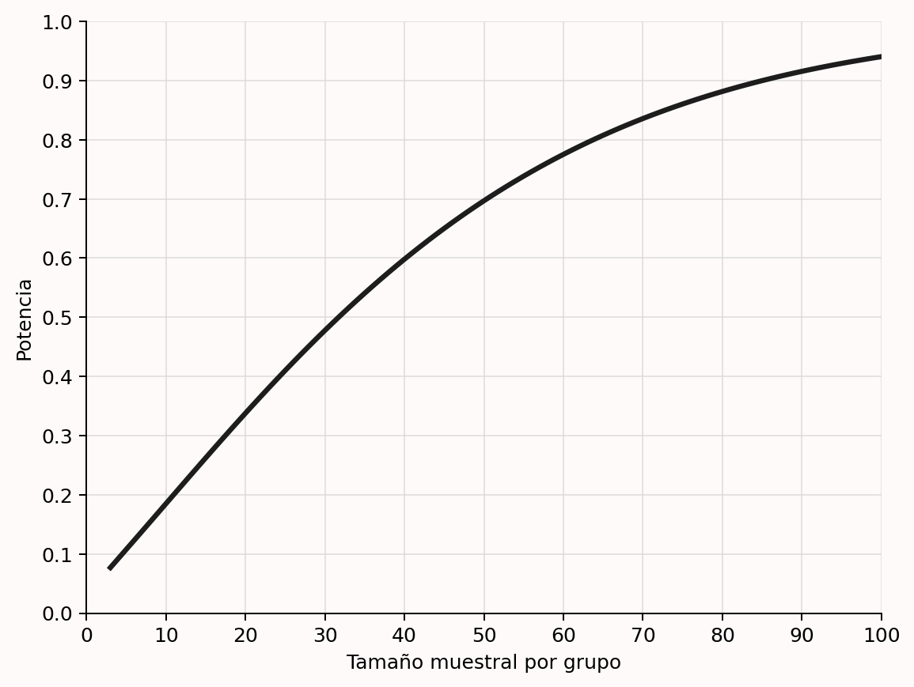{#fig-power-2}

Aunque sea habitual fijar el error de tipo I en el 5% y aspirar a una potencia del 80%, las tasas de error deben justificarse [@lakens_justify_2018]. Como se explicará al hablar del análisis de compromiso, la recomendación predeterminada del 80% carece de una base sólida. Cuanto menores sean los errores —y, por tanto, mayor la potencia—, más informativo será el estudio, pero también exigirá más recursos. Deben ponderarse cuidadosamente los costes de aumentar la muestra frente al beneficio de reducir los errores; en artículos que presentan un único estudio, esto probablemente haría más habituales potencias del 90% o 95%. Si se publicará una serie de estudios de replicación y extensión, la probabilidad de varios errores de tipo I será muy baja, pero aumenta la de obtener resultados mixtos aun existiendo un efecto [@lakens_too_2017]. También esto aconseja tasas bajas de tipo II, quizá elevando ligeramente alfa en cada estudio individual.

La @fig-power-3 representa dos distribuciones. La de la izquierda —línea discontinua— está centrada en 0 y modeliza la hipótesis nula. Si esta es verdadera, un resultado significativo aparecerá cuando el efecto sea lo bastante extremo en cualquiera de las dos direcciones, pero todo resultado significativo será un error de tipo I —áreas gris oscuro—. Si no existe un efecto verdadero, formalmente la potencia de una prueba de significación de la hipótesis nula no está definida: los significativos son falsos positivos que ocurren con la frecuencia fijada por alfa. La distribución de la derecha —línea continua— está centrada en *d* = 0.5 y representa la hipótesis alternativa especificada. Aun existiendo ese efecto, el estudio no siempre encontrará significación: por variación aleatoria, el observado puede quedar demasiado cerca de 0. Esos resultados son falsos negativos —área gris claro—. Al aumentar la muestra, las distribuciones se estrechan y disminuye la probabilidad de error de tipo II. Las figuras pueden reproducirse en esta [aplicación Shiny](http://shiny.ieis.tue.nl/d_p_power/).

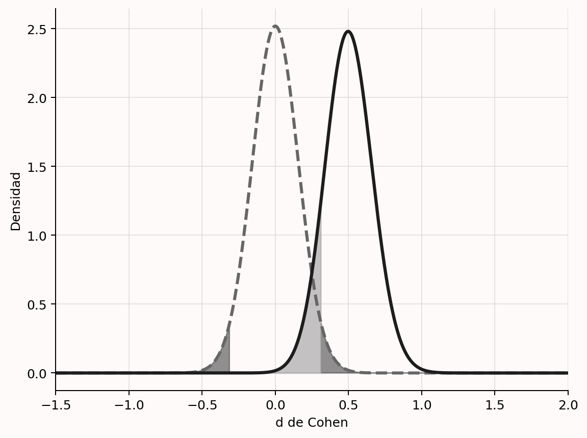{#fig-power-3}

Conviene subrayar que el objetivo de un análisis de potencia *a priori* **no** es alcanzar potencia suficiente para el verdadero tamaño del efecto, que se desconoce. El objetivo es lograrla bajo una *suposición concreta* acerca del efecto que se desea detectar. Del mismo modo que alfa es la probabilidad máxima de un error de tipo I condicionada a que la hipótesis nula sea cierta, el análisis de potencia se calcula suponiendo un tamaño del efecto específico. No sabemos si la suposición es correcta; solo podemos justificarla bien. Las inferencias basadas en una prueba que controla el error de tipo II están condicionadas a ese supuesto. Permiten afirmar que, si el efecto verdadero es al menos tan grande como el utilizado en el análisis, la probabilidad máxima de error de tipo II no supera el valor deseado.

Esto se aprecia mejor si consideramos un estudio que planifica potencia tanto para una prueba de *presencia* como de *ausencia* del efecto. Al diseñar un estudio es esencial admitir que podría no existir efecto alguno —por ejemplo, una diferencia de medias igual a cero—. Puede realizarse un análisis *a priori* para una prueba de significación y también para una prueba de ausencia de un efecto relevante, como una prueba de equivalencia que apoye estadísticamente la hipótesis nula rechazando efectos lo bastante grandes como para importar [@meyners_equivalence_2012; @lakens_equivalence_2017; @rogers_using_1993]. Cuando la misma muestra sustenta varias pruebas primarias, cada una necesita su propia justificación. Siempre que sea posible se recoge una muestra que haga informativas todas las pruebas, usando el mayor tamaño devuelto por los distintos análisis.

Por ejemplo, para detectar o rechazar *d* = 0.4 con una potencia del 90% y alfa = 0.05 en una prueba *t* independiente bilateral, se necesitan 133 participantes por condición para una prueba informativa de la hipótesis nula y 136 por condición para una prueba de equivalencia informativa. Por ello deberían recogerse 272 participantes en total. Esto no garantiza potencia suficiente para el efecto verdadero —que nunca puede conocerse—, pero sí bajo la suposición del efecto que interesa detectar o rechazar. El análisis *a priori* es útil siempre que puedan justificarse los efectos de interés.

Cuando se corrige alfa por contrastar varias hipótesis, el análisis debe utilizar el alfa corregido. Si se realizan cuatro pruebas, se desea una tasa global de tipo I del 5% y se aplica Bonferroni, el análisis debe basarse en alfa = .0125.

El análisis puede resolverse analíticamente o mediante simulaciones. Las soluciones analíticas son más rápidas, pero menos flexibles; para pruebas complejas o poco comunes, el software quizá no disponga de ellas. Las simulaciones permiten efectuar análisis de potencia para cualquier prueba [@morris_using_2019]. El código siguiente simula 10 000 pruebas *t* de una muestra contra cero, con *n* = 20 y un efecto verdadero *d* = 0.5. En cada iteración se generan datos bajo un mecanismo supuesto —normal con media 0.5 y desviación estándar 1— y se realiza la prueba. La proporción de resultados significativos estima la potencia.

```r
p <- numeric(10000)   # guardar los valores p
for (i in 1:10000) {  # simular 10 000 pruebas
  x <- rnorm(n = 20, mean = 0.5, sd = 1)
  p[i] <- t.test(x)$p.value # guardar el valor p
}
sum(p < 0.05) / 10000 # calcular la potencia
```

Existe una gran variedad de herramientas. Sea cual sea la elegida, aprender a usarla correctamente lleva tiempo. Hay libros completos [@aberson_applied_2019; @cohen_statistical_1988; @murphy_statistical_2014; @julious_sample_2004], introducciones generales [@maxwell_sample_2008; @brysbaert_how_2019; @perugini_practical_2018; @faul_gpower_2007; @baguley_understanding_2004] y cada vez más tutoriales para pruebas concretas [@debruine_understanding_2021; @lakens_simulationbased_2021; @green_simr_2016; @brysbaert_power_2018; @westfall_statistical_2014; @schoemann_determining_2017; @kruschke_bayesian_2013]. Es importante dominar los fundamentos, y aprender métodos basados en simulación puede resultar muy beneficioso. También suele recomendarse la ayuda de un especialista cuando falta experiencia con una prueba determinada.

Al informar de un análisis *a priori*, asegúrate de que sea completamente reproducible. Si se hizo en R, comparte el script y la versión del paquete. Muchos programas permiten exportar el análisis como PDF; en G\*Power, por ejemplo, puede hacerse en la pestaña «Protocolo del análisis de potencia». Si el programa no permite exportarlo, añade una captura a los materiales suplementarios.

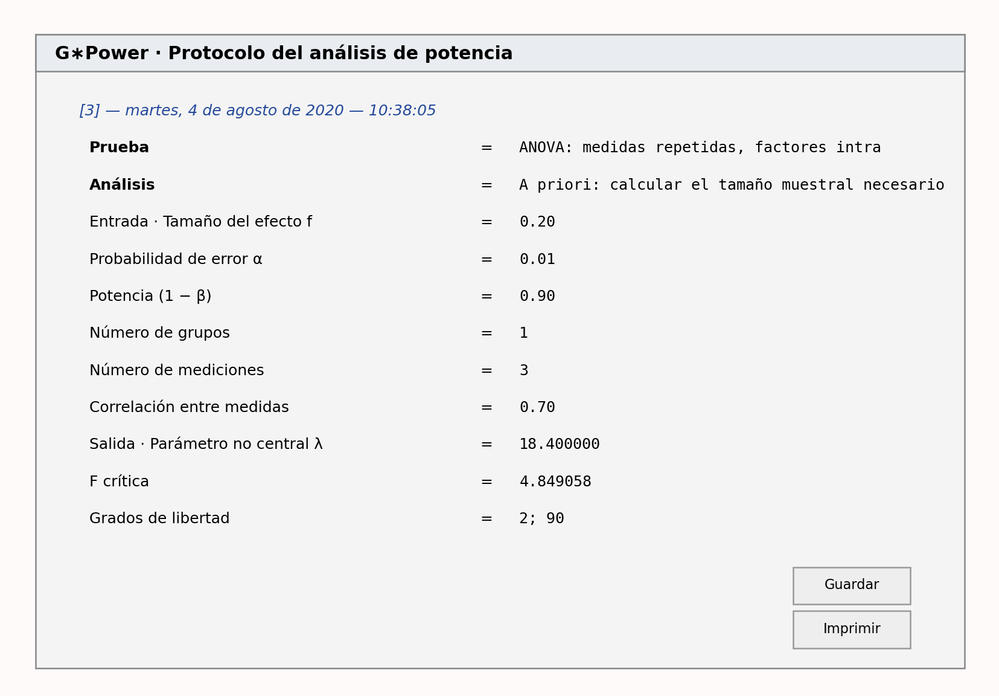{#fig-gpowprotocol}

El informe reproducible debe ir acompañado de las razones que justifican los valores utilizados. Si el tamaño del efecto procede de investigaciones previas, deben tratarse los factores de la @tbl-tablemetajust —si se basa en un metaanálisis— o de la @tbl-table-es-just —si procede de un único estudio—. Cuando la estimación se basa en la literatura, incluye la referencia completa y, preferiblemente, una cita directa del artículo. Si se utiliza el menor tamaño del efecto de interés, no basta con declararlo: hay que justificarlo mediante predicciones teóricas o consecuencias prácticas [@lakens_equivalence_2018]. La @tbl-table-pow-rec-2 resume todo lo que debe comunicarse.

| Qué debe tenerse en cuenta | Cómo tenerlo en cuenta |
|---|---|
| Enumerar todos los análisis primarios previstos | Especifique los contrastes en los que deben controlarse los errores de tipo I y II. |
| Especificar alfa para cada análisis | Enumere y justifique la tasa de tipo I y corrija las comparaciones múltiples cuando sea necesario. |
| ¿Cuál es la potencia deseada? | Enumere y justifique la potencia —o la tasa de error de tipo II— de cada análisis. |
| Especificar métrica, magnitud y justificación del efecto | Indique, por ejemplo, *d* o *f* de Cohen, el valor concreto y si procede del menor efecto de interés, un metaanálisis, un estudio previo u otra fuente. |
| Considerar que la hipótesis nula sea verdadera | Analice la potencia de la prueba destinada a examinar la ausencia de un efecto relevante —por ejemplo, una prueba de equivalencia—. |
| Garantizar la reproducibilidad | Incluya el código o un informe con todos los detalles del análisis realizado. |

: Recomendaciones para informar de un análisis de potencia *a priori*. {#tbl-table-pow-rec-2}

## Planificación de la precisión {#planprecision}

Algunos investigadores proponen justificar el tamaño muestral mediante el grado de precisión deseado [@cumming_introduction_2016; @maxwell_sample_2008; @kruschke_rejecting_2018]. El objetivo consiste en recoger datos hasta obtener un intervalo de confianza de la anchura deseada alrededor de la estimación de un parámetro. Esa anchura depende de la desviación estándar y del número de observaciones. Para justificar una muestra basada en la precisión hay que explicar la anchura deseada en relación con el objetivo inferencial y el supuesto sobre la desviación estándar poblacional.

Si se ha fijado la precisión y se dispone de una buena estimación de la desviación estándar verdadera, calcular la muestra resulta sencillo. Al medir el CI de un grupo, por ejemplo, podría desearse estimar la puntuación con un margen de error de 2 puntos para el 95% de las medias observadas a largo plazo. Suponiendo datos normales, el tamaño necesario es:

$$N = \left(\frac{z \cdot sd}{error}\right)^2$$

donde *N* es el número de observaciones, *z* el valor crítico del intervalo deseado, *sd* la desviación estándar poblacional y *error* la distancia dentro de la cual debe caer la media con la tasa de error elegida. En el ejemplo, $(1.96 \times 15 / 2)^2 = 216.1$, por lo que deben recogerse 217 observaciones. Para una diferencia de medias distinta de cero se utiliza una distribución *t* no central. Es necesario aportar un efecto esperado, aunque influye relativamente poco en la muestra [@maxwell_sample_2008]. También puede incorporarse la incertidumbre sobre el efecto, lo que se conoce como *assurance* o garantía [@kelley_sample_2006]. El paquete `MBESS` de R calcula tamaños muestrales para numerosas pruebas [@kelley_confidence_2007].

Más difícil es justificar cómo se relaciona la precisión con los objetivos inferenciales. No existe literatura que indique qué anchura elegir. Morey [-@morey_power_2020] argumenta convincentemente que la mayoría de los usos prácticos de la planificación de la precisión persiguen distinguir el efecto observado de otros valores —para una perspectiva bayesiana, véase @kruschke_rejecting_2018—. Un investigador podría esperar *r* = 0.4 y tratar de manera diferente correlaciones que se aparten más de 0.2 —es decir, 0.2 < *r* < 0.6—: efectos de *r* = 0.6 o superiores se considerarían demasiado grandes para el mecanismo supuesto [@hilgard_maximal_2021], y menores de *r* = 0.2, demasiado pequeños para apoyar la predicción. Si el objetivo es estimar con precisión suficiente para diferenciar dos efectos con alta probabilidad, en realidad se trata de una prueba de hipótesis, que requiere potencia suficiente para rechazarlos —por ejemplo, contrastar una predicción de rango entre 0.2 y 0.6—.

Si no se quiere contrastar una hipótesis, quizá porque se prefiere estimar, y faltan directrices claras, una solución es recurrir a una norma ampliamente aceptada de precisión. Podría basarse en una resolución por debajo de la cual las mediciones de un campo ya no cambian de forma apreciable las inferencias. Igual que se usa normativamente alfa = 0.05, podrían diseñarse estudios para alcanzar una anchura convencional del intervalo. Se necesita más trabajo para ayudar a elegirla —véase también la sección sobre intervalos en pruebas bayesianas de [predicciones de rango](04-estadistica-bayesiana.html#sec-whichinterval)—.

La visualización interactiva permite explorar la muestra necesaria para estimar con precisión una correlación. Piensa primero qué precisión considerarías suficiente. Si la correlación verdadera es 0.3, ¿qué anchura preferirías? Con 50 observaciones, el intervalo va de *r* = 0.024 a *r* = 0.534. ¿Aporta suficiente valor para justificar la recogida? Si todos los implicados ya creen firmemente que el valor cae en ese rango, los datos no enseñarán nada nuevo. Cambia a «precisión → *n*» y fija una anchura deseada —por ejemplo, 0.2, que produce un intervalo de *r* = 0.197 a *r* = 0.397—. Sigue siendo amplio, pero probablemente aumente el conocimiento. Explora qué muestras hacen falta para estrecharlo más y qué intervalos cabe esperar cuando la correlación verdadera se acerca a −1 o 1.

::: {.content-visible when-format="html"}

```{=html}
<iframe id="prec-cor-iframe"
        src="prec_cor_app_book.html"
        width="100%"
        height="600"
        scrolling="no"
        style="border:none;display:block;margin:1.5rem 0;overflow:hidden;"
        title="Planificación de la precisión de una correlación">
</iframe>
<script>
window.addEventListener('message', function(e) {
  if (e.data && typeof e.data.iframeHeight === 'number') {
    var f = document.getElementById('prec-cor-iframe');
    if (f && e.source === f.contentWindow) f.style.height = e.data.iframeHeight + 'px';
  }
});
</script>
```

:::

::: {.content-visible unless-format="html"}

*La edición en línea incluye una versión interactiva de esta simulación.*

:::

## Heurísticos

Cuando se emplea un heurístico, el investigador no justifica por sí mismo el tamaño muestral, sino que confía en una recomendación de alguna autoridad. Cuando comencé el doctorado en 2005, era habitual recoger 15 participantes en cada condición entre sujetos. Nadie sabía muy bien por qué, pero se confiaba en que habría una justificación en algún lugar de la literatura. Ahora sé que los heurísticos que utilizábamos carecían de ella. Como ya observó Berkeley [-@berkeley_defence_1735]: «Los hombres aprenden de otros los elementos de la ciencia; y todo aprendiz muestra mayor o menor deferencia hacia la autoridad, especialmente los jóvenes, pocos de los cuales se detienen mucho en los principios y prefieren aceptarlos por confianza. Las cosas admitidas pronto se vuelven familiares por repetición, y esa familiaridad acaba pasando por evidencia».

Algunos artículos ofrecen reglas sencillas sobre cuántas observaciones recoger. Cubren una necesidad y reciben muchas citas, aun cuando el consejo sea defectuoso. @wilsonvanvoorhis_understanding_2007, por ejemplo, convierten el *mínimo* absoluto de 50 + 8 observaciones para regresión examinado por @green_how_1991 en la recomendación de recoger unas 50. Green concluyó en realidad que «ningún número mínimo específico de sujetos ni ninguna razón mínima entre sujetos y predictores recibió apoyo». Sí señaló que *N* = 50 + 8 ofrecía un mínimo adecuado para el estudio «típico» de ciencias sociales, porque supuestamente tenía un efecto «medio», citando a Cohen (1988). Pero Cohen no afirmó que el estudio típico tuviera ese efecto; escribió que «muchos de los efectos buscados en la investigación de personalidad, social y clínica probablemente sean efectos pequeños según la definición empleada aquí». Una cadena de citas erróneas termina así en una regla engañosa.

Las reglas de este tipo parecen surgir sobre todo de citas incorrectas o recomendaciones excesivamente simplistas. Simonsohn, Nelson y Simmons [-@simmons_falsepositive_2011] recomendaron que «los autores deben recoger al menos 20 observaciones por celda». Una recomendación posterior de los mismos autores proponía *n* > 50 salvo que se estudiasen efectos grandes [@simmons_life_2013]. Por desgracia, hoy se cita a menudo como justificación para recoger **como máximo** 50 observaciones por condición, sin considerar el efecto esperado. Si se justifica una muestra concreta —por ejemplo, *n* = 50— apelando a una recomendación general, o se está citando mal el artículo o el artículo es defectuoso.

Otro heurístico común consiste en igualar la muestra de un estudio anterior. No se recomienda en disciplinas con sesgo de publicación generalizado o donde se publican hallazgos novedosos y sorprendentes de estudios únicos, en gran medida exploratorios. Solo es válido si la justificación del estudio anterior también se aplica al actual. En lugar de decir que se recogerá la misma muestra, hay que repetir la justificación y actualizarla con la información nueva —por ejemplo, el efecto del estudio previo; véase la @tbl-table-es-just—.

Revisores y editores deben examinar con cuidado estas reglas, porque pueden hacer parecer informativo un estudio que no lo será. Ante una justificación heurística, pregúntate: «¿Por qué se utiliza esta regla?». Hay que conocer su lógica para saber si es válida en una situación concreta. En la mayoría de los casos la lógica es débil y la aplicabilidad limitada. Aun así, un campo podría desarrollar heurísticos válidos. Podría acordar, por ejemplo, que los efectos menores que *d* = 0.3 carecen de interés y usar diseños secuenciales con un 90% de potencia para detectarlos; o decidir que los datos deben alcanzar cierta precisión con independencia del efecto verdadero. En esos casos existirían reglas fundadas en objetivos compartidos. @simonsohn_small_2015 propone que las replicaciones tengan muestras 2.5 veces mayores que el estudio original, lo que proporciona un 80% de potencia para una prueba de equivalencia cuyo límite se fija en el efecto que el original tenía un 33% de potencia para detectar, suponiendo un efecto verdadero nulo. Como los autores rara vez especifican qué efecto falsaría su hipótesis, el enfoque de los «telescopios pequeños» constituye un buen punto de partida para rechazar un efecto tan grande como el descrito. Es responsabilidad del investigador distinguir los heurísticos válidos de los mecánicos y juzgar si producirán un resultado informativo para el objetivo del estudio.

## Sin justificación

Puede sonar a *contradictio in terminis*, pero conviene distinguir una última categoría en la que se declara explícitamente que no existe justificación para el tamaño muestral. Quizá había recursos para recoger más datos, pero no se utilizaron. Podría haberse realizado un análisis de potencia o planificado la precisión, pero no se hizo. En lugar de fingir una razón, la honestidad exige reconocerlo. Esto no es necesariamente malo. Todavía puede discutirse el menor tamaño del efecto de interés, el efecto mínimo estadísticamente detectable, la anchura del intervalo de confianza y un análisis de sensibilidad en relación con la muestra recogida. Si no había objetivos inferenciales específicos, esa evaluación puede basarse en los objetivos razonables que tendrían otros científicos al conocer la existencia de los datos.

No construyas una historia que presente como muy informativo un estudio que no lo fue. Evalúa con transparencia qué información aportó para los tamaños del efecto relevantes y asegúrate de que las conclusiones se desprendan de los datos. La falta de una justificación quizá no sea problemática, pero puede significar que el estudio no fue informativo para la mayoría de los efectos de interés, lo que dificulta especialmente interpretar resultados no significativos o estimaciones con gran incertidumbre.

## ¿Cuál es tu objetivo inferencial?

El objetivo inferencial de la recogida suele relacionarse de algún modo con el tamaño del efecto. Para diseñar un estudio informativo conviene pensar qué efectos interesan. Al determinar la muestra resulta útil considerar tres: el menor efecto de interés, el menor que podría ser estadísticamente significativo —solo si se realizará una prueba de significación— y el efecto esperado. También pueden evaluarse rangos de efectos: calcular la anchura esperada del intervalo de confianza alrededor de un valor —por ejemplo, cero— y examinar cuáles podrían rechazarse; representar una curva de sensibilidad para ver qué rango tiene una potencia razonable y para cuál es baja; o considerar el rango que probablemente se observe en un área determinada.

## ¿Cuál es el menor tamaño del efecto de interés?

La justificación más sólida se basa en declarar explícitamente el menor efecto considerado interesante. Puede derivarse de predicciones teóricas o de consideraciones prácticas. Para ensayos controlados aleatorizados, véanse @cook_assessing_2014 y @keefe_defining_2013; para revisiones de distintos métodos, @king_point_2011 y @copay_understanding_2007; y para una discusión centrada en psicología, @lakens_equivalence_2018.

Determinarlo puede resultar difícil cuando las teorías están poco desarrolladas o la pregunta queda lejos de aplicaciones prácticas, pero aun así merece la pena pensar qué efectos serían demasiado pequeños para importar. Un primer paso es discutirlo con colegas de la misma línea. Los investigadores difieren en qué magnitudes consideran suficientemente grandes [@murphy_statistical_2014]. Del mismo modo que no todos encuentran interesante la misma pregunta, tampoco consideran relevantes los mismos efectos, y los distintos grupos implicados pueden discrepar [@kelley_effect_2012].

Pese a la dificultad, especificar ese valor aporta ventajas importantes. El efecto poblacional siempre es incierto —estimarlo suele ser precisamente uno de los objetivos—, por lo que, si se planifica para un efecto esperado, no sabemos si la potencia bastará para el efecto verdadero. En cambio, si el menor efecto de interés se concreta y se acuerda tras una reflexión cuidadosa, puede diseñarse el estudio con potencia suficiente para detectarlo o rechazarlo con una tasa de error conocida. Aunque el umbral sea subjetivo —una persona puede considerar irrelevante *d* < 0.3 y otra interesarse aún por *d* < 0.1— y haya incertidumbre en los parámetros de una valoración coste-beneficio, una vez fijado es posible controlar el error de tipo II para ese valor. Por ello, siempre que pueda especificarse, se prefiere un análisis *a priori* basado en el menor efecto de interés [@brown_errors_1983; @aberson_applied_2019; @albers_when_2018; @cascio_open_1983; @dienes_using_2014; @lenth_practical_2001].

## El efecto mínimo estadísticamente detectable {#sec-minimaldetectable2}

El [efecto mínimo estadísticamente detectable](02-control-de-errores.html#sec-minimaldetectable1) es el menor tamaño del efecto que, de observarse, produciría un valor *p* estadísticamente significativo [@cook_assessing_2014]. La @fig-power-effect1 representa la distribución de *d* de Cohen con 15 participantes por grupo cuando el efecto verdadero es *d* = 0 o *d* = 0.5. Es similar a la @fig-power-3, pero añade la *d* crítica. Con una muestra tan pequeña solo serán significativos los efectos observados superiores a *d* = 0.75. Hay que considerar y justificar con cuidado si esos efectos son interesantes y realistas.

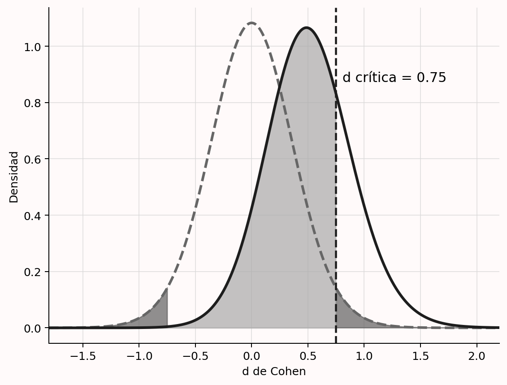{#fig-power-effect1}

Calcular este efecto mínimo es útil cuando no se realizó un análisis *a priori*, tanto al evaluar estudios publicados sin justificación [@lakens_equivalence_2018] como cuando se emplearon heurísticos.

Pregúntate si el efecto crítico del diseño cae dentro del rango que cabe esperar de manera realista. Si no es así, un resultado significativo publicado implica que el efecto es sorprendentemente grande o, más probablemente, que la estimación está sesgada al alza. Con sesgo de publicación, los trabajos publicados producirán estimaciones sesgadas. Si aún puedes aumentar la muestra —por ejemplo, dejando de aplicar una regla y realizando un análisis *a priori*—, hazlo. Si no puedes por falta de recursos, el efecto mínimo debería dejar claro que la interpretación no debe centrarse en valores *p*, sino en la magnitud y su intervalo de confianza —véase la @tbl-table-pow-rec—.

También conviene calcularlo cuando el análisis de potencia sea «optimista». Si el mejor escenario es *d* = 0.57 y se usa esa expectativa, con 50 observaciones en un diseño de dos grupos independientes no serán significativos los efectos menores que *d* = 0.4. Si el peor escenario bajo la alternativa es *d* = 0.35, el diseño no permitirá declarar significativos efectos próximos a él. Tener presente el mínimo detectable obliga a preguntarse si la prueba responderá de manera informativa y si la forma de justificar la muestra —regla general o restricciones— conduce a un estudio útil.

## ¿Cuál es el tamaño del efecto esperado?

Aunque el efecto poblacional verdadero siempre se desconoce, a veces existe una expectativa razonable que se desea utilizar en un análisis *a priori*. Incluso cuando sea en buena parte una conjetura, explicitar qué efectos se esperan resulta útil. Puede justificarse una muestra mediante el efecto esperado aunque el estudio no sea muy informativo respecto al menor efecto de interés. Entonces será informativo para un objetivo —comprobar la presencia o ausencia del efecto esperado—, pero no tanto para el segundo —hacer lo mismo con el menor efecto relevante—.

Las expectativas suelen proceder de tres fuentes: un metaanálisis, un estudio anterior o un modelo teórico. Es tentador ser demasiado optimista, porque las estimaciones grandes exigen muestras menores, pero ese optimismo aumenta la probabilidad de falsos negativos. Al revisar una justificación debe evaluarse críticamente la base del efecto esperado utilizado.

## Usar una estimación de un metaanálisis

En un mundo perfecto, un metaanálisis proporcionaría la información más precisa sobre el efecto esperable. Sin embargo, el sesgo de publicación hace que sus estimaciones no siempre sean exactas y que, en ocasiones, estén muy sesgadas. Además, suele existir heterogeneidad considerable: el efecto metaanalítico difiere entre subconjuntos de estudios. Por ello, hay que extremar la cautela antes de introducirlo en un análisis de potencia.

Deben considerarse tres aspectos —@tbl-tablemetajust—. Primero, los estudios del metaanálisis han de ser lo bastante similares al estudio previsto como para esperar un efecto semejante; esto exige evaluar su generalización y las diferencias en manipulación, medida, población y demás variables relevantes. Segundo, hay que comprobar la homogeneidad. Si existe heterogeneidad sustancial, no cabe esperar el mismo efecto verdadero en todos los estudios y debe usarse la estimación del subconjunto que mejor represente el diseño previsto. Incluso las replicaciones directas pueden ser heterogéneas si variables no medidas moderan el efecto [@kenny_unappreciated_2019; @olsson-collentine_heterogeneity_2020]; seleccionar estudios similares aumenta la probabilidad de acertar, pero no ofrece garantías. Tercero, la estimación no debe estar sesgada. Comprueba si se aplicaron métodos actuales de detección o utiliza varios por tu cuenta [@carter_correcting_2019], y considera estimaciones corregidas, reconociendo que también pueden estar sesgadas y no reflejar el verdadero efecto metaanalítico.

| Qué debe tenerse en cuenta | Cómo tenerlo en cuenta |
|---|---|
| ¿Son similares los estudios del metaanálisis? | Compare diseño, medidas y población con el estudio previsto y evalúe la generalización de la estimación. |
| ¿Son homogéneos? | Si existe heterogeneidad, use el efecto metaanalítico del subconjunto homogéneo más pertinente. |
| ¿La estimación está libre de sesgo? | Revise las pruebas de sesgo y, si procede, use una estimación más conservadora corregida, reconociendo sus límites. |

: Recomendaciones para justificar una estimación metaanalítica en un análisis de potencia. {#tbl-tablemetajust}

## Usar una estimación de un estudio anterior

Si no hay metaanálisis, suele recurrirse a un efecto observado anteriormente. Lo primero es comprobar que ambos estudios sean suficientemente similares. Deben valorarse diferencias de población, diseño, manipulación, medidas u otros factores que hagan esperar una magnitud distinta. La variabilidad intraindividual del tiempo de reacción aumenta con la edad, de modo que cabe esperar un efecto estandarizado menor en personas mayores. Una manipulación más sutil que la anterior también debería producir un efecto menor. Además, los tamaños del efecto no se generalizan entre diseños: el de una comparación entre grupos normalmente no coincide con el de una interacción en un estudio posterior que añade otro factor [@lakens_simulationbased_2021].

Incluso cuando los estudios son similares, los estadísticos advierten contra el uso de pequeños estudios piloto. Leon, Davis y Kraemer [-@leon_role_2011] escriben:

> Al contrario de lo que dicta la tradición, un estudio piloto no proporciona una estimación significativa del tamaño del efecto para planificar estudios posteriores, debido a la imprecisión inherente a los datos de muestras pequeñas.

Hay dos problemas principales: la variación aleatoria separa el efecto observado del poblacional y el sesgo de publicación infla las estimaciones. La @fig-followupbias muestra la distribución de $\eta_p^2$ en un estudio de tres condiciones y 25 participantes por condición cuando la hipótesis nula es verdadera —curva gris discontinua— y cuando existe un efecto «medio» verdadero de $\eta_p^2$ = 0.0588 —curva negra continua; @richardson_eta_2011—. El efecto crítico es aproximadamente 0.08. Si la nula es cierta, los valores superiores son errores de tipo I —gris oscuro—; bajo la alternativa, los inferiores son errores de tipo II —gris claro—. Todos los resultados significativos superan el efecto verdadero, por lo que un análisis de potencia basado en un hallazgo significativo —por ejemplo, porque solo esos se publican— sobrestimará la magnitud.

Incluso con acceso a todos los efectos, la variación aleatoria puede producir $\eta_p^2$ = 0.01 en un piloto pequeño aunque el valor verdadero sea 0.0588. Introducir 0.01 sugeriría una muestra total de 957 observaciones para obtener un 80% de potencia. Si solo se continúan los pilotos cuyo efecto permite una muestra posterior viable, las estimaciones seleccionadas estarán sesgadas al alza y la potencia real será sistemáticamente inferior a la deseada [@albers_when_2018].

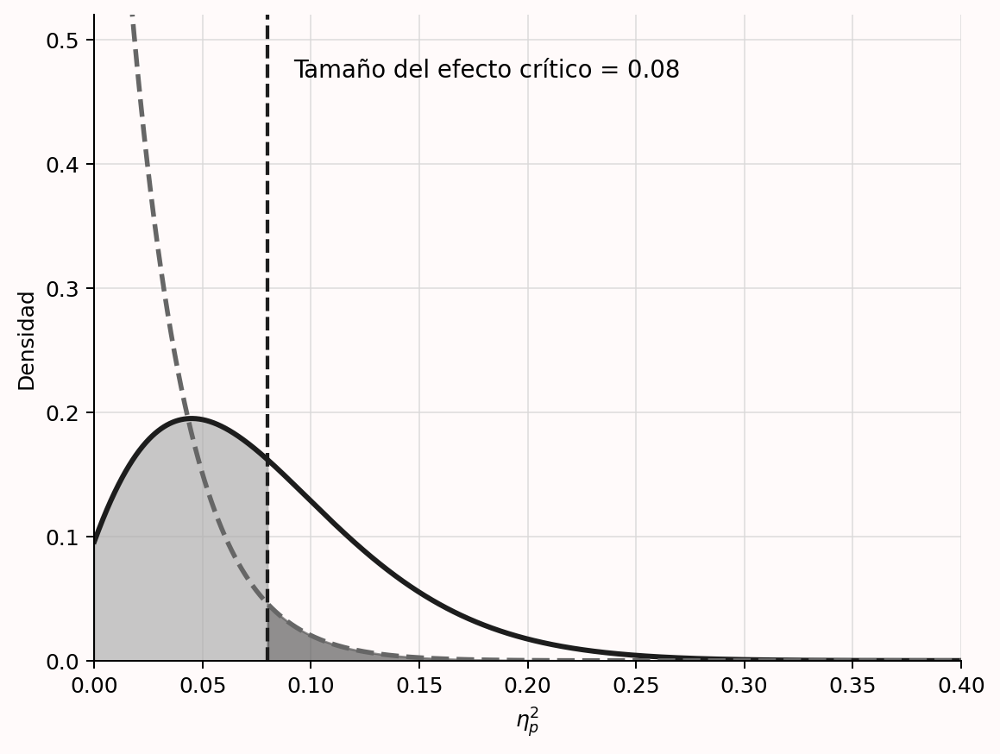{#fig-followupbias}

El problema esencial es que, por sesgo de publicación o de seguimiento, los efectos usados no proceden de una distribución *F* completa, sino de una *F truncada* [@taylor_bias_1996]. Con sesgo extremo, en el ejemplo solo serían accesibles estudios con $\eta_p^2$ > 0.08 y resultado significativo. Es posible calcular una estimación corregida bajo ciertos supuestos. Imaginemos un ANOVA de un factor con tres condiciones que informa *F*(2, 42) = 4.5 y $\eta_p^2$ = 0.176. Tomado literalmente, el análisis sugeriría 17 observaciones por condición para una potencia del 80%.

Si se supone que existe sesgo, el paquete `BUCSS` [@anderson_samplesize_2017] intenta corregirlo. Bajo un modelo específico en el que solo se publican resultados significativos de una *F* truncada, el ejemplo aconseja 73 participantes por condición. A veces la estimación corregida del parámetro de no centralidad es cero y el método no puede aplicarse. Otra alternativa es usar una estimación conservadora, como el límite inferior de un intervalo bilateral del 60%, lo que @perugini_safeguard_2014 denominan *potencia de salvaguarda*. Ambos enfoques son más conservadores, no necesariamente más exactos. No es posible hacer un análisis preciso a partir de un estudio pequeño o potencialmente sesgado [@teare_sample_2014]. Cuando tampoco puede especificarse un menor efecto de interés y la expectativa es muy incierta, un diseño secuencial puede ser más eficiente.

En resumen, el efecto de un estudio previo puede usarse si se cumplen tres condiciones —@tbl-table-es-just—: el estudio es suficientemente parecido, el riesgo de sesgo es bajo —por ejemplo, procede de un informe registrado— y la muestra permite una estimación relativamente precisa, atendiendo a la anchura del intervalo del 95%. Siempre hay incertidumbre; introducir en el análisis los límites superior e inferior del intervalo ayuda a valorar sus consecuencias.

| Qué debe tenerse en cuenta | Cómo tenerlo en cuenta |
|---|---|
| ¿Es el estudio suficientemente similar? | Examine diferencias de población, diseño, manipulaciones, medidas y cualquier otro factor que haga esperar un efecto distinto. |
| ¿Existe riesgo de sesgo? | Pregúntese si una estimación menor no se habría usado o publicado y compare el efecto informado con uno corregido al calcular la potencia. |
| ¿Cuánta incertidumbre existe? | Las muestras pequeñas producen gran incertidumbre. Considere una estimación más conservadora, como en la potencia de salvaguarda. |

: Recomendaciones para justificar el uso del efecto estimado en un único estudio. {#tbl-table-es-just}

## Usar una estimación de un modelo teórico

Si el modelo teórico es lo bastante específico como para construir uno computacional y se conocen los parámetros relevantes para los datos previstos, puede derivarse de él una estimación del tamaño del efecto. Si se dispusiera de hipótesis sólidas sobre los pesos de los rasgos que dos estímulos comparten o no, por ejemplo, podrían predecirse juicios de semejanza con el modelo de contraste de Tversky [@tversky_features_1977] y estimarse las diferencias entre condiciones. Aunque los modelos que producen predicciones puntuales aún son poco comunes, cuando existen ofrecen una justificación sólida del efecto esperado.

## Calcular la anchura del intervalo de confianza del tamaño del efecto

Si puede estimarse la desviación estándar de las observaciones, también puede calcularse *a priori* la anchura del intervalo de confianza del 95% alrededor del efecto [@kelley_confidence_2007]. Los intervalos son rangos suficientemente amplios para que, a largo plazo, el parámetro poblacional verdadero quede dentro de ellos el $100 - \alpha$ por ciento de las veces. En un estudio concreto el valor está dentro o fuera, pero a largo plazo podemos *actuar* como si el intervalo lo incluyera, manteniendo presente la tasa de error. Cumming [-@cumming_understanding_2013] denomina margen de error a la distancia entre el efecto observado y cada límite del intervalo.

Con 15 observaciones por condición en una prueba *t* independiente, el intervalo del 95% alrededor de *d* = 0 va de −0.716 a 0.716 [@smithson_confidence_2003]. La [aplicación Shiny MOTE](https://www.aggieerin.com/shiny-server/) permite calcular estos intervalos. El margen de error es 0.716. Un estimador bayesiano con una previa no informativa obtendría un intervalo creíble con límites iguales o muy similares [@albers_credible_2018; @kruschke_bayesian_2011] y podría concluir que el rango plausible de efectos poblacionales es demasiado amplio para resultar informativo. Sea cual sea la filosofía estadística, con 15 observaciones por grupo aprenderemos poco.

Una interpretación útil pregunta qué efectos podrían rechazarse si el verdadero fuese cero. Valores cercanos a *d* = 0.7 corresponden a hallazgos como «las personas se vuelven agresivas cuando se las provoca», «prefieren a su propio grupo» o «las parejas se parecen en atractivo físico» [@richard_one_2003]. La anchura indica que solo podríamos rechazar efectos tan grandes que probablemente ya los habríamos advertido. Si los efectos habituales son mucho menores, un estudio con *n* = 15 quizá no enseñe nada nuevo. En muestras grandes que permiten rechazar, por ejemplo, efectos superiores a *d* = 0.2 cuando la nula es cierta, muchos colegas considerarían informativo el estudio.

El margen de error —0.716— es casi, pero no exactamente, el efecto mínimo detectable —*d* = 0.748—, porque el intervalo se calcula a partir de la distribución *t*. Para un efecto no nulo se utiliza una *t* no central y el intervalo es asimétrico. La @fig-noncentralt muestra una distribución simétrica centrada en cero y dos asimétricas con parámetros de no centralidad 2 y 3. La asimetría se ve mejor con cinco grados de libertad, pero persiste en muestras mayores. Un efecto verdadero *d* = 0.5 con 15 observaciones por grupo produce $d_s$ = 0.50, IC del 95% [−0.23; 1.22]. Alrededor del efecto crítico se obtiene $d_s$ = 0.75, IC del 95% [0.00; 1.48], en consonancia con la relación entre el intervalo y el valor *p*: el intervalo excluye cero cuando la prueba es significativa. Los distintos enfoques para valorar la informatividad se basan, a menudo, en la misma información.

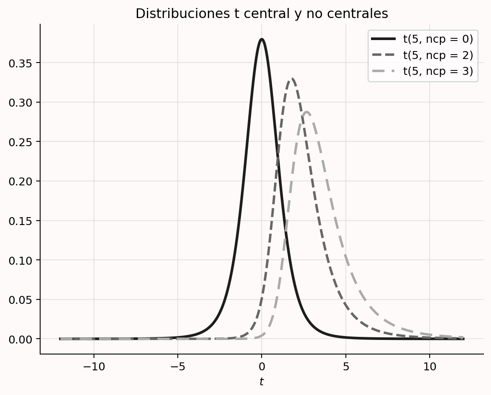{#fig-noncentralt}

## Representar un análisis de sensibilidad de la potencia

Un análisis de sensibilidad fija la muestra, la potencia deseada y alfa, y responde qué efecto podría detectar el estudio con esa potencia. Se realiza, por tanto, cuando la muestra ya se conoce: porque los datos se recogieron para otra pregunta, proceden de una base existente, no se reflexionó previamente sobre el tamaño o los recursos limitan la muestra futura. En todos esos casos permite juzgar la potencia para efectos plausibles y relevantes, incluido el menor efecto de interés y el esperado.

Supongamos 30 observaciones en total, 15 por condición entre sujetos. La @fig-gsens0 muestra un análisis en G\*Power con alfa = 5% y potencia deseada del 90%. El diseño puede detectar con esa potencia efectos de al menos *d* = 1.23. Si el investigador considera que el 90% es muy exigente y aceptaría una potencia menor, puede representar una curva para tamaños más pequeños.

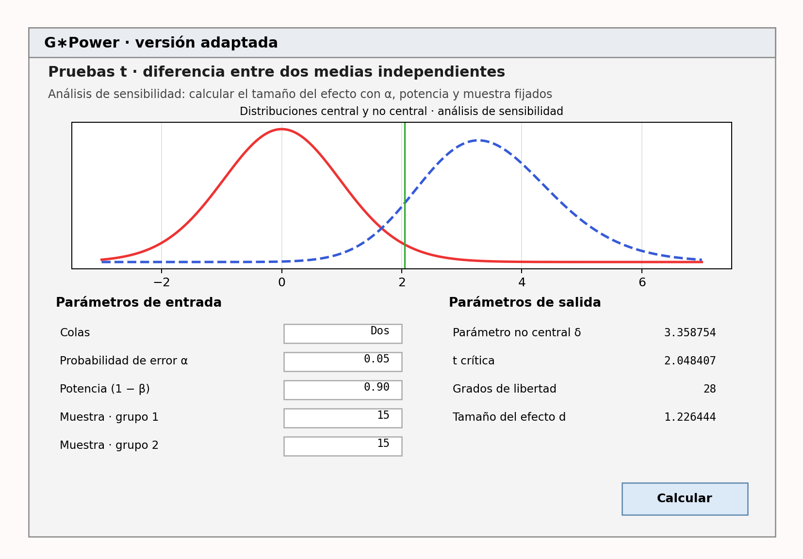{#fig-gsens0}

Las dos dimensiones son el tamaño del efecto y la potencia para observar significación si ese efecto existe. Fijada la muestra, pueden representarse en una curva. En G\*Power se obtiene con el botón «Gráfico X–Y para un rango de valores», como en la @fig-gsens1. Así puede examinarse la potencia para un rango plausible *a priori* o qué magnitudes ofrecen niveles razonables. En análisis por simulación se repite el cálculo para diversos efectos. Incluso si se acepta un 50% de potencia —una regla decisoria muy ruidosa ante resultados no significativos—, la figura muestra un diseño con potencia extremadamente baja para muchos efectos razonables. El análisis permite descubrir que es poco probable obtener significación para el rango esperable.

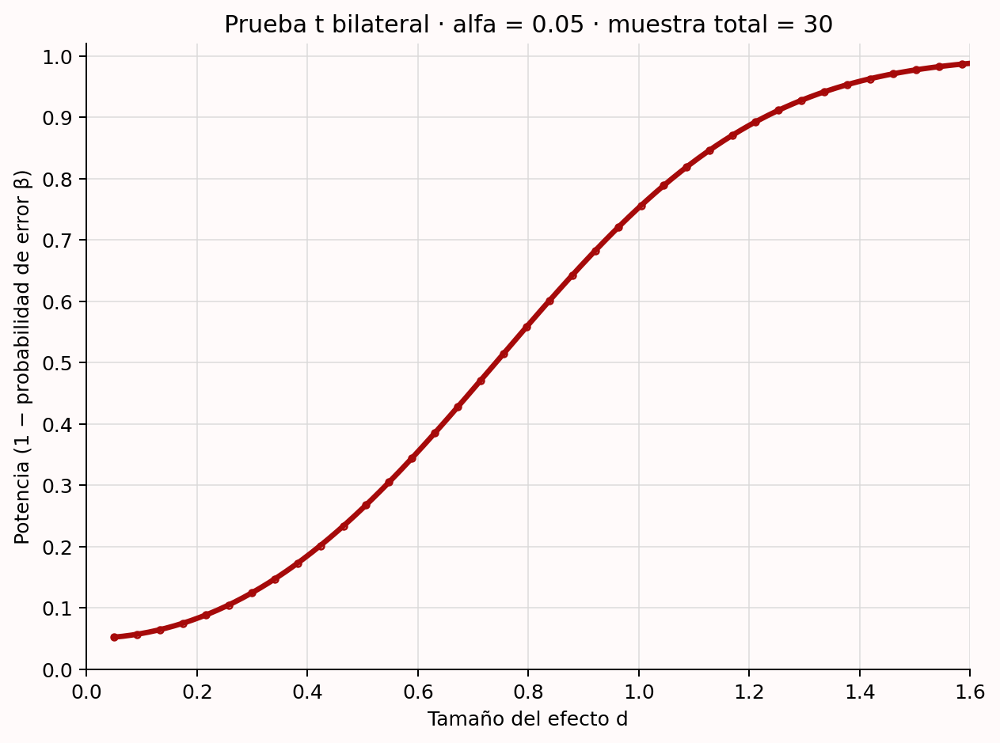{#fig-gsens1}

Con más observaciones, la valoración podría ser positiva. Con 150 por grupo, quizá habría potencia suficiente para el rango más interesante y aproximadamente un 50% incluso para efectos bastante pequeños. Para que la sensibilidad tenga sentido, la curva debe compararse con el menor efecto de interés o con un rango esperado. No hay puntos de corte claros [@bacchetti_current_2010]; se trata de ponderar de manera global los efectos plausibles o relevantes y la potencia asociada.

## La distribución de tamaños del efecto en un área de investigación

Por mi experiencia, el valor que más se introduce en un análisis *a priori* para una prueba *t* independiente es el efecto «medio» de Cohen, debido al *efecto predeterminado*: al abrir G\*Power, es la opción inicial. Los puntos de referencia de Cohen para efectos pequeños, medios y grandes no deben usarse en un análisis de potencia [@cook_assessing_2014; @correll_avoid_2020], y el propio Cohen lamentó haberlos propuesto [@funder_evaluating_2019]. La diversidad de temas hace improbable que cualquier valor por defecto corresponda con la situación concreta y puede producir una muestra muy desalineada con la pregunta.

Se han propuesto otros valores. Brysbaert [-@brysbaert_how_2019] recomienda *d* = 0.4 en psicología, promedio observado en proyectos de replicación y metaanálisis. No sabemos si es realista y existe enorme heterogeneidad entre campos y preguntas. Otros autores sugieren redefinir los puntos de referencia según la distribución de efectos de un campo [@bosco_correlational_2015; @hill_empirical_2008; @kraft_interpreting_2020; @lovakov_empirically_2021; @funder_evaluating_2019]. Siempre debe examinarse el posible sesgo de publicación. Dada la gran variación interna, elegir un efecto pequeño, medio o grande a partir de esa distribución resulta poco útil para calcular potencia.

Conocer la distribución sí ayuda a interpretar un intervalo. Si casi ningún efecto del área supera el que el diseño podría rechazar en una prueba de equivalencia —por ejemplo, solo valores mayores que *d* = 0.7 cuando se observa cero—, es improbable *a priori* que recoger datos enseñe algo que no sepamos.

Más difícil es defender un valor específico de esa distribución como base del análisis *a priori*. Puede ser mejor que una conjetura al azar, pero no constituye una justificación suficientemente fuerte. Llega un momento en que hay que admitir que no se está preparado para realizar el análisis por falta de expectativas claras [@scheel_why_2021]. Otras justificaciones, como las restricciones de recursos combinadas quizá con un diseño secuencial, pueden ajustarse mejor al objetivo real.

## Consideraciones adicionales al diseñar un estudio informativo

Hasta ahora nos hemos centrado en justificar muestras de estudios cuantitativos. Hay varios asuntos relacionados que ayudan a diseñar estudios informativos. Además de los análisis *a priori* o prospectivos y los análisis de sensibilidad, conviene distinguir el análisis de potencia de compromiso —útil— del análisis *post hoc* o retrospectivo —inútil; por ejemplo, @zumbo_note_1998 y @lenth_post_2007—. Cuando la muestra se justifica mediante potencia *a priori*, puede ser muy eficiente recoger datos con un diseño secuencial que continúe o se detenga tras análisis intermedios. También merece la pena aumentar la potencia sin incrementar la muestra, conocer bien la variable dependiente —en especial su desviación estándar— y recordar que justificar la muestra es igualmente importante en estudios cualitativos. Trataremos cada cuestión por turno.

## Análisis de potencia de compromiso

En un análisis de compromiso se fijan la muestra y el efecto, y se calculan las tasas de error a partir de la razón deseada entre las de tipo I y tipo II. Resulta útil tanto cuando pueden recogerse muchísimas observaciones como cuando solo se dispone de unas pocas.

En la primera situación, quizá haya tantos datos que la potencia sea muy alta para todos los efectos relevantes. Imaginemos 2000 empleados obligados a responder durante la evaluación anual de una empresa que prueba una intervención para reducir el estrés percibido. Estamos bastante seguros de que un efecto menor que *d* = 0.2 no sería perceptible para las personas [@jaeschke_measurement_1989]. Con alfa = 0.05, la potencia es 0.994 y la tasa de tipo II, 0.006. Para el menor efecto de interés, el error de tipo I es por tanto unas 8.3 veces más probable que el de tipo II.

Aunque la idea original de controlar ambos errores exigía justificarlos [@neyman_problem_1933], un heurístico habitual fija alfa = 0.05 y beta = 0.20, de modo que el tipo I se considera cuatro veces menos probable. Esta norma del 80% procede de una preferencia personal de Cohen [-@cohen_statistical_1988]:

> Se propone como convención que, cuando el investigador no tenga otra base para fijar la potencia deseada, utilice .80. Esto significa fijar $\beta$ en .20. Se ofrece este valor arbitrario pero razonable por varias razones. La principal tiene en cuenta la convención implícita de $\alpha$ = .05. Se elige $\beta$ = .20 pensando que la gravedad relativa general de ambos errores es del orden de .20/.05; es decir, que los errores de tipo I son aproximadamente cuatro veces más graves que los de tipo II. Esta convención se propone con la esperanza de que sea ignorada siempre que el investigador encuentre en las cuestiones sustantivas de su estudio una base para elegir otro valor.

Las convenciones se construyen sobre convenciones: el 80% descansa en alfa = 5%. La lección de Cohen no es que debamos aspirar siempre al 80%, sino que debemos justificar las tasas según la gravedad relativa de cada error. Ahí interviene el análisis de compromiso. Si compartimos la idea de que el tipo I es cuatro veces más grave, y el tipo II ya es muy bajo en el estudio de 2000 empleados, tiene sentido ajustar alfa [@cascio_open_1983]. De hecho, el programa G\*Power fue creado en parte para ofrecer esta herramienta [@erdfelder_gpower_1996].

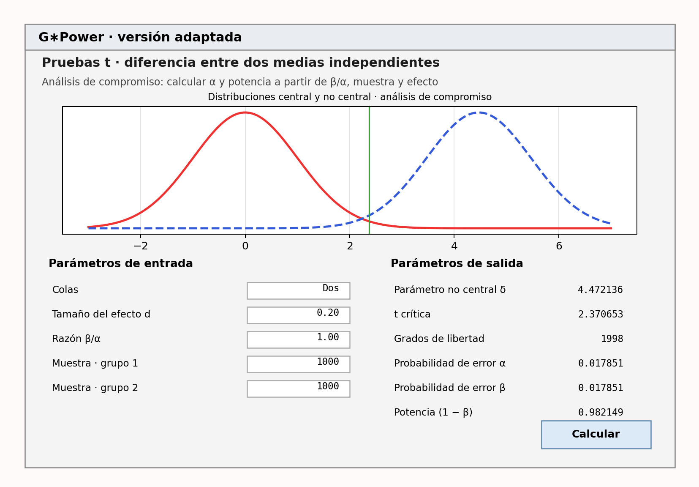{#fig-gpowcompromise}

La @fig-gpowcompromise muestra un análisis en el que ambos errores se consideran igualmente costosos —$\beta/\alpha = 1$—. Con 1000 observaciones por condición produce alfa = beta = 0.0179. Como escriben Faul, Erdfelder, Lang y Buchner [-@faul_gpower_2007]:

> Naturalmente, los análisis de compromiso pueden producir niveles de significación poco convencionales, superiores a $\alpha$ = .05 —con muestras o efectos pequeños— o inferiores a $\alpha$ = .001 —con muestras o efectos grandes—. Sin embargo, creemos que el beneficio de equilibrar los riesgos de error de tipo I y II compensa a menudo el coste de apartarse de las convenciones.

La segunda situación aparece cuando sabemos que la potencia será baja. Aunque decidir con tasas altas es muy indeseable, si hay que hacerlo con poca información, @winer_statistical_1962 escribe:

> El uso frecuente de los niveles .05 y .01 es una convención con escasa base científica o lógica. Cuando la potencia probablemente sea baja con esos niveles y los errores de tipo I y II tengan importancia aproximadamente igual, los niveles .30 y .20 pueden resultar más apropiados que .05 y .01.

Si podemos recoger como máximo 50 observaciones en cada grupo independiente, esperamos *d* = 0.5 y realizamos una prueba *t* bilateral con alfa = 0.05, tendremos un 70% de potencia. Un análisis de compromiso puede ponderar ambos errores por igual y fijar alfa y beta en 0.149; la potencia pasa al 85.10%. La elección también puede incorporar probabilidades previas de las hipótesis nula y alternativa [@maier_justify_2022; @murphy_statistical_2014; @miller_quest_2019].

El análisis de compromiso exige especificar una muestra, que a su vez necesita justificación; por ello suele combinarse con restricciones de recursos. Es especialmente importante si hay que tomar una decisión, pues deben valorarse las tasas que los implicados están dispuestos a aceptar. También tiene sentido con muestras enormes fijadas por factores externos, como un proyecto internacional guiado por otras preguntas. Cuando beta es diminuta y la potencia altísima, algunos estadísticos recomiendan reducir alfa para evitar la paradoja de Lindley, en la que un efecto significativo —*p* < alfa— constituye evidencia a favor de la hipótesis nula [@jeffreys_theory_1939; @good_bayes_1992]. Ajustar alfa según la potencia puede evitarla [@maier_justify_2022]. Finalmente, el efecto debe justificarse mediante el menor de interés o uno esperado. La @tbl-table-compromise-just resume los tres aspectos.

| Qué debe tenerse en cuenta | Cómo tenerlo en cuenta |
|---|---|
| ¿Cómo se justifica la muestra? | Explique por qué se recoge ese tamaño —restricciones de recursos u otros factores—. |
| ¿Cómo se justifica el efecto? | Indique si procede del menor efecto de interés o de uno esperado. |
| ¿Qué razón entre errores de tipo I y II se desea? | Pondere sus costes relativos evaluando cuidadosamente las consecuencias de cada error. |

: Recomendaciones para justificar las tasas de error de un análisis de compromiso. {#tbl-table-compromise-just}

## ¿Qué hacer si el editor pide potencia *post hoc*? {#sec-posthocpower}

La potencia *post hoc*, retrospectiva u observada describe la potencia calculada suponiendo que el efecto estimado en los datos recogidos es el verdadero [@zumbo_note_1998; @lenth_post_2007]. No se realiza antes de ver los datos a partir de efectos relevantes, como el análisis *a priori*, ni evalúa un rango de efectos interesantes como el de sensibilidad. Al basarse en el efecto observado no añade información al valor *p*: presenta lo mismo de otra forma. Pese a ello, editores y revisores la solicitan a menudo para interpretar resultados no significativos. La petición no es sensata y no debe aceptarse. En su lugar, realiza un análisis de sensibilidad y discute la potencia para el menor efecto de interés y para un rango realista de efectos esperados.

La potencia *post hoc* está directamente relacionada con el valor *p* [@hoenig_abuse_2001]. En una prueba *z*, si *p* = 0.05, siempre será del 50%. Cuando el valor *p* coincide con alfa, el estadístico observado coincide con el valor crítico —por ejemplo, *z* = 1.96 en una prueba bilateral con alfa = 5%—. Si la hipótesis alternativa se centra en ese valor crítico, la mitad de sus resultados esperados cae a cada lado. Por tanto, suponiendo verdadero el efecto observado, la potencia es exactamente el 50%.

En pruebas con una alternativa asimétrica —como la *t* no central de la @fig-noncentralt—, *p* = 0.05 no se traduce exactamente en un 50%, pero ambas estadísticas siguen estando directamente ligadas. La @fig-obs-power-plot-2 muestra que, en una prueba *t*, cuando *p* no es significativo —mayor que 0.05—, la potencia observada es inferior aproximadamente al 50%. En pruebas *F* también queda completamente determinada por *p*, aunque ya no se cumple siempre ese límite [@lenth_post_2007].

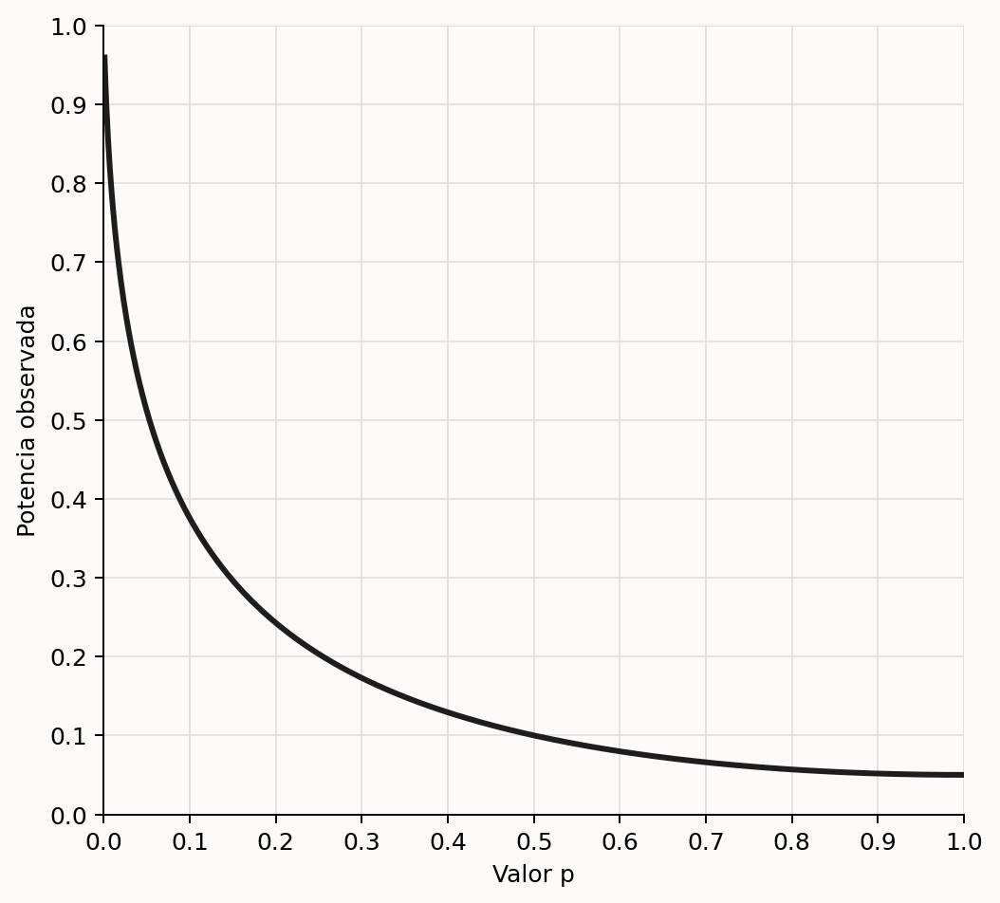{#fig-obs-power-plot-2}

Cuando se pide potencia *post hoc* se intenta distinguir verdaderos negativos —concluir que no hay efecto cuando no lo hay— de falsos negativos —un error de tipo II—. Como solo vuelve a expresar *p*, no responde a esa pregunta [@hoenig_abuse_2001; @lenth_post_2007; @yuan_post_2005; @schulz_sample_2005]. Para concluir que no existe un efecto relevante debe realizarse una [prueba de equivalencia](09-pruebas-de-equivalencia.html#sec-equivalencetest) y diseñar el estudio con potencia alta para rechazar el menor efecto de interés. Si este no se especificó, puede informarse de un análisis de sensibilidad.

## Análisis secuenciales {#sec-sequentialsamplesize}

Cuando la muestra se justifica mediante potencia *a priori*, recoger datos secuencialmente puede ser muy eficiente. Estos diseños controlan los errores a través de varias inspecciones —por ejemplo, tras 50, 100 y 150 observaciones— y reducen la muestra esperada media frente a un diseño fijo que solo analiza al alcanzar el máximo [@wassmer_group_2016; @proschan_statistical_2006]. Tienen una larga historia [@dodge_method_1929] y muchas variantes: prueba secuencial de la razón de probabilidades [@wald_sequential_1945], combinación de pruebas independientes [@westberg_combining_1985], diseños secuenciales por grupos [@jennison_group_2000], factores de Bayes secuenciales [@schonbrodt_sequential_2017] y pruebas seguras [@grunwald_safe_2019]. La primera es la más eficiente si se analiza tras cada observación [@schnuerch_controlling_2020]. Los diseños por grupos, con datos recogidos por lotes, ofrecen mayor flexibilidad en la recogida, el control de errores y la corrección de estimaciones [@wassmer_group_2016]. Las pruebas seguras son especialmente flexibles cuando las observaciones dependen entre sí [@terschure_accumulation_2019].

Resultan muy útiles cuando hay gran incertidumbre sobre el efecto o es plausible que sea mayor que el menor efecto para el cual se diseñó el estudio [@lakens_performing_2014]. La recogida puede detenerse pronto si el efecto es grande y continuar hasta el máximo si hace falta. Evitan desperdicio tanto al parar cuando se rechaza la nula como al hacerlo cuando se rechaza la presencia del menor efecto de interés —parada por futilidad—. Los diseños secuenciales por grupos son hoy los más usados y pueden planificarse con `rpact` o `gsDesign`, que disponen de aplicaciones [en línea](https://rpact.shinyapps.io/public/) [para ello](https://gsdesign.shinyapps.io/prod/).

## Aumentar la potencia sin aumentar la muestra

La vía más directa para aumentar el valor informativo es ampliar la muestra. Como los recursos suelen ser limitados, conviene examinar alternativas. La primera es usar pruebas direccionales —unilaterales— cuando proceda. Muchas predicciones tienen dirección: «X será mayor que Y». La prueba lógica es entonces una *t* unilateral. Al concentrar el error de tipo I en una cola, reduce el valor crítico y necesita menos observaciones para la misma potencia.

Aunque se discute cuándo son apropiadas, las pruebas direccionales son perfectamente defendibles desde la perspectiva de Neyman–Pearson [@cho_twotailed_2013]; una predicción unilateral prerregistrada aumenta tanto la potencia como el riesgo de la predicción. Pero a veces interesa examinar también el sentido contrario, especialmente por sus consecuencias prácticas. Al evaluar una intervención educativa que se espera mejore el rendimiento, quizá queramos detectar si lo empeora para recomendar abandonarla. En esos casos el error puede distribuirse de manera asimétrica, con un criterio más estricto para los efectos negativos que para los positivos [@rice_heads_1994].

Otra posibilidad es elevar alfa, como se explicó en el análisis de compromiso. Naturalmente, aumenta el riesgo de tipo I. Ambos errores deben ponderarse con cuidado, normalmente considerando la probabilidad previa de la hipótesis nula [@cascio_open_1983; @mudge_setting_2012; @murphy_statistical_2014; @miller_quest_2019]. Si *hay* que decidir o formular una afirmación y los datos viables son limitados, elevar alfa puede justificarse mediante un análisis de compromiso o un análisis coste-beneficio [@field_minimizing_2004; @baguley_understanding_2004].

También se recomienda usar diseños intrasujeto cuando sea posible. Casi siempre requieren menos participantes que un diseño entre sujetos para detectar una diferencia. Según @maxwell_designing_2017, el número necesario en un diseño intrasujeto de dos condiciones, $N_W$, en relación con uno entre sujetos, $N_B$, bajo normalidad, es:

$$N_W = \frac{N_B(1-\rho)}{2}$$

Se divide por dos porque cada participante aporta dos datos. La reducción adicional depende de la correlación entre las variables dependientes, expresada por $(1-\rho)$. Si es cero, hacen falta la mitad de participantes —64 en lugar de 128, por ejemplo—. Cuanto más positiva sea la correlación, mayor la ventaja; si es negativa, hasta −1, desaparece.

La @fig-plot-1 muestra dos puntuaciones normales con una diferencia de medias de 6, desviación estándar 15 y correlación 0. La desviación estándar de las diferencias es $\sqrt{2}$ veces la de cada medida: $15\sqrt{2} = 21.21$, redondeado a 21. Esta situación equivale a una prueba *t* independiente, en la que no se tiene en cuenta la correlación.

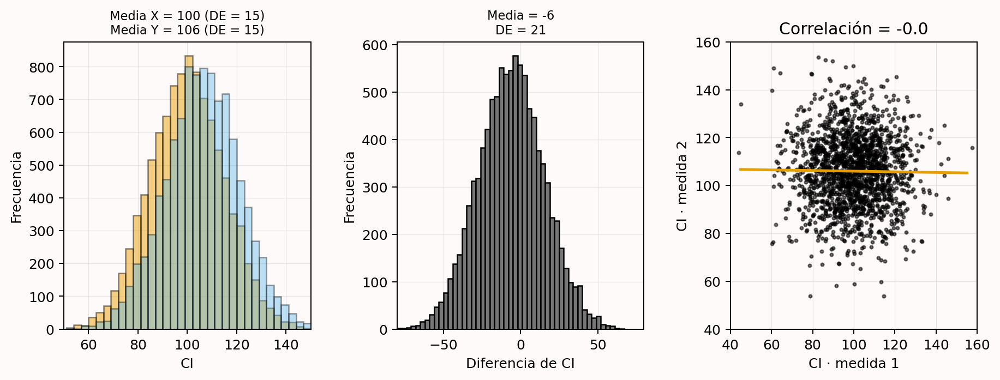{#fig-plot-1}

La @fig-plot-4 muestra qué ocurre con *r* = 0.7. Las medias no cambian, pero la desviación estándar de las diferencias es 11 en lugar de 21. Como el efecto estandarizado divide la diferencia por la desviación estándar, la *d* de Cohen —$d_z$ en diseños intrasujeto— es mayor.

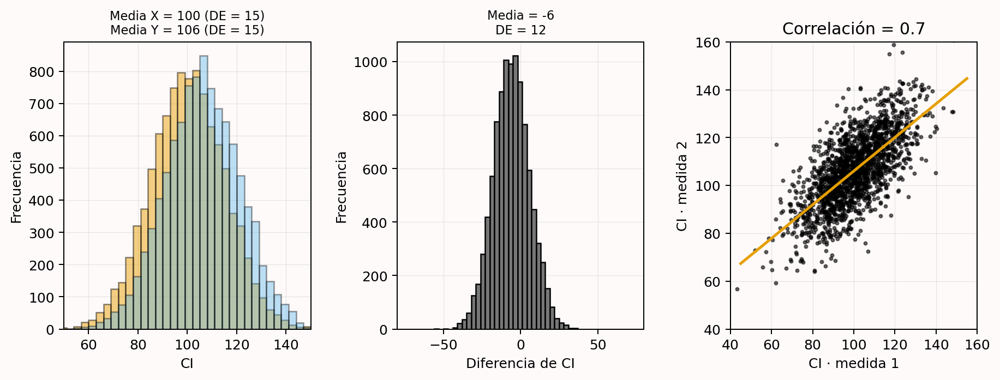{#fig-plot-4}

La correlación entre variables dependientes es un aspecto importante de estos diseños. Recomiendo informarla expresamente —por ejemplo: los participantes respondieron más despacio con los pies (*M* = 390, *DE* = 44) que con las manos (*M* = 371, *DE* = 44, *r* = .953), *t*(17) = 5.98, *p* < 0.001, *g* de Hedges = 0.43, $M_{dif}$ = 19, IC del 95% [12; 26]—. Como en psicología la mayoría de estas variables correlacionan positivamente, el diseño intrasujeto aumenta la potencia disponible. Úsalo cuando sea posible, pero sopesa la ventaja frente a efectos de orden o arrastre [@maxwell_designing_2017]. Esta [aplicación Shiny](http://shiny.ieis.tue.nl/within_between/) permite explorar medias, desviaciones y correlaciones.

En general, cuanto menor es la variación, mayor es el efecto estandarizado —dividimos por una desviación menor— y, con la misma muestra, mayor la potencia. La literatura ofrece otras recomendaciones [@allison_power_1997; @bausell_power_2002; @hallahan_statistical_1996]:

1. Mejorar la selección previa de participantes cuando el estudio la requiera.
2. Asignar un número desigual a las condiciones cuando, por ejemplo, recoger datos del control sea mucho más barato.
3. Usar medidas fiables con poca varianza de error [@williams_impact_1995].
4. Utilizar de manera inteligente covariables prerregistradas [@meyvis_increasing_2018].

Hay que evitar que estas reducciones de la variación tengan un coste excesivo en validez externa. En un análisis por *intención de tratar* de un ensayo aleatorizado se mantienen quienes incumplen el protocolo para que el efecto represente la implantación real en la población, no solo a quienes lo siguen perfectamente [@gupta_intentiontotreat_2011]. Existen equilibrios semejantes en otras áreas.

## Conoce tu medida {#sec-knowyourmeasure}

Aunque resulte cómodo hablar de efectos estandarizados, suele ser preferible interpretar las puntuaciones brutas y conocer la desviación estándar de las medidas [@baguley_standardized_2009; @lenth_practical_2001]. El uso de las mismas medidas validadas dentro de una comunidad crea una base fiable para planificar la precisión y expresar el menor efecto de interés en la escala original.

También deben conocerse las correlaciones entre variables dependientes —la $d_z$ de Cohen de una prueba *t* dependiente depende de ellas—. Cuanto más complejo sea el modelo, más componentes del proceso generador de datos hay que prever. En modelos jerárquicos se necesitan componentes de varianza para calcular potencia [@westfall_statistical_2014; @debruine_understanding_2021]. Asimismo, importa la fiabilidad de la medida [@parsons_psychological_2019], sobre todo al usar el efecto de un estudio con otra fiabilidad o al aplicar la misma medida en poblaciones donde podría cambiar. La creciente disponibilidad de datos abiertos debería facilitar estas estimaciones.

La desviación estándar muestral estima el valor poblacional. En muestras pequeñas puede alejarse mucho; por la ley de los grandes números se vuelve más precisa conforme aumenta *N*. Como toda estimación incierta, puede acompañarse de un intervalo de confianza [@smithson_confidence_2003] y pueden diseñarse pilotos que la estimen con suficiente fiabilidad. El intervalo de la varianza $\sigma^2$ es:

$$\frac{(N-1)s^2}{\chi^2_{N-1:\alpha/2}},\; \frac{(N-1)s^2}{\chi^2_{N-1:1-\alpha/2}}$$

El intervalo de la desviación estándar es la raíz cuadrada de esos límites.

Cuando existen parámetros inciertos puede realizarse un *piloto interno* secuencial [@wittes_role_1990]. Se fija una muestra provisional, se efectúa un análisis intermedio, se actualizan parámetros como la varianza y se revisa la muestra final. Mientras la inspección sea ciega —sin información sobre las condiciones—, ajustar la muestra por una nueva estimación de la varianza apenas afecta en la práctica al error de tipo I [@friede_sample_2006; @proschan_twostage_2005]. Si se quieren controlar ambos errores pero se desconoce la desviación estándar, un piloto interno puede ser una opción atractiva [@chang_adaptive_2016].

## Las convenciones como metaheurísticos

Aunque no se use una regla para decidir directamente la muestra, los heurísticos intervienen de forma indirecta. La potencia, la precisión o una decisión exigen escoger tasas de error, una anchura deseada o un menor efecto de interés. A veces pueden justificarse mediante un análisis coste-beneficio, pero hacerlo con solidez quizá requiera líneas de investigación propias, que no siempre son viables o rentables. Puede costar menos realizar un estudio con un alfa conservador aceptado por los colegas que reunir todos los datos necesarios para determinarlo mediante costes y beneficios. En tales situaciones se emplean convenciones.

Sea una anchura, una potencia u otro valor de entrada, debe comunicarse con transparencia que se ha usado una norma. Alfa = 5% y potencia = 80% funcionan en la práctica como un umbral inferior de valor informativo que los colegas aceptan *sin* justificación; con una justificación, también pueden aceptarse tasas de error mayores. Nada está grabado en piedra. Las revistas pueden exigir más —*Nature Human Behaviour* requiere un 95% de potencia en informes registrados, y mi departamento ha pedido que las propuestas éticas alcancen un 90% siempre que sea posible—. Quien diseñe estudios más informativos que el mínimo convencional debería recibir reconocimiento.

Algunos campos han cambiado sus convenciones, como el umbral de 5 sigma de la física para declarar un descubrimiento en lugar de un 5% de error de tipo I; en otros no prosperaron intentos semejantes [@johnson_revised_2013]. Las mejores normas deben depender del contexto y parece razonable acordarlas en reuniones de consenso [@mullan_town_1985], habituales en medicina y utilizadas incluso para decidir el menor efecto de interés [@fried_method_1993]. Muchas convenciones actuales pueden mejorarse. Resulta extraño usar alfa = 5% tanto en estudios únicos como en metaanálisis; cabe imaginar un futuro en que el segundo sea mucho menor. Hacer visible la falta de justificación debería impulsar discusiones sobre cómo mejorar las normas. La aplicación Shiny enlaza buenos ejemplos y se actualizará cuando aparezcan mejores justificaciones.

## Justificación del tamaño muestral en investigación cualitativa

La perspectiva del valor de la información también se aplica a la investigación cualitativa. El coste de incluir más participantes debe compararse con la información nueva que aportan para los objetivos inferenciales. Una aplicación extendida es la *saturación*: los nuevos datos reproducen observaciones anteriores sin añadir información [@morse_significance_1995]. Si preguntamos por qué la gente tiene mascota, las entrevistas revelarán categorías; cuando después de 20 personas dejan de aparecer categorías nuevas, se ha alcanzado la saturación. Existen otras filosofías cualitativas que no la valoran y, lamentablemente, para ellas no se han desarrollado enfoques fundamentados [@marshall_does_2013].

El objetivo del muestreo no suele ser la representatividad, sino reunir suficientes sujetos diversos para alcanzar la saturación con eficiencia. Fugard y Potts [-@fugard_supporting_2015] proponen justificar la muestra atendiendo al número de códigos de la población —razones para tener mascota—, la probabilidad de observar cada código en una fuente —que una persona lo mencione— y cuántas veces se desea observarlo. Ofrecen una fórmula en R basada en probabilidades binomiales.

Rijnsoever [-@rijnsoever_cant_2017] presenta un enfoque más avanzado que compara estrategias de muestreo. Seleccionar deliberadamente fuentes de las que se espera información novedosa es mucho más eficiente que muestrear al azar, pero exige conocer los códigos y las subpoblaciones en que aparecen. A veces pueden identificarse fuentes que aportarán al menos un código nuevo mediante comunicación informal previa. Una buena justificación cualitativa se basa en: 1) identificar poblaciones y subpoblaciones; 2) estimar cuántos códigos existen; 3) estimar la probabilidad de encontrar cada código en una fuente; y 4) especificar la estrategia de muestreo.

## Discusión

Justificar coherentemente la muestra es esencial para diseñar un estudio informativo. Los enfoques varían según el objetivo de la recogida, los recursos y el método estadístico. El principio general es considerar el valor de la información en relación con los objetivos inferenciales.

A veces el proceso debe llevar a concluir que no merece la pena recoger los datos porque su valor no justifica el coste. Puede que nunca haya estudios suficientes para un metaanálisis, que la información no se use para decidir o afirmar nada, y que las pruebas no permitan contrastar una hipótesis con errores razonables ni estimar con precisión. Si no existe una buena razón para recoger todas las observaciones viables, realizar el estudio es desperdiciar tiempo o dinero [@button_power_2013; @brown_errors_1983; @halpern_continuing_2002].

Crece la conciencia de que muchas muestras anteriores eran demasiado pequeñas para objetivos inferenciales realistas [@lindsay_replication_2015; @sedlmeier_studies_1989; @fraley_npact_2014; @button_power_2013]. A medida que más revistas exijan justificaciones, algunos investigadores descubrirán que necesitan muestras mayores. Tendrán que pedir más fondos para pagar participantes o colaborar más [@moshontz_psychological_2018]. Si la pregunta merece respuesta pero los recursos propios no bastan, una opción es organizar una colaboración y perseguirla colectivamente.

## Autoevaluación

**P1**: Un estudiante dispone como máximo de dos meses para recoger datos. Debe pagar a los participantes y su presupuesto se limita a 250 euros. Decide incluir a todas las personas que pueda durante ese tiempo y con ese dinero. ¿Qué tipo de justificación es?

- Medir toda la población.
- Una justificación basada en recursos.
- Un heurístico.
- Sin justificación.

**P2**: ¿Cuál es el objetivo de un análisis de potencia *a priori*?

- Alcanzar la potencia deseada para el efecto verdadero y controlar el error de tipo I.
- Alcanzar la potencia deseada para un efecto de interés y controlar el error de tipo I.
- Alcanzar la potencia deseada para el efecto verdadero y controlar el error de tipo II.
- Alcanzar la potencia deseada para un efecto de interés y controlar el error de tipo II.

**P3**: Un investigador ya conoce la muestra que podrá recoger. Con ella calcula tasas iguales de error de tipo I y II para un efecto de interés. Esto se denomina:

- Análisis de potencia *a priori*.
- Análisis de sensibilidad de la potencia.
- Análisis de potencia *post hoc*.
- Análisis de potencia de compromiso.

**P4**: Según la fórmula de la sección «Aumentar la potencia sin aumentar la muestra», ¿qué dos factores explican que un diseño intrasujeto pueda tener mucha más potencia que uno entre sujetos con el mismo número de participantes?

- Cada participante aporta varias observaciones y los efectos intraindividuales suelen ser mayores que los efectos entre personas.
- Cada participante aporta varias observaciones y existe una correlación entre las medidas.
- Los efectos de orden aumentan el tamaño del efecto y existe una correlación entre las medidas.
- Los efectos de orden aumentan el tamaño del efecto y los efectos intraindividuales suelen ser mayores que los efectos entre personas.

**P5**: ¿Qué factores determinan el efecto mínimo estadísticamente detectable?

- La potencia del estudio.
- El efecto verdadero del estudio.
- El tamaño muestral y el nivel alfa.
- El efecto observado en la muestra.

**P6**: En igualdad de condiciones, si quieres que el estudio tenga el mayor valor informativo posible, ¿cuál es el mejor modo de especificar el efecto de interés?

- Fijar el menor tamaño del efecto de interés.
- Calcular el efecto mínimo estadísticamente detectable.
- Usar una estimación metaanalítica.
- Realizar un análisis de sensibilidad.

**P7**: En un análisis *a priori* basado en una estimación empírica, ¿qué dos cuestiones son importantes tanto si procede de un metaanálisis como de un único estudio?

- Evaluar el riesgo de sesgo y la incertidumbre de la estimación.
- Evaluar la heterogeneidad y la similitud con el estudio previsto.
- Evaluar el riesgo de sesgo y la similitud con el estudio previsto.
- Evaluar la heterogeneidad y la incertidumbre de la estimación.

**P8**: Un investigador no justificó la muestra antes del estudio y no tenía razón alguna para el tamaño elegido. Tras enviar el artículo, los revisores le piden una justificación. La honestidad exige reconocer que no existía; aun así, ¿cómo puede evaluar el valor informativo para efectos de interés?

- Con un análisis de potencia *a priori*.
- Con un análisis de compromiso.
- Con un análisis de sensibilidad.
- Con un análisis *post hoc* o retrospectivo.

**P9**: ¿Por qué resulta útil considerar la distribución de tamaños del efecto de un área al evaluar el valor informativo de un estudio previsto?

- Si el estudio solo puede rechazar efectos tan grandes que casi nunca aparecen en el área, recoger datos no enseñará nada que no sepamos ya.
- Permite diseñar potencia alta para el menor efecto observado en la literatura, lo que garantiza gran valor informativo.
- Permite diseñar potencia alta para detectar el efecto mediano de la literatura, lo que garantiza gran valor informativo.
- Permite diseñar potencia alta para rechazar el efecto mediano de la literatura, lo que garantiza gran valor informativo.

**P10**: ¿Por qué carece de sentido pedir un análisis de potencia *post hoc* que use el efecto observado y la muestra recogida después de un resultado no significativo?

- Porque siempre se basa en supuestos y deja de ser informativo cuando estos son incorrectos.
- Porque está directamente relacionado con *p*: si el efecto no es significativo, la potencia *post hoc* será baja y no aportará información adicional.
- Porque equivale matemáticamente a un análisis de sensibilidad para una estimación concreta y siempre es mejor representar un rango.
- Porque el riesgo de falsos negativos solo puede controlarse antes, nunca interpretarse después.

**P11**: No debe realizarse potencia *post hoc*. Hay una solución al diseñar el estudio y otra al interpretar un resultado no significativo con los datos ya recogidos. ¿Cuál puede aplicarse cuando ya se dispone de los datos?

- Evaluar la precisión del efecto o realizar un análisis de sensibilidad.
- Planificar potencia alta para una prueba de equivalencia o realizar un análisis de sensibilidad.
- Evaluar la precisión del efecto o realizar un análisis de compromiso.
- Planificar potencia alta para una prueba de equivalencia o realizar un análisis de compromiso.

**P12**: ¿Qué puede aumentar la potencia estadística sin incrementar la muestra?

- Realizar una prueba unilateral en lugar de una bilateral.
- Aumentar el nivel alfa.
- Usar medidas con mayor varianza de error.
- Todas las respuestas anteriores.

### Preguntas abiertas

1. ¿Por qué las restricciones de recursos son siempre, si no la justificación principal, una secundaria —salvo que pueda medirse toda la población—?
2. ¿Cuál es el objetivo de un análisis de potencia *a priori* y por qué no consiste en alcanzar una tasa de error de tipo II deseada para el efecto verdadero?
3. ¿Qué determina el efecto mínimo estadísticamente detectable y por qué conviene calcularlo antes de un estudio?
4. ¿Qué ventaja tiene planificar la precisión cuando el efecto suele desconocerse e incluso podría ser cero? ¿Qué decisión es la más difícil de justificar?
5. ¿Qué problema plantea basar la muestra en heurísticos?
6. Aunque parezca contradictorio incluir «sin justificación», ¿por qué es importante declarar expresamente que no existía ninguna?
7. De las seis categorías de la @tbl-table-effect-eval, ¿cuál ofrece la mejor base si puede especificarse?
8. ¿Por qué no puede trasladarse sin más un efecto metaanalítico a un análisis *a priori* de un estudio relacionado?
9. ¿Por qué no puede hacerse lo mismo con el efecto de un único estudio?
10. ¿Cuál es el objetivo de un análisis de compromiso?
11. ¿Por qué la potencia *post hoc* o retrospectiva no ayuda a inferir a partir de resultados no significativos?
12. ¿Cuándo realizarías un análisis de sensibilidad?
13. ¿Cómo puede aumentarse la potencia sin aumentar la muestra?
14. ¿Por qué puede ser beneficioso un diseño intrasujeto frente a uno entre sujetos?

## Solucionario {.unnumbered}

- **P1:** Una justificación basada en recursos.
- **P2:** Alcanzar la potencia deseada para un efecto de interés y controlar el error de tipo II.
- **P3:** Un análisis de potencia de compromiso.
- **P4:** Cada participante aporta varias observaciones y existe una correlación entre las medidas.
- **P5:** El tamaño muestral y el nivel alfa.
- **P6:** Fijar el menor tamaño del efecto de interés.
- **P7:** Evaluar el riesgo de sesgo y la similitud con el estudio previsto.
- **P8:** Realizar un análisis de sensibilidad.
- **P9:** Si el diseño solo puede rechazar efectos extremadamente grandes e improbables en el área, los datos difícilmente aportarán información nueva.
- **P10:** La potencia *post hoc* está determinada por el valor *p* y no añade información.
- **P11:** Evaluar la precisión del efecto o realizar un análisis de sensibilidad.
- **P12:** Tanto una prueba unilateral como un nivel alfa mayor aumentan la potencia; emplear una medida con más varianza de error no lo hace.

## Referencias {.unnumbered}

::: {#refs}
:::
