# Pruebas de equivalencia e hipótesis de intervalo {#sec-equivalencetest}

> Traducción literal al castellano del capítulo 9, “Equivalence Testing and Interval Hypotheses”, de Daniël Lakens, *Improving Your Statistical Inferences*.<br>
> Original: https://lakens.github.io/statistical_inferences/09-equivalencetest.html<br>
> Licencia del original: CC-BY-4.0. Traducción no oficial.


La mayoría de los estudios científicos están diseñados para probar la predicción de que existe un efecto o una diferencia. ¿Funciona una nueva intervención? ¿Existe una relación entre dos variables? Estos estudios se analizan comúnmente con una prueba de significación de la hipótesis nula. Cuando se observa un valor *p* estadísticamente significativo, la hipótesis nula puede rechazarse y los investigadores pueden afirmar que la intervención funciona, o que existe una relación entre dos variables, con una tasa de error máxima. Pero si el valor *p* no es estadísticamente significativo, los investigadores muy a menudo llegan a una conclusión lógicamente incorrecta: concluyen que no hay ningún efecto basándose en *p* > 0,05.

Abra una sección de resultados de un artículo que esté escribiendo o la sección de resultados de un artículo que haya leído recientemente. Busque "*p* > 0,05" y observe detenidamente lo que usted o los científicos concluyeron (en la sección de resultados, pero también verifique qué afirmaciones hacen en la sección de discusión). Si ve la conclusión de que "no hubo efecto" o "no hubo asociación entre variables", habrá encontrado un ejemplo en el que los investigadores olvidaron que *la ausencia de evidencia no es evidencia de ausencia* [@altman_statistics_1995]. Un resultado no significativo en sí mismo sólo nos dice que no podemos rechazar la hipótesis nula. Es tentador preguntar después de *p* > 0,05 'entonces, ¿el verdadero efecto es cero'? Pero el valor *p* de una prueba de significación de la hipótesis nula no puede responder esa pregunta. (recuerde el concepto de 無 ([mu](https://en.wikipedia.org/wiki/Mu_(negative)#Non-dualistic_meaning)) discutido en el capítulo sobre [*p* valores](#sec-misconception1): la respuesta no es ni sí ni no, pero debemos 'deshacer' la pregunta).

Debería haber muchas situaciones en las que los investigadores estén interesados en examinar si está ausente un efecto relevante. Por ejemplo, puede ser importante mostrar que dos grupos no difieren en factores que podrían constituir una variable de confusión en el diseño experimental (por ejemplo, examinar si una manipulación destinada a aumentar la fatiga no afectó el estado de ánimo de los participantes, al mostrar que el afecto positivo y negativo no difirió entre los grupos). Es posible que los investigadores quieran saber si dos intervenciones funcionan igual de bien, especialmente cuando la intervención más nueva cuesta menos o requiere menos esfuerzo (por ejemplo, ¿es la terapia en línea tan eficaz como la terapia en persona?). Y otras veces podríamos estar interesados en demostrar la ausencia de un efecto porque un modelo teórico predice que no hay efecto, o porque creemos que un estudio publicado anteriormente fue un falso positivo, y esperamos mostrar la ausencia de un efecto en un estudio de replicación [@dienes_using_2014]. Y, sin embargo, cuando se pregunta a los investigadores si alguna vez diseñaron un estudio cuyo objetivo fuera mostrar que no hubo ningún efecto, por ejemplo prediciendo que no habría diferencia entre dos condiciones, muchas personas dicen que nunca diseñaron un estudio donde su predicción principal fuera que el tamaño del efecto fuera 0. Los investigadores casi siempre predicen que hay una diferencia. Una razón podría ser que muchos investigadores ni siquiera sabrían cómo respaldar estadísticamente una predicción de un tamaño del efecto de 0, porque no estaban capacitados en el uso de pruebas de equivalencia.

Nunca es posible demostrar que un efecto es *exactamente* 0. Incluso si se recogeran datos de todas las personas en el mundo, el efecto en cualquier estudio variará aleatoriamente alrededor del verdadero tamaño del efecto de 0; podría terminar con una diferencia media muy cercana a cero, pero no exactamente, en cualquier muestra finita. @hodges_testing_1954 fueron los primeros en discutir el problema estadístico de probar si dos poblaciones tienen la misma media. Sugieren (p. 264) “probar que sus medias no difieran en más de una cantidad especificada para representar la diferencia más pequeña de interés práctico”. @nunnally_place_1960 propuso de manera similar una hipótesis de "incremento fijo" en la que los investigadores comparan un efecto observado con un rango de valores que se considera demasiado pequeño para resultar relevante. Definir un rango de valores considerados prácticamente equivalentes a la ausencia de un efecto se conoce como **rango de equivalencia** [@bauer_unifying_1996] o **región de equivalencia práctica** [@kruschke_bayesian_2013]. El rango de equivalencia debe especificarse de antemano y requiere una consideración cuidadosa del menor tamaño del efecto de interés.

Aunque los investigadores han intentado repetidamente introducir pruebas contra un rango de equivalencia en las ciencias sociales [@cribbie_recommendations_2004; @levine_communication_2008; @hoenig_abuse_2001; @rogers_using_1993; @quertemont_how_2011], este enfoque estadístico se ha vuelto popular sólo recientemente. Durante la crisis de replicación, los investigadores buscaron herramientas para interpretar resultados nulos al realizar estudios de replicación. Los investigadores querían poder publicar resultados nulos informativos al replicar hallazgos en la literatura que sospechaban que eran falsos positivos. Un ejemplo notable fueron los estudios sobre precognición de Daryl Bem, que aparentemente mostraron que los participantes eran capaces de predecir el futuro [@bem_feeling_2011]. Se propusieron pruebas de equivalencia como un enfoque estadístico para responder a la pregunta de si un efecto observado es lo suficientemente pequeño como para concluir que un estudio anterior no se pudo replicar [@anderson_theres_2016; @lakens_equivalence_2017; @simonsohn_small_2015]. Los investigadores especifican un menor tamaño del efecto de interés (por ejemplo, un efecto de 0,5, por lo que para una prueba bilateral cualquier valor fuera de un rango de -0,5 a 0,5) y prueban si se pueden rechazar efectos más extremos que este rango. Si es así, pueden rechazar la presencia de efectos que se consideren lo bastante grandes como para resultar relevantes.

Se puede distinguir una **hipótesis nula de efecto cero**, donde la hipótesis nula es un efecto de 0, de una **hipótesis nula distinta de cero**, donde la hipótesis nula es cualquier otro efecto distinto de 0, por ejemplo efectos más extremos que el menor tamaño del efecto de interés [@nickerson_null_2000]. Como escribe Nickerson:

>La distinción es importante, especialmente en relación con la controversia sobre los méritos o deficiencias de NHST, ya que las críticas que pueden ser válidas cuando se aplican a las pruebas de hipótesis nulas no son necesariamente válidas cuando se dirigen a las pruebas de hipótesis nulas en el sentido más general.

Las pruebas de equivalencia son una implementación específica de **pruebas de hipótesis de intervalo**, donde en lugar de probar contra una hipótesis nula de ningún efecto (es decir, un tamaño del efecto de 0; **hipótesis nula de efecto cero**), se prueba un efecto contra una hipótesis nula que representa un rango de tamaños de efecto distintos de cero (**hipótesis nula distinta de cero**). De hecho, una de las mejoras sugeridas más ampliamente que mitiga las limitaciones más importantes de la prueba de significación de la hipótesis nula es reemplazar la hipótesis nula con la prueba de una predicción de rango (especificando una hipótesis nula distinta de cero) en una prueba de hipótesis de intervalo [@lakens_practical_2021]. Para ilustrar la diferencia, el panel A en @fig-intervaltest visualiza los resultados que se predicen en una prueba bilateral de significación de la hipótesis nula con una hipótesis de efecto cero, donde la prueba examina si se puede rechazar un efecto de 0. El panel B muestra una hipótesis de intervalo en la que se predice un efecto entre 0,5 y 2,5, donde la hipótesis nula distinta de cero consta de valores menores que 0,5 o mayores que 2,5, y la prueba de hipótesis de intervalo examina si los valores en estos rangos pueden rechazarse. El panel C ilustra una prueba de equivalencia, que es básicamente idéntica a una prueba de hipótesis de intervalo, pero los efectos previstos se ubican en un rango alrededor de 0 y contienen efectos que se consideran demasiado pequeños para resultar relevantes.

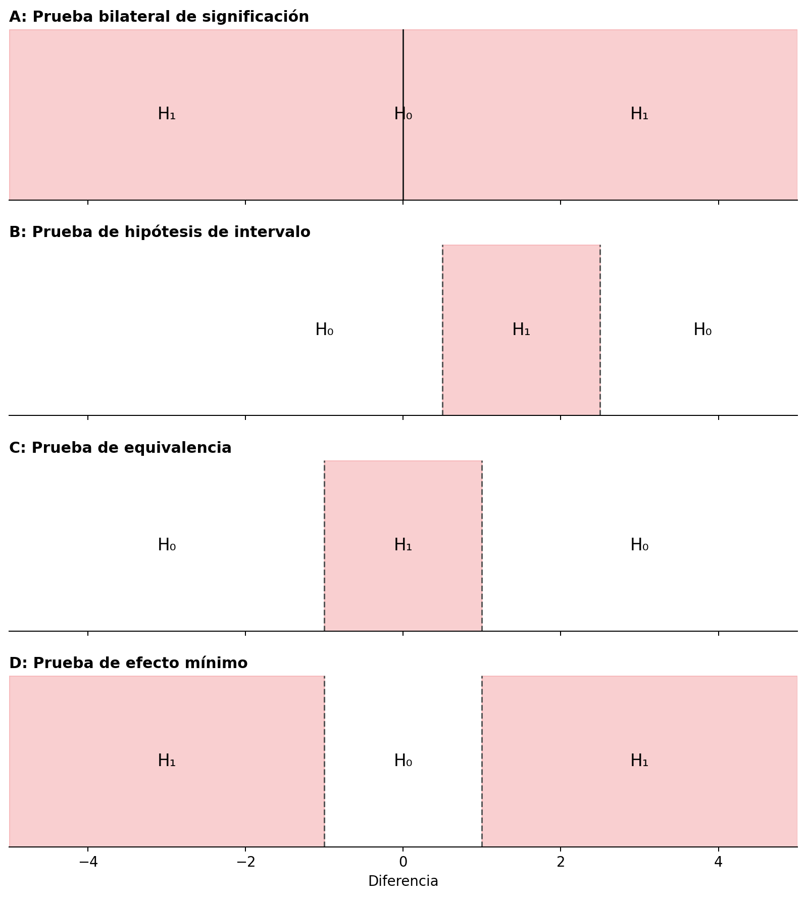{#fig-intervaltest}


Cuando se invierte una prueba de equivalencia, un investigador diseña un estudio para rechazar efectos menos extremos que un menor tamaño del efecto de interés (consulte el panel D en @fig-intervaltest), se denomina **prueba de efecto mínimo** [@murphy_testing_1999]. Un investigador podría no sólo estar interesado en rechazar un efecto de 0 (como en una prueba de significación de la hipótesis nula), sino en rechazar una gama de efectos que son demasiado pequeños para resultar relevantes. En igualdad de condiciones, un estudio diseñado para tener una potencia elevada para un efecto mínimo requiere más observaciones que si el objetivo hubiera sido rechazar un efecto de cero. Como el intervalo de confianza debe rechazar un valor más cercano al tamaño del efecto observado (por ejemplo, 0,1 en lugar de 0), debe ser más estrecho, lo que requiere más observaciones.

Un beneficio de una prueba de efecto mínimo en comparación con una prueba de hipótesis nula es que no hay distinción entre significación estadística y significación práctica. Como el valor de la prueba se elige para representar el efecto mínimo de interés, siempre que se rechaza, el efecto es estadística y prácticamente relevante [@murphy_statistical_2014]. Otro beneficio de las pruebas de efecto mínimo es que, especialmente en los estudios correlacionales en las ciencias sociales, las variables a menudo están conectadas a través de estructuras causales que dan como resultado correlaciones reales pero teóricamente poco interesantes distintas de cero entre variables, lo que se ha denominado el "factor «crud»" [@meehl_appraising_1990; @orben_crud_2020]. Debido a que es poco probable que un efecto de cero sea cierto en grandes conjuntos de datos correlacionales, rechazar una hipótesis nula no es una prueba severa. Incluso si la hipótesis es incorrecta, es probable que se rechace un efecto de 0 debido a [ese «crud» o ruido de fondo](#sec-crud). Por esta razón, algunos investigadores han sugerido probar con un efecto mínimo de *r* = 0,1, ya que las correlaciones por debajo de este umbral son bastante comunes debido a correlaciones teóricamente irrelevantes entre las variables [@ferguson_providing_2021].

@fig-intervaltest ilustra pruebas bilaterales, pero suele ser más intuitivo y lógico realizar pruebas unilaterales. En ese caso, una prueba de efecto mínimo tendría como objetivo, por ejemplo, rechazar efectos menores que 0,1, y una prueba de equivalencia tendría como objetivo rechazar efectos mayores que, por ejemplo, 0,1. En lugar de especificar un límite superior e inferior de un rango, es suficiente especificar un valor único para las pruebas unilaterales. Una variación final de una prueba de hipótesis nula unilateral no nula se conoce como prueba de **no inferioridad**, que examina si un efecto es mayor que el límite inferior de un rango de equivalencia. Esta prueba se realiza, por ejemplo, cuando una intervención novedosa no debería ser notablemente peor que una intervención existente, pero puede ser un poquito peor. Por ejemplo, si una diferencia entre una intervención novedosa y una existente no es menor que -0,1, y se pueden rechazar efectos menores que -0,1, se puede concluir que un efecto no es inferior [@schumi_looking_2011; @mazzolari_myths_2022]. Vemos que extender las pruebas de hipótesis nulas a hipótesis nulas no nulas permite a los investigadores hacer preguntas que podrían ser más interesantes.

## Pruebas de equivalencia

Las pruebas de equivalencia se desarrollaron por primera vez en las ciencias farmacéuticas [@hauck_new_1984; @westlake_use_1972] y luego se formalizaron como el procedimiento de **dos pruebas unilaterales (TOST)** para las pruebas de equivalencia [@schuirmann_comparison_1987; @seaman_equivalence_1998; @wellek_testing_2010]. El procedimiento TOST implica realizar dos pruebas unilaterales para examinar si los datos observados son sorprendentemente mayores que un límite de equivalencia inferior ($\Delta_{L}$), o sorprendentemente más pequeños que un límite de equivalencia superior ($\Delta_{U}$):

$$
t_{L} = \frac{{\overline{M}}_{1} - {\overline{M}}_{2} - \Delta_{L}}{\sigma\sqrt{\frac{1}{n_{1}} + \frac{1}{n_{2}}}}
$$

y

$$
t_{U} = \frac{{\overline{M}}_{1} - {\overline{M}}_{2}{- \Delta}_{U}}{\sigma\sqrt{\frac{1}{n_{1}} + \frac{1}{n_{2}}}}
$$

donde *M* indica las medias de cada muestra, *n* es el tamaño de la muestra y σ es
la desviación estándar agrupada:

$$
\sigma = \sqrt{\frac{\left( n_{1} - 1 \right)\text{sd}_{1}^{2} + \left( n_{2} - 1 \right)\text{sd}_{2}^{2}}{n_{1} + \ n_{2} - 2}}
$$

Si ambas pruebas unilaterales son significativas, podemos rechazar la presencia de efectos lo bastante grandes como para resultar relevantes. Las fórmulas son muy similares a la fórmula normal para el estadístico *t*. La diferencia entre una prueba NHST *t* y el procedimiento TOST es que el límite de equivalencia inferior $\Delta_{L}$ y el límite de equivalencia superior $\Delta_{U}$ se restan de la diferencia de medias entre grupos (en una prueba *t* normal, comparamos la diferencia de medias con 0 y, por lo tanto, el delta sale de la fórmula porque es 0).

Para realizar una prueba de equivalencia, no es necesario aprender ninguna prueba estadística nueva, ya que es solo la conocida prueba *t* contra un valor diferente a 0. Es algo sorprendente que el uso de pruebas *t* para realizar pruebas de equivalencia no se enseñe junto con su uso en pruebas de significación de hipótesis nulas, ya que hay algunos indicios de que esto podría evitar malentendidos comunes de los valores *p* [@parkhurst_statistical_2001]. Veamos un ejemplo de prueba de equivalencia utilizando el procedimiento TOST.

En un estudio en el que los investigadores manipulan la fatiga pidiendo a los participantes que carguen cajas pesadas, los investigadores quieren asegurarse de que la manipulación no altere inadvertidamente el estado de ánimo de los participantes. Los investigadores evalúan las emociones positivas y negativas en ambas condiciones y quieren afirmar que no hay diferencias en el estado de ánimo positivo. Supongamos que el estado de ánimo positivo en la condición de fatiga experimental ($m_1$ = 4,55, $sd_1$ = 1,05, $n_1$ = 15) no difirió del estado de ánimo en la condición de control ($m_2$ = 4,87, $sd_2$ = 1,11, $n_2$ = 15). Los investigadores concluyen: "El estado de ánimo no difirió entre las condiciones, *t* = -0,81, *p* = 0,42". Por supuesto, el estado de ánimo difirió entre las condiciones, ya que 4,55 - 4,87 = -0,32. La afirmación es que no hubo una diferencia *relevante* en el estado de ánimo, pero para hacer tal afirmación de manera correcta, primero debemos especificar qué diferencia de estado de ánimo es lo bastante grande como para resultar relevante. Por ahora, supongamos que el investigador considera que cualquier efecto menos extremo es medio punto de escala demasiado pequeño para resultar relevante. Ahora probamos si la diferencia media observada de -0,32 es lo suficientemente pequeña como para poder rechazar la presencia de efectos que sean lo suficientemente grandes como para importar.

El paquete TOSTER (creado originalmente por mí pero recientemente rediseñado por [Aaron Caldwell](https://aaroncaldwell.us/)) se puede utilizar para trazar dos distribuciones *t* y sus regiones críticas que indican cuándo podemos rechazar la presencia de efectos menores que -0,5 y mayores que 0,5. Puede llevar algún tiempo acostumbrarse a la idea de que estamos rechazando valores más extremos que los límites de equivalencia. Trate de preguntar constantemente en cualquier prueba de hipótesis: ¿Qué valores puede rechazar la prueba? En una prueba de hipótesis nula de efecto cero, podemos rechazar un efecto de 0, y en la prueba de equivalencia de la Figura siguiente, podemos rechazar valores inferiores a -0,5 y superiores a 0,5. En @fig-tdistequivalence vemos dos distribuciones *t* centradas en el límite superior e inferior del rango de equivalencia especificado (-0,5 y 0,5).

```r
res <- TOSTER::tsum_TOST(m1 = 4.55, m2 = 4.87, sd1 = 1.05, sd2 = 1.11,
                  n1 = 15, n2 = 15, low_eqbound = -0.5, high_eqbound = 0.5)

plot(res, type = "tnull")

```


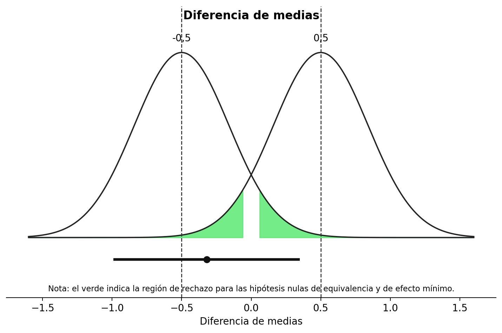{#fig-tdistequivalence}


Debajo de las dos curvas vemos una línea que representa el intervalo de confianza que va de -0,99 a 0,35, y un punto en la línea que indica la diferencia media observada de -0,32. Veamos primero la curva izquierda. Vemos el área resaltada en verde en las colas que resalta qué diferencias medias observadas serían lo suficientemente extremas como para rechazar estadísticamente un efecto de -0,5. Nuestra diferencia media observada de -0,32 se encuentra muy cerca de -0,5, y si observamos la distribución izquierda, la media no está lo suficientemente lejos de -0,5 como para caer en el área verde que indica cuándo las diferencias observadas serían estadísticamente significativas. También podemos realizar la prueba de equivalencia usando el paquete TOSTER y ver los resultados.

```r
TOSTER::tsum_TOST(m1 = 4.55,
                  m2 = 4.87,
                  sd1 = 1.05,
                  sd2 = 1.11,
                  n1 = 15,
                  n2 = 15,
                  low_eqbound = -0.5,
                  high_eqbound = 0.5)
```


En la línea «t-test», el resultado muestra la prueba tradicional de significación de la hipótesis nula (que ya sabíamos que no era estadísticamente significativa: *t* = 0,46, *p* = 0,42). Al igual que la prueba *t* predeterminada de R, la función `tsum_TOST` calcula por defecto la prueba *t* de Welch (en lugar de la prueba *t* de Student), que constituye una opción predeterminada mejor [@delacre_why_2017]; puede solicitar la prueba *t* de Student añadiendo `var.equal = TRUE` como argumento de la función.

También vemos una prueba indicada por TOST Lower. Esta es la primera prueba unilateral que examina si podemos rechazar efectos inferiores a -0,5. Del resultado de la prueba vemos que este no es el caso: *t* = 0,46, *p* = 0,33. Esta es una prueba *t* ordinaria, sólo contra un efecto de -0,5. Como no podemos rechazar diferencias más extremas que -0,5, es posible que esté presente una diferencia que consideremos relevante (por ejemplo, una diferencia de -0,60). Cuando miramos la prueba unilateral contra el límite superior del rango de equivalencia (0,5), vemos que podemos rechazar estadísticamente la presencia de efectos en el estado de ánimo mayores que 0,5, como en la línea TOST superior vemos *t* = -2,08, *p* = 0,02. Por lo tanto, nuestra conclusión final es que, aunque podemos rechazar efectos más extremos que 0,5 basándose en la diferencia media observada de -0,32, no podemos rechazar efectos más extremos que -0,5. Por lo tanto, no podemos rechazar por completo la presencia de efectos relevantes en el estado de ánimo. Como los datos no nos permiten afirmar que el efecto sea diferente de 0, ni que el efecto sea, en todo caso, demasiado pequeño para importar (basado en un rango de equivalencia de -0,5 a 0,5), los datos son **no concluyentes**. No podemos distinguir entre un error de tipo 2 (hay un efecto, pero en este estudio simplemente no lo detectamos) o un verdadero negativo (realmente no hay ningún efecto lo suficientemente grande como para importar).

Tenga en cuenta que debido a que no rechazamos la prueba unilateral contra el límite inferior de equivalencia, sigue existiendo la posibilidad de que exista un tamaño del efecto real que sea lo suficientemente grande como para considerarse relevante. Esta afirmación es cierta, incluso cuando el tamaño del efecto que hemos observado (-0,32) está más cerca de cero que del límite de equivalencia de -0,5. Se podría pensar que el tamaño del efecto observado debe ser más extremo (es decir, < -0,5 o > 0,5) que la equivalencia necesaria para mantener la posibilidad de que exista un efecto lo suficientemente grande como para considerarse relevante. Pero eso no es necesario. El IC del 90% indica que algunos valores inferiores a -0,5 no se pueden rechazar. Como podemos esperar que el 90% de los intervalos de confianza a largo plazo capturen el verdadero parámetro poblacional, es perfectamente posible que el verdadero tamaño del efecto sea más extremo que -0,5. Y el efecto podría ser incluso más extremo que los valores capturados por este intervalo de confianza, ya que se espera que el 10% de las veces el intervalo de confianza calculado no contenga el verdadero tamaño del efecto. Por lo tanto, cuando no podemos rechazar el tamaño del efecto de interés más pequeño, mantenemos la posibilidad de que exista un efecto de interés. Si podemos rechazar la hipótesis nula de efecto cero, pero no rechazamos valores más extremos que los límites de equivalencia, entonces podemos afirmar que hay un efecto, y podría ser lo suficientemente grande como para resultar relevante.


Una forma de reducir la probabilidad de un efecto no concluyente es recoger datos suficientes. Imaginemos que los investigadores no hubieran reunido a 15 participantes en cada condición, sino a 200 participantes. Por lo demás, observan exactamente los mismos datos. Como se explica en el capítulo sobre [intervalos de confianza](#sec-confint), a medida que aumenta el tamaño de la muestra, el intervalo de confianza se vuelve más estrecho. Para que una prueba de equivalencia TOST pueda rechazar tanto el límite superior como el inferior del rango de equivalencia, el intervalo de confianza debe estar completamente dentro del rango de equivalencia. En @fig-ciequivalence1 vemos el mismo resultado que en @fig-tdistequivalence, pero ahora si hubiéramos recogido 200 observaciones. Debido al mayor tamaño de la muestra, el intervalo de confianza es más estrecho que cuando reunimos a 15 participantes. Vemos que el intervalo de confianza del 90% alrededor de la diferencia de medias observada ahora excluye tanto el límite de equivalencia superior como el inferior. Esto significa que ahora podemos rechazar efectos fuera del rango de equivalencia (aunque apenas, con un *p* = 0,048, ya que la prueba unilateral contra el límite inferior de equivalencia apenas es estadísticamente significativa).

```r
result <- TOSTER::tsum_TOST(m1 = 4.55, m2 = 4.87, sd1 = 1.05, sd2 = 1.11, n1 = 200, n2 = 200, low_eqbound = -0.5, high_eqbound = 0.5)

# trazar el resultado
plot(result, type = "tnull", estimates = "raw")

# imprimir el resultado
result
```


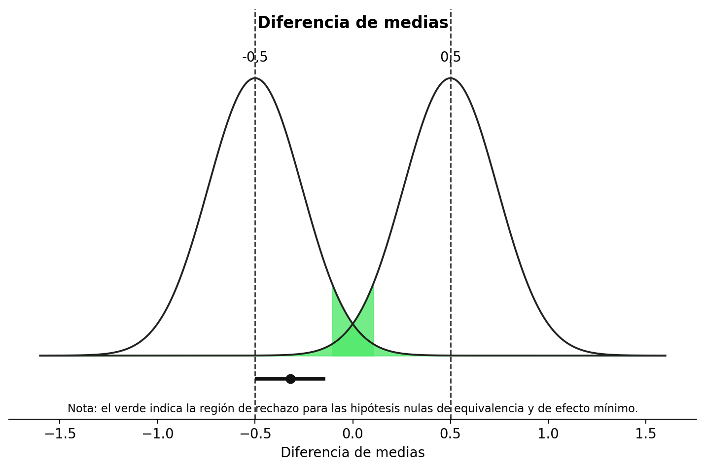{#fig-ciequivalence1}


En @fig-ciequivalence2 vemos los mismos resultados, pero ahora visualizados como un gráfico de densidad de confianza [@schweder_confidence_2016], que es un resumen gráfico de la distribución de confianza. Un gráfico de densidad de confianza le permite ver qué efectos se pueden rechazar con anchuras de intervalo de confianza diferentes. Vemos que los límites del área verde (correspondiente a un intervalo de confianza del 90%) caen dentro de los límites de equivalencia. Por tanto, la prueba de equivalencia es estadísticamente significativa y podemos rechazar estadísticamente la presencia de efectos fuera del rango de equivalencia. También podemos ver que el intervalo de confianza del 95% excluye 0 y, por lo tanto, una prueba de significación de la hipótesis nula tradicional también es estadísticamente significativa.

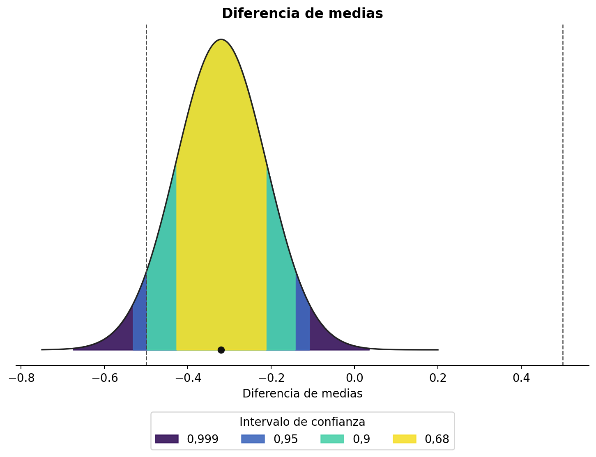{#fig-ciequivalence2}


Es decir, tanto la prueba de hipótesis nula como la prueba de equivalencia han arrojado resultados significativos. Esto significa que podemos afirmar que el efecto observado es estadísticamente diferente de cero, y que el efecto es estadísticamente menor que los efectos que consideramos lo suficientemente grandes como para importar cuando especificamos el rango de equivalencia de -0,5 a 0,5. Esto ilustra cómo la combinación de pruebas de equivalencia y pruebas de hipótesis nulas puede evitar que confundamos efectos estadísticamente significativos con efectos prácticamente relevantes. En este caso, con 200 participantes, podemos rechazar un efecto de 0, pero el efecto, si lo hay, no es lo suficientemente grande como para resultar relevante. En la calculadora interactiva a continuación, puede realizar una prueba de equivalencia para una prueba *t* independiente especificando las medias, las desviaciones estándar, los tamaños de muestra y los límites. Examine los resultados de la prueba para diferentes entornos, como tamaños de muestra grandes, tamaños de muestra pequeños, un efecto verdadero grande y un efecto nulo.


```{=html}
<iframe id="toster-ttest-iframe"
        src="toster_ttest_app_book.html"
        width="100%"
        height="600"
        scrolling="no"
        style="border:none;display:block;margin:1.5rem 0;overflow:hidden;"
        title="Prueba de equivalencia (TOST) para una prueba t independiente">
</iframe>
<script>
window.addEventListener('message', function(e) {
  if (e.data && typeof e.data.iframeHeight === 'number') {
    var f = document.getElementById('toster-ttest-iframe');
    if (f && e.source === f.contentWindow) f.style.height = e.data.iframeHeight + 'px';
  }
});
</script>
```


*En la versión en línea de este libro hay disponible una calculadora interactiva de prueba de equivalencia para una prueba t independiente.*


## Cómo informar de las pruebas de equivalencia

Es una práctica común informar únicamente la prueba que arroja el valor *p* más alto de las dos pruebas unilaterales al informar una prueba de equivalencia. Debido a que ambas pruebas unilaterales deben ser estadísticamente significativas para rechazar la hipótesis nula en una prueba de equivalencia (es decir, la presencia de efectos lo suficientemente grandes como para importar), cuando la mayor de las dos pruebas de hipótesis rechaza el límite de equivalencia, también lo hace la otra prueba. A diferencia de las pruebas de significación de hipótesis nulas, no es común informar tamaños de efecto estandarizados para las pruebas de equivalencia, pero puede haber situaciones en las que los investigadores quieran discutir hasta qué punto se aleja el efecto de los límites de equivalencia en la escala bruta. Evite la interpretación errónea de afirmar que "no hay efecto", que un efecto está "ausente", que el verdadero tamaño del efecto es "cero", o descripciones verbales vagas, como que dos grupos produjeron datos "similares" o "comparables". Una prueba de equivalencia significativa rechaza efectos más extremos que los límites de equivalencia. No se han rechazado efectos verdaderos más pequeños y, por lo tanto, sigue siendo posible que exista un efecto verdadero. Debido a que un procedimiento TOST es una prueba frecuentista basada en un valor *p*, todos los demás [conceptos erróneos sobre los valores *p*](#sec-misconceptions) también deben evitarse.

Al resumir el resultado principal de una prueba de equivalencia, por ejemplo en un resumen, informe siempre el rango de equivalencia con el que se prueban los datos. Leer "basándonos en una prueba de equivalencia concluimos que la ausencia de un efecto relevante" significa algo muy diferente si los límites de equivalencia fueran *d* = -0,9 a 0,9 que cuando los límites fueran *d* = -0,2 a *d* =0,2. Entonces, en su lugar, escriba "basándonos en una prueba de equivalencia con un rango de equivalencia de *d* = -0,2 a 0,2, concluimos la ausencia de un efecto que consideramos significativo". Por supuesto, si los compañeros están de acuerdo en que usted ha concluido correctamente la ausencia de un efecto relevante depende de si están de acuerdo con su justificación de un efecto de interés más pequeño. Una conclusión más neutral sería una afirmación como: "basándonos en una prueba de equivalencia, rechazamos la presencia de efectos más extremos que -0,2 a 0,2, por lo que podemos actuar (con una tasa de error de alfa) como si el efecto, si lo hubiera, fuera menos extremo que nuestro rango de equivalencia". Aquí no se utilizan términos cargados de valores como "significativo". Si tanto una prueba de hipótesis nula como una prueba de equivalencia no son significativas, el hallazgo se describe mejor como "no concluyente": no hay datos suficientes para rechazar el efecto nulo o el menor tamaño del efecto de interés. Si tanto la prueba de hipótesis nula como la prueba de equivalencia son estadísticamente significativas, puede afirmar que hay un efecto, pero al mismo tiempo afirmar que el efecto es demasiado pequeño para ser de interés (dada su justificación para el rango de equivalencia).

Los límites de equivalencia se pueden especificar en tamaños de efecto brutos o en diferencias de medias estandarizadas. Es mejor especificar los límites de equivalencia en términos de tamaños de efecto brutos. Establecerlos en términos de *d* de Cohen conduce a un sesgo en la prueba estadística, ya que la desviación estándar observada debe usarse para traducir el *d* de Cohen especificado en un tamaño de efecto bruto para la prueba de equivalencia (y cuando establece límites de equivalencia en diferencias de medias estandarizadas, TOSTER advertirá: "Advertencia: establecer el tipo de límite en SMD produce resultados sesgados"). En la práctica, el sesgo no es demasiado problemático en ninguna prueba de equivalencia única, y poder especificar los límites de equivalencia en diferencias de medias estandarizadas reduce el umbral para realizar una prueba de equivalencia cuando no se conoce la desviación estándar de su medida. Pero a medida que las pruebas de equivalencia se vuelven más populares y los campos establecen tamaños de efecto de interés más pequeños, deberían hacerlo en diferencias de tamaño de efecto brutas, no en diferencias de tamaño de efecto estandarizadas.

## Pruebas de efecto mínimo {#sec-MET}

Si un investigador ha especificado un menor tamaño del efecto de interés y está interesado en probar si el efecto en la población es mayor que este efecto de interés más pequeño, se puede realizar una prueba de efecto mínimo. Como ocurre con cualquier prueba de hipótesis, podemos rechazar el efecto de interés más pequeño siempre que el intervalo de confianza alrededor del efecto observado no se superponga con él. Sin embargo, en el caso de una prueba de efecto mínimo, el intervalo de confianza debe caer completamente más allá del menor tamaño del efecto de interés. Por ejemplo, supongamos que un investigador realiza una prueba de efecto mínimo con 200 observaciones por condición frente a un menor tamaño del efecto de interés de una diferencia media de 0,5.

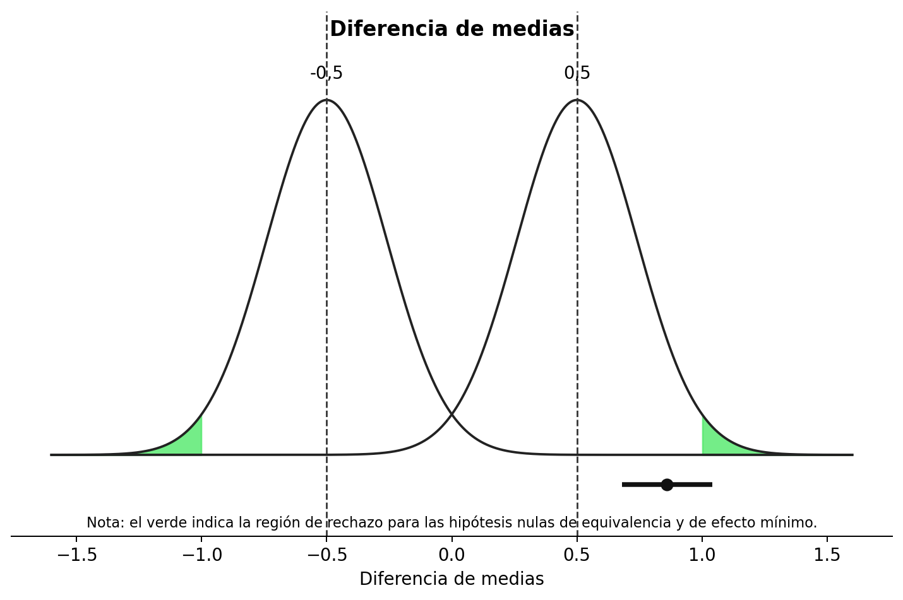{#fig-tmet}


Debajo de las dos curvas volvemos a ver una línea que representa el intervalo de confianza que va de 0,68 a 1,04, y un punto en la línea que indica la diferencia media observada de 0,86. Todo el intervalo de confianza se encuentra muy por encima del efecto mínimo de 0,5 y, por lo tanto, no solo podemos rechazar la hipótesis nula, sino también efectos menores que el efecto mínimo de interés. Por lo tanto, podemos afirmar que el efecto es lo suficientemente grande como para ser no sólo estadísticamente significativo, sino también prácticamente relevante (siempre que hayamos justificado bien nuestro menor tamaño del efecto de interés). Debido a que hemos realizado una prueba de efecto mínimo bilateral, la prueba de efecto mínimo también habría sido significativa si el intervalo de confianza hubiera estado completamente en el lado opuesto de -0,5.

Anteriormente analizamos cómo la combinación del NHST tradicional y una prueba de equivalencia podría generar resultados más informativos. También es posible combinar una prueba de efecto mínimo y una prueba de equivalencia. Incluso se podría decir que tal combinación es la prueba más informativa de una predicción siempre que se pueda especificar un menor tamaño del efecto de interés. En principio, esto es cierto. Siempre que seamos capaces de recoger suficientes datos, siempre obtendremos una respuesta informativa y sencilla cuando combinemos una prueba de efecto mínimo con una prueba de equivalencia: o podemos rechazar todos los efectos que son demasiado pequeños para ser de interés, o podemos rechazar todos los efectos que son lo suficientemente grandes como para ser de interés. Como veremos más adelante en la sección sobre análisis de potencia para hipótesis de intervalo, siempre que el tamaño del efecto real esté cerca del menor tamaño del efecto de interés, será necesario recoger una gran cantidad de observaciones. Y si el verdadero tamaño del efecto resulta ser idéntico al menor tamaño del efecto de interés, ni la prueba del efecto mínimo ni la prueba de equivalencia pueden rechazarse correctamente (y cualquier prueba significativa sería un error de Tipo 1). Si un investigador puede recoger datos suficientes (para que la prueba tenga una alta potencia estadística) y está relativamente seguro de que el verdadero tamaño del efecto será mayor o menor que el efecto de interés más pequeño, entonces la combinación de una prueba de efecto mínimo y una prueba de equivalencia puede ser atractiva, ya que es probable que dicha prueba de hipótesis produzca una respuesta informativa a la pregunta de investigación.

## Análisis de potencia para pruebas de hipótesis de intervalo

Al diseñar un estudio, es una estrategia sensata planificar siempre tanto la presencia como la ausencia de un efecto. Varias revistas científicas exigen una justificación del tamaño de la muestra para los informes registrados en la que la potencia estadística para rechazar la hipótesis nula sea alta, pero el estudio también sea capaz de demostrar la ausencia de un efecto, por ejemplo mediante un análisis de potencia para una prueba de equivalencia. Como vimos en los capítulos sobre [control de errores](02-control-de-errores.html#sec-errorcontrol) y [verosimilitudes](03-verosimilitudes.html#sec-likelihoods), cabe esperar resultados nulos; si solo se piensa en la posibilidad de observar un efecto nulo una vez recogidos los datos, muchas veces ya es demasiado tarde.

La potencia estadística de las hipótesis de intervalo depende del nivel alfa, el tamaño de la muestra, el menor efecto de interés contra el que se decida contrastar y el tamaño real del efecto. Para una prueba de equivalencia es habitual realizar un análisis de potencia suponiendo que el verdadero tamaño del efecto es 0, aunque esto no siempre resulta realista. Cuanto más cerca esté el efecto esperado del menor tamaño del efecto de interés, mayor será la muestra necesaria para alcanzar la potencia deseada. No caiga en la tentación de suponer un efecto verdadero de 0 si tiene buenas razones para esperar uno pequeño pero distinto de cero. El análisis de potencia indicará entonces una muestra menor, pero en realidad también habrá una probabilidad mayor de obtener un resultado no concluyente. Las versiones anteriores de TOSTER solo permitían realizar estos análisis suponiendo un efecto verdadero de 0; una nueva función de Aaron Caldwell permite especificar `delta`, el tamaño del efecto esperado.

Supongamos que un investigador desea alcanzar el 90 % de potencia para una prueba de equivalencia con un rango de equivalencia de -0,5 a 0,5, con un nivel alfa de 0,05 y asumiendo un tamaño del efecto poblacional de 0. Se puede realizar un análisis de potencia para una prueba de equivalencia para examinar el tamaño muestral requerido.

```r
TOSTER::power_t_TOST(power = 0.9, delta = 0,
                     alpha = 0.05, type = "two.sample",
                     low_eqbound = -0.5, high_eqbound = 0.5)
```


Vemos que el tamaño muestral requerido es de 88 participantes en cada condición para la prueba *t* independiente. Comparemos este análisis de potencia con una situación en la que el investigador espera un efecto verdadero de *d* = 0,1, en lugar de un efecto verdadero de 0. Para poder rechazar de manera fiable efectos mayores que 0,5, necesitaremos un tamaño muestral más grande, al igual que necesitamos un tamaño muestral más grande para una prueba de hipótesis nula con capacidad para detectar *d* = 0,4 que una prueba de hipótesis nula con capacidad para detectar *d* = 0,5.

```r
TOSTER::power_t_TOST(power = 0.9, delta = 0.1,
                     alpha = 0.05, type = "two.sample",
                     low_eqbound = -0.5, high_eqbound = 0.5)
```


Vemos que el tamaño de la muestra ahora ha aumentado a 109 participantes en cada condición. Como se mencionó anteriormente, no es necesario realizar una prueba de equivalencia bilateral. También es posible realizar una prueba de equivalencia unilateral. Un ejemplo de una situación en la que una prueba direccional de este tipo es apropiada es un estudio de replicación. Si un estudio anterior observó un efecto de *d* = 0,48 y usted realiza un estudio de replicación, podría decidir considerar cualquier efecto menor que *d* = 0,2 como una falla en la replicación, incluido cualquier efecto en la dirección opuesta, como un efecto de *d* = -0,3. Aunque la mayoría del software para pruebas de equivalencia requiere que usted especifique un límite superior e inferior para un rango de equivalencia, puede imitar una prueba unilateral estableciendo el límite de equivalencia en la dirección que desea ignorar en un valor bajo, de modo que la prueba unilateral contra este valor siempre sea estadísticamente significativa. Esto también se puede utilizar para realizar un análisis de potencia para una prueba de efecto mínimo, donde un límite es el efecto mínimo de interés y el otro límite se establece en un valor extremo en el otro lado del tamaño del efecto esperado.

En el análisis de potencia para un ejemplo de prueba de equivalencia a continuación, el límite inferior se establece en -5 (debe establecerse lo suficientemente bajo como para que reducirlo aún más no tenga un efecto notable). Vemos que la nueva función de potencia en el paquete TOSTER tiene en cuenta la predicción direccional y, al igual que con las predicciones direccionales en una prueba de hipótesis nula de efecto cero, una predicción direccional en una prueba de equivalencia es más eficiente y solo se necesitan 70 observaciones para lograr el 90% de potencia.

```r
# Las nuevas funciones de potencia de TOSTER permiten calcular la potencia para un efecto esperado distinto de cero.
TOSTER::power_t_TOST(power = 0.9, delta = 0,
                     alpha = 0.05, type = "two.sample",
                     low_eqbound = -5, high_eqbound = 0.5)
```


El software estadístico ofrece análisis de potencia para algunas pruebas, pero no para todas. Igual que en el análisis de potencia de una prueba de hipótesis nula, puede ser necesario recurrir a simulaciones. En la calculadora interactiva siguiente puede realizar análisis de potencia *a priori* para una prueba *t* independiente. Explore cómo cambia la muestra requerida con límites más amplios o estrechos, un efecto verdadero de 0 o uno pequeño distinto de cero, y una potencia estadística deseada mayor o menor.


```{=html}
<iframe id="toster-power-iframe"
        src="toster_power_app_book.html"
        width="100%"
        height="600"
        scrolling="no"
        style="border:none;display:block;margin:1.5rem 0;overflow:hidden;"
        title="Análisis de potencia para una prueba de equivalencia (prueba t independiente)">
</iframe>
<script>
window.addEventListener('message', function(e) {
  if (e.data && typeof e.data.iframeHeight === 'number') {
    var f = document.getElementById('toster-power-iframe');
    if (f && e.source === f.contentWindow) f.style.height = e.data.iframeHeight + 'px';
  }
});
</script>
```


*En la versión en línea de este libro se encuentra disponible una calculadora interactiva de análisis de potencia para una prueba de equivalencia para una prueba t independiente.*


## El procedimiento bayesiano ROPE {#sec-ROPE}

En la estimación bayesiana, una forma de argumentar a favor de la ausencia de un efecto relevante es el procedimiento de **región de equivalencia práctica** (ROPE) [@kruschke_bayesian_2013], que es “algo análogo a las pruebas de equivalencia frecuentistas” [@kruschke_bayesian_2017]. En el procedimiento ROPE, se especifica un rango de equivalencia, al igual que en las pruebas de equivalencia, pero se utiliza el intervalo bayesiano de mayor densidad basado en una distribución posterior (como se explica en el capítulo sobre [estadísticas bayesianas](#sec-bayes)) en lugar del intervalo de confianza.

Si la distribución previa utilizada por Kruschke fuera perfectamente uniforme y el procedimiento ROPE y una prueba de equivalencia usaran el mismo intervalo de confianza (por ejemplo, 90%), las dos pruebas arrojarían resultados idénticos. Sólo habría diferencias filosóficas en cómo se interpretan los números. El paquete `BEST` de R que se puede utilizar para realizar el procedimiento ROPE de forma predeterminada utiliza una distribución previa «amplia» y, por lo tanto, los resultados del procedimiento ROPE y una prueba de equivalencia no son exactamente iguales, pero sí muy parecidos. Incluso se podría argumentar que las dos pruebas son "prácticamente equivalentes". Las siguientes figuras muestran datos simulados distribuidos normalmente para dos condiciones (medias de 0 y una desviación estándar de 1) y el resultado del procedimiento ROPE y una prueba de equivalencia TOST.

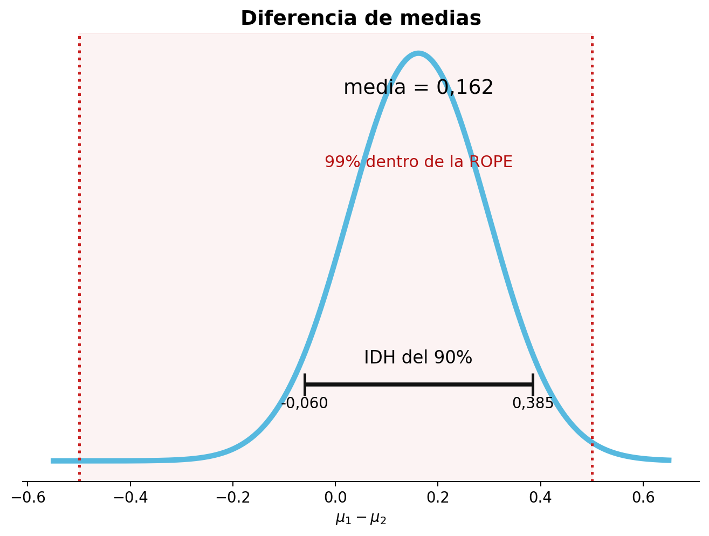

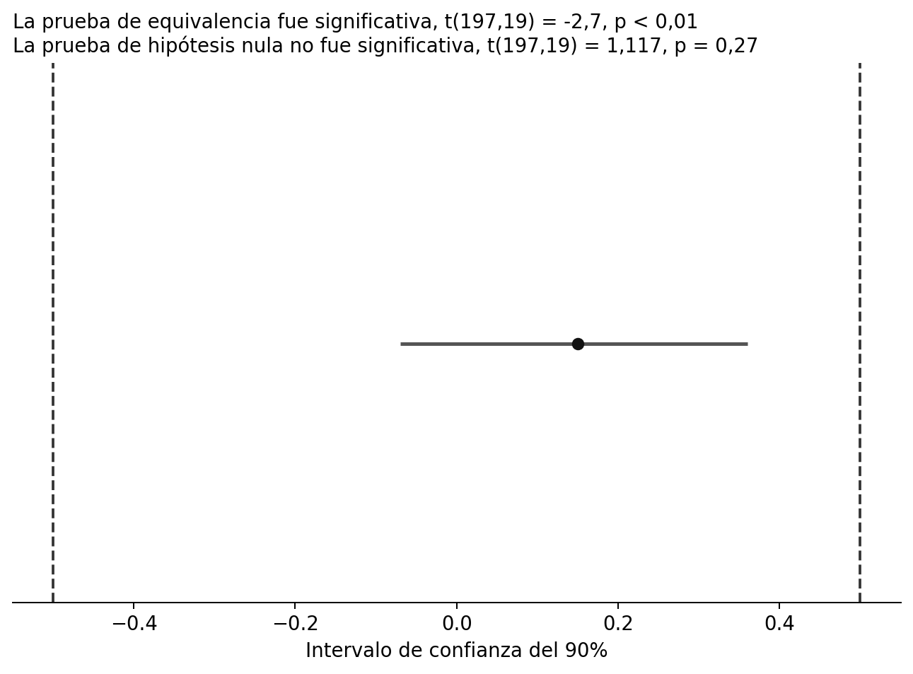


El IDH del 90% oscila entre -0,06 y 0,39, con una media estimada a partir de la distribución previa y los datos de 0,164. El IDH se sitúa completamente entre el límite superior y el inferior del rango de equivalencia y, por tanto, valores más extremos que -0,5 o 0,5 se consideran inverosímiles. El IC del 95% oscila entre -0,07 y 0,36, con una diferencia de medias observada de 0,15. Vemos que los números no son idénticos, porque en la estimación bayesiana los valores observados se combinan con una distribución previa y la estimación media no se basa únicamente en los datos. Pero los resultados son muy similares y, en la mayoría de los casos, conducirán a inferencias similares. El paquete `BEST` de R también permite a los investigadores realizar análisis de potencia basados en simulación, que requieren mucho tiempo pero, cuando se utiliza una distribución previa amplia, arrojan un resultado básicamente idéntico al tamaño muestral de un análisis de potencia para una prueba de equivalencia. El mayor beneficio de ROPE frente a TOST es que permite incorporar información previa. Si dispone de información previa fiable, ROPE puede utilizarla, lo cual resulta especialmente útil cuando no se tienen muchos datos. Si utiliza distribuciones previas informativas, compruebe mediante análisis de sensibilidad la robustez de la distribución posterior ante cambios razonables en la distribución previa.

## ¿Qué anchura de intervalo debe utilizarse? {#sec-whichinterval}

Debido a que el procedimiento TOST se basa en dos pruebas unilaterales, se utiliza un intervalo de confianza del 90% cuando las pruebas unilaterales se realizan a un nivel alfa del 5%. Debido a que tanto la prueba contra el límite superior como la prueba contra el límite inferior deben ser estadísticamente significativas para declarar la equivalencia (que, como se explica en el capítulo sobre [control de errores](02-control-de-errores.html#sec-multiplecomparisons) es un enfoque de intersección y unión para pruebas múltiples), no es necesario corregir el hecho de que se realizan dos pruebas. Si el nivel alfa se ajusta para comparaciones múltiples, o si el nivel alfa está justificado en lugar de confiar en el nivel predeterminado del 5 % (o ambos), se debe utilizar el intervalo de confianza correspondiente, donde CI = 100 - (2 * $\alpha$). Por lo tanto, la amplitud del intervalo de confianza está directamente relacionada con la elección del nivel alfa, ya que tomamos decisiones para rechazar o no el menor tamaño del efecto de interés, en función de si el intervalo de confianza excluyó el efecto contra el que se prueba.

Cuando se utiliza un intervalo de densidad más alta desde una perspectiva bayesiana, como el procedimiento ROPE, la elección de la amplitud de un intervalo de confianza no se deriva lógicamente de una tasa de error deseada ni de ningún otro principio. Kruschke [-@kruschke_doing_2014] escribe: "¿Cómo deberíamos definir 'razonablemente creíble'? Una forma es decir que cualquier punto dentro del IDH del 95% es razonablemente creíble". McElreath [-@mcelreath_statistical_2016] ha recomendado el uso de 67%, 89% y 97%, porque "No hay motivo. Son números primos, lo que los hace fáciles de recordar". Ambas sugerencias carecen de una justificación sólida. Como observó Gosset (o Estudiante), [-@gosset_application_1904]:

> Los resultados solo son valiosos cuando la cantidad en la que probablemente difieren de la verdad es tan pequeña que resulta insignificante para los propósitos del experimento. Las probabilidades que deben seleccionarse dependen:
>
> 1. Del grado de precisión que permite la naturaleza del experimento.
> 2. De la importancia de las cuestiones en juego.

Sólo hay dos soluciones basadas en principios. En primer lugar, si se utiliza una anchura de intervalo de máxima densidad para hacer afirmaciones, estas afirmaciones se harán con ciertas tasas de error, y los investigadores deberían cuantificar el riesgo de afirmaciones erróneas calculando tasas de error frecuentistas. Esto convertiría al procedimiento ROPE en un procedimiento de compromiso bayesiano/frecuentista, donde el cálculo de una distribución posterior permite interpretaciones bayesianas de qué valores de parámetros se creen que son más probables, mientras que las decisiones basadas en si el IDH cae o no dentro de un rango de equivalencia tienen una tasa de error formalmente controlada. Tenga en cuenta que cuando se utiliza una distribución previa informativa, un IDH no coincide con un CI, y la tasa de error cuando se utiliza un IDH sólo se puede derivar mediante simulaciones. La segunda solución es no hacer ninguna afirmación, presentar la distribución posterior completa y dejar que los lectores saquen sus propias conclusiones.

## Establecer el menor tamaño del efecto de interés {#sec-sesoi}

Para realizar una prueba de equivalencia necesitamos especificar qué valores observados son demasiado pequeños para resultar relevantes. Nunca podemos decir que un efecto es exactamente cero, pero podemos examinar si los efectos observados son demasiado pequeños para ser teórica o prácticamente interesantes. Esto requiere que especifiquemos el **menor tamaño del efecto de interés** (SESOI). El mismo concepto recibe muchos nombres, como diferencia mínima importante o diferencia clínicamente importante [@king_point_2011]. Dedique un momento a pensar cuál es el tamaño del efecto más pequeño que aún consideraría relevante desde el punto de vista teórico o práctico para el próximo estudio que esté diseñando. Puede ser difícil determinar cuál es el tamaño del efecto más pequeño que usted consideraría interesante, y la pregunta de cuál es el menor tamaño del efecto de interés podría ser algo en lo que nunca haya pensado realmente, para empezar. Sin embargo, determinar el tamaño del efecto de interés más pequeño tiene importantes beneficios prácticos. En primer lugar, si los investigadores en un campo son capaces de especificar qué efectos serían demasiado pequeños para importar, resulta muy sencillo dimensionar un estudio para los efectos que se consideran relevantes. El segundo beneficio de especificar el tamaño del efecto de interés más pequeño es que hace que su estudio sea falsificable. Que otra persona falsifique sus predicciones puede no ser tan bueno para usted personalmente, pero es bastante útil para la ciencia en su conjunto [@popper_logic_2002]. Después de todo, si no hay forma de que una predicción pueda ser errónea, ¿por qué alguien se impresionaría si la predicción es correcta?

Para empezar a pensar qué tamaños de efectos importan, pregúntese si *cualquier* efecto en la dirección prevista respalda realmente la hipótesis alternativa. Por ejemplo, ¿un tamaño del efecto de *d* de Cohen de 10 respaldaría su hipótesis? En psicología, debería ser raro que una teoría prediga un efecto tan grande, y si observaras un *d* = 10, probablemente comprobarías si hay un error de cálculo o una confusión en el estudio. En el otro extremo de la escala, ¿un efecto de *d* = 0,001 estaría en línea con el mecanismo propuesto teóricamente? Tal efecto es increíblemente pequeño y está muy por debajo de lo que un individuo notaría, ya que estaría por debajo de la **diferencia apenas perceptible** dadas las limitaciones perceptivas y cognitivas. Por lo tanto, un *d* = 0,001 llevaría en la mayoría de los casos a los investigadores a concluir: "Bueno, esto es realmente demasiado pequeño para ser algo que mi teoría ha predicho, y un efecto tan pequeño es prácticamente equivalente a la ausencia de un efecto". Sin embargo, cuando hacemos una predicción direccional, decimos que todos estos tipos de efectos son parte de nuestra hipótesis alternativa. Aunque muchos investigadores estarían de acuerdo en que efectos tan pequeños son demasiado pequeños para importar, todavía respaldan oficialmente nuestra hipótesis alternativa si tenemos una predicción direccional con una hipótesis nula de efecto cero. Además, los investigadores rara vez tienen los recursos para rechazar estadísticamente la presencia de efectos tan pequeños, por lo que la afirmación de que dichos efectos aún respaldarían una predicción teórica hace que la teoría sea **prácticamente infalsificable**: un investigador podría simplemente responder a cualquier estudio de replicación que muestre un efecto pequeño no significativo (por ejemplo, *d* = 0,05) diciendo: "Eso no falsifica mi predicción. Supongo que el efecto es sólo un poco menor que *d* = 0,05", sin tener que admitir que la predicción ha quedado falsada. Esto es problemático, porque si no tenemos un proceso de replicación y falsificación, una disciplina científica corre el riesgo de deslizarse hacia lo infalsificable [@ferguson_vast_2012]. Entonces, siempre que sea posible, cuando diseñe un experimento o formule una teoría y una predicción teórica, piense cuidadosamente y establezca claramente cuál es el menor tamaño del efecto de interés.

## Especificar un SESOI a partir de la teoría

Un ejemplo de un menor tamaño del efecto de interés predicho teóricamente se encuentra en el estudio de Burriss et al. [-@burriss_changes_2015], que examinó si las mujeres mostraban un mayor enrojecimiento facial durante la fase fértil de su ciclo ovulatorio. La hipótesis era que una piel ligeramente más roja indica mayor atractivo y salud física, y que enviar esta señal a los hombres genera una ventaja evolutiva. Esta hipótesis presupone que los hombres puedan detectar el aumento del enrojecimiento a simple vista. Burriss et al. recogieron datos de 22 mujeres y demostraron que el enrojecimiento de la piel del rostro aumentó durante su período fértil. Sin embargo, este aumento no fue lo suficientemente grande como para que los hombres lo detectaran a simple vista, por lo que la hipótesis quedó refutada. Gracias a que se puede medir la diferencia apenas perceptible en el enrojecimiento de la piel, fue posible establecer un SESOI con motivación teórica. Un menor tamaño del efecto de interés motivado teóricamente puede derivarse de diferencias apenas perceptibles, que proporcionan un límite inferior para los tamaños de efecto capaces de influir en los individuos, o basarse en modelos computacionales, que pueden proporcionar un límite inferior para los parámetros del modelo que aún podrán explicar los hallazgos observados en la literatura empírica.

## Métodos basados en anclajes para establecer un SESOI

Partiendo de la idea de una diferencia apenas perceptible, los psicólogos suelen estar interesados en efectos que sean lo suficientemente grandes como para que las personas los noten. Un procedimiento para estimar lo que constituye un cambio relevante a nivel individual es el método basado en anclajes [@jaeschke_measurement_1989; @norman_truly_2004; @king_point_2011]. Las mediciones se recogen en dos momentos (por ejemplo, una medida de calidad de vida antes y después del tratamiento). En el segundo momento, se utiliza una medida independiente (el ancla) para determinar si los individuos no muestran cambios con respecto al momento 1 o si han mejorado o empeorado. A menudo se pide directamente al paciente que responda la pregunta ancla e indique si subjetivamente se siente igual, mejor o peor en el momento 2 que en el momento 1. @button_minimal_2015 utilizó un método basado en anclajes para estimar que una diferencia mínima clínicamente importante en el Inventario de Depresión de Beck correspondía a una reducción del 17,5 % en las puntuaciones respecto al valor inicial.

Anvari y Lakens [-@anvari_using_2021] aplicaron el método basado en anclajes para examinar un efecto de interés más pequeño medido por la ampliamente utilizada Escala de Afecto Positivo y Negativo (PANAS). Los participantes completaron el PANAS de 20 ítems en dos momentos con varios días de diferencia (usando una escala de Likert que va de 1 = “muy ligeramente o nada”, a 5 = “extremadamente”). En el segundo momento también se les pidió que indicaran si su afecto había cambiado poco, mucho o nada. Cuando las personas indicaron que su afecto había cambiado “un poco”, el cambio promedio en unidades Likert fue de 0,26 puntos en la escala para el afecto positivo y de 0,28 puntos en la escala para el afecto negativo. Por lo tanto, una intervención para mejorar el estado afectivo de las personas que debería conducir a lo que los individuos consideran subjetivamente al menos una pequeña mejora podría establecer el SESOI en 0,3 unidades en el PANAS.

## Especificar un SESOI mediante un análisis de coste-beneficio

Otro enfoque basado en principios para justificar un menor tamaño del efecto de interés es realizar un análisis de coste-beneficio. Las investigaciones muestran que el entrenamiento cognitivo puede mejorar las capacidades mentales en los adultos mayores, lo que podría beneficiar a los conductores de más edad [@ball_effects_2002]. A partir de estos hallazgos, Viamonte, Ball y Kilgore [-@viamonte_costbenefit_2006] realizaron un análisis de coste-beneficio y concluyeron que, dado el coste de la intervención (\$247,50), la probabilidad de accidente de los conductores mayores de 75 años (*p* = 0,0710) y el coste de un accidente (\$22.000), aplicar la intervención a todos los conductores de 75 años o más era más eficiente que no intervenir o hacerlo solo después de una prueba de detección. Además, los análisis de sensibilidad revelaron que intervenir sobre todos los conductores seguiría siendo beneficioso siempre que la reducción del riesgo de colisión fuera del 25 %. Por lo tanto, una reducción del 25 % en la probabilidad de que las personas mayores de 75 años sufran un accidente de tráfico podría establecerse como el menor tamaño del efecto de interés.

Para poner otro ejemplo, los economistas han estimado el valor de una vida estadística, a partir de la disposición a pagar para reducir el riesgo de muerte, entre \$1,5 y \$2,5 millones (en el año 2000, en países occidentales; véase Mrozek y Taylor [-@mrozek_what_2002]). A partir de este trabajo, Abelson [-@abelson_value_2003] calculó la disposición a pagar para prevenir problemas de salud agudos, como la irritación ocular, en aproximadamente \$40–\$50 al día. Un investigador podría examinar una intervención psicológica que reduce la cantidad de veces que las personas se tocan la cara cerca de los ojos y, por tanto, la irritación ocular causada por bacterias. Si administrar la intervención cuesta \$20 al año, debería reducir el número medio de días con irritación ocular en la población en al menos 0,5 días para que mereciera la pena. Un análisis de coste-beneficio también puede basarse en los recursos necesarios para estudiar empíricamente un efecto muy pequeño frente al valor que ese conocimiento tendría para la comunidad científica.

## Especificar el SESOI mediante el enfoque de los telescopios pequeños

Idealmente, los investigadores que publican afirmaciones empíricas siempre especificarían qué observaciones falsearían sus afirmaciones. Lamentablemente, esta aún no es una práctica común. Esto es particularmente problemático cuando un investigador realiza una réplica fiel de un trabajo anterior. Debido a que nunca es posible demostrar que un efecto es exactamente cero, y los autores originales rara vez especifican qué rango de tamaños del efecto falsearían sus hipótesis, ha resultado muy difícil interpretar el resultado de un estudio de replicación [@anderson_theres_2016]. ¿Cuándo contradicen los nuevos datos el hallazgo original?

Considere un estudio en el que quiera poner a prueba la idea de la sabiduría de las multitudes. Pide a 20 personas que estimen la cantidad de monedas que hay en un frasco, esperando que el promedio esté muy cerca del valor real. La pregunta de investigación es si las personas pueden, en promedio, adivinar correctamente el número de monedas, que es 500. La media observada de la estimación de 20 personas es 550, con una desviación estándar de 100. La diferencia observada con respecto al valor real es estadísticamente significativa, *t*(19) = 2,37, *p* = 0,0375, con un *d* de Cohen de 0,5. ¿Es posible que la media del grupo esté tan lejos? ¿No existe la sabiduría de las multitudes? ¿Había algo especial en las monedas utilizadas que hiciera especialmente difícil adivinar su número? ¿O fue solo una casualidad? Se propuso realizar una réplica detallada de este estudio.

Quiere que su estudio sea informativo, independientemente de si hay un efecto o no. Esto significa que necesita diseñar un estudio de replicación que le permita sacar una conclusión informativa, independientemente de si la hipótesis alternativa es verdadera (la multitud no estimará con precisión el número real de monedas) o si la hipótesis nula es verdadera (la multitud adivinará 500 monedas y el estudio original fue una casualidad). Pero dado que el investigador original no especificó un menor tamaño del efecto de interés, ¿cuándo un estudio de replicación le permitiría concluir que los nuevos datos contradicen el estudio original? Quizás algunos consideren que observar una media de exactamente 500 es bastante convincente, pero debido a la variación aleatoria (casi) nunca encontrará una puntuación media de exactamente 500. Un resultado no significativo no puede interpretarse como la ausencia de un efecto, porque su estudio podría tener un tamaño muestral demasiado pequeño para detectar efectos relevantes, y el resultado podría ser un error de tipo 2. Entonces, ¿cómo podemos avanzar y definir un tamaño del efecto que sea relevante? ¿Cómo se puede diseñar un estudio que tenga la capacidad de falsear un hallazgo anterior?

Uri Simonsohn [-@simonsohn_small_2015] define un efecto pequeño como “uno que daría un 33% de potencia al estudio original”. En otras palabras, el tamaño del efecto que daría al estudio original una probabilidad de 2:1 *en contra* de observar un resultado estadísticamente significativo si hubiera un efecto. La idea es que si el estudio original tuviera un 33% de potencia, la probabilidad de observar un efecto significativo, si hubiera un efecto verdadero, es demasiado baja para distinguir de manera fiable la señal del ruido (o situaciones en las que hay un efecto verdadero de situaciones en las que no hay ningún efecto verdadero). Simonsohn (2015, p. 561) llama a esto el **enfoque de los telescopios pequeños** y escribe: "Imagínense un astrónomo que afirma haber encontrado un nuevo planeta con un telescopio. Otro astrónomo intenta replicar el descubrimiento usando un telescopio más grande y no encuentra nada. Aunque esto no prueba que el planeta no exista, contradice los hallazgos originales, porque los planetas que son observables con el telescopio más pequeño también deberían ser observables con el más grande".

Aunque este enfoque para establecer un menor tamaño del efecto de interés (SESOI) es arbitrario (¿por qué no 30% de potencia o 35%?), es suficiente para fines prácticos (y usted es libre de elegir un nivel de potencia que considere demasiado bajo). Lo bueno de esta definición de SESOI es que si conoce el tamaño de la muestra del estudio original, siempre puede calcular el tamaño del efecto que ese estudio tenía una potencia del 33%. Por lo tanto, siempre puede utilizar este enfoque para establecer el menor tamaño del efecto de interés. Si no se encuentra apoyo para un tamaño del efecto que el estudio original tiene una potencia del 33%, no significa que no haya un efecto verdadero, y ni siquiera que el efecto sea demasiado pequeño para tener algún interés teórico o práctico. Pero utilizar el enfoque de los telescopios pequeños es un buen primer paso, ya que iniciará la conversación sobre qué efectos son relevantes y permitirá a los investigadores que quieran replicar un estudio especificar cuándo considerarían falsificada la afirmación original.

Con el enfoque de los telescopios pequeños, el SESOI se basa únicamente en el tamaño de la muestra del estudio original. Se establece un menor tamaño del efecto de interés sólo para efectos en la misma dirección. Todos los efectos menores que este efecto (incluidos los efectos grandes en la dirección opuesta) se interpretan como una falla en la replicación de los resultados originales. Vemos que el enfoque de los telescopios pequeños es una **prueba de equivalencia unilateral**, donde solo se especifica el límite superior y el tamaño del efecto de interés más pequeño se determina en función del tamaño de la muestra del estudio original. La prueba examina si podemos rechazar efectos tan grandes o mayores que el efecto que el estudio original tiene una potencia del 33%. Es una prueba simple y unilateral, no contra 0, sino contra un SESOI.

Por ejemplo, considere nuestro estudio anterior en el que 20 personas intentaron estimar la cantidad de monedas. Los resultados se analizaron con una prueba *t* bilateral de una muestra, utilizando un nivel alfa de 0,05. Para determinar el tamaño del efecto para el cual este estudio tuvo una potencia del 33%, podemos realizar un análisis de sensibilidad. En un análisis de sensibilidad calculamos el tamaño del efecto requerido dados el alfa, el tamaño de la muestra y la potencia estadística deseada. Tenga en cuenta que Simonsohn utiliza una prueba bilateral en sus análisis de potencia, que seguiremos aquí: si el estudio original informó una predicción direccional registrada previamente, el análisis de potencia debe basarse en una prueba unilateral. En este caso, el nivel alfa es 0,05, el tamaño total de la muestra es 20 y la potencia deseada es 33%. Calculamos el tamaño del efecto que nos da un 33% de potencia y vemos que es un *d* de Cohen de 0,358. Esto significa que podemos establecer nuestro menor tamaño del efecto de interés para el estudio de replicación en *d* = 0,358. Si podemos rechazar efectos tan grandes o mayores que *d* = 0,358, podemos concluir que el efecto es menor que cualquier efecto para el que el estudio original tuviera una potencia del 33%. La siguiente captura de pantalla ilustra la configuración correcta en G\*Power y el código en R es:

```r
library("pwr")

pwr::pwr.t.test(
  n = 20,
  sig.level = 0.05,
  power = 0.33,
  type = "one.sample",
  alternative = "two.sided"
)
```


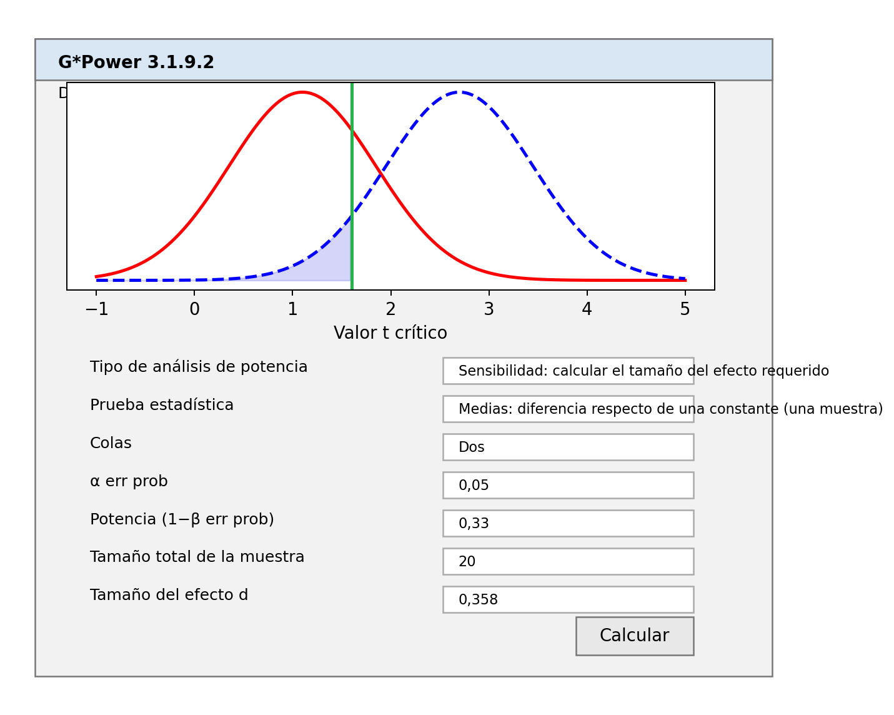{#fig-smalltelpower}


La determinación del SESOI en función del tamaño del efecto que el estudio original tenía una potencia del 33% tiene una propiedad conveniente adicional. Imagine que el verdadero tamaño del efecto es en realidad 0 y realiza una prueba estadística para ver si los datos son estadísticamente más pequeños que el SESOI según el enfoque de los telescopios pequeños (lo que se denomina prueba de inferioridad). Si aumenta el tamaño de la muestra 2,5 veces, tendrá aproximadamente un 80 % de potencia para esta prueba de equivalencia unilateral, asumiendo que el tamaño del efecto real es exactamente 0 (por ejemplo, *d* = 0). Las personas que realizan un estudio de replicación pueden seguir las recomendaciones de los telescopios pequeños y determinar muy fácilmente tanto el menor tamaño del efecto de interés como el tamaño muestral necesario para diseñar un estudio de replicación informativo, asumiendo que el tamaño del efecto real es 0 (pero consulte la sección anterior para análisis de potencia a priori en los que desea probar la equivalencia, pero no espera un tamaño del efecto real de 0).

La siguiente figura, de Simonsohn (2015) ilustra el enfoque de los telescopios pequeños utilizando un ejemplo de la vida real. El estudio original de Zhong y Liljenquist (2006) tenía una muestra pequeña de 30 participantes en cada condición y observó un tamaño del efecto de *d* = 0,53, que apenas era estadísticamente diferente de cero. Dado un tamaño muestral de 30 por condición, el estudio tuvo una potencia del 33% para detectar efectos mayores que *d* = 0,401. Este “pequeño efecto” está indicado por la línea discontinua verde. En R, el tamaño del efecto de interés más pequeño se calcula utilizando:

```r
pwr::pwr.t.test(
  n = 30,
  sig.level = 0.05,
  power = 1/3,
  type = "two.sample",
  alternative = "two.sided"
)
```


Tenga en cuenta que el 33% de potencia es un valor redondeado y el cálculo utiliza 1/3 (o 0,3333333…).

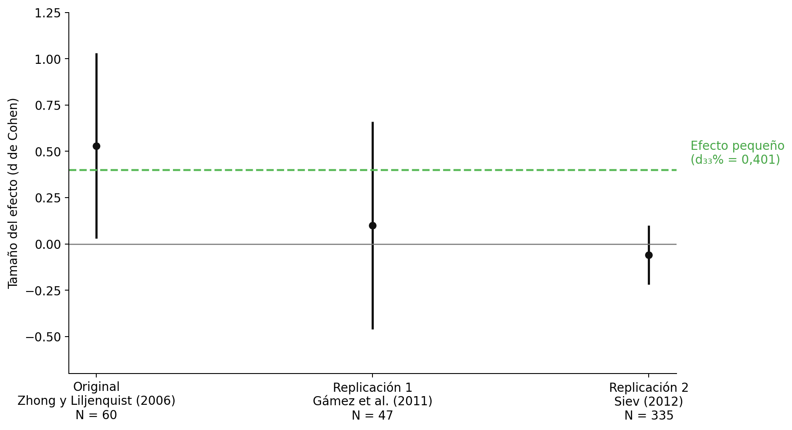{#fig-simonsohnexample}


Podemos ver que la primera réplica de Gámez y sus colegas también tuvo un tamaño muestral relativamente pequeño (N = 47, en comparación con N = 60 en el estudio original) y no fue diseñada para producir resultados informativos cuando se interpreta con un enfoque de telescopios pequeños. El intervalo de confianza es muy amplio e incluye el efecto nulo (*d* = 0) y el tamaño del efecto de interés más pequeño (*d* = 0,401). Por tanto, este estudio no es concluyente. No podemos rechazar el valor nulo, pero tampoco podemos rechazar tamaños de efecto de 0,401 o mayores que todavía se consideran acordes con el resultado original. La segunda replicación tiene un tamaño muestral mucho mayor y nos dice que no podemos rechazar el efecto nulo, pero podemos rechazar el menor tamaño del efecto de interés, lo que sugiere que el efecto es menor de lo que se considera un efecto interesante según el enfoque de los telescopios pequeños.

Aunque las recomendaciones del *pequeño telescopio* son fáciles de usar, se debe tener cuidado de no convertir ningún procedimiento estadístico en una heurística. En nuestro ejemplo anterior con los 20 árbitros, se usaría un *d* de Cohen de 0,358 como menor tamaño del efecto de interés, y se recogería un tamaño muestral de 50 (2,5 veces los 20 originales), pero si alguien hiciera el esfuerzo de realizar un estudio de replicación, sería relativamente fácil recoger un tamaño muestral mayor. Alternativamente, si el estudio original hubiera sido extremadamente grande, habría tenido una alta potencia para efectos que podrían no resultar relevantes en la práctica, y no querríamos recoger 2,5 veces más observaciones en un estudio de replicación. De hecho, como escribe Simonsohn: "si necesitamos 2,5 veces el tamaño de la muestra original o no depende de la pregunta que deseamos responder. Si estamos interesados en probar si el tamaño del efecto es menor que d33%, entonces sí, necesitamos alrededor de 2,5 veces el tamaño de la muestra original, sin importar cuán grande sea la muestra original. Sin embargo, cuando las muestras son muy grandes, esa puede no ser la cuestión de interés". Piense siempre en la pregunta que desea formular y diseñe el estudio de manera que proporcione una respuesta informativa a una pregunta de interés. No siga automáticamente una heurística de 2,5 veces n y reflexione siempre sobre si el uso de un procedimiento sugerido es apropiado en su situación.

## Establecer el menor tamaño del efecto de interés a partir del efecto mínimo estadísticamente detectable

Dado un tamaño muestral y un nivel alfa, cada prueba tiene un [efecto mínimo estadísticamente detectable](02-control-de-errores.html#sec-minimaldetectable). Por ejemplo, dada una prueba con 86 participantes en cada grupo y un nivel alfa del 5%, solo las pruebas *t* que arrojen un *t* ≥ 1,974 serán estadísticamente significativas. En otras palabras, *t* = 1,974 es el **valor *t* crítico**. Dado un tamaño muestral y un nivel alfa, el valor *t* crítico se puede transformar en un valor ***d* crítico**. Como se visualiza en @fig-distpowerplot1, con *n* = 50 en cada grupo y un nivel alfa del 5%, el valor *d* crítico es 0,4. Esto significa que solo efectos mayores que 0,4 producirán un *p* \< 0,05. El valor crítico *d* está influido por el tamaño muestral por grupo y el nivel alfa, pero no depende del tamaño real del efecto.

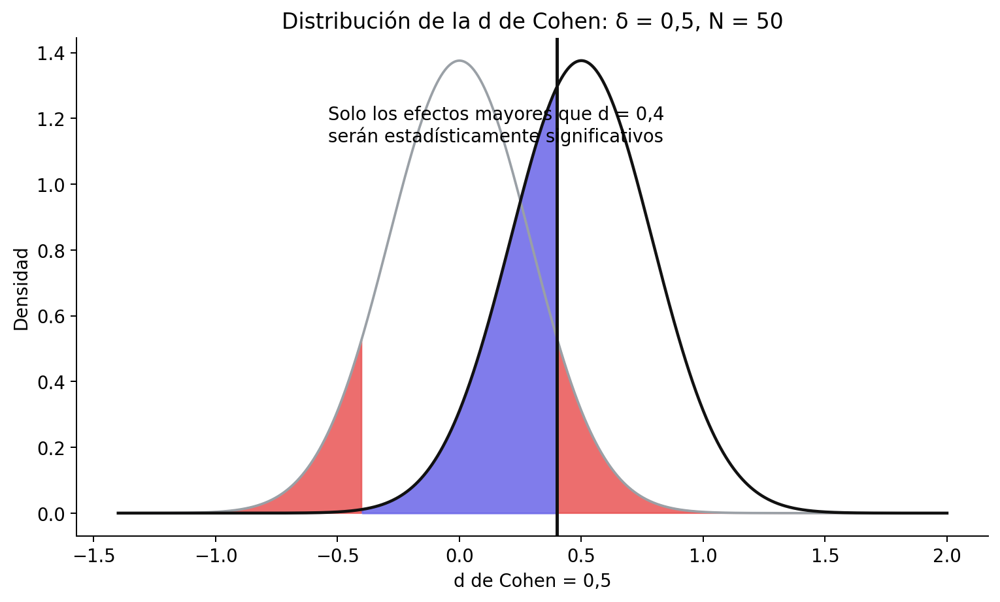{#fig-distpowerplot1}


Es posible observar un resultado de prueba estadísticamente significativo si el tamaño del efecto real es *menor* que el tamaño del efecto crítico. Debido a la variación aleatoria, es posible observar un valor mayor en una *muestra* que el valor real en la población. Ésta es la razón por la que la potencia estadística de una prueba nunca es 0 en una prueba de significación de la hipótesis nula. Como se ilustra en @fig-distpowerplot2, incluso si el verdadero tamaño del efecto es menor que el valor crítico (es decir, si el verdadero tamaño del efecto es 0,2), vemos en la distribución que podemos esperar que algunos *tamaños del efecto observados* sean mayores que 0,4 cuando el *verdadero tamaño del efecto poblacional* es *d* = 0,2; si calculamos la potencia estadística para esta prueba, resulta que podemos esperar que el 16,77% de los *tamaños del efecto observados* sean mayores que 0,4, a largo plazo. Eso no es mucho, pero es algo. Esta es también la razón por la que el sesgo de publicación combinado con investigaciones con poca potencia es problemático: conduce a una gran **sobreestimación del verdadero tamaño del efecto** cuando solo los tamaños del efecto observados a partir de hallazgos estadísticamente significativos en estudios con poca potencia terminan en la literatura científica.

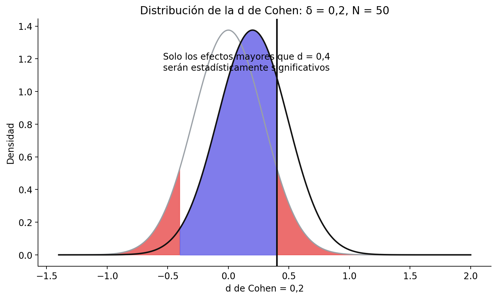{#fig-distpowerplot2}


Podemos utilizar el efecto mínimo estadísticamente detectable para establecer el SESOI para estudios de replicación. Si intenta replicar un estudio, una opción justificable al elegir el tamaño del efecto de interés más pequeño (SESOI) es utilizar el tamaño del efecto observado más pequeño que podría haber sido estadísticamente significativo en el estudio que está replicando. En otras palabras, usted decide que los efectos que no podrían haber producido un valor *p* menor que $\alpha$% en un estudio original no se considerarán relevantes en el estudio de replicación. La suposición aquí es que los autores originales estaban interesados en observar un efecto significativo y, por lo tanto, no estaban interesados en tamaños de efecto observados que no podrían haber arrojado un resultado significativo. Podría ser probable que los autores originales no consideraran qué tamaños de efecto su estudio tenía una buena potencia estadística para detectar, o que estuvieran interesados en efectos más pequeños pero apostaran por observar un efecto especialmente grande en la muestra simplemente como resultado de una variación aleatoria. Incluso entonces, al basarnos en investigaciones anteriores que no especifican un SESOI, un punto de partida justificable podría ser establecer el SESOI en el tamaño del efecto más pequeño que, cuando se observó en el estudio original, **podría haber sido estadísticamente significativo**. Es posible que no todos los investigadores estén de acuerdo con esto (por ejemplo, los autores originales podrían decir que en realidad les importaba tanto un efecto de *d* =0,001). Sin embargo, a medida que intentamos cambiar el campo de la situación actual en la que nadie especifica qué falsearía su hipótesis, o cuál es el menor tamaño del efecto de interés, este enfoque es una forma de comenzar. En la práctica, como se explica en la sección sobre [potencia post-hoc](#sec-posthocpower), debido a la relación entre *p* = 0,05 y 50 % de potencia para el tamaño del efecto observado, esta justificación para un SESOI significará que el SESOI se establece en el tamaño del efecto que el estudio original tenía un 50 % de potencia para detectar para una prueba *t* independiente. Este enfoque es en cierto modo similar al enfoque de los telescopios pequeños de Simonsohn (2015), excepto que conducirá a un SESOI algo más grande.

Establecer un tamaño de efecto de interés mínimo para un estudio de replicación es un poco como un partido de tenis. Los autores originales sacan y golpean la pelota a través de la red, diciendo "mira, algo está pasando". El enfoque para establecer el SESOI en el tamaño del efecto que podría haber sido significativo en el estudio original es una volea de retorno que le permite decir "no parece haber nada lo suficientemente grande que podría haber sido significativo en su propio estudio original" después de realizar un estudio de replicación bien diseñado con alta potencia estadística para rechazar el SESOI. Este nunca es el final del partido: los autores originales pueden intentar devolver la pelota con una declaración más específica sobre los efectos que predice su teoría y demostrar que un tamaño del efecto más pequeño está presente. Pero la pelota vuelve a estar en su campo, y si quieren seguir afirmando que existe un efecto, tendrán que respaldar su afirmación con nuevos datos.

Más allá de los estudios de replicación, el efecto mínimo estadísticamente detectable también se puede calcular en función de los tamaños de muestra que normalmente se utilizan en un campo de investigación. Por ejemplo, imagine una línea de investigación en la que una hipótesis casi siempre se ha probado mediante la realización de una prueba *t* de una muestra, y donde los tamaños de muestra que se recopilan son siempre menores que 100 observaciones. Una prueba *t* de una muestra en 100 observaciones, utilizando un alfa de 0,05 (bilateral), tiene una potencia del 80% para detectar un efecto de *d* = 0,28 (como se puede calcular en un análisis de sensibilidad de la potencia). En un nuevo estudio, la conclusión de que se puede rechazar de manera fiable la presencia de efectos más extremos que *d* = 0,28 sugiere que los tamaños de muestra de 100 podrían no ser suficientes para detectar efectos en tales líneas de investigación. Rechazar la presencia de efectos más extremos que *d* = 0,28 no prueba una predicción teórica, pero contribuye a la literatura al responder una **pregunta de recurso**. Sugiere que futuros estudios en esta línea de investigación necesitarán cambiar el diseño de sus estudios aumentando sustancialmente el tamaño de la muestra. Establecer el menor tamaño del efecto de interés con base en este enfoque no responde a ninguna pregunta teórica (después de todo, el SESOI no se basa en ninguna predicción teórica). Pero este enfoque para especificar un menor tamaño del efecto de interés puede hacer una contribución útil a la literatura al informar a los pares que el efecto no es lo suficientemente grande como para que pueda estudiarse de manera fiable dados los tamaños de muestra que los investigadores suelen recoger. Esto no significa que el efecto no sea interesante, pero podría ser una indicación de que el campo necesitará coordinar la recolección de datos en el futuro, porque el efecto es demasiado pequeño para realizar un estudio confiable con los tamaños de muestra que se recogeron en el pasado.

## Ponte a prueba
### Preguntas sobre pruebas de equivalencia

**Pregunta 1:** Cuando el IC del 90 % alrededor de una diferencia media se encuentra justo dentro del rango de equivalencia de -0,4 a 0,4, podemos rechazar el tamaño del efecto de interés más pequeño. Según su conocimiento sobre los intervalos de confianza, cuando el rango de equivalencia se cambia a -0,3 – 0,3, ¿qué se necesita para que la prueba de equivalencia sea significativa (asumiendo que la estimación del tamaño del efecto y la desviación estándar siguen siendo las mismas)?

- A. Un tamaño de efecto mayor.
- B. Un nivel alfa más bajo.
- C. Un tamaño muestral mayor.
- D. Menor potencia estadística.


**Pregunta 2:** ¿Por qué es incorrecto concluir que no hay ningún efecto cuando una prueba de equivalencia es estadísticamente significativa?

- A. Una prueba de equivalencia es una declaración sobre los datos, no sobre la presencia o ausencia de un efecto.
- B. El resultado de una prueba de equivalencia podría ser un error de Tipo 1 y, por lo tanto, se debería concluir que no hay ningún efecto o que se ha observado un error de Tipo 1.
- C. Una prueba de equivalencia rechaza valores tan grandes o mayores que el menor tamaño del efecto de interés, por lo que no se puede rechazar la posibilidad de que exista un efecto pequeño distinto de cero.
- D. Concluimos que no hay efecto cuando la prueba de equivalencia no es significativa, no cuando la prueba de equivalencia es significativa.


**Pregunta 3:** Los investigadores están interesados en demostrar que los estudiantes que usan un libro de texto en línea se desempeñan tan bien como los estudiantes que usan un libro de texto en papel. Si es así, pueden recomendar a los profesores que permitan a los estudiantes elegir su medio preferido, pero si hay un beneficio, recomendarían el medio que conduzca a un mejor desempeño de los estudiantes. Asignan aleatoriamente a los estudiantes para que utilicen un libro de texto en línea o un libro de texto en papel, y comparan sus calificaciones en el examen del curso (desde la peor calificación posible, 1, hasta la mejor calificación posible, 10). Encuentran que ambos grupos de estudiantes se desempeñan de manera similar, en la condición del libro de texto en papel *m* = 7,35, *sd* = 1,15, *n* = 50, y en la del libro de texto en línea *m* = 7,13, *sd* = 1,21, *n* = 50. Supongamos que consideramos que cualquier efecto igual o superior a medio punto (0,5) merece la pena, pero cualquier diferencia menor que 0,5 es demasiado pequeña para importar, y el nivel alfa se establece en 0,05. ¿Qué concluirían los autores? Copie el siguiente código en R, reemplazando todos los ceros con los números correctos. Escriba `?tsum_TOST` para obtener ayuda con la función.

<!-- ```{r eval = FALSE} -->

<!-- result <- TOSTER::tsum_TOST(m1 = 7.35, -->
<!--                   sd1 = 1.15, -->
<!--                   n1 = 50, -->
<!--                   m2 = 7.13, -->
<!--                   sd2 = 1.21, -->
<!--                   n2 = 50, -->
<!--                   low_eqbound = -0.5, -->
<!--                   high_eqbound = 0.5, -->
<!--                   eqbound_type = "raw", -->
<!--                   alpha = 0.05) -->
<!-- ``` -->


```r
result <- TOSTER::tsum_TOST(
  m1 = 0.00,
  sd1 = 0.00,
  n1 = 0,
  m2 = 0.00,
  sd2 = 0.00,
  n2 = 0,
  low_eqbound = -0.0,
  high_eqbound = 0.0,
  eqbound_type = "raw",
  alpha = 0.05
)

# imprimir el resultado
result

# trazar el resultado
plot(result, type = "tnull", estimates = "raw")

```


- A. Podemos **rechazar** un tamaño de efecto de cero y podemos **rechazar** la presencia de efectos tan grandes o mayores que el menor tamaño del efecto de interés.
- B. Podemos **no rechazar** un tamaño del efecto de cero y podemos **rechazar** la presencia de efectos tan grandes o mayores que el menor tamaño del efecto de interés.
- C. Podemos **rechazar** un tamaño de efecto de cero y **no podemos rechazar** la presencia de efectos tan grandes o mayores que el menor tamaño del efecto de interés.
- D. Podemos **no rechazar** un tamaño del efecto de cero y **no podemos rechazar** la presencia de efectos tan grandes o mayores que el menor tamaño del efecto de interés.


**Pregunta 4:** Si aumentamos el tamaño de la muestra en la pregunta 3 a 150 participantes en cada condición, y asumiendo que las medias y desviaciones estándar observadas serían exactamente las mismas, ¿a qué conclusión llegaríamos?

- A. Podemos **rechazar** un tamaño de efecto de cero y podemos **rechazar** la presencia de efectos tan grandes o mayores que el menor tamaño del efecto de interés.
- B. Podemos **no rechazar** un tamaño del efecto de cero y podemos **rechazar** la presencia de efectos tan grandes o mayores que el menor tamaño del efecto de interés.
- C. Podemos **rechazar** un tamaño de efecto de cero y **no podemos rechazar** la presencia de efectos tan grandes o mayores que el menor tamaño del efecto de interés.
- D. Podemos **no rechazar** un tamaño del efecto de cero y **no podemos rechazar** la presencia de efectos tan grandes o mayores que el menor tamaño del efecto de interés.


**Pregunta 5:** Si aumentamos el tamaño de la muestra en la pregunta 3 a 500 participantes en cada condición, y asumiendo que las medias y las desviaciones estándar observadas serían exactamente las mismas, ¿qué conclusión sacaríamos?

- A. Podemos **rechazar** un tamaño de efecto de cero y podemos **rechazar** la presencia de efectos tan grandes o mayores que el menor tamaño del efecto de interés.
- B. Podemos **no rechazar** un tamaño del efecto de cero y podemos **rechazar** la presencia de efectos tan grandes o mayores que el menor tamaño del efecto de interés.
- C. Podemos **rechazar** un tamaño de efecto de cero y **no podemos rechazar** la presencia de efectos tan grandes o mayores que el menor tamaño del efecto de interés.
- D. Podemos **no rechazar** un tamaño del efecto de cero y **no podemos rechazar** la presencia de efectos tan grandes o mayores que el menor tamaño del efecto de interés.


A veces el resultado de una prueba es **no concluyente**, ya que tanto la prueba de hipótesis nula como la prueba de equivalencia no son estadísticamente significativas. La única solución en tal caso es recoger datos adicionales. A veces, tanto la prueba de hipótesis nula como la prueba de equivalencia son estadísticamente significativas, en cuyo caso el efecto es **estadísticamente diferente de cero, pero prácticamente insignificante** (según la justificación del SESOI).

**Pregunta 6:** Podríamos preguntarnos cuál fue la potencia estadística de la prueba de la pregunta 3, suponiendo que no hubiera una diferencia real entre los dos grupos —es decir, un tamaño del efecto verdadero de 0—. Con la nueva función `power_t_TOST` del paquete de R `TOSTER`, podemos calcularla mediante un análisis de sensibilidad: introducimos el tamaño muestral de 50 por grupo, el efecto verdadero supuesto de 0, los límites de equivalencia y el nivel alfa. Como los límites de la pregunta 3 se expresaron en la escala original, también debemos aportar una estimación de la desviación estándar poblacional; supongamos que es 1,2. Redondee la respuesta a dos decimales. Escriba `?power_t_TOST` para obtener ayuda con la función. ¿Cuál era la potencia de la prueba de la pregunta 3?


<!-- ```{r eval = FALSE} -->
<!-- TOSTER::power_t_TOST( -->
<!--   n = 50, -->
<!--   delta = 0.0, -->
<!--   sd = 1.2, -->
<!--   low_eqbound = -0.5, -->
<!--   high_eqbound = 0.5, -->
<!--   alpha = 0.05, -->
<!--   type = "two.sample" -->
<!-- ) -->
<!-- ``` -->

```r
TOSTER::power_t_TOST(
  n = 00,
  delta = 0.0,
  sd = 0.0,
  low_eqbound = -0.0,
  high_eqbound = 0.0,
  alpha = 0.05,
  type = "two.sample"
)
```


- A. 0,00
- B. 0,05
- C. 0,33
- D. 0,40


**Pregunta 7:** Supongamos que solo hubiéramos tenido 15 participantes en cada grupo en la pregunta 3, en lugar de 50. ¿Cuál sería la potencia estadística de la prueba con este tamaño muestral más pequeño (manteniendo todas las demás configuraciones como en la pregunta 6)? Redondee la respuesta a 2 dígitos.

- A. 0,00
- B. 0,05
- C. 0,33
- D. 0,40


**Pregunta 8:** Quizás recuerde de las discusiones sobre la potencia estadística para una prueba de significación de la hipótesis nula que la potencia estadística nunca es menor que el 5 % (si el tamaño del efecto real es 0, el nivel de potencia no está formalmente definido, pero observaremos al menos un 5 % de errores de tipo 1, y el nivel de potencia aumenta al introducir un efecto verdadero). En una prueba de equivalencia bilateral, la potencia puede ser inferior al nivel alfa. ¿Por qué?

- A. Porque en una prueba de equivalencia la tasa de error Tipo 1 no está limitada al 5%.
- B. Porque en una prueba de equivalencia la hipótesis nula y la hipótesis alternativa se invierten y, por lo tanto, la tasa de error de tipo 2 no tiene un límite inferior (al igual que la tasa de error de tipo 1 en NHST no tiene un límite inferior).
- C. Debido a que el intervalo de confianza debe estar entre el límite inferior y superior del intervalo de equivalencia, y con tamaños de muestra pequeños, esta probabilidad puede ser cercana a cero (porque el intervalo de confianza es muy amplio).
- D. Porque la prueba de equivalencia se basa en un intervalo de confianza y no en un valor *p* y, por lo tanto, la potencia no está limitada por el nivel alfa.


**Pregunta 9:** Un estudio bien diseñado tiene una alta potencia para detectar un efecto de interés, pero también para rechazar el menor tamaño del efecto de interés. Realice un análisis de potencia *a priori* para la situación descrita en la pregunta 3. ¿Qué tamaño muestral se debe recoger en **cada grupo** para alcanzar una potencia del 90 % (o 0,9), suponiendo que el verdadero tamaño del efecto es 0 y que la desviación estándar poblacional es 1,2? Utilice el código siguiente y redondee hacia arriba el tamaño muestral, ya que no se puede recoger una observación parcial.


<!-- ```{r eval = FALSE} -->
<!-- TOSTER::power_t_TOST( -->
<!--   power = 0.90, -->
<!--   delta = 0.0, -->
<!--   sd = 1.2, -->
<!--   low_eqbound = -0.5, -->
<!--   high_eqbound = 0.5, -->
<!--   alpha = 0.05, -->
<!--   type = "two.sample" -->
<!-- ) -->
<!-- ``` -->


```r
TOSTER::power_t_TOST(
  power = 0.00,
  delta = 0.0,
  sd = 0.0,
  low_eqbound = -0.0,
  high_eqbound = 0.0,
  alpha = 0.05,
  type = "two.sample"
)
```


- A. 100
- B. 126
- C. 200
- D. 252


**Pregunta 10:** Supongamos que al realizar el análisis de potencia para la pregunta 9 no esperábamos que el verdadero tamaño del efecto fuera 0, pero en realidad esperábamos una diferencia media de 0,1 puntos. ¿Qué tamaño muestral en **cada grupo** necesitaríamos recoger para la prueba de equivalencia, ahora que esperamos un tamaño del efecto real de 0,1? Cambie la variable `delta` en `power_t_TOST` para responder esta pregunta.

<!-- ```{r eval = FALSE} -->
<!-- TOSTER::power_t_TOST( -->
<!--   power = 0.90, -->
<!--   delta = 0.1, -->
<!--   sd = 1.2, -->
<!--   low_eqbound = -0.5, -->
<!--   high_eqbound = 0.5, -->
<!--   alpha = 0.05, -->
<!--   type = "two.sample" -->
<!-- ) -->
<!-- ``` -->

- A. 117
- B. 157
- C. 314
- D. 3118


**Pregunta 11:** Cambie el rango de equivalencia a -0,1 y 0,1 para la pregunta 9 (y establezca el tamaño del efecto esperado de `delta` en 0). Para poder rechazar efectos fuera de un rango de equivalencia tan estrecho, necesitará un tamaño muestral grande. Con un alfa de 0,05 y una potencia deseada de 0,9 (o 90%), ¿cuántos participantes necesitaría en **cada grupo**?

<!-- ```{r eval = FALSE} -->
<!-- TOSTER::power_t_TOST( -->
<!--   power = 0.90, -->
<!--   delta = 0.0, -->
<!--   sd = 1.2, -->
<!--   low_eqbound = -0.1, -->
<!--   high_eqbound = 0.1, -->
<!--   alpha = 0.05, -->
<!--   type = "two.sample" -->
<!-- ) -->
<!-- ``` -->

- A. 117
- B. 157
- C. 314
- D. 3118


Puede ver que se necesita un tamaño muestral muy grande para tener una potencia alta que rechace de manera fiable efectos muy pequeños. Esto no debería sorprender. Después de todo, ¡también requiere un tamaño muestral muy grande para *detectar* pequeños efectos! Es por eso que normalmente dejamos para un futuro metanálisis detectar, o rechazar, la presencia de pequeños efectos.

**Pregunta 12:** Puede realizar pruebas de equivalencia para todas las pruebas. El paquete TOSTER tiene funciones para pruebas *t*, correlaciones, diferencias entre proporciones y metanálisis. Si la prueba que desea realizar no está incluida en ningún software, recuerde que puede utilizar simplemente un intervalo de confianza del 90% y probar si puede rechazar el menor tamaño del efecto de interés. Realicemos una prueba de equivalencia para un metanálisis. Hyde, Lindberg, Linn, Ellis y Williams [-@hyde_gender_2008] informan que los tamaños del efecto para las diferencias de género
en las pruebas de matemáticas de los 7 millones de estudiantes de EE. UU. representan diferencias triviales, donde una diferencia trivial se especifica como un tamaño del efecto menor que *d* =0,1. A continuación se reproduce la tabla con la d de Cohen y su error estándar:

| **Calificaciones** | **d + ee** |
|-------------|------------------|
| Curso 2 | 0,06 +/- 0,003 |
| Curso 3 | 0,04 +/- 0,002 |
| Curso 4 | \-0,01 +/- 0,002 |
| Curso 5 | \-0,01 +/- 0,002 |
| Curso 6 | \-0,01 +/- 0,002 |
| Curso 7 | \-0,02 +/- 0,002 |
| Curso 8 | \-0,02 +/- 0,002 |
| Curso 9 | \-0,01 +/- 0,003 |
| Curso 10 | 0,04 +/- 0,003 |
| Curso 11 | 0,06 +/- 0,003 |

Para el segundo grado, cuando realizamos una prueba de equivalencia con límites de *d* =-0,1 y *d* =0,1, usando un alfa de 0,01, ¿a qué conclusión podemos llegar? Utilice la función TOSTER TOSTmeta e ingrese el alfa, el tamaño del efecto (ES), el error estándar (se) y los límites de equivalencia.

```r
TOSTER::TOSTmeta(
  ES = 0.00,
  se = 0.000,
  low_eqbound_d = -0.0,
  high_eqbound_d = 0.0,
  alpha = 0.05
)

```


- A. Podemos **rechazar** un tamaño de efecto de cero y podemos **rechazar** la presencia de efectos tan grandes o mayores que el menor tamaño del efecto de interés.
- B. Podemos **no rechazar** un tamaño del efecto de cero y podemos **rechazar** la presencia de efectos tan grandes o mayores que el menor tamaño del efecto de interés.
- C. Podemos **rechazar** un tamaño de efecto de cero y **no podemos rechazar** la presencia de efectos tan grandes o mayores que el menor tamaño del efecto de interés.
- D. Podemos **no rechazar** un tamaño del efecto de cero y **no podemos rechazar** la presencia de efectos tan grandes o mayores que el menor tamaño del efecto de interés.


### Preguntas sobre el enfoque de los pequeños telescopios

**Pregunta 13:** ¿Cuál es el tamaño del efecto de interés más pequeño basado en el enfoque de los telescopios pequeños, cuando el estudio original reunió a 20 participantes en cada condición de una prueba *t* independiente, con un **nivel alfa de 0,05**? Tenga en cuenta que para esta respuesta, depende de si ingresa la potencia como 0,33 o 1/3 (o 0,333). Puede utilizar el siguiente código, que se basa en el paquete `pwr`.

<!-- ```{r} -->
<!-- pwr::pwr.t.test( -->
<!--   n = 20,  -->
<!--   sig.level = 0.05,  -->
<!--   power = 1/3,  -->
<!--   type = "two.sample", -->
<!--   alternative = "two.sided" -->
<!-- ) -->
<!-- ``` -->

```r
pwr::pwr.t.test(
  n = 0,
  sig.level = 0.00,
  power = 0,
  type = "two.sample",
  alternative = "two.sided"
)
```


- A. *d* =0,25 (configuración de potencia en 0,33) o 0,26 (configuración de potencia en 1/3)
- B. *d* =0,33 (configuración de potencia en 0,33) o 0,34 (configuración de potencia en 1/3)
- C. *d* =0,49 (configuración de potencia en 0,33) o 0,50 (configuración de potencia en 1/3)
- D. *d* =0,71 (configuración de potencia en 0,33) o 0,72 (configuración de potencia en 1/3)


**Pregunta 14:** Supongamos que está intentando replicar un resultado anterior basado en una correlación en una prueba de dos colas. El estudio contó con 150 participantes. Calcule el SESOI utilizando una justificación de telescopios pequeños para una réplica de este estudio que utilizará un nivel alfa de 0,05. Tenga en cuenta que para esta respuesta, depende de si ingresa la potencia como 0,33 o 1/3 (o 0,333). Puede utilizar el siguiente código.

<!-- ```{r, eval = FALSE} -->
<!-- pwr::pwr.r.test( -->
<!--   n = 150,  -->
<!--   sig.level = 0.05,  -->
<!--   power = 1/3,  -->
<!--   alternative = "two.sided") -->
<!-- ``` -->

```r
pwr::pwr.r.test(
  n = 0,
  sig.level = 0,
  power = 0,
  alternative = "two.sided")
```


- A. *r* = 0,124 (configurando la potencia en 0,33) o 0,125 (configurando la potencia en 1/3)
- B. *r* = 0,224 (configurando la potencia en 0,33) o 0,225 (configurando la potencia en 1/3)
- C. *r* = 0,226 (configurando la potencia en 0,33) o 0,227 (configurando la potencia en 1/3)
- D. *r* = 0,402 (configurando la potencia en 0,33) o 0,403 (configurando la potencia en 1/3)


**Pregunta 15:** En la era del big data, los investigadores suelen tener acceso a grandes bases de datos y pueden ejecutar correlaciones en muestras de miles de observaciones. Supongamos que el estudio original de la pregunta anterior no tenía 150 observaciones, sino 15.000 observaciones. Todavía utilizamos un nivel alfa de 0,05. Tenga en cuenta que para esta respuesta, depende de si ingresa la potencia como 0,33 o 1/3 (o 0,333). ¿En qué se basa el SESOI desde el enfoque de los pequeños telescopios?

- A. *r* = 0,0124 (configuración de potencia en 0,33) o 0,0125 (configuración de potencia en 1/3)
- B. *r* = 0,0224 (configurando la potencia en 0,33) o 0,0225 (configurando la potencia en 1/3)
- C. *r* = 0,0226 (configurando la potencia en 0,33) o 0,0227 (configurando la potencia en 1/3)
- D. *r* = 0,0402 (configuración de potencia en 0,33) o 0,0403 (configuración de potencia en 1/3)


¿Es probable que este efecto sea práctico o teóricamente relevante? Probablemente no. Esta sería una situación en la que el enfoque de telescopios pequeños no es un procedimiento muy útil para determinar el menor tamaño del efecto de interés.

**Pregunta 16:** Utilizando el enfoque de telescopios pequeños, usted establece el SESOI en un estudio de replicación en *d* = 0,35 y establece el nivel alfa en 0,05. Después de recoger los datos en un estudio de replicación con potencia suficiente que fue lo más cercano posible al estudio original, no se encuentra ningún efecto significativo y se pueden rechazar efectos tan grandes o mayores que *d* = 0,35. ¿Cuál es la interpretación correcta de este resultado?

- A. No hay ningún efecto.
- B. Podemos rechazar estadísticamente (usando un alfa de 0,05) efectos que cualquiera consideraría teóricamente relevantes.
- C. No podemos rechazar estadísticamente (usando un alfa de 0,05) efectos que cualquiera consideraría prácticamente relevantes.
- D. Podemos rechazar estadísticamente (usando un alfa de 0,05) los efectos que el estudio original tenía una potencia del 33%.


### Preguntas sobre la especificación del SESOI como el efecto mínimo estadísticamente detectable

**Pregunta 17:** Abra la aplicación Shiny en línea que se puede utilizar para calcular el efecto mínimo estadísticamente detectable para dos grupos independientes: https://shiny.ieis.tue.nl/d_p_power/. Tres controles deslizantes influyen en el aspecto de la figura: el tamaño de la muestra por condición, el tamaño del efecto real y el nivel alfa. ¿Qué afirmación es verdadera?

- A. El valor crítico *d* está influenciado por el tamaño de la muestra por grupo, el verdadero tamaño del efecto, pero **no** por el nivel alfa.
- B. El valor crítico *d* está influenciado por el tamaño de la muestra por grupo, el nivel alfa, pero **no** por el verdadero tamaño del efecto.
- C. El valor crítico *d* está influenciado por el nivel alfa, el verdadero tamaño del efecto, pero **no** por el tamaño de la muestra por grupo.
- D. El valor crítico *d* está influenciado por el tamaño de la muestra por grupo, el nivel alfa y por el verdadero tamaño del efecto.


**Pregunta 18:** Imagine que unos investigadores realizaron un estudio con 18 participantes en cada condición y realizaron una prueba *t* utilizando un nivel alfa de 0,01. Usando la aplicación Shiny, ¿cuál es el tamaño del efecto más pequeño que podría haber sido estadísticamente significativo en este estudio?

- A. *d* = 0,47
- B. *d* = 0,56
- C. *d* = 0,91
- D. *d* = 1


**Pregunta 19:** Espera que el verdadero tamaño del efecto en su próximo estudio sea *d* = 0,5 y planea utilizar un nivel alfa de 0,05. Reúne a 30 participantes en cada grupo para una prueba *t* independiente. ¿Qué afirmación es verdadera?


- A. Tiene poca potencia para todos los tamaños de efecto posibles.
- B. Los tamaños del efecto observados de *d* = 0,5 serán estadísticamente significativos el 5% de las veces.
- C. Los tamaños del efecto observados de *d* = 0,5 nunca serán estadísticamente significativos.
- D. Los tamaños del efecto observados de *d* = 0,5 serán estadísticamente significativos.


El ejemplo que hemos utilizado hasta ahora se basó en una prueba *t* independiente, pero la idea se puede generalizar. Aquí se ofrece una aplicación Shiny para una prueba *F*: <https://shiny.ieis.tue.nl/f_p_power/>. El tamaño del efecto asociado a la potencia de una prueba *F* es eta cuadrado parcial ($\eta_{p}^{2}$), que para un ANOVA unidireccional (visualizado en la aplicación Shiny) es igual a eta cuadrado.

La distribución de eta-cuadrado se ve ligeramente diferente de la distribución de *d* de Cohen, principalmente porque una prueba *F* es una prueba unidireccional (y debido a esto, los valores de eta-cuadrado son todos positivos, mientras que *d* de Cohen puede ser positivo o negativo). La línea gris claro traza la distribución esperada de eta-cuadrado cuando el valor nulo es verdadero, mientras que el área roja debajo de la curva indica errores de tipo 1, y la línea negra traza la distribución esperada de eta-cuadrado cuando el tamaño del efecto real es η = 0,059. El área azul indica los tamaños de efecto esperados menores que el η crítico de 0,04, que no serán estadísticamente significativos y, por lo tanto, serán errores de Tipo 2.

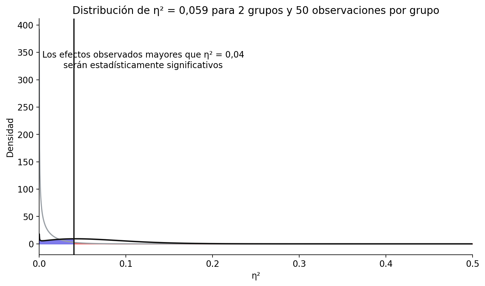{#fig-critf}


**Pregunta 20:** Establezca el número de participantes (por condición) en 14 y el número de grupos en 3. Usando la aplicación Shiny en <https://shiny.ieis.tue.nl/f_p_power/>, ¿qué tamaños de efecto (expresados en eta-cuadrado parcial, como se indica en el eje vertical) pueden ser estadísticamente significativos con n = 14 por grupo y 3 grupos?

- A. Sólo efectos mayores que 0,11
- B. Sólo efectos mayores que 0,13
- C. Sólo efectos mayores que 0,14
- D. Sólo efectos mayores que 0,16


Cada tamaño muestral y nivel alfa implica un efecto mínimo estadísticamente detectable que puede ser estadísticamente significativo en su estudio. Examinar qué efectos observados pueden detectarse es una forma útil de comprobar que el diseño permite detectar el menor tamaño del efecto de interés.

**Pregunta 21:** Utilizando el efecto mínimo estadísticamente detectable, establece el SESOI en un estudio de replicación en *d* = 0,35 y establece el nivel alfa en 0,05. Después de recoger los datos en un estudio de replicación con potencia suficiente que fue lo más cercano posible al estudio original, no se encuentra ningún efecto significativo y se pueden rechazar efectos tan grandes o mayores que *d* = 0,35. ¿Cuál es la interpretación correcta de este resultado?

- A. No hay ningún efecto.
- B. Podemos rechazar estadísticamente (usando un alfa de 0,05) efectos que cualquiera consideraría teóricamente relevantes.
- C. Podemos rechazar estadísticamente (usando un alfa de 0,05) efectos que cualquiera consideraría prácticamente relevantes.
- D. Podemos rechazar estadísticamente (usando un alfa de 0,05) efectos que podrían haber sido estadísticamente significativos en el estudio original.


### Preguntas abiertas

1. ¿Qué se quiere decir con la afirmación “La ausencia de evidencia no es prueba de ausencia”?

2. ¿Cuál es el objetivo de una prueba de equivalencia?

3. ¿Cuál es la diferencia entre una hipótesis nula de efecto cero y una hipótesis nula distinta de cero?

4. ¿Qué es una prueba de efecto mínimo?

5. ¿Qué conclusión podemos extraer si se realizan una prueba de significación de la hipótesis nula y una prueba de equivalencia con los mismos datos, y ninguna resulta estadísticamente significativa?

6. Al diseñar una prueba de equivalencia con una potencia estadística determinada, ¿por qué se necesita una muestra mayor cuanto más estrecho es el rango de equivalencia?

7. Mientras que para una prueba de significación de la hipótesis nula siempre se tiene cierta probabilidad de observar un resultado estadísticamente significativo, es posible realizar una prueba de equivalencia con una potencia del 0%. ¿Cuándo sucedería esto?

8. ¿Por qué es incorrecto decir que “no hay efecto” cuando la prueba de equivalencia es estadísticamente significativa?

9. Especifique una forma en que el procedimiento bayesiano ROPE y una prueba de equivalencia son similares, y especifique una forma en que son diferentes.

10. ¿Cuál es el método basado en anclajes para especificar el menor tamaño del efecto de interés?

11. ¿Qué es un enfoque de coste-beneficio para especificar un menor tamaño del efecto de interés?

12. ¿Cómo pueden los investigadores utilizar predicciones teóricas para especificar el menor tamaño del efecto de interés?

13. ¿Cuál es la idea detrás del enfoque de los “pequeños telescopios” para las pruebas de equivalencia?

## Solucionario {.unnumbered}

- **Pregunta 1:** C
- **Pregunta 2:** C
- **Pregunta 3:** D
- **Pregunta 4:** B
- **Pregunta 5:** A
- **Pregunta 6:** C
- **Pregunta 7:** A
- **Pregunta 8:** C
- **Pregunta 9:** B
- **Pregunta 10:** B
- **Pregunta 11:** D
- **Pregunta 12:** A
- **Pregunta 13:** C
- **Pregunta 14:** A
- **Pregunta 15:** A
- **Pregunta 16:** D
- **Pregunta 17:** B
- **Pregunta 18:** C
- **Pregunta 19:** C
- **Pregunta 20:** B
- **Pregunta 21:** D
