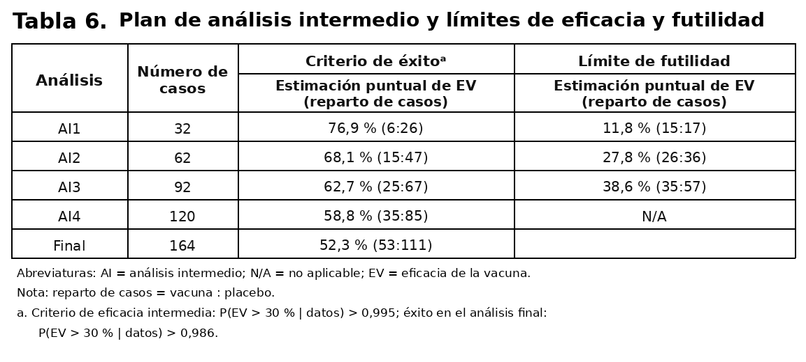
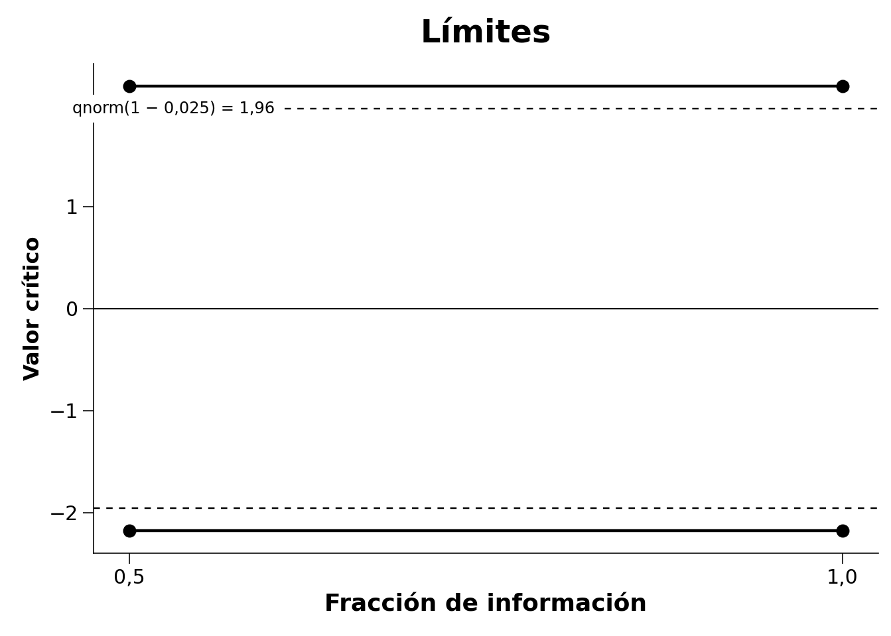
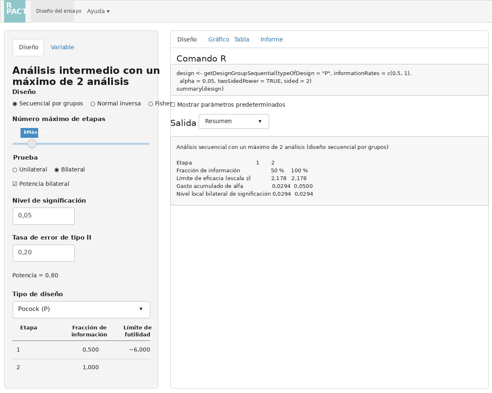
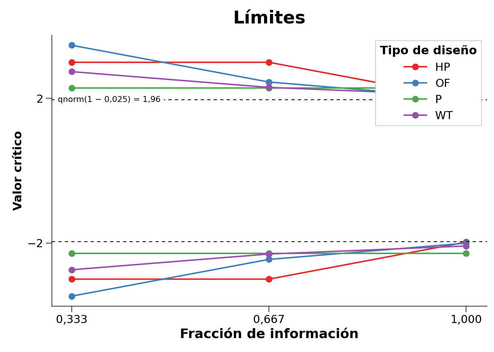
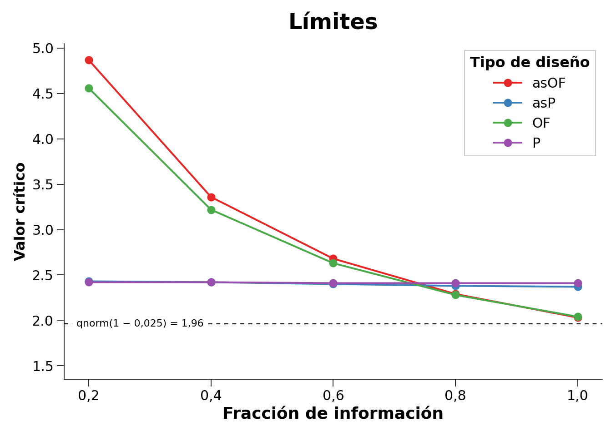
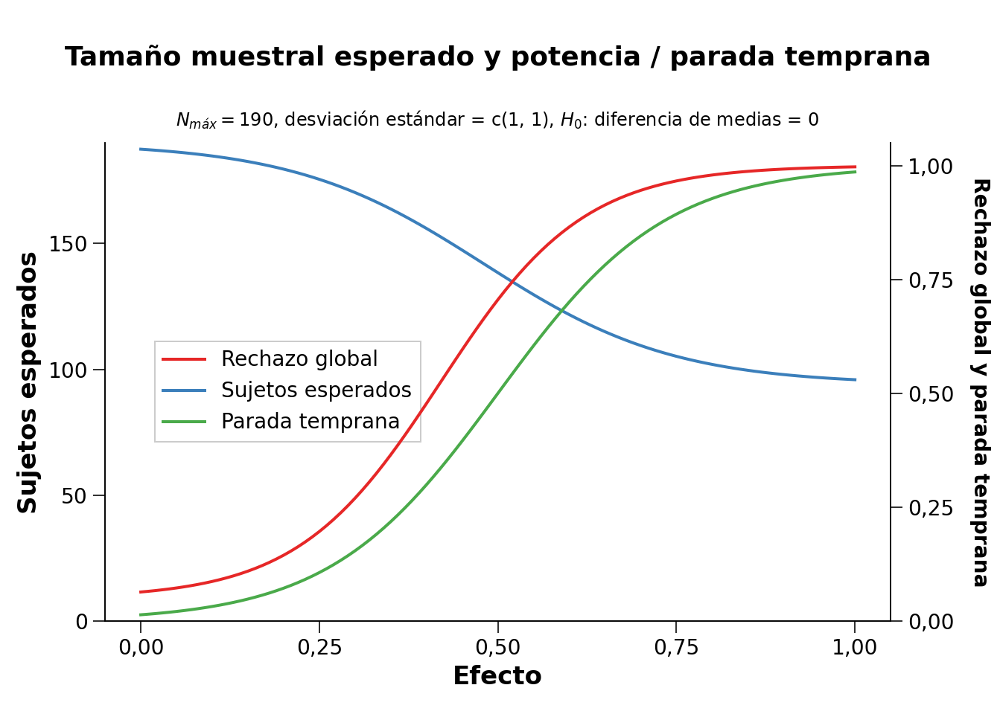
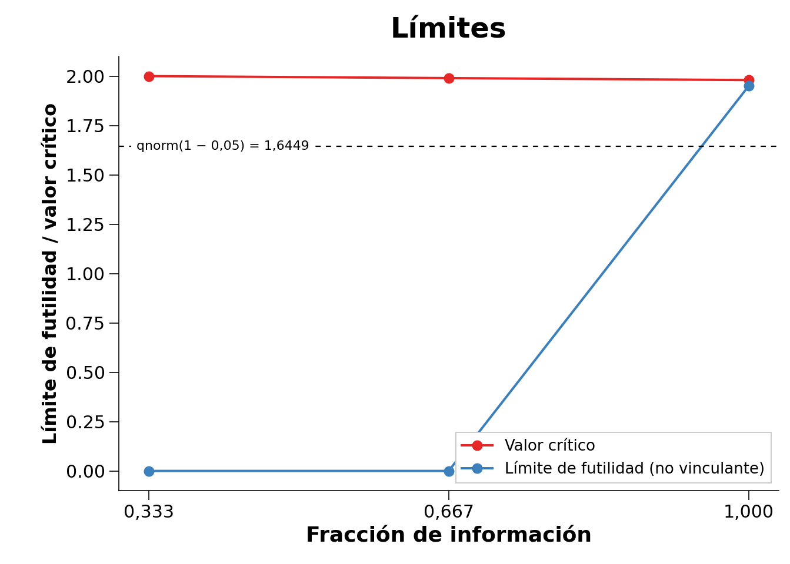
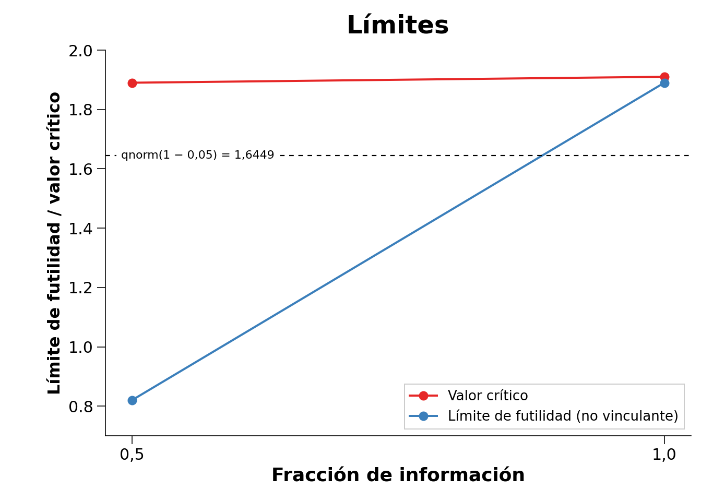
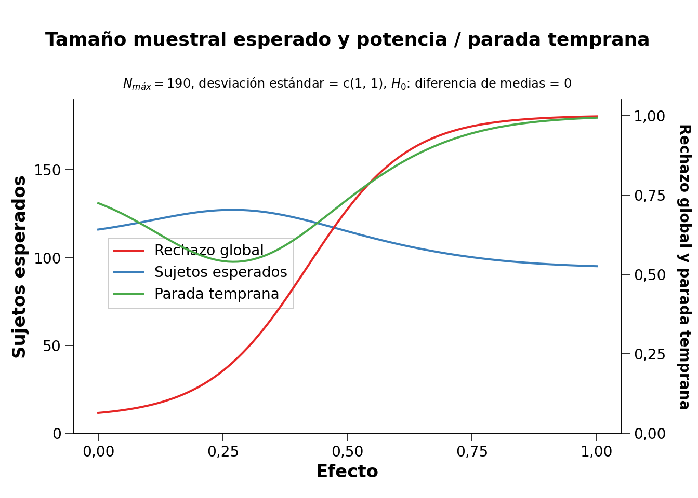
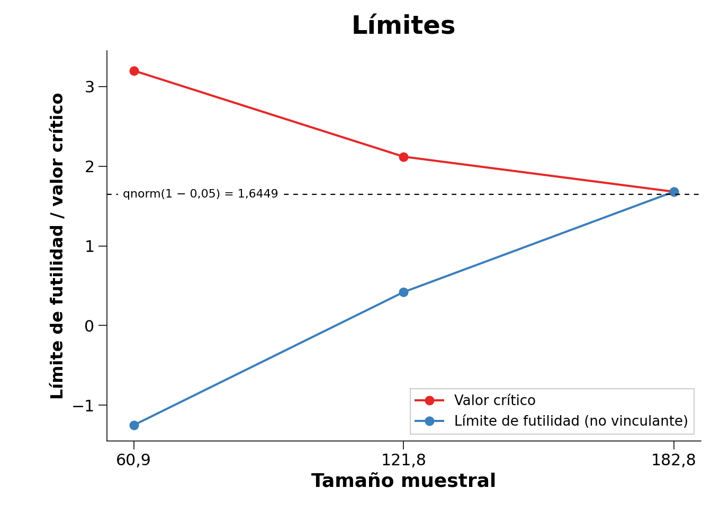

# Análisis Secuencial {#sec-sequential}

> Traducción literal al castellano del capítulo 10, “Sequential Analysis”, de Daniël Lakens, *Improving Your Statistical Inferences*.<br>
> Original: https://lakens.github.io/statistical_inferences/10-sequential.html<br>
> Licencia del original: CC-BY-4.0. Traducción no oficial.

Analizar repetidamente los datos a medida que llegan mientras la recogida continúa tiene muchas ventajas. Los investigadores pueden detener la recogida de datos en un análisis intermedio cuando pueden rechazar la hipótesis nula o el menor tamaño del efecto de interés, aunque estuvieran dispuestos a recopilar más datos si fuera necesario, o si los resultados muestran que existe un problema inesperado en el estudio (por ejemplo, que los participantes no entienden las instrucciones o las preguntas). Podría sostenerse fácilmente que los investigadores en psicología tienen la obligación ética de analizar repetidamente los datos acumulados, dado que continuar recogiéndolos cuando ya se ha alcanzado el nivel de confianza deseado, o cuando está suficientemente claro que los efectos esperados no están presentes, supone malgastar el tiempo de los participantes y el dinero aportado por los contribuyentes. Además de este argumento ético, diseñar estudios que utilicen análisis secuenciales puede ser más eficiente que analizar los datos una sola vez, cuando se ha alcanzado el tamaño máximo de muestra que un investigador está dispuesto a recopilar.

Los análisis secuenciales no deben confundirse con el [**muestreo opcional**](02-control-de-errores.html#sec-optionalstopping), que se explicó en el capítulo sobre el control de errores. En el muestreo opcional, los investigadores utilizan un nivel alfa sin ajustar (por ejemplo, el 5 %) para analizar repetidamente los datos a medida que llegan, lo que puede inflar considerablemente la tasa de error de tipo I. La diferencia fundamental con el **análisis secuencial** es que en este último se controla la tasa de error de tipo I. Al reducir el nivel alfa en cada análisis intermedio, puede controlarse la tasa global de error de tipo I, de manera muy similar a como se utiliza una corrección de Bonferroni para evitar la inflación de dicha tasa en comparaciones múltiples. De hecho, la corrección de Bonferroni es un enfoque válido —aunque conservador— para controlar la tasa de error en los análisis secuenciales [@wassmer_group_2016].

En un análisis secuencial, el investigador diseña el estudio de modo que pueda realizar **análisis intermedios**, por ejemplo cuando se ha recopilado el 25 %, el 50 % y el 75 % de los datos. En cada análisis intermedio se realiza una prueba con un nivel alfa corregido, de manera que a lo largo de todos los análisis planificados se mantenga la tasa deseada de error de tipo I. Los análisis secuenciales se utilizan habitualmente en ensayos médicos, donde descubrir rápidamente un tratamiento eficaz puede ser una cuestión de vida o muerte. Si en un análisis intermedio los investigadores deciden que un nuevo fármaco es eficaz, pueden querer terminar el ensayo y administrar el fármaco que funciona a los pacientes del grupo de control para mejorar su salud o incluso salvarles la vida. Por ejemplo, para estudiar la seguridad y la eficacia de la vacuna contra la COVID-19 de Pfizer–BioNTech se utilizó un diseño experimental en el que se había previsto analizar los datos cinco veces y se controló la tasa global de error de tipo I reduciendo el nivel alfa en cada [análisis intermedio](https://www.nejm.org/doi/suppl/10.1056/NEJMoa2034577/suppl_file/nejmoa2034577_protocol.pdf).

{width=100%}

El uso de análisis secuenciales solo está aumentando lentamente en muchas disciplinas científicas, pero estas técnicas tienen una larga historia. Ya en 1929, Dodge y Romig comprendieron que analizar los datos secuencialmente era más eficiente que hacerlo una sola vez [@dodge_method_1929]. Wald [-@wald_sequential_1945], quien popularizó en 1945 la idea de las pruebas secuenciales de hipótesis, realizó su trabajo durante la Segunda Guerra Mundial. Solo se le permitió publicar sus hallazgos después de que terminara la guerra, como explica en una nota histórica:

> Debido al considerable ahorro en el número esperado de observaciones que permitía la prueba secuencial de la razón de probabilidades, y debido a la sencillez de este procedimiento de prueba en aplicaciones prácticas, el Comité Nacional de Investigación para la Defensa consideró que estos avances eran lo bastante útiles para el esfuerzo bélico como para que resultara conveniente mantener los resultados fuera del alcance del enemigo, al menos durante cierto tiempo. Por tanto, se pidió al autor que presentara sus hallazgos en un informe restringido, fechado en septiembre de 1943.

Los análisis secuenciales son procedimientos bien establecidos y se han desarrollado con gran detalle durante las últimas décadas [@proschan_statistical_2006; @jennison_group_2000; @wassmer_group_2016]. Aquí explicaremos los fundamentos para controlar las tasas de error en los análisis secuenciales por grupos, realizar un análisis de potencia *a priori* y comparar en qué circunstancias los diseños secuenciales son más o menos eficientes que los diseños fijos. Antes de abordar estos temas, conviene aclarar algunos términos. Una **revisión** —también llamada **etapa**— consiste en analizar todos los datos recogidos hasta un momento determinado; por ejemplo, se revisan los datos tras 50, 100 y 150 observaciones, analizando en cada ocasión todos los datos acumulados. Después de 50 y 100 observaciones realizamos un **análisis intermedio**, y después de 150 observaciones realizamos el **análisis final**, tras el cual siempre nos detenemos. No todas las revisiones tienen que llegar a realizarse. Si el análisis revela un resultado estadísticamente significativo en la primera revisión, puede terminarse la recogida de datos. Podemos detenernos porque rechazamos $H_0$ —por ejemplo, en una prueba de significación de la hipótesis nula— o porque rechazamos $H_1$ —por ejemplo, en una prueba de equivalencia—. También podemos detenernos por **truncamiento** o por **futilidad**: es imposible, o muy improbable, que el análisis final produzca *p* < alfa. El **nivel alfa global** de un diseño secuencial difiere del nivel alfa utilizado en cada revisión. Por ejemplo, si queremos una tasa global de error de tipo I del 5 % para una prueba bilateral con tres revisiones, el nivel alfa en cada una podría ser 0,0221 si decidimos utilizar la corrección propuesta por Pocock [-@pocock_group_1977]. En este capítulo nos centraremos en los diseños secuenciales por grupos, en los que los datos se recogen en varios grupos, aunque existen otros enfoques secuenciales, como se explica en el capítulo sobre la [justificación del tamaño de la muestra](08-justificacion-del-tamaño-de-la-muestra.html#sequentialsamplesize).

## Elección de los niveles alfa en los análisis secuenciales

Si se analizaran los datos en múltiples revisiones sin corregir el nivel alfa, la tasa de error de tipo I se inflaría [@armitage_repeated_1969]. Como muestran Armitage y sus colaboradores, con revisiones igualmente espaciadas el nivel alfa aumenta hasta 0,142 después de cinco revisiones, hasta 0,374 después de cien y hasta 0,530 después de mil. Examinar los datos dos veces es conceptualmente similar a decidir que un resultado es significativo si una de dos variables dependientes muestra un efecto estadísticamente significativo. Sin embargo, existe una diferencia importante: en los análisis secuenciales las múltiples pruebas no son independientes, sino dependientes. Una prueba en la segunda revisión combina los datos antiguos recopilados en la primera con los nuevos datos de la segunda. Por ello, la tasa de error de tipo I aumenta más lentamente que con pruebas independientes y, como veremos, esto permite soluciones más eficientes y flexibles para controlar las tasas de error.

Al controlar la tasa de error de tipo I en los análisis secuenciales, hay que decidir cómo gastar el nivel alfa entre todas las revisiones de los datos. Por ejemplo, cuando un investigador planifica un estudio con una revisión intermedia y otra final, debe fijar valores críticos $Z$ para la primera revisión —con $n$ de las $N$ observaciones— y para la segunda —con $N$ observaciones—. Estos dos valores críticos, $c_1$ y $c_2$, deben elegirse de manera que la probabilidad global (Pr) de rechazar la hipótesis nula —cuando en el primer análisis la puntuación $Z$ observada es mayor o igual que el valor crítico de la primera revisión, $Z_n \geq c_1$, y, si no se rechazó la hipótesis en el primer análisis, $Z_n < c_1$, se continúa recogiendo datos y en el segundo análisis $Z_N \geq c_2$— sea igual al nivel alfa global deseado cuando la hipótesis nula es verdadera. En términos formales, para una prueba direccional:

$$
Pr\{Z_n \geq c_1\} + Pr\{Z_n < c_1, Z_N \geq c_2\} = \alpha
$$

Con más de un análisis intermedio deben determinarse valores críticos adicionales siguiendo el mismo razonamiento. Si se combinan múltiples revisiones de los datos con comparaciones múltiples, el nivel alfa se corregiría dos veces: una por las comparaciones múltiples y otra por las múltiples revisiones. Como el nivel alfa está corregido, no importa qué prueba estadística se realice en cada revisión; lo único importante es comparar el valor *p* con el nivel alfa corregido. Las correcciones que se explican a continuación son válidas para cualquier diseño en el que los datos sigan una distribución normal y cada grupo de observaciones sea independiente del grupo anterior.

## La corrección de Pocock

La primera decisión que deben tomar los investigadores es cómo quieren corregir la tasa de error de tipo I entre las distintas revisiones. Cuatro enfoques habituales son la corrección de Pocock, la corrección de O’Brien–Fleming, la corrección de Haybittle–Peto y el enfoque de Wang y Tsiatis. Los usuarios también pueden especificar su propia forma preferida de gastar el nivel alfa entre las revisiones.

La corrección de Pocock es la manera más sencilla de corregir el nivel alfa para múltiples revisiones. Conceptualmente, es muy similar a la corrección de Bonferroni. Se creó de forma que el nivel alfa fuera idéntico en cada revisión de los datos, lo que da lugar a valores críticos constantes —expresados como valores *z*—, $u_k = c$, para rechazar la hipótesis nula, $H_0$, en la revisión $k$. El siguiente código utiliza el paquete `rpact` para diseñar un estudio con un análisis secuencial:

```r
library(rpact)
design <- getDesignGroupSequential(
  kMax = 2,
  typeOfDesign = "P",
  sided = 2,
  alpha = 0.05,
  beta = 0.1
)
print(summary(design))
```

**Parámetros y resultados del diseño secuencial por grupos**

- Tipo de diseño: Pocock
- Número máximo de etapas: 2
- Etapas: 1, 2
- Fracciones de información: 0,500; 1,000
- Nivel de significación: 0,0500
- Tasa de error de tipo II: 0,1000
- Prueba: bilateral
- Límites de futilidad —no vinculantes—: $-\infty$
- Gasto acumulado de alfa: 0,02939; 0,05000
- Valores críticos: 2,178; 2,178
- Niveles por etapa —unilaterales—: 0,01469; 0,01469

| Etapa | 1 | 2 |
|---|---:|---:|
| Fracción de información planificada | 50 % | 100 % |
| Alfa acumulado gastado | 0,0294 | 0,0500 |
| Niveles por etapa —bilaterales— | 0,0294 | 0,0294 |
| Límite de eficacia —escala *z*— | 2,178 | 2,178 |
| Potencia acumulada | 0,5893 | 0,9000 |

El resultado indica que hemos diseñado un estudio con dos revisiones —una intermedia y otra final— utilizando la función de gasto de Pocock. La última línea devuelve niveles alfa unilaterales. El paquete `rpact` se centra en el diseño y análisis adaptativo confirmatorio de ensayos clínicos. En los ensayos clínicos, los investigadores suelen poner a prueba predicciones direccionales y, por ello, la configuración predeterminada es realizar una prueba unilateral. En este ámbito es habitual utilizar un nivel de significación de 0,025 para pruebas unilaterales, mientras que en muchos otros campos el valor predeterminado más frecuente es 0,05. Podemos obtener los niveles alfa bilaterales multiplicando por dos los niveles unilaterales:

```r
design$stageLevels * 2
```

```text
[1] 0.02938579 0.02938579
```

Podemos comprobar este resultado en la [página de Wikipedia sobre la corrección de Pocock](https://en.wikipedia.org/wiki/Pocock_boundary), donde vemos que, con dos revisiones de los datos, el nivel alfa en cada una es 0,0294. La corrección de Pocock es ligeramente más eficiente que una corrección de Bonferroni —en cuyo caso los niveles alfa serían 0,025— debido a la dependencia de los datos: en la segunda revisión vuelven a formar parte del análisis los datos ya analizados en la primera.

`rpact` permite representar fácilmente los límites —basados en los valores críticos— de cada revisión. Las revisiones se representan en función de la «fracción de información», es decir, el porcentaje de los datos totales que se ha recogido en cada revisión. En la @fig-boundplot1 hay dos revisiones igualmente espaciadas: una cuando se ha recogido el 50 % de los datos —fracción de información de 0,5— y otra cuando se ha recogido el 100 % —fracción de información de 1—. Los valores críticos —líneas negras continuas— son mayores que el 1,96 que utilizaríamos en un diseño fijo con un nivel alfa del 5 %: concretamente, $Z = 2{,}178$ —línea negra discontinua—. Siempre que observemos en la primera o la segunda revisión un estadístico de contraste más extremo que estos valores críticos, podremos rechazar la hipótesis nula.

{#fig-boundplot1 width=100%}

El análisis también puede realizarse en la [aplicación Shiny de `rpact`](https://rpact.shinyapps.io/public/), que permite crear todos los gráficos mediante opciones de menú sencillas y descargar un informe completo de los análisis —por ejemplo, para incluirlo en un documento de prerregistro—.

{#fig-rpactshiny width=100%}

## Comparación de las funciones de gasto

Podemos representar en un mismo gráfico las correcciones de distintos tipos de diseño para cada una de tres revisiones —dos intermedias y una final—, como se muestra en la @fig-fourspendingfunctions. El gráfico presenta las correcciones de Pocock, O’Brien–Fleming, Haybittle–Peto y Wang–Tsiatis con $\Delta = 0{,}25$. Los investigadores pueden escoger diferentes formas de gastar el nivel alfa entre las revisiones. Pueden gastarlo de manera conservadora —reservando la mayor parte para la última revisión— o más liberal —gastando más alfa en las primeras revisiones, lo que aumenta la probabilidad de detener el experimento pronto para muchos tamaños del efecto verdaderos—.

{#fig-fourspendingfunctions width=100%}

La corrección de O’Brien y Fleming es mucho más conservadora en la primera revisión, pero en la última está cerca del valor crítico no corregido de 1,96 —la línea negra discontinua; en las pruebas bilaterales, todos los valores críticos se reflejan en la dirección negativa—: 3,471; 2,454 y 2,004. La corrección de Pocock tiene el mismo valor crítico en cada revisión: 2,289; 2,289 y 2,289. La corrección de Haybittle y Peto mantiene el mismo valor crítico hasta la última revisión: 3; 3 y 1,975. Con la corrección de Wang y Tsiatis, los valores críticos disminuyen con cada revisión: 2,741; 2,305 y 2,083.

Ser conservador en las primeras revisiones tiene sentido si el objetivo principal es supervisar los resultados para detectar acontecimientos inesperados. Una corrección de Pocock resulta más útil cuando existe una incertidumbre considerable tanto sobre la presencia de un efecto como sobre su magnitud, ya que ofrece una mayor probabilidad de detener pronto el experimento cuando los efectos son grandes. Como la potencia estadística de una prueba depende del nivel alfa, reducir el alfa de la última revisión disminuye la potencia respecto a un diseño fijo y obliga a aumentar el tamaño muestral para conservar la misma potencia en esa revisión final. Este aumento puede compensarse deteniendo antes la recogida de datos, en cuyo caso el diseño secuencial es más eficiente que el fijo. Puesto que el alfa de la última revisión en los diseños de O’Brien–Fleming o Haybittle–Peto es muy similar al de un diseño fijo con una sola revisión, el tamaño muestral necesario también es muy parecido. La corrección de Pocock exige un incremento mayor del tamaño muestral máximo para alcanzar la potencia deseada.

Los niveles alfa corregidos pueden calcularse con muchos decimales, pero enseguida se alcanza un grado de precisión que carece de sentido en la vida real. La tasa de error de tipo I observada en todas las pruebas que realizará una persona a lo largo de su vida no cambia de manera apreciable por fijar el nivel alfa en 0,0194, 0,019 o 0,02; véase el concepto de [cifras significativas](https://en.wikipedia.org/wiki/Significant_figures). Aunque en las pruebas secuenciales calculemos y utilicemos umbrales alfa con muchos decimales, la complejidad de la mayoría de las investigaciones hace que estos niveles posean una [falsa precisión](https://en.wikipedia.org/wiki/False_precision). Conviene recordarlo al interpretar los datos.

## Funciones de gasto de alfa

Los enfoques descritos hasta ahora para especificar la forma de los límites de decisión entre las revisiones presentan una limitación importante [@proschan_statistical_2006]. Exigen especificar de antemano el número de revisiones —por ejemplo, cuatro— y el tamaño muestral de las revisiones intermedias —por ejemplo, después del 25 %, el 50 %, el 75 % y el 100 % de las observaciones—. Desde el punto de vista logístico, no siempre es posible detener la recogida de datos exactamente al alcanzar el 25 % del tamaño total previsto. Lan y DeMets [-@lan_discrete_1983] realizaron una contribución importante a la literatura sobre pruebas secuenciales al introducir el enfoque de gasto de alfa para corregir este nivel. En él, la tasa acumulada de error de tipo I gastada a lo largo de las revisiones se especifica previamente mediante una función —la *función de gasto de alfa*— para controlar el nivel global de significación $\alpha$ al final del estudio.

La principal ventaja de estas funciones es que permiten controlar las tasas de error en los análisis intermedios sin que sea necesario especificar de antemano ni el número ni el momento de las revisiones. Por ello, los enfoques de gasto de alfa son mucho más flexibles que los métodos anteriores para controlar el error de tipo I en los diseños secuenciales por grupos. Cuando se utiliza una función de gasto de alfa, es importante que la decisión de realizar un análisis intermedio no se base en los datos recogidos, pues esto todavía podría aumentar la tasa de error de tipo I. Siempre que se cumpla este supuesto, es posible actualizar los niveles alfa en cada revisión durante el estudio.

{#fig-comparison width=100%}

## Actualización de los límites durante un estudio

Aunque las funciones de gasto de alfa controlan la tasa de error de tipo I incluso cuando hay desviaciones respecto al número de revisiones planificado o al momento en que se realizan, es necesario recalcular los límites de la prueba estadística en función de la cantidad de información observada. Supongamos que un investigador diseña un estudio con tres revisiones igualmente espaciadas —dos intermedias y una final—, utilizando una función de gasto de alfa semejante a Pocock, y que los resultados se analizarán mediante una prueba *t* bilateral con una tasa global deseada de error de tipo I de 0,05 y una potencia deseada de 0,90 para una *d* de Cohen de 0,5. Un análisis de potencia *a priori* —que explicaremos en la sección siguiente— indica que alcanzamos la potencia deseada si planificamos las revisiones después de 65,4; 130,9 y 196,3 observaciones en cada condición. Como no podemos recoger fracciones de participantes, debemos redondear estos valores hacia arriba. Dado que tenemos dos grupos independientes, recogeremos 66 observaciones en la primera revisión —33 por condición—, 132 en la segunda —66 por condición— y 198 en la tercera —99 por condición—. El siguiente código calcula los niveles alfa de cada revisión o etapa para una prueba bilateral:

```r
design <- getDesignGroupSequential(
  kMax = 3,
  typeOfDesign = "asP",
  sided = 2,
  alpha = 0.05,
  beta = 0.1
)
design$stageLevels * 2
```

```text
[1] 0.02264162 0.02173822 0.02167941
```

Imaginemos ahora que, debido a dificultades logísticas, no conseguimos analizar los datos hasta haber recopilado 76 observaciones —38 en cada condición— en lugar de las 66 previstas. Este tipo de dificultades es frecuente en la práctica y constituye una de las principales razones por las que se desarrollaron las funciones de gasto de alfa para diseños secuenciales por grupos. Nuestra primera revisión no ocurre cuando se ha recogido el 33,3 % de la muestra total prevista, sino cuando se ha alcanzado $76/198 = 38{,}4\,\%$. Podemos volver a calcular el nivel alfa que debe utilizarse en cada revisión basándonos en la revisión actual y en las futuras revisiones planificadas. En lugar de usar 0,0226; 0,0217 y 0,0217 en las tres revisiones respectivas —obsérvese que, con una función de gasto semejante a Pocock, los niveles alfa son casi iguales, pero no exactamente iguales como en la corrección de Pocock—, podemos ajustar las fracciones de información especificándolas mediante `informationRates`. La primera revisión ocurre ahora en $76/198$ de la muestra planificada; la segunda sigue prevista para los dos tercios de la muestra y la última para el tamaño muestral máximo planificado.

```r
design <- getDesignGroupSequential(
  typeOfDesign = "asP",
  informationRates = c(76/198, 2/3, 1),
  alpha = 0.05,
  sided = 2
)
design$stageLevels * 2
```

```text
[1] 0.02532710 0.02043978 0.02164755
```

Los niveles alfa actualizados son 0,0253 para la revisión actual, 0,0204 para la segunda y 0,0216 para la final. Por tanto, en la primera revisión no utilizaremos el 0,0226 previsto originalmente, sino un valor ligeramente mayor, 0,0253. La segunda revisión empleará un alfa algo menor, 0,0204 en lugar de 0,0217. Las diferencias son pequeñas, pero resulta extremadamente útil disponer de un método formal que controle el nivel alfa y, al mismo tiempo, permita realizar las revisiones en momentos distintos de los planificados.

También es posible corregir el nivel alfa si cambia la revisión final de los datos, por ejemplo porque no se consigue alcanzar el tamaño muestral previsto o porque, debido a circunstancias imprevistas, se recogen más datos de los planificados. Esto es cada vez más frecuente a medida que se prerregistran estudios o se publican *Registered Reports*. A veces se termina con algo más de información de la prevista, lo que plantea si debe analizarse la muestra planificada o la totalidad de los datos. Analizar todos los datos evita desperdiciar respuestas de los participantes y utiliza toda la información disponible, pero aumenta la flexibilidad del análisis, pues los investigadores pueden elegir entre analizar la muestra prevista o todos los datos recogidos. Las funciones de gasto de alfa resuelven este dilema: permiten analizar todos los datos y actualizar el nivel alfa con el que se controla el alfa global.

Si se recogen más datos de los planificados, ya no podemos utilizar la función de gasto de alfa elegida —por ejemplo, la función de Pocock— y debemos proporcionar una **función de gasto de alfa definida por el usuario**, actualizando los momentos y la función para reflejar cómo se desarrolló realmente la recogida de datos hasta la revisión final. Supongamos que la segunda revisión de nuestro ejemplo se realizó tal como estaba previsto, al alcanzar dos tercios de la muestra planificada, pero la última tuvo lugar con 206 participantes en lugar de 198. Podemos calcular un nivel alfa actualizado para la revisión final. Con el nuevo tamaño total, debemos recalcular las fracciones de información de las revisiones anteriores: $76/206 = 0{,}369$, $132/206 = 0{,}641$ y $206/206 = 1$.

La primera y la segunda revisión se realizaron con los niveles alfa ajustados tras la primera modificación —0,0253 y 0,0204—. Ya hemos gastado una parte del alfa total en esas dos revisiones. Podemos consultar el «alfa acumulado gastado» en los resultados del diseño anterior:

```r
design$alphaSpent
```

```text
[1] 0.02532710 0.03816913 0.05000000
```

Hemos gastado 0,0253 tras la primera revisión y 0,0382 tras la segunda. También sabemos que queremos gastar en la última el resto de nuestra tasa de error de tipo I, hasta alcanzar un total de 0,05.

Como nuestra función de gasto de alfa real ya no queda representada por la función de Pocock después de haber recogido más datos de los planificados, especificamos una función definida por el usuario. Podemos realizar estos cálculos mediante el código siguiente, proporcionando la información `userAlphaSpending` después de elegir el diseño `asUser`:

```r
design <- getDesignGroupSequential(
  typeOfDesign = "asUser",
  informationRates = c(76/206, 132/206, 1),
  alpha = 0.05,
  sided = 2,
  userAlphaSpending = c(0.0253, 0.0382, 0.05)
)
design$stageLevels * 2
```

```text
[1] 0.02530000 0.02050921 0.02096654
```

Los niveles alfa de las revisiones pasadas no coinciden con los que utilizamos, pero el nivel alfa final —0,0208— proporciona el valor que debemos emplear en el análisis final con una muestra mayor que la planificada. La diferencia respecto al nivel que habríamos utilizado con la muestra prevista es muy pequeña —0,0216 frente a 0,0208—, en parte porque no sobrepasamos demasiado el tamaño planificado. Estas pequeñas diferencias apenas se notarán en la práctica, pero resulta muy útil que exista una solución formalmente correcta para tratar los casos en que se recogen más datos de los previstos y seguir controlando la tasa de error de tipo I. Si se utilizan diseños secuenciales, estas correcciones pueden aplicarse siempre que se sobrepase el tamaño muestral recogido en un prerregistro.

## Tamaño muestral en los diseños secuenciales

En la revisión final, los diseños secuenciales requieren algunos participantes más que un diseño fijo, dependiendo de cuánto se haya reducido el nivel alfa en esa revisión por la corrección de comparaciones múltiples. No obstante, gracias a la parada temprana, los diseños secuenciales necesitarán por término medio menos participantes. Examinemos primero cuántos necesitaríamos en un diseño fijo, en el que solo analizamos los datos una vez. Tenemos un nivel alfa de 0,05 y un error de tipo II —beta— de 0,10; en otras palabras, la potencia deseada es del 90 %. Realizaremos una prueba y, suponiendo una distribución normal, nuestro valor crítico $Z$ será 1,96 para un alfa del 5 %.

```r
design <- getDesignGroupSequential(
  kMax = 1,
  sided = 2,
  alpha = 0.05,
  beta = 0.1
)

power_res <- getSampleSizeMeans(
  design = design,
  groups = 2,
  alternative = 0.5,
  stDev = 1,
  allocationRatioPlanned = 1,
  normalApproximation = FALSE
)

print(power_res)
```

**Cálculo del tamaño muestral para un diseño fijo**

- Valor crítico: 1,960
- Potencia bilateral: FALSE
- Nivel de significación: 0,0500
- Tasa de error de tipo II: 0,1000
- Prueba: bilateral
- Alternativa: 0,5
- Desviación estándar: 1
- Grupos de tratamiento: 2
- Razón de asignación planificada: 1
- Número total de sujetos: 170,1
- Número de sujetos por grupo: 85,0
- Valores críticos inferiores —escala del efecto del tratamiento—: −0,303
- Valores críticos superiores —escala del efecto del tratamiento—: 0,303

Necesitamos 85 participantes en cada grupo —o 86, puesto que el tamaño muestral es en realidad 85,03 y debe redondearse hacia arriba—, de modo que necesitamos 172 participantes en total. Otros programas de análisis de potencia, como G\*Power, deberían producir el mismo tamaño muestral. Podemos examinar ahora el diseño anterior con dos revisiones y una función de gasto de alfa semejante a Pocock para una prueba bilateral con alfa de 0,05. Revisaremos los datos dos veces y esperamos un efecto verdadero de $d = 0{,}5$, que introducimos especificando una alternativa de 0,5 y una desviación estándar de 1.

```r
seq_design <- getDesignGroupSequential(
  kMax = 2,
  typeOfDesign = "asP",
  sided = 2,
  alpha = 0.05,
  beta = 0.1
)

# Calcular el tamaño muestral necesario
power_res_seq <- getSampleSizeMeans(
  design = seq_design,
  groups = 2,
  alternative = 0.5,
  stDev = 1,
  allocationRatioPlanned = 1,
  normalApproximation = FALSE
)

print(power_res_seq)
```

**Cálculo del tamaño muestral para un diseño secuencial**

- Fracciones de información: 0,500; 1,000
- Valores críticos: 2,157; 2,201
- Gasto acumulado de alfa: 0,03101; 0,05000
- Niveles locales de significación unilaterales: 0,01550; 0,01387
- Número máximo de sujetos: 188,9
- Número de sujetos en la primera etapa: 94,5
- Número de sujetos en la segunda etapa: 188,9
- Rechazo en la primera etapa: 0,6022
- Rechazo en la segunda etapa: 0,2978
- Parada temprana: 0,6022
- Número esperado de sujetos bajo $H_0$: 186,0
- Número esperado de sujetos bajo $H_0/H_1$: 172,7
- Número esperado de sujetos bajo $H_1$: 132,1

El tamaño muestral por condición es 47,24 en la primera revisión y 94,47 en la segunda, lo que significa que ahora recopilamos 190 participantes en lugar de 172. Esto es consecuencia de reducir el nivel alfa en cada revisión —de 0,05 a 0,028—. Para compensar este alfa menor, debemos aumentar el tamaño muestral y así alcanzar la misma potencia.

Sin embargo, el tamaño máximo no es el tamaño esperado para este diseño, porque existe la posibilidad de detener la recogida de datos en una revisión anterior. A largo plazo, si $d = 0{,}5$, utilizamos una función de gasto semejante a Pocock e ignoramos el redondeo hacia arriba necesario para recoger un número entero de observaciones, unas veces recogeremos 96 participantes y nos detendremos tras la primera revisión y otras continuaremos hasta 190. Como se muestra en la fila «Rechazo por etapa», se espera que la recogida se detenga tras la primera revisión en 0,60 de los estudios porque se habrá observado un resultado significativo. El resto de las veces será $1 - 0{,}60 = 0{,}40$.

Por tanto, si existe un efecto verdadero de $d = 0{,}5$, el tamaño muestral *esperado* es la probabilidad de detenerse en cada revisión multiplicada por el número de observaciones de esa revisión: $0{,}60 \times 96 + 0{,}30 \times 190 = 133{,}39$. El paquete `rpact` devuelve 132,06 en «Número esperado de sujetos bajo $H_1$»; la pequeña diferencia se debe a que `rpact` no redondea hacia arriba el número de observaciones, aunque debería hacerlo. Así, si el efecto verdadero es $d = 0{,}5$, en un estudio concreto quizá necesitemos algo más de información que en un diseño fijo —donde recogeríamos 172 observaciones—, pero, por término medio, necesitaremos menos en un diseño secuencial.

Como la potencia es una curva y se desconoce el tamaño del efecto verdadero, resulta útil representarla para un rango de efectos posibles. Así podemos explorar el tamaño muestral esperado a largo plazo cuando utilizamos un diseño secuencial bajo distintos tamaños del efecto verdaderos.

```r
# Usar getPowerMeans y fijar N máximo en 190 según el análisis anterior
sample_res <- getPowerMeans(
  design = seq_design,
  groups = 2,
  alternative = seq(0, 1, 0.01),
  stDev = 1,
  allocationRatioPlanned = 1,
  maxNumberOfSubjects = 190,
  normalApproximation = FALSE
)

plot(sample_res, type = 6)
```

{#fig-powerseq width=100%}

La línea azul de la @fig-powerseq indica el número esperado de observaciones que debemos recopilar. Como cabía esperar, cuando el tamaño del efecto verdadero es cero casi siempre continuaremos hasta el final. Solo nos detendremos si observamos un error de tipo I, algo poco frecuente, de modo que el número esperado de observaciones estará muy cerca del tamaño máximo que estamos dispuestos a recopilar. En el otro extremo del gráfico aparece el escenario en el que el efecto verdadero es $d = 1$. Con un efecto tan grande tendremos una potencia elevada en la primera revisión y casi siempre podremos detenernos entonces. La línea roja indica la potencia en la revisión final y la verde, la probabilidad de una parada temprana.

La corrección de Pocock produce un nivel alfa considerablemente menor en la última revisión, por lo que exige aumentar el tamaño muestral. Como vimos antes, la función de gasto de O’Brien–Fleming no requiere una reducción tan acusada del alfa final. El análisis siguiente muestra que, con dos revisiones, este diseño no necesita en la práctica ningún incremento del tamaño muestral.

```r
seq_design <- getDesignGroupSequential(
  kMax = 2,
  typeOfDesign = "asOF",
  sided = 2,
  alpha = 0.05,
  beta = 0.1
)

# Calcular el tamaño muestral necesario
power_res_seq <- getSampleSizeMeans(
  design = seq_design,
  groups = 2,
  alternative = 0.5,
  stDev = 1,
  allocationRatioPlanned = 1,
  normalApproximation = FALSE
)

print(summary(power_res_seq))
```

**Diseño semejante a O’Brien–Fleming con dos revisiones**

| Etapa | 1 | 2 |
|---|---:|---:|
| Fracción de información planificada | 50 % | 100 % |
| Alfa acumulado gastado | 0,0031 | 0,0500 |
| Niveles por etapa —bilaterales— | 0,0031 | 0,0490 |
| Límite de eficacia —escala *z*— | 2,963 | 1,969 |
| Potencia acumulada | 0,2525 | 0,9000 |
| Número de sujetos | 85,3 | 170,6 |
| Número esperado de sujetos bajo $H_1$ |  | 149,1 |

Este diseño alcanza la potencia deseada con 172 participantes, exactamente los mismos que necesitaríamos si no revisáramos los datos antes del final. Básicamente, obtenemos una revisión gratuita y el número esperado de participantes —si $d = 0{,}5$— desciende a 149,1. Aumentar el número de revisiones hasta cuatro solo exige un pequeño incremento adicional para mantener la potencia, pero reduce aún más el tamaño muestral esperado. El análisis secuencial constituye una opción muy atractiva, en especial cuando se realiza un análisis de potencia *a priori* conservador o basado en el menor tamaño del efecto de interés y existe una probabilidad razonable de que el efecto verdadero sea mayor.

## Parada por futilidad

Hasta ahora, los diseños secuenciales que hemos descrito solo se detendrían en un análisis intermedio si pudiéramos rechazar $H_0$. Un estudio bien diseñado también tiene en cuenta la posibilidad de que no exista efecto, como explicamos en el capítulo sobre [pruebas de equivalencia](09-pruebas-de-equivalencia.html#sec-equivalencetest). En la literatura sobre análisis secuencial, detenerse para rechazar la presencia del menor tamaño del efecto de interés se denomina **parada por futilidad**. En el caso más extremo, después de un análisis intermedio podría ser imposible que el análisis final produjera un resultado estadísticamente significativo. Imaginemos, a modo de ejemplo, que después de recopilar 182 de las 192 observaciones previstas, la diferencia de medias observada entre dos condiciones independientes es 0,1 y el estudio se diseñó considerando que la menor diferencia de interés era 0,5. Si la variable dependiente principal se mide en una escala Likert de siete puntos, podría suceder que, aunque los cinco participantes restantes del grupo de control respondieran 1 y los cinco del grupo experimental respondieran 7, el efecto después de 192 observaciones no produjera $p < \alpha$. Si el objetivo del estudio era detectar un efecto de al menos 0,5 puntos de diferencia media, en ese momento el investigador sabe que no se alcanzará. Detener un estudio en un análisis intermedio porque el resultado final ya no puede ser significativo se denomina *truncamiento no estocástico*.

En situaciones menos extremas, pero más frecuentes, todavía podría ser posible observar un efecto significativo, aunque con una probabilidad muy pequeña. La probabilidad de obtener un resultado significativo dados los datos observados hasta un análisis intermedio se denomina **potencia condicional**. Calcularla a partir del efecto esperado originalmente puede resultar demasiado optimista, pero tampoco es deseable utilizar el efecto observado, que suele tener bastante incertidumbre. Una propuesta consiste en actualizar el efecto esperado a partir de los datos. Cuando se emplea un procedimiento de actualización bayesiana, se denomina **potencia predictiva** [@spiegelhalter_monitoring_1986]. También pueden utilizarse **diseños adaptativos** que permitan aumentar el número final de observaciones a partir de un análisis intermedio sin inflar la tasa de error de tipo I; véase @wassmer_group_2016.

Otra posibilidad es detenerse por futilidad cuando el efecto observado es menor de lo esperado. Para ilustrar una regla sencilla, imaginemos que un investigador se detendrá siempre que el efecto observado sea cero o vaya en la dirección opuesta a la predicha. En la @fig-futility1, la línea roja muestra los valores críticos para declarar un efecto significativo. En esencia, si en un análisis intermedio la puntuación *z* observada es cero o negativa, se termina la recogida de datos. Esta regla puede especificarse añadiendo `futilityBounds = c(0, 0)` al diseño secuencial. Puede decidirse de antemano detenerse obligatoriamente cuando se cumplan los criterios de futilidad —una regla vinculante—, aunque suele recomendarse conservar la posibilidad de continuar —una regla no vinculante, especificada mediante `bindingFutility = FALSE`—.

```r
design <- getDesignGroupSequential(
  sided = 1,
  alpha = 0.05,
  beta = 0.1,
  typeOfDesign = "asP",
  futilityBounds = c(0, 0),
  bindingFutility = FALSE
)
```

En la @fig-futility1 aparece un diseño secuencial en el que la recogida se detiene para rechazar $H_0$ cuando la puntuación *z* observada supera los valores de la línea roja, calculados con una función de gasto de alfa semejante a Pocock. También se detiene cuando en un análisis intermedio se observa una puntuación *z* menor o igual que cero, como indica la línea azul. Si no se cumple ninguna regla en una revisión, se continúa hasta la siguiente. En la última revisión las líneas roja y azul se encuentran porque necesariamente rechazaremos $H_0$ al superar el valor crítico o no la rechazaremos.

{#fig-futility1 width=100%}

Especificar manualmente los límites de futilidad no es ideal, pues corremos el riesgo de detener la recogida por no rechazar $H_0$ cuando existe una probabilidad elevada de cometer un error de tipo II. Es preferible establecer esos límites controlando directamente el error de tipo II entre las revisiones. Del mismo modo que distribuimos la tasa de error de tipo I entre los análisis intermedios, podemos distribuir la de tipo II y detenernos por futilidad cuando no rechazamos el tamaño del efecto de interés con la tasa deseada de error de tipo II.

Cuando una prueba de significación de la hipótesis nula se diseña con una potencia del 90 % para detectar un efecto $d = 0{,}5$, en un 10 % de los casos no se rechazará $H_0$ cuando debería rechazarse. En esos errores de tipo II se concluirá que no existe un efecto de 0,5 cuando en realidad sí existe un efecto de $d = 0{,}5$ o mayor. En una prueba de equivalencia frente a un menor tamaño del efecto de interés de $d = 0{,}5$, concluir que no existe un efecto de 0,5 o mayor cuando en realidad sí existe se denomina error de tipo I: concluimos incorrectamente que el efecto es prácticamente equivalente a cero. Por tanto, lo que constituye un error de tipo II en una prueba de significación —con $H_0: d = 0$ y $H_1: d = 0{,}5$— es un error de tipo I en una prueba de equivalencia —con $H_0: d = 0{,}5$ y $H_1: d = 0$— [@jennison_group_2000]. Controlar el error de tipo II en un diseño secuencial puede verse, por tanto, como controlar el error de tipo I de una prueba de equivalencia frente al tamaño del efecto para el que se ha dotado de potencia al estudio. Si diseñamos un estudio con una tasa de error de tipo I del 5 % y una tasa igualmente baja de error de tipo II —por ejemplo, otro 5 %, es decir, una potencia del 95 %—, el estudio constituye una prueba informativa tanto de la presencia como de la ausencia de un efecto de interés.

Si el tamaño del efecto verdadero es cero o está cerca de cero, los diseños secuenciales que permiten detenerse por futilidad son más eficientes que aquellos que no lo permiten. Añadir límites de futilidad basados en funciones de gasto de beta reduce la potencia y obliga a aumentar el tamaño muestral, pero este coste puede compensarse porque los estudios se detienen antes por futilidad. Cuando no es posible especificar el menor tamaño del efecto de interés, quizá no se desee incorporar esta regla. Para controlar la tasa de error de tipo II entre revisiones debe elegirse una **función de gasto de beta**, por ejemplo una función semejante a Pocock, una semejante a O’Brien–Fleming o una definida por el usuario. Una función de gasto de beta semejante a Pocock se añade mediante `typeBetaSpending = "bsP"`. La función de gasto de beta no tiene por qué coincidir con la de alfa. En `rpact`, las funciones de gasto de beta solo pueden elegirse para pruebas direccionales —unilaterales—. Al fin y al cabo, puede considerarse que un efecto en cualquiera de las dos direcciones apoya la hipótesis, mientras que un efecto en la dirección contraria proporciona una razón para rechazar la hipótesis alternativa.

```r
design <- getDesignGroupSequential(
  kMax = 2,
  typeOfDesign = "asP",
  sided = 1,
  alpha = 0.05,
  beta = 0.1,
  typeBetaSpending = "bsP",
  bindingFutility = FALSE
)

plot(design)
```

{#fig-futility2 width=100%}

Con una función de gasto de beta aumenta el número esperado de sujetos bajo $H_1$. Por tanto, si la hipótesis alternativa es verdadera, diseñar un estudio que pueda detenerse por futilidad tiene un coste. Sin embargo, $H_0$ puede ser verdadera y, cuando lo es, la parada por futilidad reduce el tamaño muestral esperado. En la @fig-powerseq2, la probabilidad de detenerse —línea verde— también es elevada cuando el efecto verdadero es cero, porque ahora podemos detenernos por futilidad; si lo hacemos, el tamaño muestral esperado —línea azul— es menor que en la @fig-powerseq. Es importante diseñar estudios con un alto valor informativo para rechazar la presencia de un efecto relevante en el análisis final, pero incorporar o no una parada temprana por futilidad exige considerar la probabilidad de que la hipótesis nula sea verdadera y aceptar un incremento, quizá pequeño, del tamaño muestral.

{#fig-powerseq2 width=100%}

## Comunicación de los resultados de un análisis secuencial

Los diseños secuenciales por grupos se desarrollaron para contrastar hipótesis de manera eficiente dentro del enfoque de Neyman–Pearson, cuyo objetivo consiste en decidir cómo actuar al tiempo que se controlan las tasas de error a largo plazo. Estos diseños no pretenden cuantificar la fuerza de la evidencia ni proporcionar estimaciones exactas del tamaño del efecto [@proschan_statistical_2006]. Sin embargo, después de concluir si una hipótesis puede rechazarse, los investigadores suelen querer interpretar también la estimación del efecto.

Al interpretar el efecto observado en diseños secuenciales surge una dificultad: cuando un estudio se detiene pronto al rechazar $H_0$, existe el riesgo de que el análisis se haya detenido porque, debido a la variación aleatoria, en ese momento se observó un efecto grande. Por ello, los efectos observados en los análisis intermedios sobreestiman el tamaño verdadero. Como muestran @schou_metaanalysis_2013 y @schonbrodt_sequential_2017, un metaanálisis de estudios con diseños secuenciales producirá una estimación exacta porque los estudios que se detienen pronto tienen muestras menores y reciben menos peso; esto se compensa con las estimaciones menores de los estudios secuenciales que alcanzan la revisión final y reciben más peso por su mayor muestra. No obstante, antes de poder realizar un metaanálisis quizá sea necesario interpretar los efectos de estudios individuales, y en ese caso puede ser útil comunicar una estimación ajustada. Aunque los programas de análisis secuencial solo calculan estimaciones ajustadas para ciertas pruebas, recomendamos informar tanto del efecto ajustado cuando sea posible como del efecto sin ajustar, que será necesario en futuros metaanálisis.

Surge un problema parecido al comunicar valores *p* e intervalos de confianza. En un diseño secuencial, la distribución de un valor *p* que no tenga en cuenta la naturaleza secuencial del diseño ya no es uniforme cuando $H_0$ es verdadera. Un valor *p* es la probabilidad de observar un resultado *al menos tan extremo* como el obtenido, suponiendo que $H_0$ sea verdadera. En un diseño secuencial ya no es sencillo determinar qué significa «al menos tan extremo» [@cook_pvalue_2002]. El procedimiento más recomendado ordena los resultados de una serie de análisis secuenciales según la revisión en la que se detuvo el estudio: detenerse antes se considera más extremo que detenerse después y, cuando distintos estudios se detienen en el mismo momento, los valores *z* mayores se consideran más extremos [@proschan_statistical_2006]. Este procedimiento se denomina *ordenación por etapas* y trata los rechazos en revisiones tempranas como evidencia más fuerte contra $H_0$ que los rechazos posteriores [@wassmer_group_2016]. Dada la relación directa entre un valor *p* y un intervalo de confianza, también se han desarrollado intervalos ajustados para diseños secuenciales.

No obstante, puede criticarse la comunicación de valores *p* e intervalos de confianza ajustados. Tras un diseño secuencial, la interpretación correcta desde el marco de Neyman–Pearson consiste en concluir que se rechaza $H_0$, que se rechaza la hipótesis alternativa o que los resultados son inconcluyentes. Los valores *p* ajustados se comunican para que los lectores puedan interpretarlos como una medida de la evidencia. Dupont [-@dupont_sequential_1983] ofrece buenos argumentos para dudar de que constituyan una medida válida de la fuerza de la evidencia. Además, una interpretación estricta del enfoque de Neyman–Pearson también desaconseja interpretar los valores *p* como medidas de evidencia [@lakens_why_2022]. Por ello, si se quiere comunicar la evidencia de los datos a favor de $H_0$ frente a la hipótesis alternativa, se recomienda informar de verosimilitudes o factores de Bayes, que siempre pueden calcularse e interpretarse una vez finalizada la recogida. Comunicar el valor *p* sin ajustar en relación con el nivel alfa muestra la base para rechazar hipótesis, aunque puede ser importante advertir a quienes realicen un metaanálisis basado en valores *p* —por ejemplo, un análisis de curva *p* o curva *z*, como se explica en el capítulo sobre [detección de sesgos](12-deteccion-de-sesgos.html#bias)— de que se trata de valores *p* secuenciales. Los intervalos de confianza ajustados son útiles para evaluar la estimación observada en relación con su variabilidad en una revisión intermedia o final. Téngase en cuenta que los programas estadísticos solo ofrecen estimaciones de parámetros ajustadas para algunos diseños habituales en ensayos farmacéuticos, como la comparación de diferencias de medias o el análisis de supervivencia.

A continuación retomamos el mismo diseño secuencial del comienzo, con dos revisiones y una función de gasto de alfa semejante a Pocock. Después de completar el estudio con 95 participantes por condición —48 en la primera revisión y los 47 restantes en la segunda—, podemos introducir los datos mediante la función `getDataset`. Las medias y las desviaciones estándar se introducen por separado en cada etapa. Por tanto, en la segunda revisión solo se utilizan los datos de los segundos 95 participantes para calcular las medias —1,51 y 1,01— y las desviaciones estándar —1,03 y 0,96—.

```r
design <- getDesignGroupSequential(
  kMax = 2,
  typeOfDesign = "asP",
  sided = 2,
  alpha = 0.05,
  beta = 0.1
)

dataMeans <- getDataset(
  n1 = c(48, 47),
  n2 = c(48, 47),
  means1 = c(1.12, 1.51), # en prueba direccional, medias 1 > medias 2
  means2 = c(1.03, 1.01),
  stDevs1 = c(0.98, 1.03),
  stDevs2 = c(1.06, 0.96)
)

res <- getAnalysisResults(
  design,
  equalVariances = TRUE,
  dataInput = dataMeans
)

print(summary(res))
```

**Resultados del análisis —medias de dos grupos, diseño secuencial por grupos—**

| Etapa | 1 | 2 |
|---|---:|---:|
| Fracción de información planificada | 50 % | 100 % |
| Alfa acumulado gastado | 0,0310 | 0,0500 |
| Niveles por etapa —bilaterales— | 0,0310 | 0,0277 |
| Límite de eficacia —escala *z*— | 2,157 | 2,201 |
| Tamaño del efecto acumulado | 0,090 | 0,293 |
| Desviación estándar acumulada —combinada— | 1,021 | 1,013 |
| Estadístico global | 0,432 | 1,993 |
| Valor *p* global | 0,3334 | 0,0238 |
| Acción de la prueba | continuar | aceptar |
| Probabilidad condicional de rechazo | 0,0039 |  |
| Intervalo de confianza repetido del 95 % | [−0,366; 0,546] | [−0,033; 0,619] |
| Valor *p* repetido | >0,5 | 0,0819 |
| Valor *p* final |  | 0,0666 |
| Intervalo de confianza final |  | [−0,020; 0,573] |
| Estimación mediana insesgada |  | 0,281 |

Imaginemos que hemos realizado un estudio con un máximo de dos revisiones igualmente espaciadas, una prueba bilateral con alfa de 0,05 y una función de gasto de alfa semejante a Pocock, y que en la última revisión observamos diferencias de medias entre las dos condiciones. Los niveles alfa de la prueba *t* bilateral son 0,003051 y 0,0490. Podemos rechazar $H_0$ después de la segunda revisión, pero también queremos comunicar un tamaño del efecto y valores *p* e intervalos de confianza ajustados.

Los resultados muestran que, tras la primera revisión, la decisión fue continuar la recogida y que en la segunda pudo rechazarse $H_0$. La diferencia de medias sin ajustar aparece en la fila «Tamaño del efecto global» y en la revisión final fue 0,293. La diferencia ajustada aparece en «Estimación mediana insesgada» y es menor. El intervalo ajustado aparece en «Intervalo de confianza final»: 0,281, IC del 95 % [−0,020; 0,573].

Los valores *p* sin ajustar para una prueba unilateral aparecen en la fila «Valor *p* global». Los valores de nuestra prueba bilateral serían el doble: 0,6668 y 0,0477. El valor *p* ajustado en la revisión final aparece en la fila «Valor *p* final» y es 0,06662.

## Autoevaluación

**Pregunta 1:** Los análisis secuenciales pueden aumentar la eficiencia de los estudios. ¿Qué afirmación es verdadera para un diseño secuencial en el que los investigadores solo se detienen si pueden rechazar $H_0$ y no han especificado una regla de parada por futilidad?

- A. Los análisis secuenciales reducirán el tamaño muestral de todos los estudios.
- B. Los análisis secuenciales reducirán por término medio el tamaño muestral de los estudios.
- C. Los análisis secuenciales reducirán por término medio el tamaño muestral de los estudios siempre que exista un efecto verdadero, si no se ha especificado una regla de parada por futilidad.
- D. Los análisis secuenciales exigirán por término medio el mismo tamaño muestral que los diseños fijos, pero ofrecerán más flexibilidad.

**Pregunta 2:** ¿Cuál es la diferencia entre el análisis secuencial y el muestreo opcional?

- A. La única diferencia es que el análisis secuencial se comunica con transparencia, mientras que el muestreo opcional no suele revelarse en los artículos.
- B. En el análisis secuencial se controla la tasa de error de tipo I, mientras que en el muestreo opcional se infla.
- C. En el muestreo opcional la recogida solo se detiene al observar un resultado significativo, mientras que en el análisis secuencial también puede detenerse cuando se establece la ausencia de un efecto relevante.
- D. En el análisis secuencial no es posible diseñar un estudio en el que se analicen los datos después de cada participante, mientras que en el muestreo opcional sí.

**Pregunta 3:** ¿Cuál es la característica definitoria de la corrección de Pocock?

- A. Utiliza un nivel alfa muy conservador en las primeras revisiones y un nivel cercano al alfa sin ajustar en la última.
- B. Utiliza el mismo nivel alfa en cada revisión —o casi el mismo cuando se emplea una función de gasto semejante a Pocock—.
- C. Utiliza un valor crítico de 3 en cada análisis intermedio y gasta el resto del error de tipo I en la última revisión.
- D. Posee un parámetro que permite gastar el error de tipo I de forma más conservadora o liberal en los primeros análisis intermedios.

**Pregunta 4:** Una ventaja de la corrección de O’Brien–Fleming es que el nivel alfa de la última revisión está cerca del alfa sin corregir. ¿Por qué es una ventaja?

- A. El tamaño muestral del análisis de potencia *a priori*, que depende del nivel alfa, se aproxima al de un diseño fijo y, al mismo tiempo, pueden realizarse revisiones adicionales.
- B. La tasa de error de tipo I solo se infla un poco respecto a un diseño fijo.
- C. La tasa de error de tipo I solo es un poco más conservadora que en un diseño fijo.
- D. El tamaño muestral del análisis de potencia *a priori* siempre es idéntico al de un diseño fijo, aunque se realicen revisiones adicionales.

**Pregunta 5:** Un investigador utiliza un diseño secuencial con cinco revisiones, un nivel alfa global deseado de 0,05 para una prueba bilateral y una **corrección de Pocock**. Tras continuar hasta la tercera revisión observa un valor $p = 0{,}011$. ¿Qué afirmación es verdadera? Recuerde que `rpact` devuelve niveles alfa unilaterales.

```r
design <- rpact::getDesignGroupSequential(
  kMax = 5,
  typeOfDesign = "P",
  sided = 2,
  alpha = 0.05
)
print(summary(design))
```

- A. El investigador puede rechazar la hipótesis nula y terminar la recogida.
- B. El investigador no rechaza la hipótesis nula y debe continuar recogiendo datos.

**Pregunta 6:** Un investigador utiliza un diseño secuencial con cinco revisiones, un alfa global deseado de 0,05 y una **corrección de O’Brien–Fleming**. Tras continuar hasta la tercera revisión observa $p = 0{,}011$. ¿Qué afirmación es verdadera?

- A. Puede rechazar la hipótesis nula y terminar la recogida.
- B. No rechaza la hipótesis nula y debe continuar recogiendo datos.

**Pregunta 7:** Para el diseño de la pregunta 5 —corrección de Pocock—, ¿qué tamaño muestral se necesita para alcanzar una potencia del 80 % para un efecto $d = 0{,}5$, equivalente a una diferencia de medias de 0,5 con una desviación estándar de 1?

```r
design <- rpact::getDesignGroupSequential(
  kMax = 5,
  typeOfDesign = "P",
  sided = 2,
  alpha = 0.05
)

power_res <- rpact::getSampleSizeMeans(
  design = design,
  groups = 2,
  alternative = 0.5,
  stDev = 1,
  allocationRatioPlanned = 1,
  normalApproximation = FALSE
)

print(power_res)
```

- A. 64 —32 en cada grupo independiente—.
- B. 128 —64 en cada grupo independiente—.
- C. 154 —77 en cada grupo independiente—.
- D. 158 —79 en cada grupo independiente—.

**Pregunta 8:** Para el diseño anterior, ¿qué tamaño muestral se necesita para alcanzar una potencia del 80 % para $d = 0{,}5$ en un diseño fijo con una sola revisión en vez de cinco? Cambie `kMax` a 1 y vuelva a ejecutar el código.

- A. 64 —32 en cada grupo independiente—.
- B. 128 —64 en cada grupo independiente—.
- C. 154 —77 en cada grupo independiente—.
- D. 158 —79 en cada grupo independiente—.

El tamaño muestral aumenta considerablemente debido a la corrección de Pocock y al número de revisiones —cinco, que producen un alfa bajo en la revisión final—. La razón entre el tamaño muestral máximo del diseño secuencial y el del diseño fijo se denomina **factor de inflación** y no depende del tamaño del efecto. Aunque no se han programado análisis de potencia *a priori* para todos los tipos de prueba, el factor de inflación puede utilizarse para calcular el aumento necesario respecto a un diseño fijo en cualquier prueba. Los investigadores pueden realizar un análisis de potencia para un diseño fijo con la herramienta que utilicen normalmente y multiplicar el número total de observaciones por este factor. Puede obtenerse mediante `getDesignCharacteristics`.

**Pregunta 9:** Vuelva a crear el diseño secuencial de la pregunta 7, con cinco revisiones y corrección de Pocock, y ejecute el código siguiente. ¿Cuál es el factor de inflación o aumento del tamaño muestral respecto a un diseño fijo? Tenga en cuenta que `rpact` no redondea a números enteros las observaciones por grupo.

```r
rpact::getDesignCharacteristics(design)
```

- A. 1.
- B. 1,0284.
- C. 1,2286.
- D. 1,2536.

**Pregunta 10:** El factor de inflación es considerable y existe cierta probabilidad de tener que recopilar más observaciones que con un diseño fijo. Vuelva a ejecutar el código de la pregunta 7. Por término medio, si el efecto verdadero es 0,5, el diseño será más eficiente. ¿Cuál es el número esperado de sujetos bajo $H_1$ que proporciona `rpact`?

- A. 101,9.
- B. 104,3.
- C. 125,3.
- D. 152,8.

El diseño secuencial será más eficiente por término medio, pero la decisión sobre la compensación entre el diseño secuencial concreto, su posible beneficio y el riesgo de tener que recoger datos adicionales debe tomarse caso por caso.

**Pregunta 11:** Cambie la corrección de Pocock del diseño de cinco revisiones de la pregunta 7 por la corrección OF —O’Brien–Fleming—. Ejecute de nuevo el código de la pregunta 9 y determine el factor de inflación. ¿Cuál es?

- A. 1.
- B. 1,0284.
- C. 1,2286.
- D. 1,2536.

**Pregunta 12:** También es posible detenerse por futilidad —o rechazar la presencia de un efecto de interés concreto—. Los investigadores deben decidir entre funciones de gasto de beta vinculantes y no vinculantes, pero no entre funciones de gasto de alfa vinculantes y no vinculantes. Si se observa un resultado estadísticamente significativo en un análisis intermedio, pero se decide continuar recogiendo datos —por ejemplo, para estimar el efecto con mayor precisión—, ¿qué consecuencias tiene?

- A. Se inflarán tanto la tasa de error de tipo I como la de tipo II.
- B. Se inflará la tasa de error de tipo I, pero no la de tipo II.
- C. No se inflará la tasa de error de tipo I, pero sí la de tipo II.
- D. No se inflará ninguna de las dos tasas.

**Pregunta 13:** En el gráfico siguiente aparecen los límites de puntuaciones *t* para detenerse y rechazar $H_0$ —línea roja— o rechazar $H_1$ —línea azul—. En la segunda revisión intermedia se obtiene $t = 2$. ¿Qué decisión debe tomarse?

{#fig-futilityq13 width=100%}

- A. Puede rechazarse $H_0$ y detener la recogida.
- B. Puede rechazarse $H_1$ y detener la recogida.
- C. Se rechazan $H_0$ y $H_1$ y se detiene la recogida.
- D. No se rechaza ni $H_0$ ni $H_1$, y se continúa recogiendo datos.

### Preguntas abiertas

1. ¿Cuál es la diferencia entre el análisis secuencial y el muestreo opcional?

2. ¿Qué ventaja puede tener un diseño secuencial respecto a uno fijo?

3. ¿Qué significa detener la recogida de datos por futilidad?

4. ¿En qué se diferencia la filosofía con la que se gasta el alfa entre las revisiones en los enfoques de Pocock y O’Brien–Fleming?

5. ¿Qué ventaja tiene que el nivel alfa de la última revisión con una corrección de O’Brien–Fleming esté cerca del alfa sin corregir?

6. ¿Cuál es la diferencia entre las correcciones de Pocock y O’Brien–Fleming y las correspondientes funciones de gasto de alfa semejantes a Pocock y O’Brien–Fleming desarrolladas por Lan y DeMets?

7. ¿Cómo es posible que un diseño secuencial sea más eficiente aunque su tamaño muestral máximo sea algo mayor que el de un diseño fijo?

8. ¿Cuándo aumenta la eficiencia de un diseño secuencial incorporar una regla de parada por futilidad?

9. Por término medio, ¿qué efecto tiene una parada temprana sobre la estimación del tamaño del efecto? ¿Qué argumento existe para no corregir esa estimación al comunicarla?

## Solucionario {.unnumbered}

- **Pregunta 1:** C
- **Pregunta 2:** B
- **Pregunta 3:** B
- **Pregunta 4:** A
- **Pregunta 5:** A
- **Pregunta 6:** B
- **Pregunta 7:** D
- **Pregunta 8:** B
- **Pregunta 9:** C
- **Pregunta 10:** A
- **Pregunta 11:** B
- **Pregunta 12:** C
- **Pregunta 13:** D
