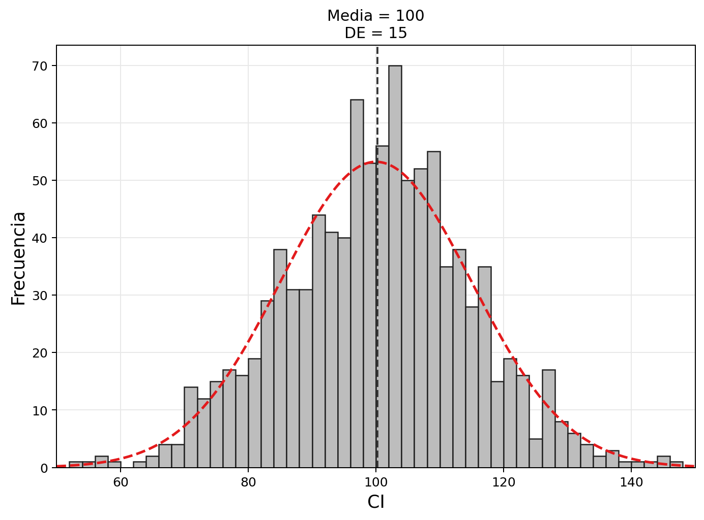
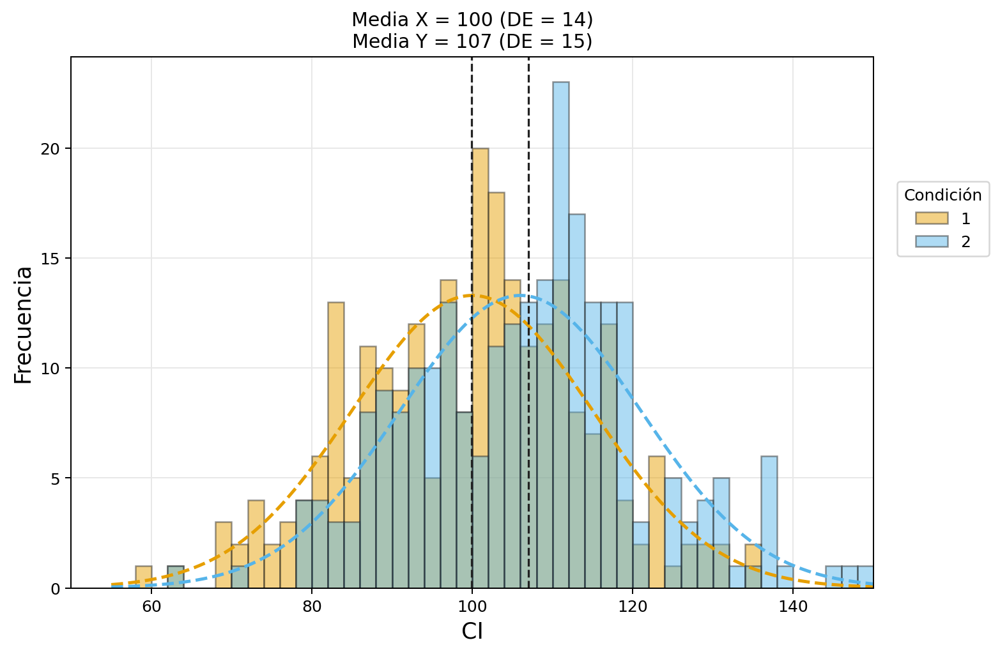
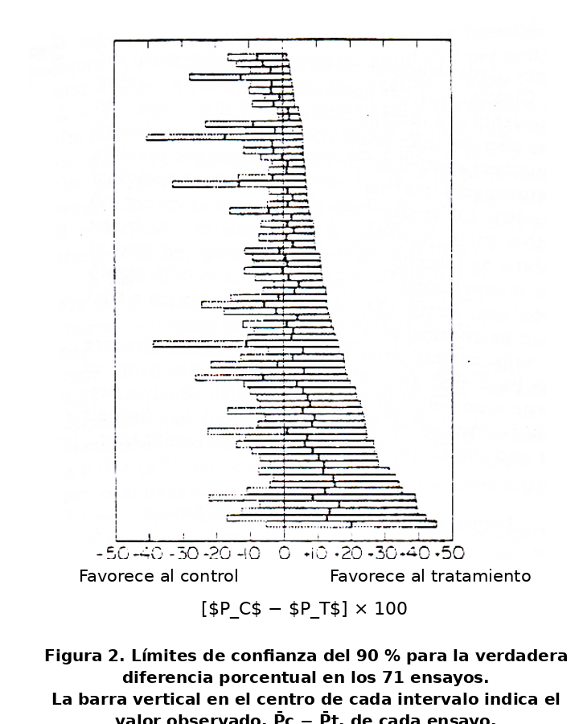
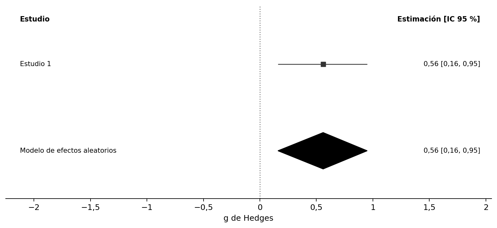
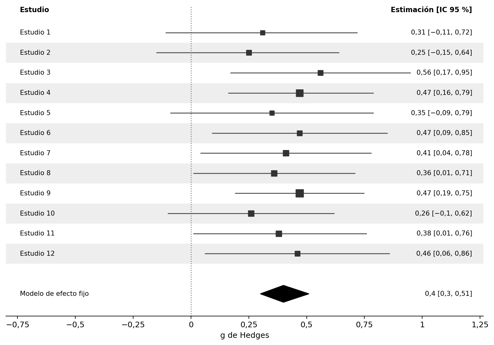
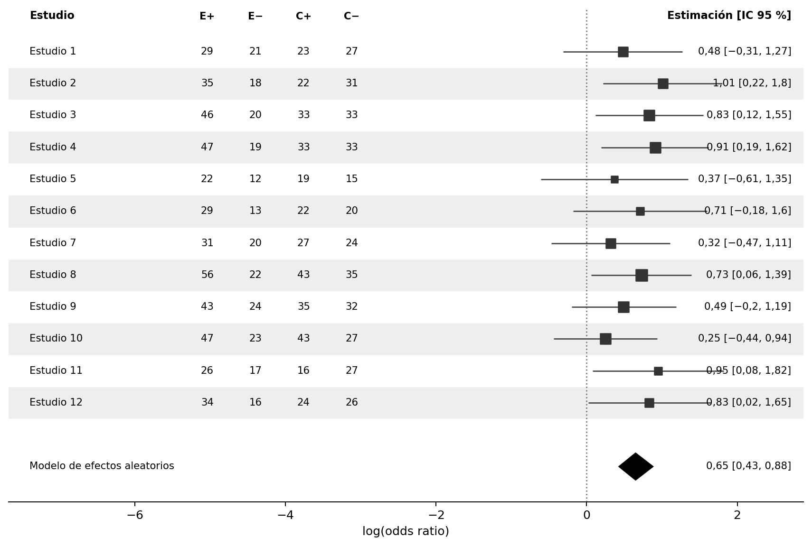
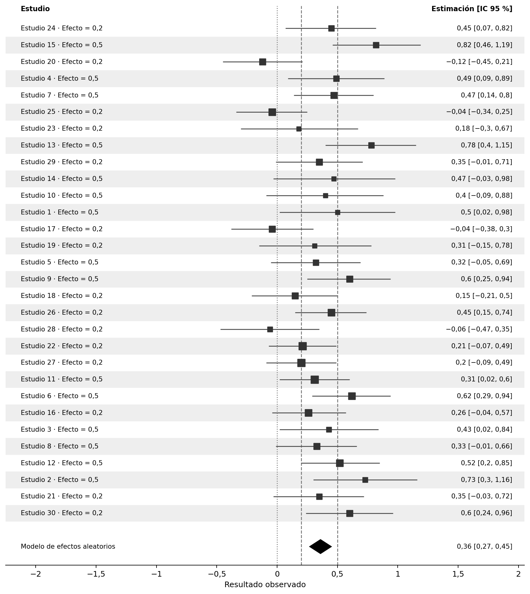
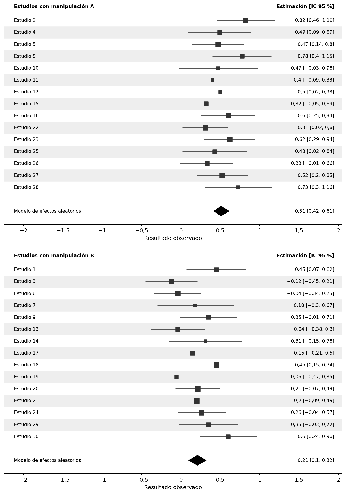
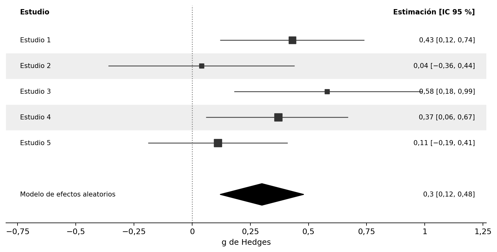
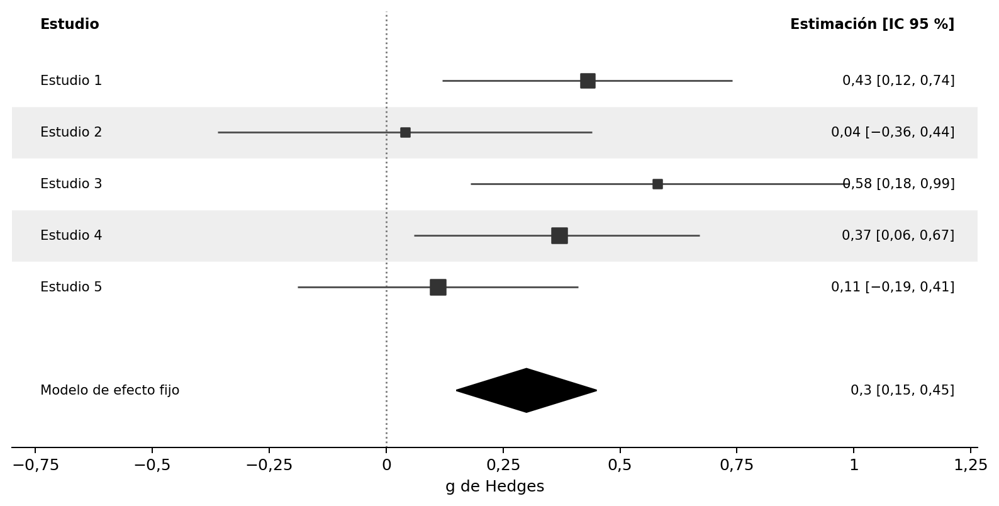

# Metaanálisis {#sec-meta}

> Traducción literal al castellano del capítulo 11, «Meta-analysis», de Daniël Lakens, *Improving Your Statistical Inferences*.<br>
> Original: https://lakens.github.io/statistical_inferences/11-meta.html<br>
> Licencia del original: CC-BY-4.0. Traducción no oficial.


Cada estudio es solo un dato en un futuro metaanálisis. Si se extraen muestras pequeñas de una población, la media y la desviación estándar de la muestra pueden diferir considerablemente de la media y la desviación estándar de la población. Existe una gran variabilidad en muestras pequeñas. Las estimaciones de parámetros a partir de muestras pequeñas son muy imprecisas y, por tanto, los intervalos de confianza del 95 % en torno a los tamaños del efecto son muy amplios. De hecho, esto llevó a Cohen [-@cohen_earth_1994] a escribir: «¡Sospecho que la razón principal por la que no se informan [los intervalos de confianza] es que son vergonzosamente grandes!». Si queremos una estimación más precisa de nuestro parámetro de interés, como la diferencia de medias o la correlación en la población, necesitamos realizar estudios individuales extremadamente grandes o, alternativamente, combinar datos de varios estudios mediante la realización de un metaanálisis. El enfoque más común para combinar estudios es realizar un metaanálisis de estimaciones del tamaño del efecto.

Puede realizar un metaanálisis de un conjunto de estudios incluidos en un único artículo que tenga previsto publicar —lo que suele denominarse metaanálisis interno—, o bien buscar en la literatura múltiples estudios publicados en tantos artículos diferentes como sea posible y realizar un metaanálisis de todos ellos. En el libro de @borenstein_introduction_2009 se proporciona una excelente introducción a los metaanálisis. Existe software comercial que puede utilizar para realizar metaanálisis, pero recomiendo encarecidamente no utilizar dicho software. Casi todos los paquetes de software comerciales carecen de transparencia y no le permiten compartir su código de análisis y sus datos con otros investigadores. En este capítulo, usaremos R para realizar un metaanálisis de tamaños de efectos, utilizando el paquete `metafor` de @viechtbauer_conducting_2010. Una ventaja importante de utilizar `metafor` es que el metaanálisis puede hacerse completamente reproducible. Si tiene previsto realizar una revisión narrativa, supone relativamente poco trabajo adicional codificar también los tamaños del efecto y los tamaños muestrales para realizar un metaanálisis de tamaños del efecto, así como codificar las pruebas estadísticas y los valores *p* para realizar un análisis de curva *p* o curva *z* (que se analizará en el próximo capítulo sobre [detección de sesgo](12-deteccion-de-sesgos.html)).

## Variación aleatoria

A la gente le resulta difícil pensar en la variación aleatoria. Nuestra mente está más orientada a reconocer patrones que a identificar el azar. En esta sección, el objetivo es aprender cómo se ve la variación aleatoria y cómo el número de observaciones recopiladas determina la cantidad de variación.

Las pruebas de inteligencia se han diseñado de manera que el coeficiente intelectual medio de toda la población de adultos sea 100, con una desviación estándar de 15. Esto no será cierto para todas las muestras que extraigamos de la población. Veamos cómo se ven las puntuaciones de coeficiente intelectual de una muestra. ¿Qué puntuaciones de coeficiente intelectual tendrán las personas de nuestra muestra?

Comenzaremos calculando manualmente la media y la desviación estándar de una muestra aleatoria hipotética de 10 individuos. Imagine que sus puntuaciones de coeficiente intelectual son: 91, 87, 76, 116, 96, 105, 87, 101, 83 y 106. Si sumamos estas 10 puntuaciones y las dividimos por 10, obtenemos una media muestral de 94,8. También podemos calcular la desviación estándar: restar la media (94,8) de cada puntuación individual, elevar al cuadrado esas diferencias y sumarlas (dando aproximadamente 1356). Al dividir por *n* − 1 = 9 y extraer la raíz cuadrada se obtiene una desviación estándar de aproximadamente 12,3.

La visualización interactiva a continuación extrae simultáneamente cuatro muestras aleatorias independientes de una población con media = 100 y DE = 15. Cada panel muestra un histograma de las puntuaciones de CI simuladas, la curva discontinua roja muestra la distribución normal teórica de la población escalada al tamaño de la muestra y la línea discontinua vertical marca la media de la muestra. La media muestral (M) y la desviación estándar (DE) se muestran dentro de cada panel. Haga clic en **Nuevas muestras** para extraer cuatro nuevas muestras independientes y observar cuánto varían la media y la desviación estándar.


```{=html}
<iframe id="rv-single-iframe"
        src="random_variation_single_app_book.html"
        width="100%"
        height="600"
        scrolling="no"
        style="border:none;display:block;margin:1.5rem 0;overflow:hidden;"
        title="Variación aleatoria: una muestra">
</iframe>
<script>
window.addEventListener('message', function(e) {
  if (e.data && typeof e.data.iframeHeight === 'number') {
    var f = document.getElementById('rv-single-iframe');
    if (f && e.source === f.contentWindow) f.style.height = e.data.iframeHeight + 'px';
  }
});
</script>
```


Cada una de las cuatro muestras ilustra cuánto pueden diferir la media y la desviación estándar de los valores reales de la población cuando n = 10. Los histogramas parecen bastante irregulares (lejos de la suave curva de campana) y la media y la DE observadas varían notablemente entre las muestras. Imaginemos que todavía no supiéramos cuál es el coeficiente intelectual medio en nuestra población (donde *M* = 100), o la desviación estándar (donde *DE* = 15), y que solo tuviéramos acceso a un conjunto de datos. Nuestra estimación podría estar bastante alejada. Este tipo de variación es esperable en muestras pequeñas, dada la verdadera desviación estándar. La variabilidad de la media está determinada por la desviación estándar de la medición. En la vida real, la desviación estándar se puede reducir, por ejemplo, utilizando mediciones múltiples y fiables (razón por la cual un test de inteligencia no tiene una sola pregunta, sino muchas preguntas diferentes). Pero también podemos asegurarnos de que la media de nuestra muestra se acerque más a la media de la población aumentando el tamaño de la muestra.

Aumente *n* a 100 en la visualización interactiva y extraiga algunas muestras nuevas. Poco a poco estamos viendo lo que se conoce como la **distribución normal** (y las puntuaciones de frecuencia comienzan a parecerse a la línea de puntos roja que ilustra la distribución normal de la población). Esta es la conocida curva en forma de campana que representa la distribución de muchas variables en la investigación científica (aunque algunos otros tipos de distribuciones también son bastante comunes). La media y la desviación estándar están mucho más cerca de la media y la desviación estándar verdaderas en las cuatro muestras.

Si simulamos una muestra realmente grande de 1000 observaciones, veremos los beneficios de recolectar una muestra de gran tamaño en términos de precisión de la medición. No todos los estudios simulados de 1000 personas arrojarán la media y la desviación estándar verdaderas, pero sucederá con bastante frecuencia. Y observe cómo, aunque la distribución es muy cercana a una distribución normal, incluso con 1000 personas no es perfecta.

{#fig-plot-hist-iq-3}


Hasta ahora, hemos simulado solo un grupo de observaciones, pero también es informativo examinar la variación que observaremos cuando comparamos las medias en dos grupos independientes. Supongamos que tenemos un nuevo programa de entrenamiento de coeficiente intelectual que aumentará la puntuación de coeficiente intelectual de las personas en 6 puntos. Las personas en la condición 1 están en la condición de control: no reciben entrenamiento de coeficiente intelectual. Las personas en la condición 2 reciben entrenamiento de coeficiente intelectual. La visualización interactiva a continuación simula este escenario; de forma predeterminada, con n = 10 por grupo, aunque puede aumentar el tamaño de la muestra para explorar su efecto. Los histogramas azules muestran el Grupo 1 (Control) y los histogramas rojos muestran el Grupo 2 (Entrenamiento); las curvas discontinuas muestran las distribuciones de la población y las líneas verticales discontinuas marcan las medias de los grupos observados. Haga clic en **Nuevas muestras** para observar cómo las medias del grupo observado y su diferencia varían entre las muestras.


```{=html}
<iframe id="rv-two-groups-iframe"
        src="random_variation_two_groups_app_book.html"
        width="100%"
        height="600"
        scrolling="no"
        style="border:none;display:block;margin:1.5rem 0;overflow:hidden;"
        title="Variación aleatoria: dos grupos independientes">
</iframe>
<script>
window.addEventListener('message', function(e) {
  if (e.data && typeof e.data.iframeHeight === 'number') {
    var f = document.getElementById('rv-two-groups-iframe');
    if (f && e.source === f.contentWindow) f.style.height = e.data.iframeHeight + 'px';
  }
});
</script>
```


Vemos que hay bastante variación, hasta el punto de que en una simulación las medias muestrales están en la dirección opuesta a las medias poblacionales. Nuevamente, aumentar el tamaño de la muestra significará que, a largo plazo, las medias muestrales se acercarán más a las medias poblacionales y que estaremos estimando con mayor precisión la diferencia entre condiciones. Con 250 observaciones en cada grupo, un conjunto de observaciones simuladas aleatoriamente para los dos grupos podría verse como @fig-plotgroup3. Tenga en cuenta que es posible que esta diferencia no parezca impresionante. Sin embargo, la diferencia pasaría una prueba de significación (una prueba *t* independiente) con un nivel alfa muy bajo.

{#fig-plotgroup3}


La variación en la estimación de la media disminuye a medida que aumenta el tamaño de la muestra. Cuanto mayor sea el tamaño de la muestra, más precisa será la estimación de la media. La **desviación estándar de la muestra** ($\sigma_x$) de puntuaciones individuales de CI es 15, independientemente del tamaño de la muestra, y cuanto mayor sea el tamaño de la muestra, con mayor precisión podremos medir la verdadera desviación estándar. Pero la **desviación estándar de la distribución muestral de la media muestral** ($\sigma_{\overline{x}}$) disminuye a medida que aumenta el tamaño de la muestra y se denomina **error estándar (SE)**. La desviación estándar estimada de la media muestral, o el error estándar, calculado en base a la desviación estándar observada de la muestra ($\sigma_x$) es:

$$SE = \sigma_{\overline{x}} = \frac{\sigma_x}{\sqrt{n}}$$
Con base en esta fórmula, y suponiendo una desviación estándar observada de la muestra de 15, el error estándar de la media es 4,74 para un tamaño de muestra de 10 y 0,95 para un tamaño de muestra de 250. Debido a que las estimaciones con un error estándar más bajo son más precisas, las estimaciones del tamaño del efecto en un metaanálisis se ponderan en función del error estándar, y las estimaciones más precisas obtienen más peso.

Hasta ahora hemos visto variación aleatoria en las medias, pero las correlaciones mostrarán una variación similar en función del tamaño de la muestra. Continuaremos con nuestro ejemplo de medición de puntuaciones de coeficiente intelectual, pero ahora buscamos gemelos fraternos (por lo tanto, no idénticos) y medimos su coeficiente intelectual. Las estimaciones de la literatura sugieren que la verdadera correlación de las puntuaciones de coeficiente intelectual entre gemelos fraternos es de alrededor de *r* = 0,55. Encontramos 30 gemelos fraternos, medimos sus puntuaciones de coeficiente intelectual y trazamos la relación entre el coeficiente intelectual de ambos individuos. En esta simulación, asumimos que todos los gemelos tienen un coeficiente intelectual medio de 100 con una desviación estándar de 15.

La correlación se calcula en función de las puntuaciones de CI de un gemelo fraterno (x) y las puntuaciones de CI del otro gemelo fraterno (y) para cada par de gemelos, y el número total de pares (N). En el numerador de la fórmula se multiplica el número de pares por la suma del producto de x e y, y a este valor se le resta la suma de x multiplicada por la suma de y. En el denominador, la raíz cuadrada se saca del número de pares multiplicado por la suma de x al cuadrado, de donde se resta la suma de x, que luego se eleva al cuadrado, y se multiplica por el mismo cálculo pero ahora para y.

$$r=\frac{n \Sigma x y-(\Sigma x )(\Sigma y)}{\sqrt{[n \Sigma x^{2}-(\Sigma x)^{2}][n \Sigma y^{2}-(\Sigma y)^{2}]}}$$
Cuando simulamos aleatoriamente observaciones de 30 gemelos, la siguiente visualización interactiva muestra el resultado.


```{=html}
<iframe id="rv-correlation-iframe"
        src="random_variation_correlation_app_book.html"
        width="100%"
        height="600"
        scrolling="no"
        style="border:none;display:block;margin:1.5rem 0;overflow:hidden;"
        title="Variación aleatoria en correlaciones">
</iframe>
<script>
window.addEventListener('message', function(e) {
  if (e.data && typeof e.data.iframeHeight === 'number') {
    var f = document.getElementById('rv-correlation-iframe');
    if (f && e.source === f.contentWindow) f.style.height = e.data.iframeHeight + 'px';
  }
});
</script>
```


En el eje x, vemos la puntuación de CI de un gemelo, y en el eje y vemos la puntuación de CI del segundo gemelo, para cada par. La línea diagonal de puntos negra ilustra la correlación verdadera (0,55), mientras que la línea roja muestra la correlación observada (en este caso, *r* = 0,43). La pendiente de la línea roja está determinada por la correlación observada. El área sombreada en azul es el intervalo de confianza del 95 % alrededor del coeficiente de correlación observado. Como vimos en el capítulo sobre [intervalos de confianza](07-intervalos-de-confianza.html), el 95 % de las veces (a largo plazo) el área azul contendrá la correlación verdadera (la línea negra de puntos). Como en los ejemplos basados ​​en medias, si aumentamos el tamaño de la muestra en la visualización interactiva a *N* = 300 vemos que el intervalo de confianza es considerablemente más estrecho. Como consecuencia, la mayoría de las veces la correlación en la muestra es mucho más cercana a la verdadera correlación en la población. A medida que aumenta el tamaño de la muestra, la estimación de la correlación se vuelve más precisa, siguiendo la fórmula del error estándar de una correlación:

$$SE_{r_{xy}} = \frac{1 - r^2_{xy}}{\sqrt{(n - 2)}}$$

Debido a que las estimaciones de medias, desviaciones estándar o correlaciones basadas en muestras pequeñas tienen una incertidumbre relativamente grande, es preferible recolectar muestras más grandes. Sin embargo, esto no siempre es posible y, a menudo, el objetivo de un estudio no es proporcionar una estimación precisa, sino probar una hipótesis. Un estudio a menudo requiere menos observaciones para lograr suficiente potencia para una prueba de hipótesis que las necesarias para poder estimar con precisión un parámetro [@maxwell_sample_2008]. Por lo tanto, los científicos suelen confiar en metaanálisis, en los que se combinan datos de múltiples estudios, para proporcionar estimaciones precisas.

## Un metaanálisis de un solo estudio

Comencemos con algo que casi nunca hará en la vida real: un metaanálisis de un solo estudio. Esto es un poco absurdo, porque una simple prueba *t* o una correlación le dirán lo mismo; sin embargo, resulta instructivo comparar una prueba *t* con un metaanálisis de un solo estudio, antes de ver cómo se combinan múltiples estudios en un metaanálisis.

Una diferencia entre una prueba *t* independiente y un metaanálisis es que la primera se realiza sobre los datos sin procesar, mientras que el segundo suele realizarse sobre los tamaños del efecto de los estudios individuales. El paquete `metafor` de R contiene una función muy útil, `escalc`, que permite calcular los tamaños del efecto, sus varianzas y los intervalos de confianza de sus estimaciones. Comencemos calculando el tamaño del efecto que introduciremos en nuestro metaanálisis. Como se explica en el capítulo sobre [tamaños del efecto](06-tamaños-del-efecto.html), los dos tamaños principales utilizados en los metaanálisis de variables continuas son la diferencia de medias estandarizada (*d*) y la correlación (*r*), aunque también es posible realizar metaanálisis de variables dicotómicas, como veremos más adelante. El siguiente código calcula la **diferencia de medias estandarizada** (DME) de dos grupos independientes a partir de sus **medias** —m1i y m2i—, **desviaciones estándar** —sd1i y sd2i— y números de observaciones —n1i y n2i—. De forma predeterminada, `metafor` calcula la ***g* de Hedges**, que es la versión insesgada de la *d* de Cohen (consulte la sección sobre la [*d* de Cohen](06-tamaños-del-efecto.html#sec-cohend)).

```r
library(metafor)
g <- escalc(measure = "SMD",
            n1i = 50, # tamaño muestral del grupo 1
            m1i = 5.6, # media observada del grupo 1
            sd1i = 1.2, # desviación estándar observada del grupo 1
            n2i = 50, # tamaño muestral del grupo 2
            m2i = 4.9, # media observada del grupo 2
            sd2i = 1.3) # desviación estándar observada del grupo 2
g
```

```text
         yi        vi
1 0.5552575 0.0415416
```


El resultado proporciona la *g* de Hedges —en la columna `yi`, que siempre devuelve el tamaño del efecto; en este caso, la diferencia de medias estandarizada— y la varianza de su estimación —en `vi`—. Como se explica en las fórmulas 4.18 a 4.24 de @borenstein_introduction_2009, la diferencia de medias estandarizada *g* de Hedges se calcula dividiendo la diferencia entre medias por la desviación estándar combinada y multiplicando el resultado por un factor de corrección, J:

$$
J = (1 - \ \ 3/(4df - 1))
$$

$$
g = J \times \ \left( \frac{{\overline{X}}_{1} - {\overline{X}}_{2}}{S_{\text{within}}} \right)
$$

y una muy buena aproximación de la varianza de la *g* de Hedges viene dada por:

$$
Vg = J^{2} \times \left( \frac{n_{1} + n_{2}}{n_{1}n_{2}} + \frac{g^{2}}{2(n_{1} + n_{2})} \right)
$$

La varianza de la diferencia de medias estandarizada depende únicamente del tamaño de la muestra (n1 y n2) y del valor de la diferencia de medias estandarizada en sí. **Para realizar los cálculos necesarios para un metaanálisis, necesita los tamaños del efecto y su varianza**. Esto significa que si ha codificado los tamaños del efecto y los tamaños de muestra (por grupo) de los estudios en la literatura, tiene la información que necesita para realizar un metaanálisis. No es necesario calcular manualmente el tamaño del efecto y su varianza utilizando las dos fórmulas anteriores: la función `escalc` lo hace por usted. Ahora podemos realizar fácilmente un metaanálisis de un solo estudio utilizando la función `rma` en el paquete `metafor`:

```r
meta_res <- rma(yi, vi, data = g)
meta_res
```

```text
Modelo de efectos aleatorios (k = 1; estimador de tau^2: REML)

tau^2 (cantidad estimada de heterogeneidad total): 0
tau (raíz cuadrada del valor estimado de tau^2):    0
I^2 (heterogeneidad total / variabilidad total):    0.00%
H^2 (variabilidad total / variabilidad muestral):   1.00

Prueba de heterogeneidad:
Q(df = 0) = 0.0000, valor p = 1.0000

Resultados del modelo:

estimación      ee  valor z  valor p   ci.lb   ci.ub
    0.5553  0.2038   2.7243   0.0064  0.1558  0.9547  **

---
Códigos de significación: 0 '***' 0.001 '**' 0.01 '*' 0.05 '.' 0.1 ' ' 1
```


En «Resultados del modelo» encontramos el tamaño del efecto *g* de Hedges (0,56), el error estándar (0,20), el estadístico *Z* con el que se contrasta la diferencia de medias frente a la hipótesis nula (2,72) y el intervalo de confianza del 95 % [ci.lb = 0,16; ci.ub = 0,95] alrededor del tamaño del efecto. La amplitud del intervalo puede especificarse mediante la opción `level =`. También vemos el valor *p* de la prueba del tamaño del efecto metaanalítico frente a 0. En este caso podemos rechazar la hipótesis nula (*p* = 0,006).

En un metaanálisis, se utiliza una prueba *Z* para examinar si la hipótesis nula puede rechazarse. Esto supone un modelo de tamaño de efecto aleatorio distribuido normalmente. Normalmente, se analizarían datos de un solo estudio con dos grupos utilizando una prueba *t*, que, como cabría esperar, utiliza una distribución *t*. No sé por qué los cálculos estadísticos a veces se preocupan mucho por una pequeña magnitud de sesgo (la diferencia entre el tamaño del efecto *d* y *g*, por ejemplo) y a veces no (la diferencia entre *Z* y *t*), pero los metaanalistas parecen contentos con las puntuaciones *Z* (de hecho, con tamaños de muestra suficientemente grandes (lo que suele ser cierto en un metaanálisis) la diferencia entre una prueba *Z* y una prueba *t* es pequeña). Si comparamos directamente un metaanálisis de un solo estudio basado en una prueba *Z* con una prueba *t*, veremos algunas pequeñas diferencias en los resultados.

Como se explica en el capítulo sobre [tamaños del efecto](06-tamaños-del-efecto.html) podemos calcular directamente el tamaño del efecto *g* de Hedges (y su intervalo de confianza del 95 %) usando MOTE [@buchanan_mote_2017]. El paquete MOTE utiliza la distribución *t* al calcular los intervalos de confianza en torno al tamaño del efecto (y podemos ver que esto supone solo una pequeña diferencia en comparación con el uso de la distribución *Z* en un metaanálisis con 50 observaciones en cada grupo).


El valor *t* es 2,835 y el valor *p* es 0,006. Los resultados son muy similares a los calculados al realizar un metaanálisis, con *g* = 0,55 e IC del 95 % [0,16; 0,94], donde el tamaño del efecto y el límite superior del intervalo de confianza difieren solo 0,01 después del redondeo.

Ahora es común visualizar los resultados de un metaanálisis mediante un diagrama de bosque. Según @cooper_handbook_2009, el primer diagrama de bosque se publicó en 1978 [@freiman_importance_1978], con el objetivo de visualizar un gran conjunto de estudios que habían concluido la ausencia de un efecto basándose en resultados no significativos en estudios pequeños (ver @fig-freiman1978). Al trazar la amplitud del intervalo de confianza para cada estudio, es posible ver que aunque los estudios no rechazan un tamaño del efecto de 0 y, por lo tanto, no fueron significativos, muchos estudios tampoco rechazaron la presencia de un efecto favorable del tratamiento que fuera relevante. Para hacer que los estudios grandes sean más notorios en un diagrama de bosque, las versiones posteriores agregaron un cuadrado para indicar el tamaño del efecto estimado, donde el tamaño del cuadrado era proporcional al peso que se asignará al estudio al calcular el efecto combinado.


{#fig-freiman1978}


En @fig-metaforest vemos una versión moderna de un diagrama de bosque, con el tamaño del efecto para el Estudio 1 marcado por el cuadrado negro en 0,56, y el intervalo de confianza visualizado por líneas que se extienden hasta 0,16 a la izquierda y 0,95 a la derecha. Los números impresos en el lado derecho del diagrama de bosque proporcionan los valores exactos para la estimación del tamaño del efecto y el límite inferior y superior del intervalo de confianza. En la mitad inferior del diagrama de bosque, vemos un diamante extendido, en una fila denominada "Modelo RE", para "modelo de efectos aleatorios". El diamante resume la estimación del tamaño del efecto metaanálítico, centrándose en esa estimación del tamaño del efecto con los extremos izquierdo y derecho en el intervalo de confianza del 95 % de la estimación. Debido a que solo tenemos un estudio, la estimación del tamaño del efecto metaanálítico es la misma que la estimación del tamaño del efecto para nuestro único estudio.

{#fig-metaforest}


## Simulación de metaanálisis de diferencias estandarizadas de medias

Los metaanálisis se vuelven un poco más interesantes cuando los utilizamos para analizar los resultados de múltiples estudios. Cuando se combinan varios estudios en un metaanálisis, las estimaciones del tamaño del efecto no se promedian sin más, sino que se **ponderan** de acuerdo con su **precisión**, determinada por el error estándar, que a su vez depende del tamaño muestral del estudio. Por tanto, cuanto mayor sea la muestra de un estudio individual, mayor será su peso en el metaanálisis y más influirá en la estimación metaanalítica del tamaño del efecto.

Una forma intuitiva de aprender sobre los metaanálisis es simular estudios y metaanalizarlos. El siguiente código simula 12 estudios. Hay un efecto verdadero en los estudios simulados, ya que la diferencia de medias en la población es 0,4 (y dada la desviación estándar de 1, el *d* de Cohen = 0,4 también). Los estudios varían en el tamaño de su muestra entre 30 observaciones y 100 observaciones por condición. Se realiza el metaanálisis y se crea un diagrama de bosque.


```r

set.seed(94)
nSims <- 12 # número de estudios simulados
m1 <- 0.4 # media poblacional del grupo 1
sd1 <- 1 # desviación estándar del grupo 1
m2 <- 0 # media poblacional del grupo 2
sd2 <- 1 # desviación estándar del grupo 1
metadata <- data.frame(yi = numeric(0), vi = numeric(0)) # crear el marco de datos

for (i in 1:nSims) { # para cada estudio simulado
  n <- sample(30:100, 1) # elegir un tamaño muestral por grupo
  x <- rnorm(n = n, mean = m1, sd = sd1)
  y <- rnorm(n = n, mean = m2, sd = sd2)
  metadata[i,1:2] <- metafor::escalc(n1i = n, n2i = n, m1i = mean(x),
       m2i = mean(y), sd1i = sd(x), sd2i = sd(y), measure = "SMD")
}
result <- metafor::rma(yi, vi, data = metadata, method = "FE")
par(bg = backgroundcolor)
metafor::forest(result,
  xlab = "g de Hedges",
  efac=c(0,4),
  lty=c(1,1,0),
  cex=0.8,
  shade = TRUE,
  rowadj=0,
  colout = "#333333",
  xlim = c(-0.4, 1.5),
  alim = c(-0.2, 1),
  textpos = c(-0.4, 1.5),
  header = TRUE)
```

{#fig-meta-sim}


Vemos 12 filas, una para cada estudio, cada una con su propio tamaño del efecto e intervalo de confianza. Si observa de cerca, puede ver que los cuadrados que indican la estimación del tamaño del efecto para cada estudio difieren en tamaño. Cuanto mayor sea el tamaño de la muestra, mayor será el cuadrado. El estudio 5 tuvo un tamaño de muestra relativamente pequeño, lo que puede verse tanto por el cuadrado pequeño como por el intervalo de confianza relativamente amplio. El estudio 9 tuvo un tamaño de muestra mayor y, por lo tanto, un cuadrado ligeramente más grande y un intervalo de confianza más estrecho. En la parte inferior del gráfico encontramos el tamaño del efecto metaanálítico y su intervalo de confianza, ambos visualizados mediante un diamante y de forma numérica. El modelo se conoce como modelo FE o **modelo de efecto fijo (FE)**. El enfoque alternativo es un modelo RE o **modelo de efectos aleatorios (RE)** (la diferencia se analiza a continuación).

Quizás observe que los dos primeros estudios del metaanálisis no fueron estadísticamente significativos. Tómese un momento para pensar si habría continuado con esta línea de investigación después de no encontrar un efecto dos veces seguidas. Si lo desea, ejecute el código anterior varias veces —elimine primero el argumento `set.seed`, utilizado para hacer reproducible la simulación, o siempre obtendrá el mismo resultado— y compruebe con qué frecuencia sucede esto con el tamaño del efecto poblacional y el intervalo de tamaños muestrales de la simulación. Como debería quedar claro tras analizar los resultados mixtos en el capítulo sobre [verosimilitudes](03-verosimilitudes.html), es importante pensar metaanalíticamente. A largo plazo habrá ocasiones en las que aparezcan uno o dos resultados no significativos al comienzo de una línea de investigación, incluso cuando exista un efecto real.

Veamos también los resultados estadísticos del metaanálisis, que es un poco más interesante ahora que tenemos 12 estudios:

```text
Modelo de efectos fijos (k = 12)

I^2 (heterogeneidad total / variabilidad total):   0.00%
H^2 (variabilidad total / variabilidad muestral):  0.25

Prueba de heterogeneidad:
Q(df = 11) = 2.7368, valor p = 0.9938

Resultados del modelo:

estimación      ee  valor z  valor p   ci.lb   ci.ub
    0.4038  0.0538   7.5015  <.0001   0.2983  0.5093  ***

---
Códigos de significación: 0 '***' 0.001 '**' 0.01 '*' 0.05 '.' 0.1 ' ' 1
```


Vemos una prueba de **heterogeneidad**, un tema al que volveremos [más adelante](#sec-heterogeneity). Los resultados del modelo muestran que, en esta simulación concreta, la estimación metaanalítica del tamaño del efecto es 0,40. Su intervalo de confianza [0,30; 0,51] es mucho más estrecho que el obtenido antes para un único estudio. Esto se debe a que los 12 estudios simulados reúnen una muestra bastante grande: cuanto mayor es el tamaño muestral, menor es el error estándar y más estrecho el intervalo de confianza. La estimación metaanalítica difiere estadísticamente de 0 (*p* \< 0,0001), por lo que podemos rechazar la hipótesis nula incluso con un nivel alfa exigente, como 0,001. Como se explicó en el capítulo sobre la justificación del tamaño muestral y en la sección dedicada a justificar las tasas de error del capítulo sobre control de errores, parece razonable utilizar en los metaanálisis un nivel alfa mucho menor que el 5 %. Es posible establecer el nivel alfa en `metafor`, por ejemplo mediante `level = 0.999` para un alfa de 0,001, pero esto ajusta todos los intervalos de confianza, incluidos los de los estudios individuales, que en su mayoría habrán utilizado un alfa de 0,05. Por ello resulta más sencillo comprobar manualmente si la prueba es significativa con el nivel alfa elegido.

## Efecto fijo frente a efectos aleatorios

Hay dos modelos posibles a la hora de realizar un metaanálisis. Un modelo, conocido como modelo de efecto fijo, supone que hay un tamaño del efecto que genera los datos en todos los estudios del metaanálisis. Este modelo supone que no hay variación entre los estudios individuales: todos tienen exactamente el mismo tamaño del efecto real. El autor del paquete `metafor` que utilizamos en este capítulo prefiere utilizar el término [modelo de efectos iguales](https://wviechtb.github.io/metafor/reference/misc-models.html) en lugar de modelo de efecto fijo. El ejemplo perfecto de esto son las simulaciones que hemos realizado hasta ahora. Especificamos un único efecto verdadero en la población y generamos muestras aleatorias a partir de este efecto poblacional.

Alternativamente, se puede utilizar un modelo en el que el efecto real difiera de alguna manera en cada estudio individual. No tenemos un único efecto verdadero en la población, sino un rango de tamaños de efectos verdaderos **distribuidos aleatoriamente** (de ahí el modelo de «efectos aleatorios»). Los estudios difieren de alguna manera entre sí (o algunos conjuntos de estudios difieren de otros conjuntos), y sus verdaderos tamaños de efecto también difieren. Nótese la diferencia terminológica en el original inglés entre *fixed effect model* y *random effects model*: el plural *effects* se utiliza solo en el segundo. Borenstein et al. [-@borenstein_introduction_2009] afirman que hay dos razones para utilizar un modelo de efecto fijo: cuando todos los estudios son funcionalmente equivalentes y cuando su objetivo *no* es generalizar a otras poblaciones. Esto hace que el modelo de efectos aleatorios sea generalmente la mejor opción, aunque algunas personas han expresado su preocupación de que los modelos de efectos aleatorios den más peso a estudios más pequeños, que pueden estar más sesgados. De forma predeterminada, `metafor` utilizará un modelo de efectos aleatorios. Usamos el comando `method="FE"` para solicitar explícitamente un modelo de efecto fijo. En los metaanálisis que simularemos en el resto de este capítulo, omitiremos este comando y simularemos metaanálisis de efectos aleatorios, ya que esta es la mejor opción en muchos metaanálisis de la vida real.

## Simulación de metaanálisis para resultados dicotómicos

Aunque los metaanálisis sobre diferencias de medias son muy comunes, se puede realizar un metaanálisis sobre diferentes medidas de tamaño del efecto. Para mostrar un ejemplo un poco menos común, simulemos un metaanálisis basado en odds ratios. A veces, el resultado principal de un experimento es una variable dicotómica, como el éxito o el fracaso de una tarea. En tales diseños de estudios podemos calcular los riesgos relativos, los odds ratios o las diferencias de riesgos como medida del tamaño del efecto. A veces se considera que las diferencias de riesgo son las más fáciles de interpretar, pero los odds ratios se utilizan con mayor frecuencia para un metaanálisis porque tienen propiedades estadísticas atractivas. Un **odds ratio** es el cociente entre dos *odds*. Para ilustrar cómo se calcula un odds ratio, es útil considerar los cuatro resultados posibles en una tabla de resultados de 2 x 2:

|              | Éxito | Fracaso | *N* |
|:-------------|:-------:|:-------:|:------:|
| Experimental | *A* | *B* | *n1* |
| Control | *C* | *D* | *n2* |

El odds ratio se calcula como:
$$OR = \ \frac{\text{AD}}{\text{BC}}$$
El metaanálisis se realiza sobre los odds ratios transformados logarítmicamente (porque los odds ratios transformados logarítmicamente son simétricos alrededor de 1; véase @borenstein_introduction_2009) y, por tanto, se utiliza el log del odds ratio, que tiene una varianza que se aproxima por:
$$\text{Var}\left( \log\text{OR} \right) = \ \frac{1}{A} + \frac{1}{B} + \frac{1}{C} + \frac{1}{D}$$

Supongamos que capacitamos a los estudiantes en el uso de una estrategia de aprendizaje espaciada (trabajan con un libro de texto cada semana en lugar de estudiar la semana antes del examen). Sin dicha formación, 70 de cada 100 estudiantes logran aprobar el curso después del primer examen, pero con esta formación, 80 de cada 100 estudiantes aprueban.

|              | Éxito | Fracaso | *N* |
|--------------|---------|---------|-----|
| Experimental | 80 | 20 | 100 |
| Control | 70 | 30 | 100 |

Los *odds* de aprobar en el grupo experimental son 80/20, es decir, 4, mientras que en la condición de control son 70/30, es decir, 2,333. El cociente entre ambos *odds* es entonces: 4/2,333 = 1,714, o:

$$
OR = \ \frac{80 \times 30}{20\  \times 70} = 1,714
$$

Podemos simular estudios con resultados dicotómicos, donde fijamos el porcentaje de éxitos y
fracasos en la condición experimental y de control. En el siguiente script, de forma predeterminada el porcentaje de éxito en la condición experimental es del 70 % y en la condición de control es del 50 %.

```r
library(metafor)
set.seed(5333)
nSims <- 12 # número de experimentos simulados

pr1 <- 0.7 # fijar el porcentaje de éxitos del grupo 1
pr2 <- 0.5 # fijar el porcentaje de éxitos del grupo 2

ai <- numeric(nSims) # crear un vector vacío para los éxitos del grupo 1
bi <- numeric(nSims) # crear un vector vacío para los fracasos del grupo 1
ci <- numeric(nSims) # crear un vector vacío para los éxitos del grupo 2
di <- numeric(nSims) # crear un vector vacío para los fracasos del grupo 2

for (i in 1:nSims) { # para cada experimento simulado
  n <- sample(30:80, 1)
  x <- rbinom(n, 1, pr1) # participantes (1 = éxito, 0 = fracaso)
  y <- rbinom(n, 1, pr2) # participantes (1 = éxito, 0 = fracaso)
  ai[i] <- sum(x == 1) # éxitos del grupo 1
  bi[i] <- sum(x == 0) # fracasos del grupo 1
  ci[i] <- sum(y == 1) # éxitos del grupo 2
  di[i] <- sum(y == 0) # fracasos del grupo 2
}

# Combinar datos en un marco de datos
metadata <- cbind(ai, bi, ci, di)
# Crear un objeto de cálculo a partir de un marco de datos de metadatos
metadata <- escalc(measure = "OR",
                   ai = ai, bi = bi, ci = ci, di = di,
                   data = metadata)
# Realizar metaanálisis
result <- rma(yi, vi, data = metadata)
# Crear diagrama de bosque. Uso de argumentos ilab e ilab.xpos para sumar recuentos
par(mar=c(5, 4, 0, 2))
par(bg = backgroundcolor)
forest(result,
       ilab = cbind(metadata$ai, metadata$bi, metadata$ci, metadata$di),
       xlim = c(-10, 8),
  alim = c(-2, 2),
  ilab.xpos = c(-7, -6, -5, -4),
  xlab = "log(odds ratio)",
  efac=c(0,4),
  lty=c(1,1,0),
  cex=0.8,
  shade = TRUE,
  rowadj=0,
  colout = "#333333",
  textpos = c(-10, 8),
  header = TRUE)
text(c(-7, -6, -5, -4), 14.7, c("E+", "E-", "C+", "C-"), font = 2, cex = .8)

```

{#fig-meta-dicotomicos}


El diagrama de bosque presenta los estudios y cuatro columnas de datos después de la etiqueta del estudio, que contienen el número de éxitos y fracasos en los grupos experimentales (E+ y E-), y el número de éxitos y fracasos en el grupo de control (C+ y C-). Imaginemos que estudiamos el porcentaje de personas que consiguen un trabajo dentro de los 6 meses posteriores a un programa de capacitación laboral, en comparación con una condición de control. En el Estudio 1, que contó con 50 participantes en cada condición, 29 personas en la condición de capacitación laboral consiguieron un trabajo en 6 meses y 21 no consiguieron trabajo. En la condición de control, 23 personas consiguieron trabajo, pero 27 no. La estimación del tamaño del efecto para el modelo de efectos aleatorios es 0,65. Siéntase libre de jugar con el script, ajustando la cantidad de estudios o los tamaños de muestra en cada estudio, para examinar el efecto que tiene en la estimación del tamaño del efecto metaanálítico.

También podemos obtener los resultados de las pruebas metaanalíticas imprimiendo el resultado de la prueba. Vemos que no hubo heterogeneidad en este metaanálisis. Esto es cierto (simulamos estudios idénticos), pero es muy poco probable que suceda en la vida real, donde la variación en los tamaños del efecto entre los estudios incluidos en un metaanálisis es un escenario mucho más realista.

```r
# Imprimir los resultados del metaanálisis
result
```

```text
Modelo de efectos aleatorios (k = 12; estimador de tau^2: REML)

tau^2 (cantidad estimada de heterogeneidad total): 0 (EE = 0.0645)
tau (raíz cuadrada del valor estimado de tau^2):    0
I^2 (heterogeneidad total / variabilidad total):    0.00%
H^2 (variabilidad total / variabilidad muestral):   1.00

Prueba de heterogeneidad:
Q(df = 11) = 4.8886, valor p = 0.9364

Resultados del modelo:

estimación      ee  valor z  valor p   ci.lb   ci.ub
    0.6548  0.1132   5.7824  <.0001   0.4328  0.8767  ***

---
Códigos de significación: 0 '***' 0.001 '**' 0.01 '*' 0.05 '.' 0.1 ' ' 1
```


## Heterogeneidad {#sec-heterogeneity}

Aunque los investigadores suelen utilizar el metaanálisis para calcular una estimación metaanalítica del tamaño del efecto y comprobar si este difiere estadísticamente de cero, **un uso posiblemente mucho más importante de los metaanálisis consiste en explicar la variación entre estudios o conjuntos de estudios**. Esta variación se denomina **heterogeneidad**. Uno de los objetivos del metaanálisis no es solo codificar los tamaños del efecto y estimar un tamaño del efecto metaanalítico, sino también codificar características de los estudios que puedan explicar la heterogeneidad y examinar cuáles la explican. Esto puede contribuir a evaluar o desarrollar teorías. Se han creado pruebas para examinar si los estudios incluidos en un metaanálisis varían más de lo esperable cuando el tamaño del efecto verdadero subyacente es el mismo en todos ellos, así como medidas para cuantificar esa variación.

Si todos los estudios tienen el mismo tamaño real del efecto poblacional, la única fuente de variación es el error aleatorio. Si existen diferencias reales entre (conjuntos de) estudios, hay dos fuentes de variación, a saber, la variación aleatoria de un estudio a otro *y* diferencias reales en los tamaños del efecto en (conjuntos de) estudios.

Una medida clásica de heterogeneidad es la estadística $Q$ de Cochran, que es la suma ponderada de las diferencias al cuadrado entre las estimaciones del tamaño del efecto en cada estudio y la estimación del tamaño del efecto metaanalítico. La estadística $Q$ se puede utilizar para probar si la ausencia de heterogeneidad puede rechazarse estadísticamente (comparándola con la cantidad esperada de variación, que son los grados de libertad, *df*, o el número de estudios menos 1; véase @borenstein_introduction_2009), pero puede tener una potencia estadística baja si el número de estudios en el metaanálisis es pequeño [@huedo-medina_assessing_2006].

Desde el punto de vista teórico, se podría argumentar que siempre habrá cierta heterogeneidad en un metaanálisis y que, por tanto, resulta más interesante cuantificar su magnitud. El índice $I^2$ pretende cuantificar la heterogeneidad estadística. Se calcula de la siguiente manera:

$$I^{2} = \ \frac{(Q - k - 1)}{Q} \times 100\%$$

donde $k$ es el número de estudios —y $k-1$, los grados de libertad—. $I^2$ varía entre 0 y 100 y puede interpretarse como el porcentaje de la variabilidad total de un conjunto de tamaños del efecto que se debe a la heterogeneidad. Cuando $I^2$ = 0, toda la variabilidad de las estimaciones del tamaño del efecto puede explicarse por el error intraestudio; cuando $I^2$ = 50, la heterogeneidad real explica la mitad de la variabilidad total. Los valores de $I^2$ del 25 %, 50 % y 75 % pueden interpretarse como heterogeneidad baja, media y alta. Por último, en un metaanálisis de efectos aleatorios, $\tau^2$ estima la varianza de los efectos verdaderos y $\tau$ es la desviación estándar estimada, expresada en la misma escala que el tamaño del efecto. Una ventaja de $\tau^2$ es que no depende de la precisión, a diferencia de $I^2$, que tiende al 100 % cuando los estudios incluidos en el metaanálisis son muy grandes [@rucker_undue_2008]. Su desventaja es que $\tau^2$ resulta más difícil de interpretar [@harrer_doing_2021].

El siguiente script simula un metaanálisis similar al ejemplo anterior de diferencias de medias estandarizadas, pero introduce una pequeña variación. De los 30 estudios, 15 se generan a partir de una diferencia de medias verdadera de 0,2, mientras que los otros 15 se basan en un tamaño del efecto verdadero de 0,5. Por tanto, en este conjunto varía el tamaño del efecto verdadero y existe heterogeneidad real. Usamos la función `confint` del paquete `metafor` para obtener $I^2$ y $\tau^2$ junto con sus intervalos de confianza, y observamos que la prueba de heterogeneidad es estadísticamente significativa. En otras palabras, concluiríamos que el tamaño del efecto metaanalítico difiere estadísticamente de 0, pero también que existe variabilidad no explicada entre los tamaños del efecto y que estos no son iguales en todos los estudios del metaanálisis.

```r
library(metafor)
set.seed(3)
nSims <- 30 # número de experimentos simulados (debe ser divisible por 2)
metadata <- data.frame(yi = numeric(0), vi = numeric(0)) # crear el marco de datos
true_es <- numeric(nSims) # crear un vector vacío para los tamaños del efecto verdaderos
study <- numeric(nSims) # crear un vector vacío para los números de estudio
group <- numeric(nSims) # crear un vector vacío para el grupo

m1 <- 0.5 # media poblacional del grupo 1
sd1 <- 1 # desviación estándar del grupo 1
m2 <- 0 # media poblacional del grupo 2
sd2 <- 1 # desviación estándar del grupo 1

for (i in 1:(nSims/2)) {
  n <- sample(30:100, 1)
  x <- rnorm(n = n, mean = m1, sd = sd1) # simular datos aleatorios con distribución normal
  y <- rnorm(n = n, mean = m2, sd = sd2) # simular datos aleatorios con distribución normal
  metadata[i,1:2] <- metafor::escalc(n1i = n, n2i = n, m1i = mean(x), m2i = mean(y), sd1i = sd(x), sd2i = sd(y), measure = "SMD") # calcular el tamaño del efecto
  true_es[i] <- paste("Estudio", i, "Efecto = 0.5") # tamaño del efecto verdadero
  group[i] <- paste("Manipulación A") # etiqueta del grupo
  study[i] <- paste("Estudio",i) # estudio
}

m1 <- 0.2 # media poblacional del grupo 1
sd1 <- 1 # desviación estándar del grupo 1
m2 <- 0 # media poblacional del grupo 2
sd2 <- 1 # desviación estándar del grupo 1

for (i in (nSims/2+1):nSims) { # para la segunda mitad de los estudios simulados
  n <- sample(30:100, 1)
  x <- rnorm(n = n, mean = m1, sd = sd1) # simular datos aleatorios con distribución normal
  y <- rnorm(n = n, mean = m2, sd = sd2) # simular datos aleatorios con distribución normal
  metadata[i,1:2] <- metafor::escalc(n1i = n, n2i = n, m1i = mean(x), m2i = mean(y), sd1i = sd(x), sd2i = sd(y), measure = "SMD") # calcular el tamaño del efecto
  true_es[i] <- paste("Estudio", i, "Efecto = 0.2") # tamaño del efecto verdadero
  group[i] <- paste("Manipulación B") # etiqueta del grupo
  study[i] <- paste("Estudio",i) # estudio
}

# Combinar datos en un marco de datos
metadata <- cbind.data.frame(metadata, true_es, study, group)
# Mezclar las filas para dificultar ver de qué grupo procede cada tamaño del efecto
metadata <- metadata[sample(nrow(metadata)),]

# Realizar metaanálisis
result <- rma(yi, vi, data = metadata, slab = paste(true_es))
# Imprimir los resultados del metaanálisis
result
confint(result) # obtener los intervalos de confianza de los índices de heterogeneidad
```

```text
Modelo de efectos aleatorios (k = 30; estimador de tau^2: REML)

tau^2 (cantidad estimada de heterogeneidad total): 0.0274 (EE = 0.0160)
tau (raíz cuadrada del valor estimado de tau^2):    0.1655
I^2 (heterogeneidad total / variabilidad total):    45.43%
H^2 (variabilidad total / variabilidad muestral):   1.83

Prueba de heterogeneidad:
Q(df = 29) = 52.3032, valor p = 0.0050

Resultados del modelo:

estimación      ee  valor z  valor p   ci.lb   ci.ub
    0.3578  0.0453   7.8909  <.0001   0.2689  0.4467  ***

---
Códigos de significación: 0 '***' 0.001 '**' 0.01 '*' 0.05 '.' 0.1 ' ' 1

           estimación   ci.lb   ci.ub
tau^2          0.0274  0.0044  0.0717
tau            0.1655  0.0666  0.2677
I^2 (%)       45.4253 11.8823 68.5417
H^2            1.8324  1.1348  3.1788
```


El diagrama de bosque en @fig-plot-heterogeneity muestra que hay más variación en torno a la estimación del tamaño del efecto metaanalítico de lo esperado basándose únicamente en la variación aleatoria. La gráfica tiene dos líneas verticales, una en 0,2 y otra en 0,5. Por supuesto, en un metaanálisis real no sabríamos cuáles son los verdaderos tamaños del efecto de los subconjuntos, pero estas líneas nos ayudan a ver que un subconjunto de efectos varía aleatoriamente alrededor de 0,2 y un segundo subconjunto varía aleatoriamente alrededor de 0,5.

{#fig-plot-heterogeneity}


De acuerdo con la prueba de heterogeneidad, podemos rechazar la hipótesis nula de que no existe heterogeneidad en el metaanálisis. Estas pruebas tienen sus propias tasas de error de tipo I y de tipo II y, cuando el número de estudios es pequeño —como en nuestro ejemplo, *n* = 12—, pueden tener poca potencia estadística. Si elimina el comando `set.seed` y ejecuta el código varias veces, verá que la prueba de heterogeneidad a menudo no será significativa, aunque en la simulación exista heterogeneidad real. En metaanálisis grandes, la potencia puede ser tan elevada que la prueba siempre produzca un valor *p* lo bastante pequeño como para rechazar la hipótesis nula; en ese caso, es importante examinar la estimación de $I^2$.

Recientemente se ha prestado considerable atención a la posibilidad de que los tamaños del efecto dentro de las líneas de investigación presenten una heterogeneidad sustancial [@bryan_behavioural_2021]. Una heterogeneidad elevada puede afectar a la potencia de los estudios y, por tanto, tiene consecuencias para su planificación [@kenny_unappreciated_2019]. Aunque la heterogeneidad parece ser baja en los estudios de replicación directa [@olsson-collentine_heterogeneity_2020], es elevada en la mayoría de los metaanálisis, lo que, según se ha argumentado, refleja una comprensión insuficiente de los efectos en esas líneas de investigación [@linden_heterogeneity_2021].

## Exploración de la heterogeneidad mediante análisis de subgrupos

Imaginemos que mientras codificamos nuestro metaanálisis notamos que en el conjunto total de estudios se utilizaron dos manipulaciones diferentes. La manipulación A fue más fuerte y, por lo tanto, teóricamente esperaríamos un efecto más fuerte, mientras que la manipulación B fue más sutil. Hemos codificado qué manipulación se utilizó en cada uno de los estudios incluidos en nuestro metaanálisis. Esto nos permite explorar si la heterogeneidad observada anteriormente puede explicarse por el tipo de manipulación. En otras palabras, estamos probando si el tamaño del efecto está moderado por el tipo de manipulación. Este es un análisis de subgrupos. Es conceptualmente muy similar a un ANOVA donde probamos si existen diferencias entre grupos. Vemos que la prueba de moderadores arroja un resultado estadísticamente significativo, lo que significa que podemos rechazar la hipótesis nula de que los dos grupos no difieren en el tamaño del efecto. Además, no queda ninguna heterogeneidad estadísticamente significativa después de dividir los estudios en estos dos grupos.

```r
# Basado en https://www.metafor-project.org/doku.php/tips:comp_two_independent_estimates

# Tomamos el conjunto de datos original y ejecutamos una metarregresión utilizando el argumento "mods".
# Esto agrupa las estimaciones de tau, pero suele ser un buen enfoque.
rma(yi, vi, mods = ~ group, data = metadata, digits = 3)

```

```text
Modelo de efectos mixtos (k = 30; estimador de tau^2: REML)

tau^2 (cantidad estimada de heterogeneidad residual):       0.006 (EE = 0.010)
tau (raíz cuadrada del valor estimado de tau^2):             0.081
I^2 (heterogeneidad residual / variabilidad no explicada):  16.42%
H^2 (variabilidad no explicada / variabilidad muestral):     1.20
R^2 (proporción de heterogeneidad explicada):               76.32%

Prueba de heterogeneidad residual:
QE(df = 28) = 31.550, valor p = 0.293

Prueba de moderadores (coeficiente 2):
QM(df = 1) = 17.231, valor p < .001

Resultados del modelo:

                      estimación     ee  valor z valor p   ci.lb   ci.ub
intersección               0.514  0.053    9.643   <.001   0.410   0.618  ***
grupo Manipulación B      -0.303  0.073   -4.151   <.001  -0.446  -0.160  ***

---
Códigos de significación: 0 '***' 0.001 '**' 0.01 '*' 0.05 '.' 0.1 ' ' 1
```

Si trazamos los dos subgrupos, vemos en @fig-plot-subgroup que los tamaños del efecto varían aleatoriamente entre los tamaños del efecto real. Nuevamente, en metaanálisis reales no se conocerían estos verdaderos tamaños del efecto.

{#fig-plot-subgroup}


## Fortalezas y debilidades del metaanálisis

Las conclusiones de los metaanálisis han sido debatidas desde los primeros metaanálisis que se realizaron. Es irónico que, hasta donde puedo encontrar, la crítica de «basura entra, basura sale» al metaanálisis se origina en Eysenck [-@eysenck_exercise_1978] porque aunque es una crítica válida, el propio Eysenck publicó basura literal, ya que fue declarado [culpable de mala conducta científica](https://www.science.org/content/article/misconduct-allegations-push-psychology-hero-his-pedestal), lo que ha dado lugar a un gran número de [retracciones](http://retractiondatabase.org/RetractionSearch.aspx?AspxAutoDetectCookieSupport=1#?AspxAutoDetectCookieSupport%3d1%26auth%3dEysenck%252c%2bHans%2bJ) y expresiones de preocupación. Eysenck escribió sobre un metaanálisis que arrojó resultados que no le gustaron:

> La característica más sorprendente del ejercicio de megatonterías de Smith y Glass (1977) es su defensa de bajos estándares de juicio. Más aún, abogan y practican el abandono de juicios críticos de cualquier tipo. Una gran cantidad de informes (buenos, malos e indiferentes) se introducen en el ordenador con la esperanza de que la gente deje de preocuparse por la calidad del material en el que se basan las conclusiones. Si su abandono de la erudición se tomara en serio, una perspectiva desalentadora, aunque improbable, marcaría el comienzo de un paso hacia la era oscura de la psicología científica.
>
> La noción de que se puede destilar conocimiento científico a partir de una recopilación de estudios en su mayoría de diseño deficiente, basados ​​en juicios clínicos subjetivos, no validados y ciertamente poco fiables, y diferentes con respecto a casi todos los parámetros vitales, es difícil de eliminar. Es de esperar que este artículo sea el último estertor de tales esperanzas. «Basura entra, basura sale» es un axioma bien conocido de los especialistas en informática; se aplica aquí con igual fuerza.

El problema de «basura entra, basura sale» sigue siendo una de las críticas más comunes y difíciles de abordar al metaanálisis. Es cierto que un metaanálisis no puede convertir datos de baja calidad en una buena estimación del tamaño del efecto, o tamaños del efecto altamente heterogéneos en una estimación útil de un tamaño del efecto que se generalice a todos los estudios incluidos en el metaanálisis. La decisión de qué estudios incluir en un metaanálisis es difícil y a menudo conduce a desacuerdos en las conclusiones de los metaanálisis realizados en el mismo conjunto de estudios [@goodyear-smith_analysis_2012; @ferguson_comment_2014]. Finalmente, los metaanálisis pueden estar sesgados, de la misma manera que los estudios individuales están sesgados, lo cual es un tema que se explora con más detalle en el capítulo sobre [detección de sesgos](12-deteccion-de-sesgos.html).

Una ventaja del metaanálisis es que la combinación de estudios muy similares en un solo análisis aumenta la potencia estadística de la prueba, así como la precisión de la estimación del tamaño del efecto. Cuando no sea posible —o no resulte eficiente— realizar estudios con un gran número de observaciones, un metaanálisis no sesgado puede proporcionar mejores inferencias estadísticas. Además, incluir un **metaanálisis interno** en un artículo con varios estudios —cuando todos sean suficientemente similares— puede reducir el problema del cajón de archivo, pues permite publicar resultados mixtos. Al mismo tiempo, algunos investigadores han advertido que, si se seleccionan los estudios que se incluyen en un metaanálisis interno, simplemente se aumenta la flexibilidad del análisis y la probabilidad de afirmar erróneamente que los datos respaldan la hipótesis [@vosgerau_99_2019]. Los investigadores deberían publicar todos los estudios bien diseñados que hayan realizado dentro de una línea de investigación y, si los estudios son similares y no están sesgados, un metaanálisis mejorará las inferencias. Aun así, el resultado de un metaanálisis puede estar sesgado y no debe interpretarse como la respuesta definitiva. Por esta razón, el análisis de la heterogeneidad de las estimaciones del tamaño del efecto y el uso de técnicas estadísticas para detectar sesgos son componentes esenciales de cualquier metaanálisis.

## ¿Qué resultados debería informar para incluirlos en un futuro metaanálisis? {#sec-reportmeta}

Sería un ejercicio educativo útil para cualquier investigador que publique estudios cuantitativos codificar una docena de estudios para un metaanálisis. Un problema notorio al realizar un metaanálisis es que los investigadores no informan todos los resultados que un metaanalista necesita para incluir el estudio en su metaanálisis. A veces se puede contactar al investigador original y proporcionar la información que falta, pero como cada estudio es solo un punto de datos en un metaanálisis futuro, es mejor informar todos los resultados requeridos para incluirlos en un metaanálisis futuro.

El mejor enfoque para garantizar que toda la información requerida para un futuro metaanálisis esté disponible para los metaanalistas es compartir los datos (anonimizados) y el código de análisis con el manuscrito. Esto permitirá a los metaanalistas calcular cualquier información estadística que necesiten. El acceso a observaciones individuales permite a los metaanalistas realizar análisis en subgrupos y permite realizar pruebas estadísticas más avanzadas [@stewart_ipd_2002]. Finalmente, el acceso a los datos sin procesar, en lugar de solo acceder a los estadísticos descriptivos, hace que sea más fácil encontrar estudios individuales defectuosos que no deberían incluirse en un metaanálisis [@lawrence_lesson_2021]. A medida que los datos abiertos se conviertan en la norma, los esfuerzos para estandarizar medidas y desarrollar especificaciones para conjuntos de datos facilitarán la disponibilidad de datos sin procesar como entrada para los metaanálisis. Esto también facilitará la reutilización de datos y permitirá a los investigadores realizar metaanálisis no relacionados con la pregunta de investigación principal. Si desea compartir los datos sin procesar que recopilará, asegúrese de indicarlo en su [formulario de consentimiento informado](https://www.uu.nl/en/research/research-data-management/guides/informed-consent-for-data-sharing).

Al resumir datos en un artículo científico, informe el número de observaciones asociadas con cada prueba estadística. La mayoría de los artículos mencionarán el tamaño total de la muestra, pero si se eliminan algunas observaciones mientras se limpian los datos, también informarán el número final de observaciones incluidas en una prueba. Cuando una prueba estadística se basa en múltiples condiciones (por ejemplo, una prueba *t*), informe el tamaño de la muestra en cada grupo independiente. Si falta esta información, los metaanalistas a menudo tendrán que suponer que el número total de observaciones se distribuye equitativamente entre las condiciones, lo que no siempre es correcto. Informe los resultados completos de las pruebas para los resultados significativos y no significativos (por ejemplo, nunca escriba *F* < 1, *ns*). Escriba el resultado completo de la prueba, incluida una estimación del tamaño del efecto, independientemente del valor *p*, ya que es especialmente importante incluir resultados no significativos en los metaanálisis. Al informar los tamaños del efecto, indique cómo se calcularon (por ejemplo, al informar las diferencias de medias estandarizadas, ¿calculó la *d* de Cohen o la *g* de Hedges?). Informe los valores *p* exactos para cada prueba, o los estadísticos completos de la prueba que se pueden utilizar para volver a calcular el valor *p*. Informe las medias y las desviaciones estándar para cada grupo de observaciones y, en los diseños intrasujeto, informe la correlación entre las variables dependientes (que actualmente casi nunca se comunica, pero es necesaria para calcular la [$d_{av}$ de Cohen](06-tamaños-del-efecto.html#sec-cohend) y realizar análisis de potencia basados en simulación según el patrón de datos predicho). Podría resultar útil utilizar una tabla para resumir todas las pruebas estadísticas si se informan muchas pruebas, pero los datos sin procesar no se pueden compartir (por ejemplo, en el material complementario).

## Mejora de la reproducibilidad de los metaanálisis {#sec-metareporting}

Aunque los metaanálisis no proporcionan conclusiones definitivas, normalmente se interpretan como conocimiento empírico de última generación sobre un efecto o área de investigación específica. Los metaanálisis a gran escala a menudo acumulan una gran cantidad de citas e influyen en futuras investigaciones y desarrollo teórico. Por tanto, es esencial que los metaanálisis publicados sean de la mayor calidad posible.

Al mismo tiempo, las conclusiones de los metaanálisis suelen estar abiertas al debate y sujetas a cambios a medida que se dispone de nuevos datos. Recientemente propusimos recomendaciones prácticas para aumentar la reproducibilidad de los metaanálisis: facilitar el control de calidad, mejorar las guías de presentación de resultados, permitir a los investigadores volver a analizar los metaanálisis con criterios de inclusión alternativos y garantizar su reutilización. Para ello, los datos metaanalíticos recopilados deben compartirse, de modo que puedan realizarse metaanálisis acumulativos actualizados continuamente y aplicarse nuevas técnicas estadísticas a medida que estén disponibles [@lakens_reproducibility_2016]. La necesidad de mejorar la reproducibilidad del metaanálisis es clara: una revisión reciente de 150 metaanálisis en *Psychological Bulletin* reveló que solo un metaanálisis compartía el código estadístico [@polanin_transparency_2020]. Esto es inaceptable en la época actual. Además de inspeccionar en qué medida su metaanálisis cumple los [Estándares de presentación de metaanálisis cuantitativos de JARS](https://apastyle.apa.org/jars/quant-table-9.pdf), seguir las recomendaciones resumidas en @tbl-table-rec1 debería mejorar sustancialmente el estado del arte en los metaanálisis.

::: {#tbl-table-rec1}
| ¿Qué? | ¿Cómo? |
|---|---|
| Facilitar la ciencia acumulativa | Haga públicos todos los datos metaanalíticos de cada punto de datos: tamaños del efecto, tamaños muestrales por condición, estadísticos de contraste y grados de libertad, medias, desviaciones estándar y correlaciones entre observaciones dependientes. Cite el texto pertinente de los estudios que describe esos datos para evitar confusiones, por ejemplo cuando se selecciona un tamaño del efecto entre muchas pruebas. En los análisis de subgrupos, incluya las citas del estudio original que sustentan la clasificación y especifique las decisiones subjetivas. |
| Facilitar el control de calidad | Especifique qué cálculos del tamaño del efecto se utilizaron y qué supuestos se adoptaron ante datos ausentes —por ejemplo, tamaños muestrales iguales por condición o imputación de tamaños del efecto no informados—, si es necesario para cada efecto extraído. Indique quién extrajo y codificó los datos; es preferible que dos investigadores extraigan de forma independiente los tamaños del efecto. |
| Usar guías de presentación de resultados | Un requisito mínimo al informar de un metaanálisis es seguir alguna norma de presentación, como PRISMA. Estas guías piden comunicar información esencial en el texto principal o mediante una lista de comprobación cumplimentada como material suplementario durante la revisión y después de la publicación. |
| Prerregistrar | Siempre que sea posible, prerregistre el protocolo del metaanálisis —por ejemplo, en PROSPERO— para distinguir los análisis confirmatorios de los exploratorios. Cuando sea posible, realice un metaanálisis prospectivo. |
| Facilitar la reproducibilidad | Permita que otras personas vuelvan a analizar los datos y examinen la sensibilidad de los resultados a decisiones subjetivas, como los criterios de inclusión. Incluya siempre un enlace a archivos de datos analizables directamente: idealmente, scripts completamente reproducibles con los datos y análisis en software libre como R; como mínimo, una hoja de cálculo con todos los datos metaanalíticos. |
| Incorporar conocimientos especializados | Considere consultar a un profesional de bibliotecas antes de iniciar la búsqueda bibliográfica y a un especialista en estadística antes de codificar los tamaños del efecto, para recibir asesoramiento sobre cómo hacer reproducibles la búsqueda y los cálculos. |

: Seis recomendaciones prácticas para mejorar la calidad y la reproducibilidad de los metaanálisis.
:::


Para consultar otro recurso educativo abierto sobre metaanálisis en R, consulte [Hacer metaanálisis en R](https://bookdown.org/MathiasHarrer/Doing_Meta_Analysis_in_R).

## Ponte a prueba
**P1**: ¿Qué es cierto acerca de la desviación estándar de la muestra y la desviación estándar de la media (o el error estándar)?

- A. A medida que aumenta el tamaño de la muestra, la desviación estándar de la muestra se hace más pequeña y la desviación estándar de la media (o error estándar) se hace más pequeña.
- B. A medida que aumenta el tamaño de la muestra, la desviación estándar de la muestra se vuelve más precisa y la desviación estándar de la media (o error estándar) se vuelve más pequeña.
- C. A medida que aumenta el tamaño de la muestra, la desviación estándar de la muestra se vuelve más pequeña y la desviación estándar de la media (o error estándar) se vuelve más precisa.
- D. A medida que aumenta el tamaño de la muestra, la desviación estándar de la muestra se vuelve más precisa y la desviación estándar de la media (o error estándar) se vuelve más precisa.


**P2**: Si realizáramos un metaanálisis simplemente promediando todos los tamaños del efecto observados, un tamaño del efecto de *d* = 0,7 de un estudio pequeño con 20 observaciones influiría en la estimación del tamaño del efecto metaanálítico tanto como un *d* = 0,3 de un estudio con 2000 observaciones. ¿Cómo se calcula en cambio la estimación del tamaño del efecto metaanálítico?

- A. Las estimaciones de los tamaños del efecto de estudios pequeños se someten a una corrección de estudio pequeño antes de ser incluidas.
- B. Las estimaciones del tamaño del efecto de estudios pequeños se ignoran al calcular una estimación metaanalítica del tamaño del efecto.
- C. Los tamaños del efecto se ponderan en función de la precisión de su estimación, determinada por el error estándar.
- D. Los tamaños del efecto se ponderan en función de qué tan cerca están de la estimación del tamaño del efecto metaanalítico, y los estudios más alejados reciben menos peso.


**P3**: El tamaño de los cuadrados que indican los tamaños del efecto en un diagrama de bosque varía en función de:

- A. La potencia del estudio.
- B. El tamaño del efecto.
- C. El tamaño de la muestra.
- D. La tasa de error de tipo I.


**P4**: Se puede calcular un «modelo de efecto fijo» o un «modelo de efectos aleatorios» al realizar un metaanálisis de estudios en la literatura científica. ¿Qué afirmación es verdadera?

- A. Generalmente se recomienda calcular un modelo de **efecto fijo**, principalmente porque no todos los estudios incluidos en un metaanálisis serán funcionalmente similares.
- B. Generalmente se recomienda calcular un modelo de **efectos aleatorios**, principalmente porque no todos los estudios incluidos en un metaanálisis serán funcionalmente similares.
- C. Generalmente se recomienda calcular un modelo de **efecto fijo**, ya que esto reduce la heterogeneidad en el conjunto de estudios.
- D. Generalmente se recomienda calcular un modelo de **efectos aleatorios**, ya que esto reduce la heterogeneidad en el conjunto de estudios.


**P5**: Cuando no hay heterogeneidad en las estimaciones del tamaño del efecto incluidas en un metaanálisis, un modelo de efecto fijo y otro de efectos aleatorios arrojarán conclusiones similares. Si hay variabilidad en las estimaciones del tamaño del efecto, los dos modelos pueden producir resultados diferentes. A continuación vemos dos diagramas de bosque basados en los mismos 5 estudios simulados. El gráfico superior corresponde a un metaanálisis de efectos aleatorios y el inferior, a un metaanálisis de efecto fijo. Un metaanálisis de efectos aleatorios incorpora a la estimación metaanalítica final la incertidumbre sobre la variabilidad de los tamaños del efecto. ¿Cómo se refleja esto en la diferencia entre los dos gráficos?

{#fig-meta-sim-rand}


{#fig-meta-sim-fixed}


- A. No hay diferencia en la estimación del tamaño del efecto metaanalítico entre los gráficos, ya que cada estimación del tamaño del efecto de los 5 estudios es idéntica.
- B. El tamaño del efecto en el modelo de efectos aleatorios es idéntico a la estimación del modelo de efecto fijo, pero el intervalo de confianza es mayor.
- C. El tamaño del efecto en el modelo de efectos aleatorios es idéntico a la estimación del modelo de efecto fijo, pero el intervalo de confianza es menor.
- D. El tamaño del efecto en el modelo de efectos aleatorios es mayor que la estimación del modelo de efecto fijo, ya que incorpora incertidumbre adicional sobre el sesgo en la estimación.


**P6**: ¿Qué afirmación es verdadera acerca de las dos medidas de heterogeneidad analizadas anteriormente, el $Q$ de Cochran y el $I^2$?

- A. El $Q$ de Cochran se basa en un enfoque de prueba de hipótesis para detectar la heterogeneidad y, con pocos estudios, puede tener una potencia estadística baja. $I^2$ se basa en un enfoque de estimación y, con pocos estudios, puede tener una gran incertidumbre.
- B. El $Q$ de Cochran se basa en un enfoque de estimación y, con pocos estudios, puede tener una gran incertidumbre. $I^2$ se basa en un enfoque de prueba de hipótesis para detectar la heterogeneidad y, con pocos estudios, puede tener una potencia estadística baja.


**P7**: Los investigadores que realizan estudios muy similares en una línea de investigación pueden combinar todos los estudios (ya sea que todos produzcan resultados estadísticamente significativos o no) en un metaanálisis interno, combinando los tamaños del efecto en una estimación metaanalítica. ¿Cuál es el punto fuerte de este enfoque y cuál es el riesgo?

- A. Una fortaleza es que un metaanálisis interno puede reducir la tasa de error de tipo I cuando se han realizado múltiples estudios, cada uno con su propio nivel alfa del 5 %, pero una debilidad es que al incluir selectivamente estudios en un metaanálisis interno, el investigador tiene flexibilidad adicional para *p*-hackear.
- B. Una fortaleza es que un metaanálisis interno puede reducir la tasa de error de tipo I cuando se han realizado múltiples estudios, cada uno con su propio nivel alfa del 5 %, pero una debilidad es que la estimación del tamaño del efecto podría estar sesgada en comparación con las estimaciones de los estudios individuales, especialmente cuando hay heterogeneidad.
- C. Una fortaleza es que un metaanálisis interno puede prevenir el sesgo de publicación al proporcionar una manera de informar todos los resultados (incluidos los resultados no significativos), pero una debilidad es que al incluir selectivamente estudios en un metaanálisis interno, el investigador tiene flexibilidad adicional para *p*-hackear.
- D. Una fortaleza es que un metaanálisis interno puede prevenir el sesgo de publicación al proporcionar una manera de informar todos los resultados (incluidos los resultados no significativos), pero una debilidad es que la estimación del tamaño del efecto puede estar sesgada en comparación con las estimaciones de los estudios individuales, especialmente cuando hay heterogeneidad.


**P8**: ¿Cuál es la mejor manera de garantizar que los resultados estadísticos de un metaanálisis sean computacionalmente reproducibles? Elija la mejor respuesta.

- A. Utilice software de código abierto, como `metafor` para R, comparta los datos de análisis y comparta el código de análisis, para que cualquiera pueda ejecutar el código con los datos.
- B. Utilice software comercial, como «Comprehensive Meta-Analysis», que aunque no permite exportar los datos ni el código de análisis, sí permite compartir una imagen de un diagrama de bosque.


### Preguntas abiertas

1. ¿Cuál es la diferencia entre la desviación estándar y el error estándar y qué sucede con cada uno a medida que aumenta el tamaño de la muestra?

2. ¿Qué es un metaanálisis interno?

3. Si analiza solo un estudio, una prueba *t* y un metaanálisis difieren ligeramente en los resultados. ¿Por qué?

4. ¿Qué representan los cuadrados negros en un diagrama de bosque y qué representan las líneas horizontales que pasan por cada cuadrado?

5. Los tamaños del efecto en un metaanálisis no se promedian simplemente. ¿Por qué no y cómo se combinan?

6. ¿Cuál es la diferencia entre un metaanálisis de efecto fijo y uno de efectos aleatorios?

7. ¿Qué es la heterogeneidad en un metaanálisis y por qué es interesante?

8. ¿Cuál es el problema de «basura entra, basura sale»?

## Solucionario {.unnumbered}

- **Pregunta 1:** B
- **Pregunta 2:** C
- **Pregunta 3:** C
- **Pregunta 4:** B
- **Pregunta 5:** B
- **Pregunta 6:** A
- **Pregunta 7:** C
- **Pregunta 8:** A
