# Detección de sesgos {#sec-bias}

> Traducción literal al castellano del capítulo 12, «Bias detection», de Daniël Lakens, *Improving Your Statistical Inferences*.<br>
> Original: https://lakens.github.io/statistical_inferences/12-bias.html<br>
> Licencia del original: CC-BY-4.0. Traducción no oficial.


> Cuando Diágoras, a quien llamaban el ateo, se encontraba en Samotracia, uno de sus amigos le mostró varias pinturas de personas que habían sobrevivido a tormentas muy peligrosas. «Mira —le dijo—, tú que niegas la providencia, cuántos se han salvado gracias a sus plegarias a los dioses». «Sí —respondió Diágoras—, veo a quienes se salvaron; pero ¿dónde están pintados los que naufragaron?»
>
> *Tusculanae Disputationes*, Cicerón, 45 a. C.

Los sesgos pueden introducirse a lo largo de todo el proceso de investigación. Conviene prevenirlos o detectarlos. Algunos investigadores recomiendan adoptar una actitud escéptica ante cualquier afirmación que aparezca en la literatura científica. Por ejemplo, la filósofa de la ciencia Deborah Mayo [-@mayo_statistical_2018] escribe: «Ante la noticia estadística del día, la primera pregunta debe ser: ¿se deben los resultados a una publicación selectiva, a una selección interesada de los datos o a alguna otra maniobra semejante?». Quizá no te haga muy popular formular esta pregunta al ponente de tu próxima conferencia científica, pero sería ingenuo ignorar que los investigadores introducen sesgos en sus afirmaciones, de manera más o menos intencionada.

En el extremo más grave de las prácticas que introducen sesgos en la investigación científica se encuentra la **mala conducta científica**: inventar datos o resultados, o modificarlos u omitirlos de tal modo que la investigación no quede representada con exactitud en el registro científico. Por ejemplo, [Andrew Wakefield](https://en.wikipedia.org/wiki/Andrew_Wakefield) publicó en 1998 un artículo fraudulento que afirmaba que existía una relación entre la vacuna triple vírica —sarampión, paperas y rubéola— y el autismo. El artículo se retractó en 2010, después de haber dañado la confianza en las vacunas de una parte de la población. Otro ejemplo de la psicología fue el estudio de [James Vicary](https://en.wikipedia.org/wiki/James_Vicary) sobre *priming* subliminal. Vicary afirmó que proyectar fugazmente los mensajes «COME PALOMITAS» y «BEBE COCA-COLA» durante una película había incrementado las ventas un 57,5 % y un 18,1 %, respectivamente. Más tarde se concluyó que probablemente había cometido fraude científico: no existían pruebas de que el estudio hubiera llegado a realizarse [@rogers_how_1992]. Retraction Watch mantiene una [base de datos](http://retractiondatabase.org) que registra los motivos de las retractaciones, entre ellos la fabricación de datos. No sabemos con qué frecuencia ocurre, pero, como se explica en el capítulo sobre [integridad de la investigación](15-integridad-de-la-investigacion.html), cabe esperar que al menos un pequeño porcentaje de científicos haya fabricado, falsificado o modificado datos o resultados alguna vez.

{#fig-outliers}


Una categoría distinta son los errores al informar resultados estadísticos: desde comunicar grados de libertad incorrectos hasta presentar *p* = 0,056 como *p* < 0,05 [@nuijten_prevalence_2015]. Aunque debemos hacer cuanto podamos para evitarlos, todos cometemos errores. A medida que compartir datos y código se haga más habitual, también resultará más fácil detectar errores en el trabajo de otros investigadores. Como escribe Dorothy Bishop [-@bishop_fallibility_2018]: «A medida que la ciencia abierta se convierta en la norma, descubriremos que todo el mundo es falible. La reputación de los científicos no dependerá de que su investigación tenga defectos, sino de cómo respondan cuando estos se señalen».

[Statcheck](http://statcheck.io/) es un programa que extrae automáticamente los estadísticos de los artículos y vuelve a calcular sus valores *p*, siempre que se hayan comunicado siguiendo las normas de la American Psychological Association (APA). Comprueba la coherencia interna: dados el estadístico de contraste y los grados de libertad, ¿es correcto el valor *p* informado? Si lo es, resulta menos probable que se haya cometido un error —aunque no descarta errores internamente coherentes—; si no lo es, conviene revisar todos los datos del contraste. Statcheck no es perfecto y puede producir errores de tipo I al señalar como incorrecto algo que no lo es. Aun así, es una herramienta sencilla para revisar un artículo antes de enviarlo, y los primeros trabajos metacientíficos indican que puede reducir los errores de comunicación estadística [@nuijten_effectiveness_2023].

Otras incoherencias son más difíciles de detectar automáticamente, pero pueden identificarse de forma manual. @brown_grim_2017 muestran que numerosos artículos presentan medias imposibles dado el tamaño muestral; es lo que examina la [prueba *GRIM*](http://nickbrown.fr/GRIM). Matti Heino advirtió en una [entrada de blog](https://mattiheino.com/2016/11/13/legacy-of-psychology/) que tres medias de la tabla de un estudio clásico de Festinger y Carlsmith eran matemáticamente imposibles. Con 20 observaciones por condición y una escala de −5 a 5, cualquier media debe variar en múltiplos de 1/20, es decir, de 0,05. Las tres medias terminadas en X,X8 o X,X2 no son compatibles con el tamaño muestral y la escala comunicados. La incoherencia podría deberse, por ejemplo, a datos ausentes no declarados en algunas preguntas; pero la prueba GRIM también se ha empleado para descubrir [casos de mala conducta científica](https://en.wikipedia.org/wiki/GRIM_test).

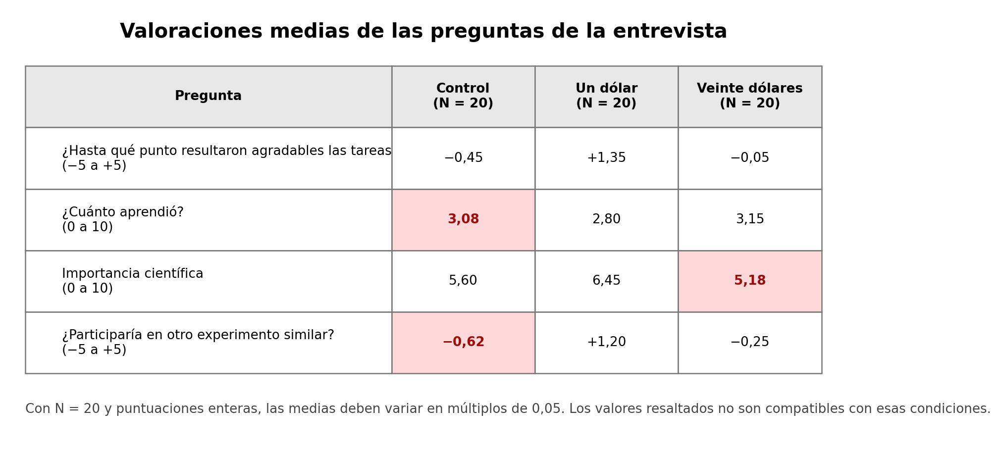{#fig-festinger}


## Sesgo de publicación {#sec-publicationbias}

El sesgo de publicación es uno de los mayores problemas a los que se enfrenta la ciencia. El **sesgo de publicación** consiste en enviar y publicar selectivamente investigaciones científicas, a menudo en función de que sus resultados sean o no «estadísticamente significativos». La literatura científica está dominada por resultados significativos. En 1959, Sterling [-@sterling_publication_1959] contó cuántos contrastes de hipótesis publicados en cuatro revistas de psicología habían producido resultados significativos. De los 294 artículos examinados, 286 —el 97 %— rechazaban la hipótesis nula con un resultado estadísticamente significativo. La réplica de Bozarth y Roberts [-@bozarth_signifying_1972] obtuvo una estimación del 94 %.

Al mismo tiempo, sabemos que muchos estudios no producen resultados significativos. Si los científicos solo tienen acceso a los resultados significativos, carecen de una visión completa de la evidencia sobre una hipótesis [@smart_importance_1964]. En el caso extremo, puede haber cientos de resultados significativos publicados y, aun así, ningún efecto verdadero, porque existan todavía más estudios no significativos que nunca se compartieron. Es el **problema del cajón de archivo**: los resultados no significativos quedan ocultos en cajones —o, actualmente, en carpetas del ordenador— y no llegan a la comunidad científica. Este sesgo afecta especialmente al contraste principal de un artículo, pues de su resultado suele depender que haya una historia interesante que contar. Es menos probable en trabajos sin una hipótesis central que necesite ser significativa para sostener el relato, por ejemplo cuando se describen tamaños del efecto en una tabla amplia de correlaciones. Todos los científicos deberían contribuir a resolver el sesgo de publicación: mientras no se compartan todos los resultados, será extremadamente difícil averiguar qué es probablemente cierto. Greenwald [-@greenwald_consequences_1975] llega a considerar una vulneración ética la comunicación selectiva de resultados significativos.

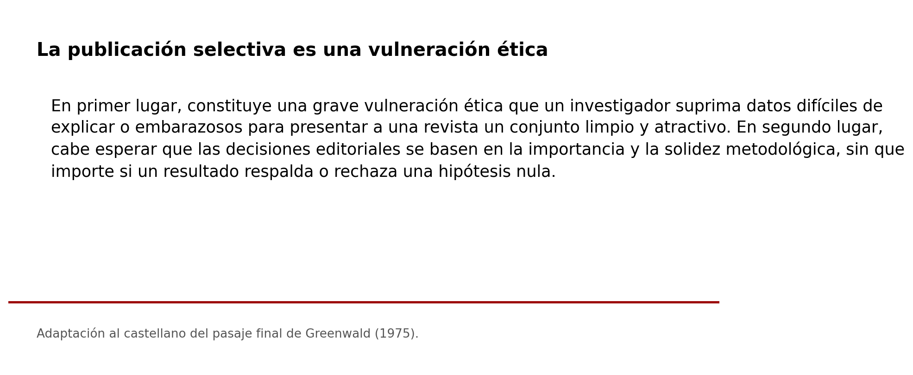{#fig-greenwald}


El sesgo de publicación solo puede resolverse haciendo accesibles todos los resultados, con independencia del valor *p* del contraste principal. Los informes registrados son una forma de combatirlo: la introducción, el método y el plan de análisis se revisan antes de recoger los datos [@chambers_present_2022; @nosek_registered_2014]. Tras la revisión por expertos, que pueden proponer mejoras en el diseño y el análisis, el artículo puede recibir una «aceptación en principio». Si se sigue el plan aprobado, se publicará con independencia de los resultados. Esto facilita la publicación de resultados nulos. Como muestra @fig-scheel, entre los primeros informes registrados publicados en psicología, 31 de 71 —el 44 %— obtuvieron resultados positivos, frente a 146 de 152 —el 96 %— de los artículos convencionales comparables publicados en el mismo periodo [@scheel_excess_2021].

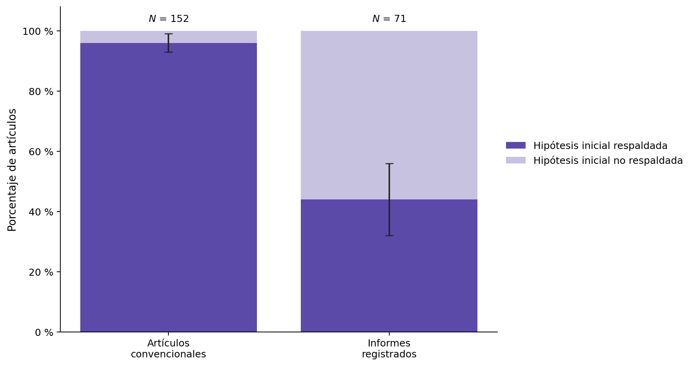{#fig-scheel}


En el pasado no existían los informes registrados y los científicos no compartían todos sus resultados [@franco_publication_2014; @greenwald_consequences_1975; @sterling_publication_1959]. Por eso debemos intentar detectar hasta qué punto el sesgo de publicación limita nuestra capacidad para evaluar la literatura. Todo metaanálisis debería examinar cuidadosamente su impacto sobre la estimación metaanalítica del tamaño del efecto. Sin embargo, solo el 57 % de los metaanálisis publicados en *Psychological Bulletin* entre 1990 y 2017 indicaron haber evaluado el sesgo de publicación [@polanin_transparency_2020]. En metaanálisis más recientes de investigación educativa, el 82 % empleó alguna prueba de detección, pero los métodos solían estar lejos del estado del arte [@ropovik_neglect_2021]. Se han desarrollado numerosas técnicas y esta continúa siendo un área muy activa. Cada método parte de supuestos concretos que deben considerarse antes de aplicarlo [@carter_correcting_2019]. No hay una solución milagrosa: ninguna técnica puede reparar el sesgo ni decirnos con certeza cuál sería la estimación metaanalítica verdadera tras corregirlo. Como máximo, estos métodos detectan determinados mecanismos de sesgo bajo determinadas condiciones. El sesgo de publicación puede detectarse, pero no corregirse.

En el capítulo sobre [verosimilitudes](03-verosimilitudes.html) vimos que los resultados mixtos son esperables y pueden constituir evidencia sólida a favor de la hipótesis alternativa. No solo debemos esperarlos: observar exclusivamente resultados significativos resulta muy sorprendente, sobre todo cuando la potencia estadística es baja. Incluso con una potencia del 80 %, cabe esperar un resultado no significativo de cada cinco cuando existe un efecto verdadero. Algunos investigadores han señalado que *no* encontrar resultados mixtos puede ser muy improbable —«demasiado bueno para ser verdad»— [@francis_frequency_2014; @schimmack_ironic_2012]. Nuestra intuición sobre el aspecto que tienen las series reales de estudios está deformada porque vemos una literatura que no refleja la realidad. Casi todos los artículos con varios estudios presentan únicamente resultados significativos, aunque ese patrón sea improbable.

La [aplicación Shiny para calcular verosimilitudes binomiales](http://shiny.ieis.tue.nl/mixed_results_likelihood/) muestra, al final de la página, la probabilidad de obtener varios resultados significativos bajo un supuesto determinado sobre la potencia de los contrastes. @francis_frequency_2014 utilizó estas probabilidades para calcular la prueba de exceso de significación [@ioannidis_exploratory_2007] en 44 artículos de *Psychological Science* publicados entre 2009 y 2012 que contenían al menos cuatro estudios. En 36 artículos, la probabilidad de observar cuatro resultados significativos, dada la potencia media calculada a partir de los tamaños del efecto observados, era inferior al 10 %. Con un nivel alfa de 0,10, esta probabilidad binomial funciona como un contraste de hipótesis: si la probabilidad del número observado de resultados significativos es inferior al 10 %, los datos resultan sorprendentes y puede rechazarse la hipótesis de que el conjunto de estudios no esté sesgado. En otras palabras, observar tantos resultados significativos es improbable y sugiere que han intervenido el sesgo de publicación u otros efectos de selección.

Yo mismo era coautor de uno de esos 44 artículos [@jostmann_weight_2009]. Por entonces sabía poco sobre potencia estadística y sesgo de publicación, y resultó estresante que nos acusaran de conducta científica inadecuada. Sin embargo, la acusación era correcta: habíamos comunicado selectivamente los resultados y los análisis que funcionaban. Como apenas habíamos recibido formación sobre el asunto, nos formamos por nuestra cuenta y subimos un estudio no publicado a psychfiledrawer.org —un sitio que ya no existe— para compartir nuestro «cajón de archivo». Años después colaboramos cuando Many Labs 3 incluyó uno de nuestros estudios entre los que iba a replicar [@ebersole_many_2016]. Tras observarse un resultado nulo, escribimos: «Hemos tenido que concluir que, en realidad, no existe evidencia fiable del efecto» [@jostmann_short_2016]. Espero que este material educativo evite que otras personas hagan el ridículo como lo hicimos nosotros.

## Detección de sesgos en el metaanálisis

Continuamente se desarrollan nuevos métodos para detectar el sesgo de publicación, mientras que otros quedan obsoletos —aunque aún aparezcan en algunos metaanálisis—. Uno de los métodos desaconsejados es el **fail-safe N**. Su idea era calcular cuántos resultados no significativos tendrían que permanecer ocultos para que la estimación metaanalítica dejara de ser estadísticamente distinta de cero. El método [ya no se recomienda](https://handbook-5-1.cochrane.org/chapter_10/10_4_4_3_fail_safe_n.htm). Becker [-@becker_failsafe_2005] sostiene que, dados los enfoques disponibles actualmente, el *fail-safe N* debería abandonarse en favor de análisis más informativos. Hoy su principal utilidad es identificar metaanálisis que no están al día metodológicamente.

Antes de que podamos explicar un segundo método (*Trim-and-fill*), es útil explicar una forma común de visualizar metaanálisis, conocida como **diagrama de embudo**. En un diagrama de embudo, el eje x se utiliza para trazar el tamaño del efecto de cada estudio, y el eje y se utiliza para trazar la "precisión" de cada tamaño del efecto (normalmente, el error estándar de cada estimación del tamaño del efecto). Cuanto mayor sea el número de observaciones en un estudio, más precisa será la estimación del tamaño del efecto, menor será el error estándar y, por lo tanto, más arriba en el diagrama de embudo estará el estudio. Un estudio infinitamente preciso (con un error estándar de 0) estaría en la parte superior del eje y.
El siguiente script simula metaanálisis de `nsims` estudios y guarda los resultados necesarios para examinar la detección del sesgo. En la primera parte simula resultados estadísticamente significativos en la dirección prevista; en la segunda genera resultados nulos. `pub.bias` determina la proporción de resultados significativos: si vale 1, todos lo son. En el ejemplo vale 0,05. Como no existe un efecto verdadero (`m1` y `m2` son iguales), los únicos resultados significativos esperables son el 5 % de falsos positivos. Por último, el script realiza el metaanálisis, imprime los resultados y crea un diagrama de embudo.

Si prefieres no utilizar R, la simulación interactiva permite explorar los efectos del sesgo de publicación y aplicar *trim-and-fill*, la metarregresión PET-PEESE y el metaanálisis límite de Rücker. Este último se explica en [*Doing Meta-Analysis in R*](https://doing-meta.guide/pub-bias#rucker-ma).

<iframe id="pub-bias-meta-iframe"
        src="pub_bias_meta_app_book.html"
        width="100%" height="650" scrolling="no"
        style="border:none;display:block;margin:1.5rem 0;overflow:hidden;"
        title="Sesgo de publicación en el metaanálisis"></iframe>
<script>
window.addEventListener('message', function(e) {
  if (e.data && typeof e.data.iframeHeight === 'number') {
    var f = document.getElementById('pub-bias-meta-iframe');
    if (f && e.source === f.contentWindow) f.style.height = e.data.iframeHeight + 'px';
  }
});
</script>

```r
library(metafor)
library(truncnorm)

nsims    <- 100   # número de experimentos simulados
pub.bias <- 0.05  # proporción de resultados significativos en la literatura

m1 <- 0; sd1 <- 1  # los efectos demasiado grandes hacen que los resultados no significativos sean muy raros
m2 <- 0; sd2 <- 1

n_sig    <- round(nsims * pub.bias)
n_nonsig <- nsims - n_sig

# Preasignar un marco de datos de resultados con n filas
make_meta_df <- function(n) {
  data.frame(m1 = numeric(n), m2 = numeric(n), sd1 = numeric(n), sd2 = numeric(n),
             n1 = integer(n), n2 = integer(n), pvalues = numeric(n),
             pcurve = character(n), stringsAsFactors = FALSE)
}

# Simular resultados significativos: p unilateral < 0,025 en la dirección esperada
sim_sig <- function(n_sig) {
  if (n_sig == 0) return(make_meta_df(0))
  out <- make_meta_df(n_sig)
  for (i in seq_len(n_sig)) {
    n <- round(rtruncnorm(1, a = 20, b = 1000, mean = 100, sd = 100))
    p <- 1
    while (p > 0.025) {
      x <- rnorm(n, mean = m1, sd = sd1)
      y <- rnorm(n, mean = m2, sd = sd2)
      p <- t.test(x, y, alternative = "greater", var.equal = TRUE)$p.value
    }
    res <- t.test(x, y, var.equal = TRUE)
    out[i, ] <- list(mean(x), mean(y), sd(x), sd(y), n, n, res$p.value,
                     paste0("t(", res$parameter, ")=", res$statistic))
  }
  out
}

# Simular resultados no significativos: bilateral p >= 0,05
sim_nonsig <- function(n_nonsig) {
  if (n_nonsig == 0) return(make_meta_df(0))
  out <- make_meta_df(n_nonsig)
  for (i in seq_len(n_nonsig)) {
    n <- round(rtruncnorm(1, a = 20, b = 1000, mean = 100, sd = 100))
    p <- 0
    while (p < 0.05) {
      x <- rnorm(n, mean = m1, sd = sd1)
      y <- rnorm(n, mean = m2, sd = sd2)
      p <- t.test(x, y, var.equal = TRUE)$p.value
    }
    res <- t.test(x, y, var.equal = TRUE)
    out[i, ] <- list(mean(x), mean(y), sd(x), sd(y), n, n, res$p.value,
                     paste0("t(", res$parameter, ")=", res$statistic))
  }
  out
}

metadata <- rbind(sim_sig(n_sig), sim_nonsig(n_nonsig))
metadata <- escalc(n1i = n1, n2i = n2, m1i = m1, m2i = m2, sd1i = sd1,
                   sd2i = sd2, measure = "SMD", data = metadata)
metadata$sei <- sqrt(metadata$vi)

result <- rma(yi, vi, data = metadata)
result

funnel(result, level = 0.95, refline = 0)
abline(v = result$b[1], lty = "dashed")
points(x = result$b[1], y = 0, cex = 1.5, pch = 17)

```


Comencemos por una literatura no sesgada: mantenemos `pub.bias` en 0,05, de modo que solo el 5 % de errores de tipo I entre en la literatura científica.

```text
Modelo de efectos aleatorios (k = 100; estimador de tau²: REML)
tau² = 0,0000 (EE = 0,0018); tau = 0,0006; I² = 0,00 %; H² = 1,00
Prueba de heterogeneidad: Q(99) = 91,7310; p = 0,6851
Estimación = −0,0021; EE = 0,0121; z = −0,1775; p = 0,8591
IC del 95 % [−0,0258; 0,0215]
```


El metaanálisis contiene 100 estudios (`k = 100`) y no muestra heterogeneidad estadísticamente significativa (*p* = 0,69), algo esperable porque programamos un tamaño del efecto verdadero igual a cero y sin heterogeneidad. La estimación metaanalítica es *d* = −0,002, muy próxima a cero, con un error estándar de 0,012. Con 100 estudios obtenemos una estimación muy precisa. Para contrastarla frente a *d* = 0 se obtiene *z* = −0,177 y *p* = 0,86, por lo que no podemos rechazar que el tamaño del efecto verdadero sea cero. El intervalo de confianza [−0,026; 0,021] también incluye cero.

En @fig-funnel1 cada punto representa un estudio. Los estudios con muestras grandes tienen errores estándar menores y aparecen más arriba; los pequeños, más abajo. La zona blanca delimita los resultados no significativos: dentro de ella, el efecto observado no se aleja lo suficiente de cero para que su intervalo de confianza lo excluya. Al disminuir el error estándar, el intervalo se estrecha y basta un efecto menor para alcanzar la significación. Al mismo tiempo, las estimaciones más precisas deberían concentrarse cerca del efecto verdadero. Si el embudo está centrado en ese valor, cabe esperar que contenga aproximadamente el 95 % de las estimaciones. Solo cinco estudios quedan fuera por la derecha: son el 5 % de falsos positivos introducido en la simulación. Si el efecto verdadero fuera *d* = 0,5 —puede probarse cambiando `m1 <- 0` por `m1 <- 0.5`—, la nube se desplazaría y quedaría centrada en 0,5.

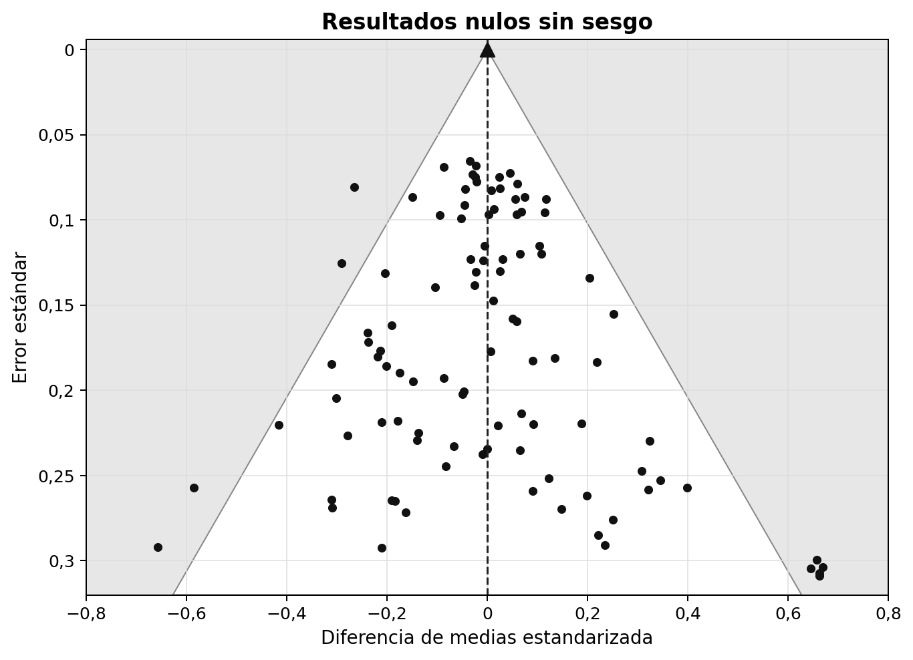{#fig-funnel1}


Comparemos ahora ese metaanálisis con otro sometido a un sesgo de publicación extremo. A partir de la estimación de @scheel_excess_2021, suponemos que el 96 % de los estudios ofrece resultados positivos y fijamos `pub.bias <- 0.96`. Las dos medias siguen siendo cero, por lo que no existe un efecto verdadero; el conjunto final estará compuesto casi por completo por errores de tipo I en la dirección prevista. El metaanálisis permite comprobar hasta qué punto esta selección produce una inferencia engañosa.

```text
Modelo de efectos aleatorios (k = 100; estimador de tau²: REML)
tau² = 0,0000 (EE = 0,0019); tau = 0; I² = 0,00 %; H² = 1,00
Prueba de heterogeneidad: Q(99) = 77,6540; p = 0,9445
Estimación = 0,2701; EE = 0,0125; z = 21,6075; p < 0,0001
IC del 95 % [0,2456; 0,2946]
```


La naturaleza sesgada del conjunto se aprecia con claridad en @fig-funnel2. Hay cuatro resultados nulos no sesgados, como se programó, pero los otros 96 son estadísticamente significativos aunque la hipótesis nula sea verdadera. La mayoría se sitúa justo fuera del borde de la zona blanca. Como los valores *p* se distribuyen uniformemente bajo la hipótesis nula, muchos de estos errores de tipo I tienen valores entre 0,02 y 0,05. Cuanto mayor es el estudio, menor es el tamaño del efecto necesario para alcanzar la significación. Que los efectos no varíen alrededor de un único valor verdadero —por ejemplo, *d* = 0 o *d* = 0,5—, sino que disminuyan a medida que aumenta el tamaño muestral, constituye una señal fuerte de sesgo. La línea vertical discontinua y el triángulo superior muestran la estimación metaanalítica observada, sesgada al alza.

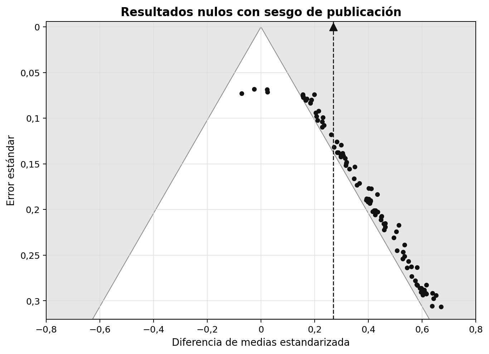{#fig-funnel2}


Podría parecer que un sesgo tan extremo rara vez aparece en la investigación, pero ocurre. @fig-carterbias reproduce el patrón descrito por @carter_publication_2014 al examinar 198 estudios publicados sobre el «agotamiento del ego», la idea de que el autocontrol depende de un recurso limitado. Mediante técnicas como la [metarregresión PET-PEESE](#sec-petpeese), estimaron con PET *d* = −0,10, un valor no distinguible estadísticamente de cero, aunque el metaanálisis sin ajustar por sesgo ofrecía *d* = 0,62. El verdadero efecto podía ser nulo. No sorprende que un *Registered Replication Report* posterior obtuviera un efecto no significativo [@hagger_multilab_2016] y que los propios investigadores originales tampoco lograran replicarlo [@vohs_multisite_2021]. Pensemos en el tiempo, el esfuerzo y el dinero desperdiciados en una literatura construida sobre sesgos. Ese desperdicio tiene implicaciones éticas y debemos asumir la responsabilidad de prevenirlo.

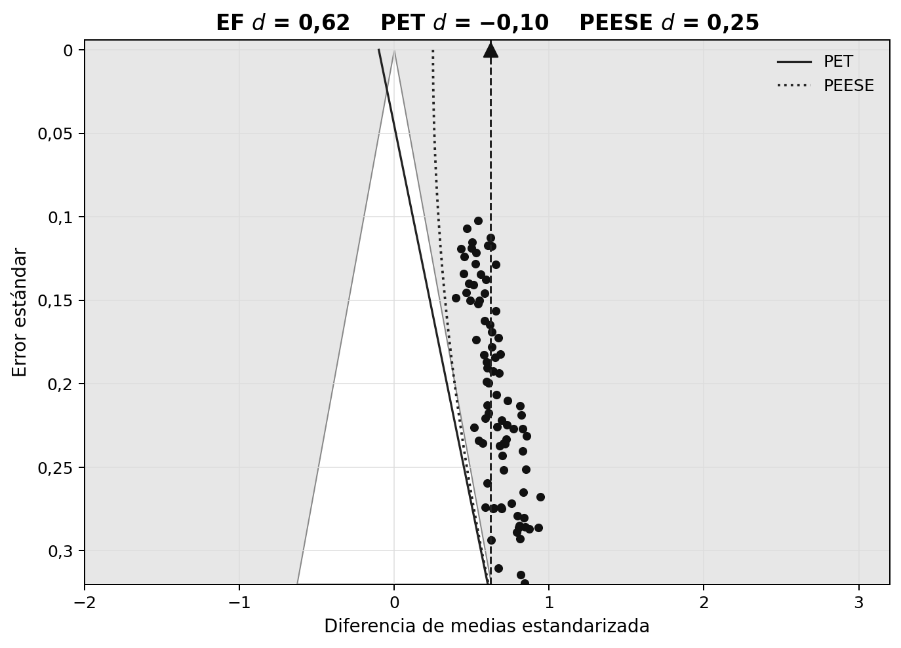{#fig-carterbias}


También podemos detectar señales de sesgo en un diagrama de bosque. @fig-twoforestplot presenta dos metaanálisis de 100 estudios: el de la izquierda utiliza datos no sesgados y el de la derecha, datos sesgados. A la izquierda, los efectos varían aleatoriamente alrededor de cero, como cabría esperar. A la derecha, después de los cuatro primeros estudios, todos los intervalos de confianza excluyen por muy poco el valor cero.

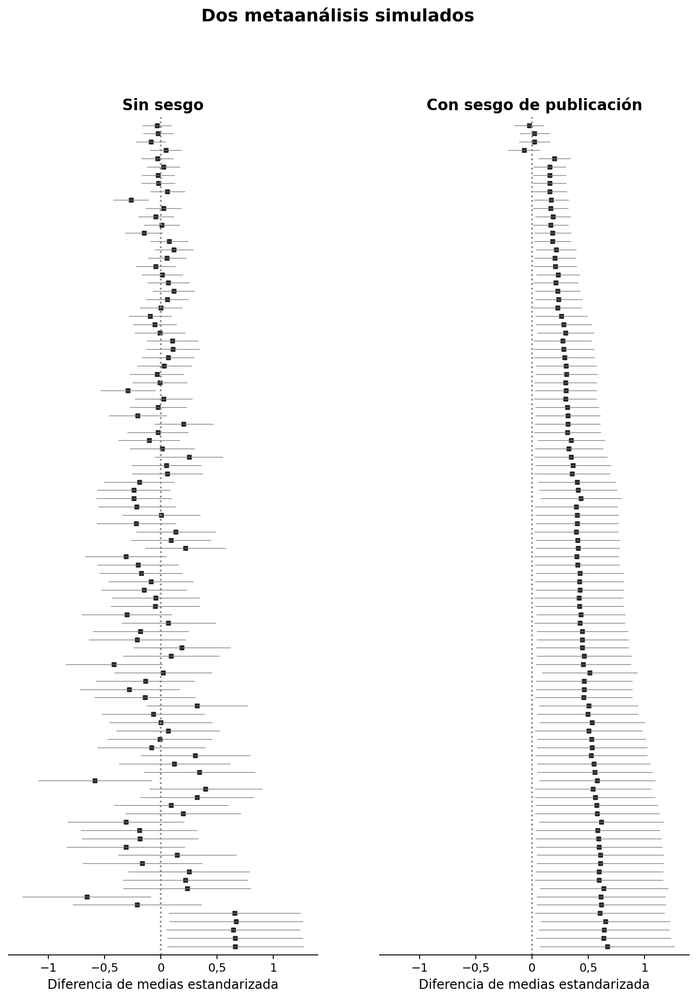{#fig-twoforestplot}


Cuando solo se publican resultados estadísticamente significativos (*p* < $\alpha$), la estimación metaanalítica del tamaño del efecto resulta **mayor** que en ausencia de sesgo. La selección elimina los efectos pequeños y no significativos, que dejan de contribuir al cálculo. La estimación queda así inflada respecto al efecto poblacional verdadero. Sabemos que existe inflación, pero no en qué medida: el efecto real podría ser algo menor o incluso igual a cero, como en la literatura sobre el agotamiento del ego.

## *Trim-and-fill*

*Trim-and-fill* amplía el conjunto de datos añadiendo estudios hipotéticos «ausentes», que podrían encontrarse en el cajón de archivo. El procedimiento comienza recortando los estudios pequeños que sesgan la estimación, calcula después un nuevo centro y rellena el diagrama de embudo con los estudios supuestamente perdidos. En @fig-trimfill1, estos estudios imputados aparecen como círculos vacíos. Cada uno es la imagen especular de un estudio observado respecto al centro estimado. El método nos advierte correctamente de que hay sesgo —de otro modo no imputaría estudios—, pero fracasa al corregir la estimación: el círculo azul indica un valor algo menor que el original, pero todavía muy alejado del efecto verdadero, que en la simulación era cero.

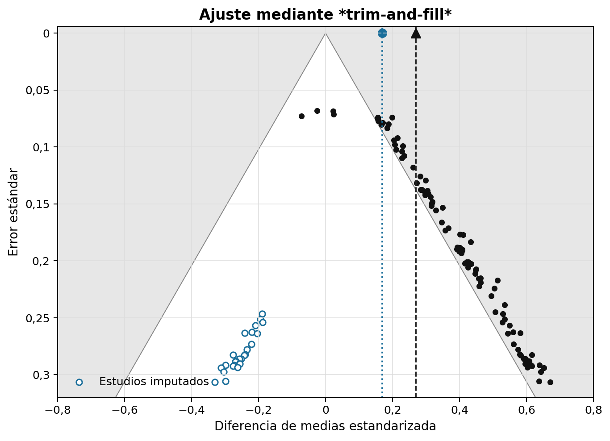{#fig-trimfill1}


*Trim-and-fill* funciona mal en muchos escenarios realistas. Depende del supuesto fuerte de que el diagrama de embudo debería ser simétrico. Cuando la selección depende del valor *p* —probablemente una de las fuentes principales de sesgo en muchos campos—, el método no aproxima bien el tamaño del efecto verdadero [@peters_performance_2007; @terrin_adjusting_2003]. Si se cumplen sus supuestos, puede emplearse como **análisis de sensibilidad**, pero la estimación ajustada no debería presentarse como si fuera una estimación realista del efecto no sesgado. Si otras pruebas —como *p*-curve o *z*-curve— ya han detectado sesgo, *trim-and-fill* puede no aportar información adicional.

## PET-PEESE {#sec-petpeese}

Otra familia de soluciones al sesgo de publicación utiliza la **metarregresión**. En lugar de ajustar una línea a observaciones individuales, cada punto representa un estudio. Como en cualquier regresión, cuantos más datos haya, mayor será la precisión; por tanto, la metarregresión funciona mejor cuando el metaanálisis incluye muchos estudios. Con pocos estudios, todas las pruebas de detección pierden potencia. La regresión también necesita variación suficiente: aquí implica disponer de un intervalo amplio de tamaños muestrales. Las recomendaciones indican que funciona mejor cuando los estudios abarcan aproximadamente de 15 a 200 participantes por grupo, algo poco habitual en muchas áreas de la psicología. Estas técnicas intentan estimar cuál sería el efecto poblacional con precisión perfecta, es decir, cuando el error estándar es cero.

Una de estas técnicas es PET-PEESE [@stanley_metaregression_2014; @stanley_finding_2017]. PET —*precision-effect test*— contrasta, dentro del marco de Neyman-Pearson, si la intersección de la metarregresión cuando $EE = 0$ permite rechazar un efecto igual a cero. Si hay pocas observaciones, el intervalo de confianza puede ser muy amplio y el contraste tendrá poca potencia. PET estima:

$$
d_i = \beta_0 + \beta_1 EE_i + u_i,
$$

donde $d_i$ es el tamaño del efecto, $EE_i$ su error estándar y la ecuación se ajusta mediante mínimos cuadrados ponderados, con $1/EE_i^2$ como peso. Cuando existe un efecto verdadero, PET tiende a subestimarlo. Por eso el procedimiento recomienda aplicar primero PET; si permite rechazar el efecto nulo, se emplea después PEESE —*precision-effect estimate with standard error*— para estimar el efecto metaanalítico. PEESE sustituye el error estándar por su varianza, lo que reduce el sesgo de la intersección estimada [@stanley_metaregression_2014].

PET-PEESE comparte las limitaciones de otras técnicas de detección: funciona mal con pocos estudios, cuando todos tienen muestras pequeñas o cuando existe mucha heterogeneidad [@stanley_finding_2017]. Además, el tamaño muestral y la precisión pueden estar correlacionados por motivos distintos del sesgo. Si los efectos verdaderos varían entre estudios y los investigadores realizan buenos análisis de potencia, los efectos grandes requerirán muestras pequeñas y los efectos pequeños, muestras grandes. La metarregresión contrasta una asociación, igual que la regresión ordinaria; interpretar esa asociación exige pensar en el mecanismo causal que la produce.

@fig-petpeese muestra cómo PET-PEESE intenta estimar el efecto no sesgado bajo supuestos concretos sobre el mecanismo de selección. La línea vertical en *d* = 0,27 es la estimación metaanalítica ordinaria, inflada porque solo promedia estudios significativos. La línea recta diagonal proporciona la estimación PET cuando $EE = 0$, indicada por el círculo. Su intervalo de confianza del 95 % contiene cero; con PET = 0,02 no podemos rechazar un efecto metaanalítico nulo. Incluso con 100 estudios, el intervalo sigue siendo amplio: la metarregresión solo es tan precisa como los datos disponibles. Si PET hubiera permitido rechazar el valor nulo, se habría utilizado la estimación PEESE —el rombo— de *d* = 0,17. Aun así, nunca sabríamos con certeza si el modelo de PEESE reproduce el verdadero mecanismo que generó el sesgo.

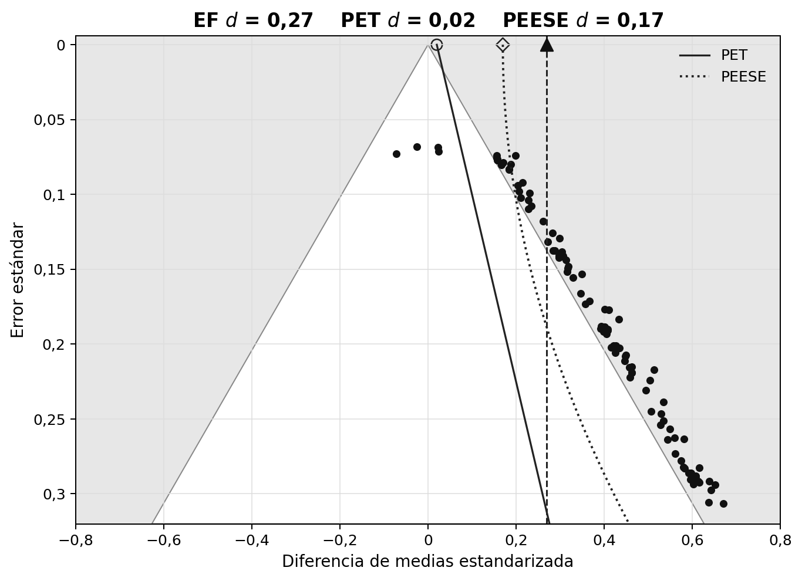{#fig-petpeese}


## Metaanálisis de valores *p*

Además de combinar tamaños del efecto, es posible realizar un metaanálisis de valores *p*. El primer enfoque de este tipo fue la [**prueba de probabilidad combinada de Fisher**](https://en.wikipedia.org/wiki/Fisher%27s_method). Métodos posteriores, como *p*-curve [@simonsohn_pcurve_2014] y *p*-uniform* [@aert_correcting_2018], se apoyan en la misma idea. Son **modelos de selección** [@iyengar_selection_1988]: combinan un modelo del proceso que genera los tamaños del efecto con otro modelo que describe cómo la selección determina qué resultados llegan a la literatura. Por ejemplo, el proceso generador puede asumir contrastes que cumplen sus supuestos y una determinada potencia media; el modelo de selección puede suponer que se publican todos los estudios significativos con $\alpha = 0,05$.

*P*-curve utiliza precisamente este modelo. Supone que se publican todos los resultados significativos y compara su distribución con la que cabría esperar bajo una determinada potencia o bajo la hipótesis nula. Como vimos al estudiar [qué valores *p* cabe esperar](01-usando-valores-p.html), con estadísticos continuos —*t*, *F* o *z*— los valores *p* son uniformes cuando la hipótesis nula es verdadera; si la alternativa es verdadera, aparecen más valores significativos pequeños —por ejemplo, 0,01— que grandes —por ejemplo, 0,04—.

*P*-curve realiza dos pruebas. La primera examina si la distribución es más plana de lo esperable con una potencia del 33 %. El umbral es algo arbitrario y puede modificarse, pero pretende representar la potencia mínima que todavía permitiría aprender algo útil. Si la potencia media fuera inferior, podría existir un efecto, aunque los estudios no estuvieran bien diseñados para detectarlo. Rechazar el patrón correspondiente al 33 % sugiere que la distribución se parece más a la esperada bajo la hipótesis nula, *aunque todos los estudios incluidos sean significativos*.

La segunda prueba examina si la distribución está suficientemente sesgada a la derecha —más valores *p* pequeños que grandes— para rechazar una distribución uniforme. Si se rechaza, los estudios podrían haber examinado un efecto verdadero y haber tenido alguna potencia, aunque todavía pudiera existir sesgo de publicación. Simonsohn y colaboradores [-@simonsohn_pcurve_2014] compararon veinte artículos de *Journal of Personality and Social Psychology* que incluían una covariable con otros veinte que no la incluían. Sospechaban que algunos investigadores podían añadir covariables después de que el primer análisis no alcanzara *p* < 0,05.

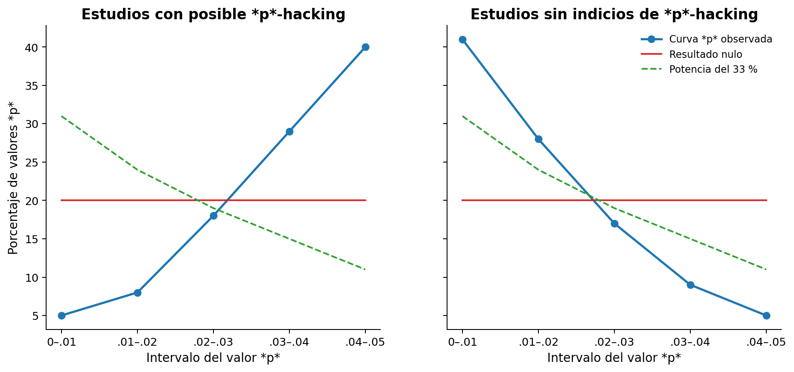{#fig-pcurve}


En @fig-pcurve, los cinco puntos azules representan la proporción de valores *p* en los intervalos 0–0,01, 0,01–0,02, 0,02–0,03, 0,03–0,04 y 0,04–0,05. El análisis utiliza *solo* resultados significativos, bajo el supuesto de que todos ellos se publican. En el panel derecho, la línea azul está más sesgada a la derecha que la distribución uniforme roja. Los autores describen este patrón como «valor evidencial», una expresión que puede resultar engañosa. La interpretación formal es que puede rechazarse la distribución uniforme esperada si la hipótesis nula fuera verdadera en todos los estudios. Eso no demuestra por sí solo el efecto teorizado: el patrón también podría surgir de una mezcla de efectos nulos y unos pocos estudios afectados por una variable de confusión.

El panel izquierdo muestra lo contrario: predominan los valores próximos a 0,05 y casi no hay valores cercanos a 0,01. La línea azul es más plana que la línea verde correspondiente al 33 % de potencia; el conjunto parece afectado por selección y no generado por estudios con potencia suficiente. *P*-curve es útil, pero debe interpretarse con cuidado. Una curva sesgada a la derecha no demuestra ausencia de sesgo ni confirma la hipótesis teórica. Una curva plana tampoco demuestra que la teoría sea falsa; indica que los estudios se parecen más al patrón esperado cuando la hipótesis nula es verdadera y existe selección.

El script almacena todas las estadísticas de las 100 pruebas *t* simuladas que se incluyen en el metaanálisis. Las primeras filas se ven así:

```text
t(136) = 0,208132209831132
t(456) = −1,20115958535433
t(58) = 0,0422284763301259
t(358) = 0,0775200850900646
t(188) = 2,43353676652346
```


Imprime todos los resultados con `cat(metadata$pcurve, sep = "\n")` y abre la [aplicación *p*-curve](http://www.p-curve.com/app4/). Pega los contrastes y pulsa «Make the p-curve». La aplicación solo genera resultados si hay valores *p* inferiores a 0,05; si todos son mayores, no puede calcularse la curva porque esos contrastes se excluyen.

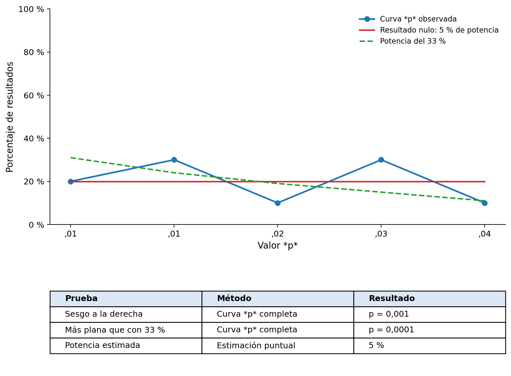{#fig-pcurveresult}


La distribución parece uniforme —y en la simulación lo es—. La prueba permite rechazar una distribución tan pronunciada como la que producirían estudios con un 33 % de potencia, *p* < 0,0001. La aplicación estima además una potencia media del 5 %, que es correcta. Aunque muchos resultados sean significativos, el conjunto es más compatible con la publicación selectiva de errores de tipo I que con el patrón esperado si hubiera un efecto verdadero estudiado con potencia suficiente. La teoría aún podría ser cierta, pero estos estudios no la respaldan.

Una técnica semejante es *p*-uniform*. A diferencia de *p*-curve, utiliza resultados significativos y no significativos y permite estimar un tamaño del efecto ajustado por sesgo. Emplea un modelo de efectos aleatorios y pondera los estudios mediante un modelo que supone que los resultados significativos tienen mayor probabilidad de publicarse. En este ejemplo estima *d* = 0,0126, un valor no distinto estadísticamente de cero, *p* = 0,3857. La técnica indica correctamente que el conjunto no ofrece una buena razón para rechazar un efecto metaanalítico nulo, aunque muchos resultados sean significativos.

```r
puniform::puniform(m1i = metadata$m1, m2i = metadata$m2, n1i = metadata$n1,
  n2i = metadata$n2, sd1i = metadata$sd1, sd2i = metadata$sd2, side = "right")
```

```text
Método: estimación del tamaño del efecto p-uniform*
Estimación = 0,0126; IC [−0,0811; 0,0887]; L₀ = −0,2904; p = 0,3857; k sig. = 96
Prueba de sesgo de publicación: L = 7,9976; p < 0,001
Metaanálisis de efecto fijo: estimación = 0,2701; EE = 0,0125; z = 21,6025; p < 0,001
IC [0,2456; 0,2946]; Q = 77,6031; p = 0,945
```


Otra técnica que combina los valores *p* individuales es *z*-curve, un metaanálisis de la potencia observada [@bartos_zcurve20_2020; @brunner_estimating_2020; véase también @sotola_garbage_2022]. Como un metaanálisis tradicional, transforma los resultados observados en puntuaciones *z*. En una literatura no sesgada donde la hipótesis nula es verdadera, debería ser significativo aproximadamente el $\alpha$ por ciento de los resultados. La distribución de *z* estaría centrada en cero. Como *z*-curve utiliza valores absolutos, con $\alpha = 0,05$ aproximadamente un 5 % debería superar el valor crítico 1,96. @fig-zcurveunbiasednull representa 1000 estudios con un efecto verdadero igual a cero y exactamente un 5 % de resultados significativos.

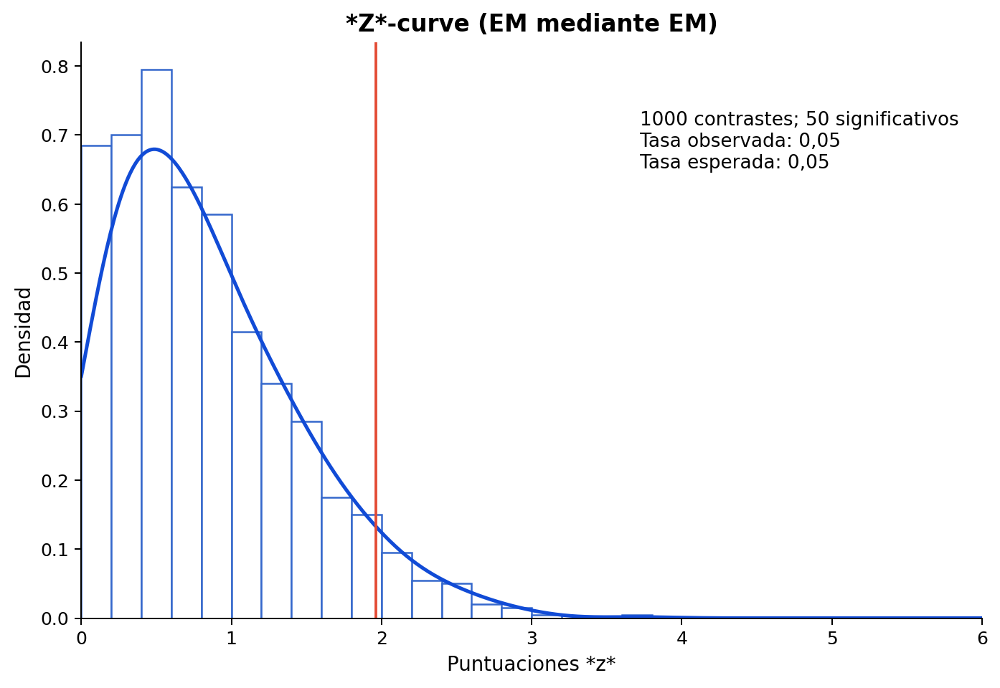{#fig-zcurveunbiasednull}


Cuando existe un efecto verdadero, la distribución se aleja de cero en función de la potencia: cuanto mayor sea, más a la derecha aparecerán las puntuaciones. @fig-zcurveunbiasedalternative muestra una distribución no sesgada con un 66 % de potencia.

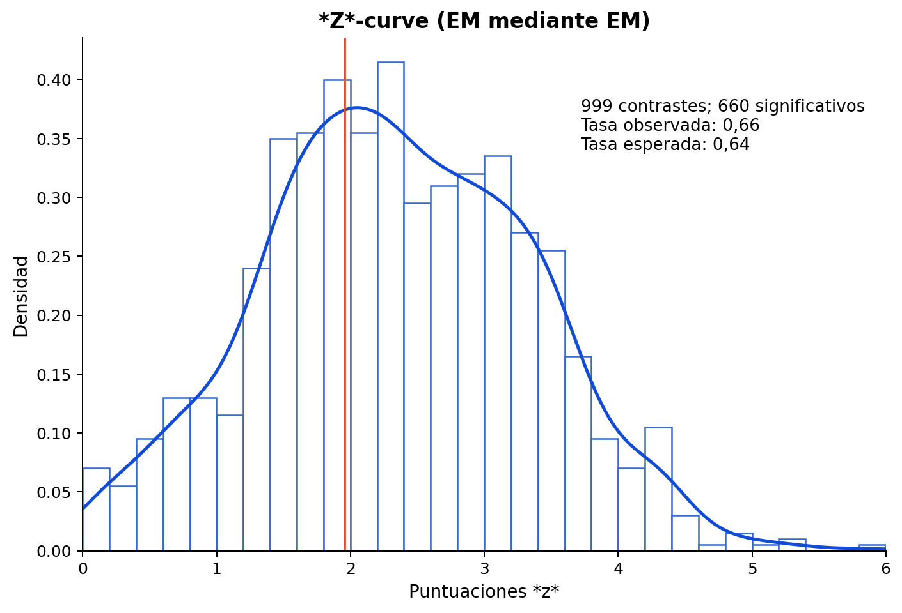{#fig-zcurveunbiasedalternative}


En un metaanálisis real, los estudios difieren en potencia y en su tamaño del efecto verdadero debido a la heterogeneidad. *Z*-curve ajusta una mezcla de distribuciones normales con medias entre 0 y 6 para representar los resultados observados [@bartos_zcurve20_2020]. A partir de ese modelo estima la potencia media y calcula tres cantidades: la **tasa de descubrimientos observada** (ODR), es decir, el porcentaje de resultados significativos; la **tasa de descubrimientos esperada** (EDR), la proporción del área estimada situada a la derecha del criterio de significación; y la **tasa de replicación esperada** (ERR), la proporción esperada de réplicas significativas entre los estudios significativos. Bajo supuestos concretos, *z*-curve puede ajustar la selección de resultados positivos y estimar EDR y ERR usando solo valores *p* significativos.

Para examinar el sesgo conviene introducir valores *p* significativos y no significativos, aunque las estimaciones utilicen únicamente los primeros. La comparación entre ODR y EDR es informativa: si la proporción observada de resultados significativos supera ampliamente la esperada, existe una señal de selección. Aplicamos el análisis al mismo conjunto sesgado de los ejemplos anteriores:

```r
z_res <- zcurve::zcurve(p = metadata$pvalues, method = "EM", bootstrap = 1000)
summary(z_res, all = TRUE)
plot(z_res, annotation = TRUE, CI = TRUE)

```


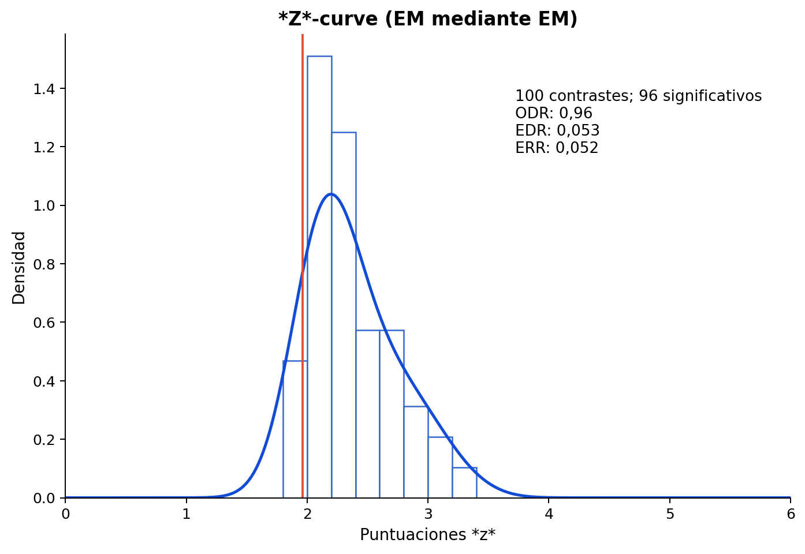{#fig-zcurvebiased}

```text
Modelo: EM mediante EM
ERR = 0,052; IC [0,025; 0,160]
EDR = 0,053; IC [0,050; 0,119]
FDR de Sorić = 0,947; IC [0,389; 1,000]
Razón del cajón de archivo = 17,987; N ausente estimado = 1723
Ajuste con 96 valores p. Se proporcionaron 100; 96 significativos
ODR = 0,96; IC del 95 % [0,89; 0,99]
```


La distribución es peculiar: faltan casi todas las puntuaciones esperadas entre 0 y 1,96. Fueron significativos 96 de 100 estudios, de modo que ODR = 0,96, IC del 95 % [0,89; 0,99]. En cambio, EDR = 0,053 y su intervalo no se solapa con ODR, una señal clara de selección. ERR = 0,052, coherente con que solo se reproduzca la tasa del 5 % de errores de tipo I, pues en la simulación no existe ningún efecto. Aunque el modelo recibe únicamente valores *p* significativos para calcular sus estimaciones, concluye correctamente que no cabe esperar una replicación superior a la tasa de error de tipo I.

## Conclusión

El sesgo de publicación constituye un problema grave. Afecta a casi todos los metaanálisis del contraste principal de los artículos, porque es mucho más probable que un trabajo se envíe y se acepte cuando ese resultado es significativo. Las estimaciones no ajustadas casi siempre sobreestiman el efecto verdadero, pero las estimaciones ajustadas también pueden engañar. Una vez distorsionada la literatura, no hay forma de saber con certeza si el metaanálisis recupera el efecto correcto. La inflación es de magnitud desconocida y, en algunos casos, el efecto verdadero ha resultado ser cero. Las pruebas de este capítulo no proporcionan certeza, pero funcionan como señales de alerta y ofrecen estimaciones que pueden acercarse más a la verdad si el modelo del mecanismo de selección es correcto.

Hay mucha actividad en la literatura sobre pruebas de sesgo de publicación. Hay muchas pruebas diferentes y es necesario comprobar cuidadosamente los supuestos de cada prueba antes de aplicarla. La mayoría de las pruebas no funcionan bien cuando hay una gran heterogeneidad, y la heterogeneidad es bastante probable. Un metaanálisis siempre debe examinar si existe sesgo de publicación, preferiblemente utilizando múltiples pruebas de sesgo de publicación y, por lo tanto, es útil no solo codificar los tamaños del efecto, sino también codificar estadísticas de prueba o valores *p*. Ninguna de las técnicas de detección de sesgos analizadas en este capítulo será una solución milagrosa, pero serán mejores que interpretar ingenuamente la estimación del tamaño del efecto no corregida del metaanálisis.

Para consultar otro recurso educativo abierto sobre pruebas de sesgo de publicación, consulte [Realizar metaanálisis en R](https://bookdown.org/MathiasHarrer/Doing_Meta_Analysis_in_R/pub-bias.html).

## Ponte a prueba
**P1**: ¿Qué ocurre con la estimación metaanalítica del tamaño del efecto cuando solo se publican resultados estadísticamente significativos (*p* < $\alpha$)?

- A. Es idéntica con y sin sesgo de publicación.
- B. Está más cerca del efecto verdadero cuando existe sesgo de publicación.
- C. Está inflada cuando existe sesgo de publicación.
- D. Es menor cuando existe sesgo de publicación.

**P2**: El siguiente diagrama de bosque presenta un aspecto peculiar. ¿Qué observas?

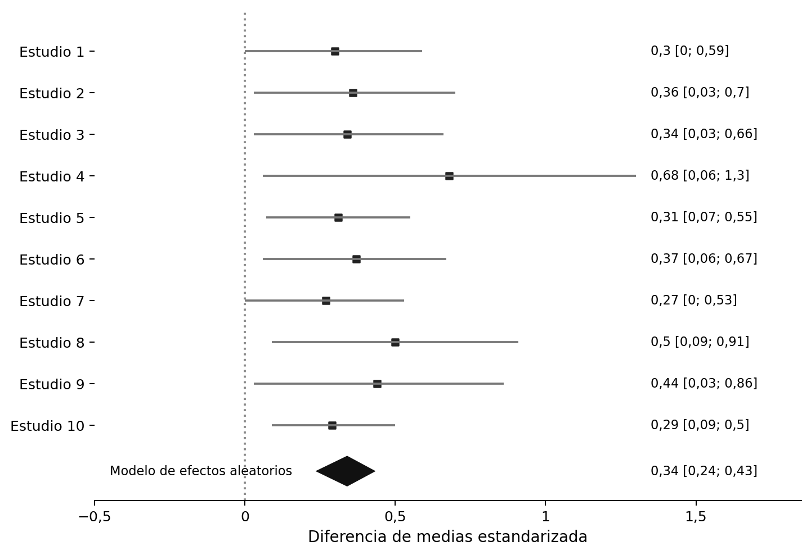{#fig-bosque-pregunta}

- A. Los tamaños del efecto son muy similares, lo que indica muestras grandes y estimaciones muy precisas.
- B. Los estudios parecen haberse diseñado mediante análisis de potencia *a priori* perfectos y todos producen resultados apenas significativos.
- C. Los intervalos de confianza apenas dejan fuera el cero, lo que sugiere que casi todos los estudios son significativos por muy poco y que puede existir sesgo de publicación.
- D. Todos los efectos siguen la misma dirección, lo que demuestra que se utilizaron contrastes unilaterales no prerregistrados.

**P3**: ¿Qué afirmación es verdadera?

- A. Con un sesgo extremo, todos los estudios pueden ser significativos, pero sus errores estándar hacen que la estimación metaanalítica no difiera de cero.
- B. Con un sesgo extremo, todos los estudios pueden ser significativos y la estimación metaanalítica quedar gravemente inflada, dando la impresión de un apoyo abrumador a $H_1$ aunque el efecto verdadero sea pequeño o nulo.
- C. Los programas estadísticos corrigen automáticamente el sesgo de publicación y la estimación metaanalítica suele ser fiable.
- D. Con independencia de que exista sesgo de publicación, toda estimación metaanalítica está gravemente sesgada y nunca debe considerarse una estimación válida de la población.

**P4**: ¿Qué afirmación es verdadera a partir de esta metarregresión PET-PEESE?

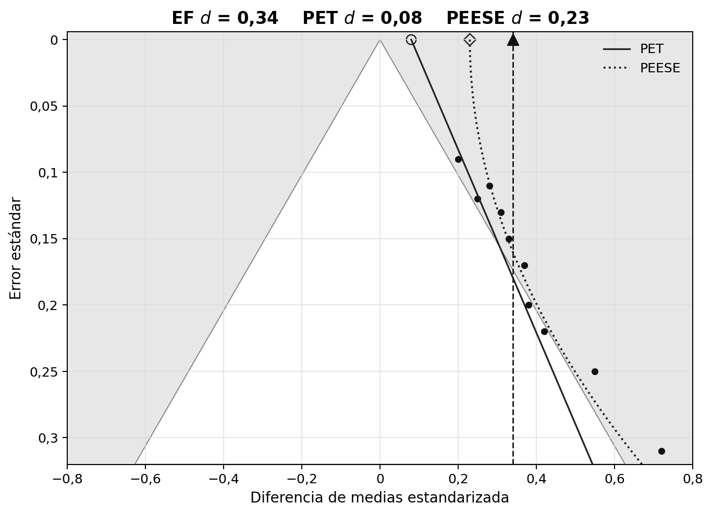{#fig-petpeeseq4}

- A. PET-PEESE demuestra que el tamaño del efecto verdadero es *d* = 0, según la estimación PET.
- B. PET-PEESE demuestra que el tamaño del efecto verdadero es *d* = 0,23, según PEESE.
- C. PET-PEESE demuestra que el tamaño del efecto verdadero es *d* = 0,34, según la estimación metaanalítica ordinaria.
- D. Con solo diez estudios, PET tiene muy poca potencia para rechazar el efecto nulo y no constituye un indicador fiable, aunque sí haya motivos para preocuparse.

**P5**: La siguiente figura y su tabla presentan el análisis *p*-curve de los estudios de la pregunta 2. ¿Qué interpretación es correcta?

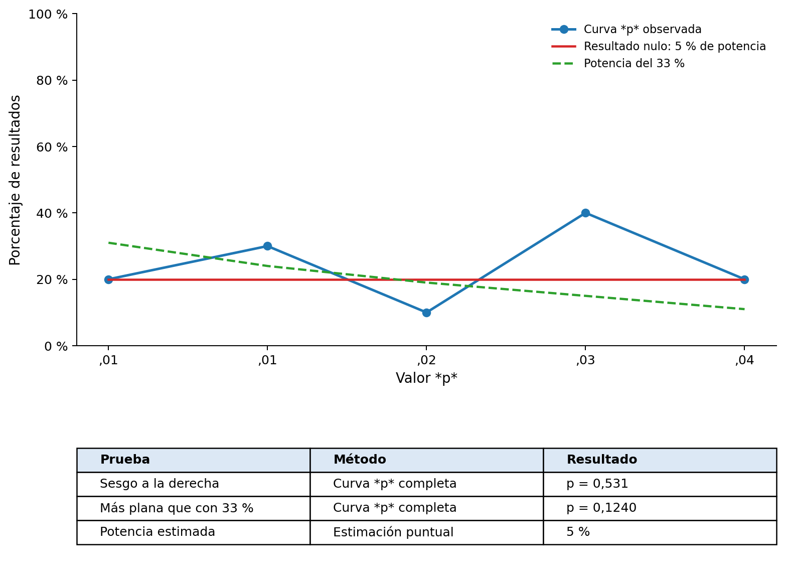{#fig-pcurveresultq5}

- A. La prueba continua de Stouffer no permite rechazar la distribución esperada bajo $H_0$, pero sí permite rechazar la distribución esperada si $H_1$ fuera verdadera y los estudios tuvieran un 33 % de potencia.
- B. La distribución no está suficientemente sesgada a la derecha y, por tanto, la teoría que originó los estudios es necesariamente falsa.
- C. La distribución está suficientemente sesgada a la derecha para concluir que coincide con la esperada bajo $H_1$ con un 33 % de potencia.
- D. La distribución es más plana de lo esperado con un 33 % de potencia y, por tanto, los datos fueron fabricados.

**P6**: En los estudios simulados de la pregunta 2, el efecto verdadero es cero. ¿Qué afirmación sobre este análisis *z*-curve es correcta?

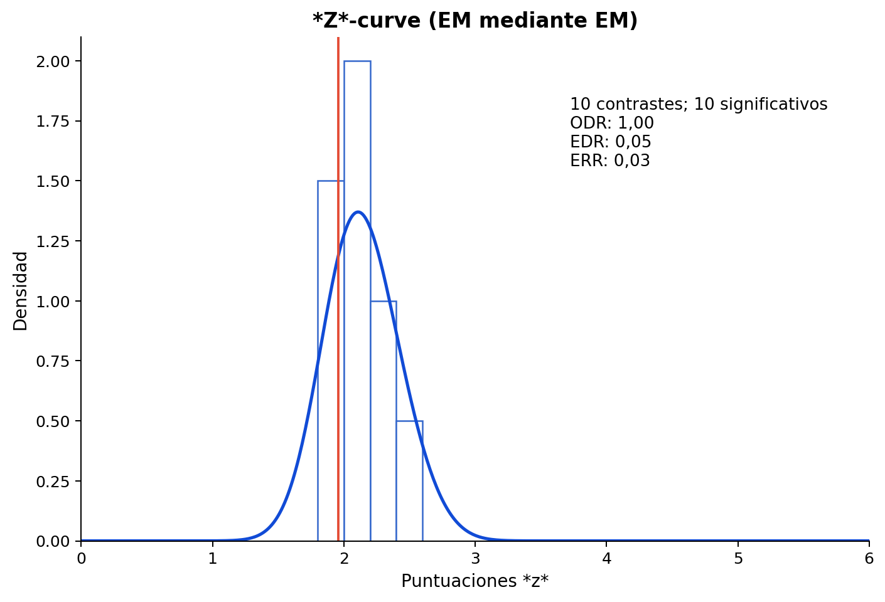{#fig-zcurveq6}

- A. EDR y ERR son estadísticamente significativas, por lo que los efectos deberían replicarse con éxito.
- B. Aunque ODR —la potencia observada— es del 100 %, *z*-curve predice correctamente una ERR próxima al 5 %, porque solo los errores de tipo I serán significativos.
- C. *Z*-curve no detecta sesgo porque EDR y ERR no difieren estadísticamente.
- D. El intervalo de confianza de ODR muestra que el 100 % de resultados significativos pudo aparecer por azar en estudios con una potencia realista.

**P7**: Todavía no hemos aplicado *trim-and-fill*. Dados los análisis anteriores, ¿qué afirmación es verdadera?

- A. Lo más probable es que *trim-and-fill* no impute ningún estudio ausente.
- B. *Trim-and-fill* tiene poca potencia y necesariamente contradiría los análisis *p*-curve y *z*-curve.
- C. *Trim-and-fill* señalaría sesgo, pero *p*-curve y *z*-curve ya lo hacen; además, su estimación ajustada no corrige adecuadamente el sesgo, por lo que no añadiría información útil.
- D. *Trim-and-fill* proporciona una estimación fiable del efecto verdadero y siempre debe presentarse junto a las demás pruebas.

**P8**: El sesgo de publicación consiste en enviar y publicar selectivamente investigaciones. En este capítulo nos hemos centrado en la selección de resultados *significativos*. ¿Puedes pensar en una línea o pregunta de investigación en la que exista un incentivo para publicar selectivamente resultados *no significativos*?

### Preguntas abiertas

1. ¿En qué se basa la prueba GRIM?

2. ¿Cómo se define el sesgo de publicación?

3. ¿Qué es el problema del cajón de archivo?

4. Cuando un diagrama de embudo está centrado en cero, ¿qué caracteriza a los estudios situados dentro del embudo?

5. ¿Qué limitaciones tiene *trim-and-fill* para detectar sesgo y corregir la estimación del tamaño del efecto?

6. ¿Qué debe tenerse en cuenta al utilizar PET-PEESE con pocos estudios?

7. ¿Qué conclusiones permiten extraer las dos pruebas de un análisis *p*-curve?

## Solucionario {.unnumbered}

- **Pregunta 1:** C
- **Pregunta 2:** C
- **Pregunta 3:** B
- **Pregunta 4:** D
- **Pregunta 5:** A
- **Pregunta 6:** B
- **Pregunta 7:** C
